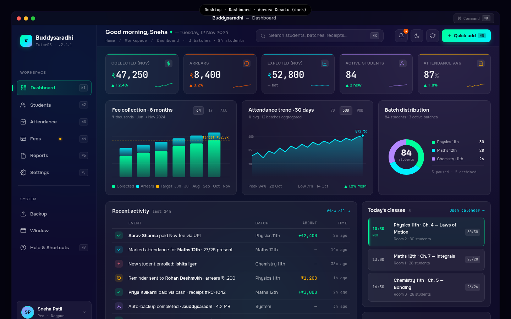

# 01 — Desktop Dashboard

> The home screen of the Buddysaradhi Tauri v2 desktop app. Dense, keyboard-first, designed for the Indian private tutor's morning ritual: open the laptop, glance at the dashboard, decide which fire to fight first — a payment reminder, a fee follow-up, or today's attendance. This file is the visual + interaction contract for the desktop dashboard mockup at `mockups/desktop/01_dashboard.html`.

**Cross-references.** `00_Design_System_Overview.md` §5 (design principles), `01_Color_Palettes.md` Palette 1 (Aurora Cosmic), `02_Typography_System.md` (type scale, tabular numerics), `03_Component_Library.md` (glass card, KPI, data table), `04_Motion_and_Microinteractions.md` (motion variants), `05_Accessibility_Contract.md` (keyboard map), `buddysaradhi_Planning/04_Dashboard.md` (business logic), `buddysaradhi_Planning/desktop/01_Architecture.md` (Tauri/Rust core, SQLite local DB).

---

## §1 — Page Identity

| Property | Value |
|---|---|
| **Platform** | Desktop (Tauri v2 · WebView2 / WebKit / WebKitGTK) |
| **Viewport** | 1440 × 900 px (default window size; min 1024 × 700) |
| **Palette** | `aurora-cosmic` (`data-palette="aurora-cosmic" data-theme="dark"`) |
| **Default theme** | Dark (Aurora Cosmic is dark-only; light variant is Midnight Slate, switched at the user level) |
| **Primary CTA** | "Quick add" button (top-right of topbar) → opens command palette scoped to create-actions |
| **Window chrome** | macOS-style title bar (38px) with traffic-light dots + centre title + ⌘K hint chip |
| **Frame** | `.desktop-frame` (1440 × 900, 14px radius, 1px hairline + 30px drop shadow) |
| **Sidebar width** | 240px (collapsible to 64px icon-only via `⌘\`) |
| **Topbar height** | 60px |
| **Status bar height** | 26px |
| **Sticky footer height** | 38px |

### Keyboard shortcuts (visible on this page)

| Shortcut | Action | Where shown |
|---|---|---|
| `⌘K` | Open command palette | Title bar chip, topbar search placeholder, status bar |
| `⌘N` | Quick add → New student | Topbar Quick add button, sidebar nav |
| `⌘1` … `⌘5` | Switch workspace (Dashboard, Students, Attendance, Fees, Reports) | Sidebar nav items |
| `⌘,` | Open Settings | Sidebar nav |
| `⌘\` | Toggle sidebar collapse | Not shown (power-user) |
| `⌘⇧P` | Quick record payment | Quick actions grid |
| `⌘⇧A` | Mark attendance | Quick actions grid |
| `⌘⇧B` | Backup now | Quick actions grid |
| `⌘⇧R` | Generate receipt | Quick actions grid |
| `⌘⇧M` | Send reminders | Quick actions grid |
| `⌘/` | Show all shortcuts | Help & Shortcuts sidebar item |
| `⌘?` | Help | Sidebar nav |

---

## §2 — Layout Anatomy

The desktop dashboard is a 3-region layout inside the window chrome:

```
┌──────────────────────────────────────────────────────────────────────────────┐
│ Title bar  (38px · traffic lights · "Buddysaradhi — Dashboard" · ⌘K chip)   │
├───────────────┬──────────────────────────────────────────────────────────────┤
│               │ Topbar (60px · greeting · search · notif · theme · Quick add)│
│               ├──────────────────────────────────────────────────────────────┤
│  Sidebar      │ Status bar (26px · online · sync · DB size · kbd hints)      │
│  (240px)      ├──────────────────────────────────────────────────────────────┤
│               │ Desktop content (scrollable)                                 │
│  • Brand      │  ┌─────────────────────────────────────────────────────────┐ │
│  • Workspace  │  │ KPI row · 5 cards (Collected · Arrears · Expected ·    │ │
│    nav        │  │ Active · Attendance)                                    │ │
│  • System     │  ├──────────────┬──────────────┬──────────────────────────┤ │
│    nav        │  │ Fee chart    │ Attendance   │ Batch donut              │ │
│  • User card  │  │ (6mo bars)   │ (30d line)   │ + legend                 │ │
│               │  ├──────────────┴──────────────┴──────────────────────────┤ │
│               │  │ Recent activity (8 rows)  │ Today's classes +         │ │
│               │  │                           │ Quick actions (6 tiles)   │ │
│               │  └───────────────────────────┴────────────────────────────┘ │
│               │  Sticky footer (38px · links · brand)                        │
└───────────────┴──────────────────────────────────────────────────────────────┘
```

### Region 1 — Title bar (38px)

- **Background.** `rgba(10,10,26,0.85)` + 24px backdrop blur + 160% saturation. Drag region for window movement (`-webkit-app-region: drag`).
- **Left.** Traffic-light dots (close #FF5F57 / min #FEBC2E / max #28C840), 12×12 px, 8px gap. Non-drag region (`-webkit-app-region: no-drag`).
- **Centre.** `<strong>Buddysaradhi</strong> — Dashboard`. 13px, weight 500, `--text-secondary`.
- **Right.** Single chip button "⌘K Command" — opens the global command palette. 11px JetBrains Mono.

### Region 2 — Sidebar (240px)

Glass panel (`rgba(15,12,41,0.55)` + 20px blur) pinned to the window's full height. Sections:

1. **Brand** (top). 34×34 gradient mark (emerald → cyan → violet) bearing the Devanagari `ब`. Brand name + `TutorOS · v2.4.1` sub-line.
2. **Workspace nav** (Dashboard active, Students, Attendance, Fees [with red dot — overdue count], Reports, Settings). Each item: 17px SVG icon, label, right-aligned `⌘N` shortcut chip.
3. **System nav** (Backup, Window, Help & Shortcuts).
4. **User card** (bottom). 36px gradient avatar (SP initials), name "Sneha Patil", "Pro · Nagpur" meta. Click → account menu.

### Region 3 — Main column (flex 1)

Stacked vertically: topbar (60px) → content (flex, scrollable) → status bar (26px) → sticky footer (38px).

---

## §3 — Section-by-Section Content Spec

### 3.1 Topbar (60px)

- **Left.** "Good morning, Sneha ✦ — Tuesday, 12 Nov 2024". Emerald star glyph. Below: breadcrumb "Home / Workspace / Dashboard · 3 batches · 84 students" (10px JetBrains Mono, `--text-muted`).
- **Centre.** Search pill (360 × 36px). Magnifier icon, placeholder "Search students, batches, receipts…", right-aligned `⌘K` chip. Click → opens command palette in search mode.
- **Right.**
  - Notifications bell (36×36px icon button, `#FF5E00` count badge "3" at top-right). Click → dropdown of 3 unread items.
  - Theme toggle (sun/moon icon). Click → cycles System → Light → Dark.
  - Sync-now button (circular arrows icon). Click → manual sync; shows spinner + last-sync timestamp.
  - **Quick add** button (primary CTA). Emerald→cyan gradient, "+ Quick add" + `⌘N` chip. Click → command palette scoped to create-actions (New student / Record payment / New batch / Mark attendance / Send reminder).

### 3.2 KPI Row — 5 cards

5-column grid (equal widths, 14px gap). Each card: glass + 1px border + top accent bar (2px). On hover: 1px lift + accent border.

| Card | Accent | Figure | Delta | Sparkline |
|---|---|---|---|---|
| Collected (Nov) | emerald `#00FF9D` | ₹47,250 | ▲ 12.4% | 6pt up trend |
| Arrears | flare `#FF5E00` | ₹8,400 | ▲ 3.2% | 6pt up trend (bad) |
| Expected (Nov) | cyan `#00F0FF` | ₹52,800 | — flat | 6pt flat |
| Active students | violet `#B388FF` | 84 | ▲ 2 new | 6pt up |
| Attendance avg | amber `#FFB300` | 87% | ▲ 1.8% | 6pt up |

- **Money figure.** 26px JetBrains Mono, weight 600, tabular-nums. `₹` rupee glyph at 20px in the card's accent colour.
- **Sparkline.** 50×16px inline SVG polyline, accent-coloured, 70% opacity.
- **Click behaviour.** Each KPI deep-links: Collected → Fees ledger filtered to current month; Arrears → Fees ledger filtered to overdue; Active students → Students list; Attendance avg → Attendance trends.

### 3.3 Charts Row — 3 cards

3-column grid (1.05fr 1.05fr 0.9fr). Each card 230px min-height.

#### Card A — Fee collection · 6 months
- **Title.** "Fee collection · 6 months". Sub: "₹ thousands · Jun → Nov 2024".
- **Range pills.** 6M (active) / 1Y / All.
- **Chart.** Stacked bar chart (320×140 viewBox). Per month: emerald bar (collected) + cyan bar (arrears) stacked. Amber dashed target line at ₹52.8k.
- **Legend foot.** Three colour swatches (Collected / Arrears / Target) + month labels.

#### Card B — Attendance trend · 30 days
- **Title.** "Attendance trend · 30 days". Sub: "% avg · 12 batches aggregated".
- **Range pills.** 7D / 30D (active) / 90D.
- **Chart.** Cyan line + gradient area fill (320×140). Today's value 87% annotated at line end with a 4px dot.
- **Foot.** Peak 94% · 28 Oct · Low 71% · 14 Oct · ▲ 1.8% MoM.

#### Card C — Batch distribution donut
- **Title.** "Batch distribution". Sub: "84 students · 3 active batches".
- **Chart.** 120×120 donut (3 segments, 16px stroke). Centre: "84" (22px Sora bold) + "students" (9px JetBrains Mono).
- **Legend.** 3 rows: coloured dot + batch name + count. Below divider: "3 paused · 2 archived".

### 3.4 Bottom Row — 2 columns

2-column grid (1.95fr 1fr).

#### Left — Recent activity table
- **Header.** "Recent activity · last 24h" + "View all →" link (cyan, JetBrains Mono).
- **Table columns.** Icon (22×22 activity-typed chip) | Event | Batch | Amount (right-aligned, tabular-nums) | Time (right-aligned, JetBrains Mono).
- **8 rows.** Real Indian names — Aarav Sharma (₹2,400 UPI), Ishita Iyer (enrolment), Priya Kulkarni (₹3,000 cash), Rohan Deshmukh (reminder ₹1,200), Aditya Joshi (partial ₹1,800), backup event, Meera Nair (guardian update).
- **Activity icon colours.** payment=emerald, attendance=cyan, student=rose, fee=amber, backup=violet. Each icon 12×12 inside a 22×22 tinted chip.

#### Right — Today's classes + Quick actions

**Today's classes panel.**
- Title "Today's classes · 3".
- 3 class cards. The "now" card has an emerald left border (3px + glow) and emerald time label.
- Each card: time (JetBrains Mono) | class name (12.5px bold) + meta (room + count) | right pill "30/30".

**Quick actions panel.**
- Title "Quick actions · ⌘K for all".
- 3×2 grid of 6 tiles. Each: gradient icon square (32×32) + label (2 lines, 10.5px) + shortcut chip.
- Tiles: Record payment (⌘⇧P) / New student (⌘N) / Mark attendance (⌘⇧A) / Backup now (⌘⇧B) / Generate receipt (⌘⇧R) / Send reminders (⌘⇧M).

### 3.5 Status bar (26px)

JetBrains Mono 10.5px, `--text-muted`. Two regions:
- **Left.** Online dot (emerald glow) + "Online · last sync 2m ago" · sync dot (cyan) + "Local DB 4.2 MB" · "3 reminders queued".
- **Right.** 3 kbd-hint pills (`⌘K commands`, `⌘N new`, `⌘/ shortcuts`) + "SQLite · 84 students · 1,247 ledger rows".

### 3.6 Sticky footer (38px)

Inside the scroll area, anchored to the bottom of the content. Two regions:
- **Left.** 4 links: Dashboard v2.4 · Keyboard shortcuts · What's new · Send feedback.
- **Right.** "Buddysaradhi · made in Nagpur 🇮🇳".

---

## §4 — Interaction Model

### Keyboard-first

The desktop dashboard is designed to be operated entirely from the keyboard. The mouse is the secondary input.

1. **Command palette (`⌘K`).** Opens a Linear/Raycast-style modal palette. Fuzzy-matches every nav item, every student, every receipt, every quick action. Defaults to "recently used" when no query. `↑↓` to navigate, `↵` to execute, `Esc` to dismiss.
2. **Workspace switching (`⌘1`–`⌘5`, `⌘,`).** Direct shortcuts to switch the sidebar's active workspace without touching the sidebar. The sidebar visually updates to reflect the new active item.
3. **KPI deep-links (`⌘1`–`⌘5` while holding `⌥`).** Opens the destination page in a new Tauri window (desktop-only affordance).
4. **Quick-add menu (`⌘N`).** Opens the command palette scoped to create-actions. The tutor types the first 2 letters of the entity ("st" → New student, "pa" → Record payment, "ba" → New batch) and hits `↵`.
5. **Search (`⌘K` from any context).** Always available. Even if the search pill is not focused, `⌘K` opens the palette.

### Mouse-second

- **Hover lift.** KPI cards, quick-action tiles, and chart cards lift 1px on hover (`--motion-fast` `--ease-out`). Hover state communicates "I am tappable", nothing more.
- **Click.** Single-click selects / opens. No double-click anywhere on the dashboard.
- **Right-click.** Context menu on KPI cards (Export, Deep-link, Set as favourite), on activity table rows (Open student, Open receipt, Copy amount), on class cards (Open attendance sheet, Mark all present, Send reminder).

### Motion variants (per `04_Motion_and_Microinteractions.md`)

| Element | Variant | Duration | Easing |
|---|---|---|---|
| KPI card hover | `card-lift-1px` | 150ms | `--ease-out` |
| Chart card hover | `card-lift-1px` | 150ms | `--ease-out` |
| Quick-action tile hover | `tile-lift-1px` + accent border | 150ms | `--ease-out` |
| Sidebar item active state | `nav-fade-12%` | 150ms | `--ease-out` |
| Class-card "now" indicator | `pulse-dot-soft` (3px bar, emerald glow) | 2s | linear |
| Status bar online dot | `pulse-dot-soft` | 2s | linear |
| Command palette open | `modal-rise-8px` + `backdrop-fade` | 200ms | `--ease-out` |
| Activity row hover | `row-tint-2%` | 100ms | `--ease-out` |

**Reduced motion (`prefers-reduced-motion: reduce`).** All `card-lift`, `tile-lift`, and `pulse-dot-soft` variants collapse to instant state changes. The "now" indicator becomes a static emerald bar (no pulse). Skeletons lose shimmer and become solid `--surface-glass-faint`.

---

## §5 — Data Bindings

### Source of truth

Per `buddysaradhi_Planning/desktop/01_Architecture.md` §1, the desktop app runs a Tauri v2 Rust binary with a local SQLCipher-encrypted SQLite database (the "local-first" store). All dashboard data is read from this local DB; sync to Turso (libSQL remote) happens out-of-band via the `sync/outbox` flusher (`desktop/01_Architecture.md` §2, `src-tauri/src/sync/outbox.rs`).

### Tauri commands (read-path)

Per `buddysaradhi_Planning/desktop/01_Architecture.md` §2 (commands) + §5 (route map):

| Dashboard region | Tauri command | Rust function | SQL read |
|---|---|---|---|
| KPI Collected | `get_kpis` | `commands::dashboard::get_kpis` | `SELECT SUM(amount_paise) FROM ledger_entries WHERE type='PAYMENT_RECEIVED' AND occurred_on >= date('now','start of month')` |
| KPI Arrears | `get_kpis` | same | `SELECT SUM(amount_paise) FROM fee_schedule_items WHERE due_date < date('now') AND status='OPEN'` |
| KPI Expected | `get_kpis` | same | `SELECT SUM(amount_paise) FROM fee_schedule_items WHERE due_date >= date('now','start of month')` |
| KPI Active students | `get_kpis` | same | `SELECT COUNT(*) FROM students WHERE archived_at IS NULL AND status='ACTIVE'` |
| KPI Attendance avg | `get_kpis` | same | `SELECT AVG(present_count*1.0/total_count) FROM attendance_sessions WHERE session_date >= date('now','-30 days')` |
| Fee collection chart | `get_fee_trend` | `commands::dashboard::get_fee_trend` | 6-month grouped `SUM` on `ledger_entries` |
| Attendance trend chart | `get_attendance_trend` | `commands::dashboard::get_attendance_trend` | 30-day grouped `AVG` on `attendance_records` |
| Batch distribution donut | `get_batch_distribution` | `commands::dashboard::get_batch_distribution` | `SELECT batch_id, COUNT(*) FROM students WHERE archived_at IS NULL GROUP BY batch_id` |
| Recent activity table | `get_recent_activity` | `commands::dashboard::get_recent_activity` | union of `ledger_entries`, `attendance_sessions`, `audit_log` for last 24h, ordered by `created_at DESC LIMIT 25` |
| Today's classes | `get_todays_classes` | `commands::dashboard::get_todays_classes` | `SELECT * FROM attendance_sessions WHERE session_date = date('now') ORDER BY start_time` |
| Status bar · DB size | `get_db_stats` | `commands::settings::get_db_stats` | `PRAGMA page_count * page_size` |

### Money handling (per `11_Data_Model.md` P-DM2)

Every money figure on the dashboard is rendered via `formatINR(paise: number)` from `src/lib/formatINR.ts`. The Rust command returns `i64` paise; the frontend formats to ₹ with thousands separators and tabular-nums. **No `REAL`/float ever crosses the IPC boundary.**

### Sync status

- **Online dot.** Driven by `app_state.online` boolean (set by `tauri-plugin-network`). Cyan pulse every 2s while online; static amber when offline.
- **"Last sync 2m ago".** `app_state.last_sync_at` ISO timestamp, formatted relative.
- **Local DB 4.2 MB.** `PRAGMA page_count × page_size` from `db::connection::open_encrypted`.

### Cached vs. live

Per `desktop/01_Architecture.md` §6, dashboard reads are **served from local SQLite** (no network round-trip). The Tauri command resolves in <2ms for the typical 84-student dataset. The Turso remote is only queried on the Backup screen and on the manual sync-now click.

---

## §6 — Accessibility

### Keyboard navigation map (per `05_Accessibility_Contract.md`)

| Key | Action |
|---|---|
| `Tab` | Cycle focusable regions: sidebar → topbar → KPI cards → chart cards → activity table → quick actions → footer links |
| `Shift+Tab` | Reverse cycle |
| `↑` `↓` | Within sidebar: cycle nav items. Within activity table: cycle rows. |
| `↵` | Activate focused item (sidebar nav, KPI deep-link, activity row → open student) |
| `Space` | Toggle checkbox / class-card "now" focus |
| `Esc` | Dismiss command palette; restore focus to last element |
| `⌘K` | Open command palette |
| `⌘1`–`⌘5` | Switch workspace |
| `?` (with `⌘`) | Open keyboard shortcuts modal |

### Focus rings

Every focusable element shows a 3px ring in `color-mix(in srgb, var(--accent-primary) 35%, transparent)` on `:focus-visible`. The ring is offset 2px from the element box. No outline-on-click; only keyboard focus triggers the ring.

### Screen reader (NVDA, VoiceOver)

- **Landmarks.** `<aside>` for sidebar (label "Workspace navigation"), `<main>` for content, `<header>` for topbar, `<footer>` for sticky footer. The status bar is a `<div role="status" aria-live="polite">` so sync/online state changes are announced.
- **KPI cards.** Each card is `<article aria-label="KPI: Collected this month, ₹47,250, up 12.4 percent">`. The figure is `aria-describedby` linked to the delta.
- **Charts.** Each SVG chart has `<title>` and `<desc>` children describing the trend ("Fee collection rose from ₹38,000 in June to ₹47,250 in November, with arrears under ₹2,000 until October").
- **Activity table.** Standard `<table>` with `<caption>` "Recent activity in the last 24 hours". The icon column header is `aria-label="Type"`.
- **Class cards.** The "now" card has `aria-current="date"` and a visually-hidden "Happening now" label.

### Contrast

All text-on-surface pairs in Aurora Cosmic dark verified at WCAG AAA in `01_Color_Palettes.md` §Palette 1. The `--text-muted` (40% white) on `--surface-glass` hits 6.4:1, grade AA.

---

## §7 — Edge Cases

### Offline (no network)

Per `buddysaradhi_Planning/14_Edge_Cases.md` EC-NET-01.

- **Status bar.** Online dot switches from emerald to amber; "Online · last sync 2m ago" becomes "Offline · last sync 2h 14m ago".
- **Sync-now button.** Disabled; tooltip "Cannot sync while offline".
- **KPIs and charts.** Continue to read from local SQLite. All figures are accurate as of the last successful sync. No degradation in read-path performance.
- **Quick add.** Continues to work. New students / payments are written to `sync_outbox` and flushed when connectivity returns.
- **Banner.** After 1 hour offline, a non-blocking toast appears at the bottom-right: "You've been offline 1h 14m. Changes will sync when you reconnect. [Dismiss] [Try sync now]".

### Sync conflict

Per `buddysaradhi_Planning/14_Edge_Cases.md` EC-SYNC-03.

- The ledger is append-only; conflict resolution is "last-write-wins" for entity tables (students, settings) and "both-rows-coexist" for ledger entries (UUIDv7 prevents collision).
- On the dashboard, if a conflict is detected during sync, the status bar shows an amber "Sync conflict · 2 rows" link. Click → Backup & sync screen with a side-by-side diff.

### Low memory

Per `desktop/01_Architecture.md` §1, Tauri baseline RSS is 45–80 MB (vs Electron's 200 MB). On a tutor's 8 GB laptop running Zoom + Chrome + Buddysaradhi, the OS may still memory-pressure the app.

- **Chart cards.** Switch from inline SVG to canvas rendering after 1,000 data points (not applicable to dashboard, but contract holds).
- **Activity table.** Virtualises rows beyond 100. The 8 visible rows are always rendered.
- **KPI sparklines.** Cached as data URIs after first render; redrawn only on data change.
- **Backoff.** If the WebView reports `performance.memory.usedJSHeapSize > 80 MB`, the sync-outbox flusher backs off from 30s to 120s and a status-bar hint appears: "Memory saver · sync paused".

### Empty state (new tutor, first launch)

- All KPIs read ₹0 / 0 / 0%. The sparkline is a flat line.
- Charts show "No data yet" centred text + an arrow pointing to the Quick add button.
- Activity table shows a single row: "Welcome to Buddysaradhi. Add your first student to get started. [Add student]".
- Today's classes shows "No classes scheduled. Open calendar to add a batch timetable."
- Quick actions remain fully functional.

### Window resize

- **Min window size.** 1024 × 700. Below this, the OS prevents further shrink.
- **Sidebar.** Collapses to 64px icon-only below 1280px width (`⌘\` to pin/unpin).
- **KPI row.** Drops from 5 columns to 4 (Arrears merges into Expected) below 1200px; to 3 below 1100px.
- **Charts row.** Drops from 3 columns to 2 (Batch distribution moves below) below 1300px.

---

## §8 — Image Reference



**Screenshot capture contract.** Render the HTML mockup at 1440 × 900 in Chrome (WebView2 mode), screenshot the `.desktop-frame` element at 2× DPI. Save as `images/desktop/01_dashboard.png`. Pixel-diff against the previous build must be < 2% (allowing for live data drift).

---

## §9 — Status

- **Author.** UI/UX Lead (Task 13-DESKTOP-MOCKUPS)
- **State.** COMPLETED
- **Mockup.** `mockups/desktop/01_dashboard.html` (905 lines, standalone HTML, links `shared/styles.css`)
- **Consumers.** Desktop agent (Tauri v2 implementation phase), QA (screenshot comparison)
- **Dependencies.** `buddysaradhi_Planning/desktop/01_Architecture.md` (Tauri commands), `buddysaradhi_Planning/04_Dashboard.md` (business logic), `buddysaradhi_Planning/11_Data_Model.md` (schema)
