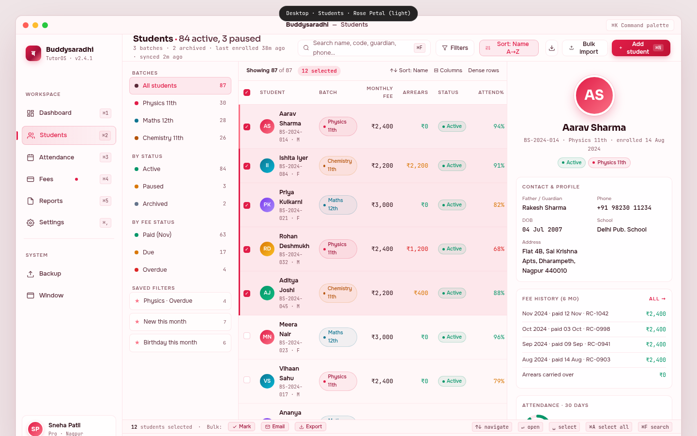

# 02 — Desktop Students

> The student master-list screen of the Buddysaradhi Tauri v2 desktop app. A 3-pane power-user layout (filter tree · list · detail) optimised for the tutor who manages 80–300 students and needs to scan, filter, multi-select, and bulk-act at speed. This file is the visual + interaction contract for the desktop students mockup at `mockups/desktop/02_students.html`.

**Cross-references.** `00_Design_System_Overview.md` §5, `01_Color_Palettes.md` Palette 5 (Rose Petal), `02_Typography_System.md`, `03_Component_Library.md`, `04_Motion_and_Microinteractions.md`, `05_Accessibility_Contract.md`, `buddysaradhi_Planning/05_Students.md` (business logic), `buddysaradhi_Planning/desktop/01_Architecture.md`.

---

## §1 — Page Identity

| Property | Value |
|---|---|
| **Platform** | Desktop (Tauri v2) |
| **Viewport** | 1440 × 900 px |
| **Palette** | `rose-petal` (`data-palette="rose-petal" data-theme="light"`) |
| **Default theme** | Light (warm ivory `#FFF7F8`) |
| **Primary CTA** | "+ Add student" button (top-right of topbar) → opens enrolment wizard |
| **Window chrome** | macOS title bar (38px) + traffic lights + ⌘K chip |
| **Sidebar** | 220px (collapsible to 64px) |
| **Topbar height** | 56px |
| **Pane 1 (filters)** | 240px |
| **Pane 2 (list)** | flex 1 (~500px typical) |
| **Pane 3 (detail)** | 360px |
| **Status bar** | 28px |
| **Sticky footer** | 38px |

### Keyboard shortcuts

| Shortcut | Action | Where shown |
|---|---|---|
| `⌘K` | Command palette | Title bar chip |
| `⌘N` | Add student | Topbar Add button |
| `⌘F` | Focus search | Topbar search |
| `⌘A` | Select all rows | Status bar |
| `⌘⇧A` | Deselect all | Status bar |
| `↑` `↓` | Navigate rows (cursor) | Status bar |
| `↵` | Open focused student | Status bar |
| `Space` | Toggle selection on focused row | Status bar |
| `⌘E` | Export selection | Bulk action |
| `⌘⇧E` | Email selection | Bulk action |
| `⌘1`–`⌘5` | Switch workspace | Sidebar |
| `⌘,` | Settings | Sidebar |
| `Esc` | Clear selection / close detail | implicit |

---

## §2 — Layout Anatomy

```
┌──────────────────────────────────────────────────────────────────────────────┐
│ Title bar (38px)                                                              │
├───────────────┬──────────────────────────────────────────────────────────────┤
│ Sidebar       │ Topbar (56px · "Students · 84 active, 3 paused" · search ·  │
│ (220px)       │ filters · sort · Bulk import · + Add student)               │
│               ├──────────┬─────────────────────────────────┬─────────────────┤
│  • Brand      │ Filters  │ Student list                    │ Detail          │
│  • Workspace  │ (240px)  │ (flex 1 · ~500px)               │ (360px)         │
│    nav        │  • Batches│  • Toolbar (sort, columns)     │  • Avatar XL    │
│    (Students  │  • Status │  • Table (8+ rows)             │  • Name + code  │
│     active)   │  • Fee    │  · Checkbox · Student · Batch  │  • Contact      │
│  • System     │  • Saved  │    · Fee · Arrears · Status    │  • Fee history  │
│    nav        │    filters│    · Attend% · ⋯              │  • Attendance   │
│  • User card  │          │                                 │    ring         │
│               │          │                                 │  • Quick actions│
│               │          │                                 │                 │
│               ├──────────┴─────────────────────────────────┴─────────────────┤
│               │ Status bar (28px · "12 selected · bulk: Mark/Email/Export")  │
│               ├──────────────────────────────────────────────────────────────┤
│               │ Sticky footer (38px)                                          │
└───────────────┴──────────────────────────────────────────────────────────────┘
```

### Region 1 — Sidebar (220px)

Same shared sidebar as the dashboard, with **Students active** (rose active state). The sidebar is the global workspace switcher; its presence on every page is what gives the tutor spatial memory ("the rose sidebar with the people-icon lit = Students").

### Region 2 — Topbar (56px)

- **Left.** "Students · 84 active, 3 paused" (18px Sora bold, rose accent dot). Below: "3 batches · 2 archived · last enrolled 38m ago · synced 2m ago" (11px JetBrains Mono, `--text-muted`).
- **Centre.** Search pill (320×34px) "Search name, code, guardian, phone… ⌘F". Plus two filter buttons: a Filters dropdown (chevron) and an active Sort pill ("Sort: Name A→Z").
- **Right.** Export icon button · "Bulk import" ghost button · **+ Add student** primary button (rose gradient, with `⌘N` chip).

### Region 3 — Three panes (the desktop power-user pattern)

The 3-pane layout is the defining affordance of the desktop Students page. It is what justifies opening the desktop app instead of the web app.

#### Pane 1 — Filters (240px, left)

A vertical filter tree. Four sections, each with a 10px uppercase label:

1. **Batches.** All students (87, active) · Physics 11th (30) · Maths 12th (28) · Chemistry 11th (26). Coloured dot per batch (rose / teal / amber).
2. **By status.** Active (84) · Paused (3) · Archived (2).
3. **By fee status.** Paid Nov (63) · Due (17) · Overdue (4).
4. **Saved filters.** Three starred filter cards: "Physics · Overdue" (4) · "New this month" (7) · "Birthday this month" (6).

Click a filter → list updates instantly (no network round-trip; pure SQL read from local SQLite). Active filter gets rose 8% tint + 1px rose 22% border.

#### Pane 2 — Student list (flex 1)

- **Toolbar (40px).** Left: "Showing 87 of 87" + rose pill "12 selected". Right: sort button, columns button, dense-rows toggle.
- **Table.** Columns: ☐ | Student (avatar+name+code) | Batch (pill) | Monthly fee (right-aligned, tabular-nums) | Arrears (right-aligned, coloured) | Status (chip) | Attend% (right-aligned, coloured) | ⋯.

  - **12 rows shown** in the mockup. The first row (Aarav Sharma) is the cursor row + selected (rose left bar 3px). Rows 1–5 are selected (rose 8% tint + rose left bar 3px).
  - **Avatar.** 30×30 gradient circle with initials. Gradient is seeded by student-code hash so each student gets a stable colour.
  - **Batch pill.** Coloured by batch family (Physics=rose, Maths=teal, Chemistry=amber).
  - **Money.** ₹ amounts in JetBrains Mono, tabular-nums, right-aligned. Arrears column colour-codes: ₹0 = muted, due = amber, overdue = red.
  - **Attendance %.** Good ≥85% (emerald) · Mid 75–84% (amber) · Low <75% (red).

#### Pane 3 — Student detail (360px, right)

The detail pane shows the currently focused (cursor) student, even when multiple are selected. This separation of selection vs. focus is the desktop affordance the web app cannot match.

- **Header.** 84px gradient avatar (4px white border + rose shadow), name "Aarav Sharma" (19px Sora bold), code "BS-2024-014 · Physics 11th · enrolled 14 Aug 2024" (11px JetBrains Mono). Below: Active status chip + Physics 11th batch pill.
- **Contact & profile card.** 2-column grid: Father/Guardian (Rakesh Sharma) · Phone (+91 98230 11234) · DOB (04 Jul 2007) · School (Delhi Pub. School) · Address (full Nagpur address, span 2).
- **Fee history (6mo) card.** 5 rows: Nov–Aug, each with month · paid date · receipt number · amount in emerald. Plus an "Arrears carried over ₹0" footer row.
- **Attendance · 30 days card.** 64px SVG ring (94% emerald fill) + figure "94%" + meta "28 of 30 sessions · ▲ 2.4% MoM".
- **Quick actions.** 2×2 grid: **Record payment** (rose primary) · Remind · Edit · Receipt.

---

## §3 — Section-by-Section Content Spec

### 3.1 Filter tree (Pane 1)

| Section | Items | Active item |
|---|---|---|
| Batches | All students (87) · Physics 11th (30) · Maths 12th (28) · Chemistry 11th (26) | All students |
| By status | Active (84) · Paused (3) · Archived (2) | — |
| By fee status | Paid Nov (63) · Due (17) · Overdue (4) | — |
| Saved filters | Physics · Overdue (4) · New this month (7) · Birthday this month (6) | — |

Each item: 8px coloured dot · label · right-aligned count (JetBrains Mono, tabular-nums). Saved-filter rows use a card style (white 50% bg + glass border + ★ icon in rose).

### 3.2 Student list (Pane 2) — column contract

| # | Column | Width | Align | Format | Notes |
|---|---|---|---|---|---|
| 1 | Checkbox | 32px | centre | — | Rose fill when checked |
| 2 | Student | flex (min 180px) | left | Avatar (30px) + Name (12.5px, 600) + Code (10px mono) | — |
| 3 | Batch | 120px | left | Pill with coloured dot | — |
| 4 | Monthly fee | 90px | right | ₹ + tabular-nums | — |
| 5 | Arrears | 80px | right | ₹ + tabular-nums, colour-coded | ₹0 = muted; due = amber; overdue = red |
| 6 | Status | 100px | left | Chip (active/paused/inactive) | Dot + label |
| 7 | Attend % | 70px | right | Tabular-nums, colour-coded | ≥85 emerald · 75–84 amber · <75 red |
| 8 | ⋯ | 36px | centre | Row action menu | — |

### 3.3 Student detail (Pane 3) — content

Per `buddysaradhi_Planning/05_Students.md` §3 (Student profile fields):

- **Avatar.** 84px gradient circle, initials "AS". 4px white border + 24px rose-tinted shadow.
- **Name.** "Aarav Sharma" (19px Sora bold).
- **Code.** "BS-2024-014 · Physics 11th · enrolled 14 Aug 2024" (11px JetBrains Mono).
- **Status chips.** Active (emerald) + Physics 11th (rose pill).
- **Contact & profile.** Guardian name, phone (+91 with Indian formatting), DOB, school, full address (span 2 columns).
- **Fee history (6 months).** Each row: Month + paid date + receipt ID + amount in emerald. Footer row: arrears carried over (₹0 in emerald).
- **Attendance ring.** 64px SVG donut showing 94% emerald fill. Centre text "94%". Right side: figure + "28 of 30 sessions · ▲ 2.4% MoM".
- **Quick actions (2×2 grid).** Record payment (rose primary, ₹ icon) · Remind (bell icon) · Edit (pencil icon) · Receipt (document icon).

---

## §4 — Interaction Model

### Keyboard-first (the desktop advantage)

The 3-pane layout is navigable entirely by keyboard. The tutor's right hand never leaves the arrow cluster.

| Key | Context | Action |
|---|---|---|
| `Tab` | Global | Move focus between panes (filters → list → detail) |
| `↑` `↓` | List pane | Move cursor row; detail pane updates to focused student |
| `↵` | List pane | Open focused student's full profile in a new window |
| `Space` | List pane | Toggle selection on focused row (does NOT move cursor) |
| `⌘A` | List pane | Select all rows matching current filter |
| `⌘⇧A` | List pane | Deselect all |
| `⌘F` | Topbar | Focus search pill |
| `⌘N` | Topbar | Open enrolment wizard |
| `⌘E` | Status bar | Export selection to CSV |
| `⌘⇧E` | Status bar | Email selection (opens default mail client with BCC list) |
| `Esc` | Detail pane | Clear cursor (closes detail pane to empty state) |
| `1` `2` `3` `4` | Filters pane | Cycle filter sections (Batches → Status → Fee → Saved) |
| `↵` | Filters pane | Apply focused filter |

### Cursor vs. selection

This is the key desktop pattern (per Linear, Notion, Mail.app):

- **Cursor.** A single row marked with a 3px rose left bar + 6% rose tint. Moves with `↑↓`. The detail pane always reflects the cursor row.
- **Selection.** Zero or more rows marked with a 3px rose left bar + 8% rose tint + checked checkbox. Toggled with `Space`. The status bar shows the count.
- **Decoupled.** Cursor can be on a non-selected row; selection can include rows above and below the cursor.

### Mouse-second

- **Click row.** Sets cursor AND selects (replaces selection).
- `Cmd+Click` row. Toggles that row's selection without moving cursor.
- `Shift+Click` row. Range-select from cursor to clicked row.
- **Click filter.** Applies filter; preserves selection across filter changes (so a tutor can multi-select across batches).

### Bulk actions

When 1+ rows selected, the status bar transforms:
- "12 students selected" + three bulk-action buttons: **Mark** (mark all attendance for the selection) · **Email** (BCC the guardians) · **Export** (CSV with selected columns).

### Motion variants

| Element | Variant | Duration |
|---|---|---|
| Filter item active | `nav-fade-8%` | 150ms |
| List row hover | `row-tint-4%` | 100ms |
| List row cursor | `row-tint-6%` + 3px left bar | instant |
| List row selected | `row-tint-8%` + 3px left bar | instant |
| Detail pane open | `panel-slide-in-right-12px` | 200ms `--ease-out` |
| Detail avatar swap (cursor moves) | `avatar-crossfade-200ms` | 200ms |
| Bulk-action button hover | `btn-tint-4%` | 150ms |

**Reduced motion.** All transitions collapse to instant state changes. Avatar crossfade becomes instant swap. Detail panel appears without slide.

---

## §5 — Data Bindings

### Tauri commands (per `desktop/01_Architecture.md` §2)

| Region | Command | Rust function | SQL read |
|---|---|---|---|
| Filter tree · batches | `get_batches` | `commands::students::get_batches` | `SELECT b.*, (SELECT COUNT(*) FROM students s WHERE s.batch_id = b.id AND s.archived_at IS NULL) AS count FROM batches b` |
| Filter tree · statuses | `get_student_status_counts` | `commands::students::get_status_counts` | `SELECT status, COUNT(*) FROM students WHERE archived_at IS NULL GROUP BY status` |
| Filter tree · fee status | `get_fee_status_counts` | `commands::students::get_fee_status_counts` | join `students` ↔ `fee_schedule_items` for current month |
| Student list | `get_students` | `commands::students::get_students` | `SELECT s.*, b.name AS batch_name, (SELECT SUM(amount_paise) FROM ledger_entries WHERE student_id = s.id AND type='PAYMENT_RECEIVED' AND occurred_on >= date('now','start of month')) AS paid_paise, (SELECT SUM(amount_paise) FROM fee_schedule_items WHERE student_id = s.id AND status='OPEN' AND due_date < date('now')) AS arrears_paise, (SELECT AVG(present) FROM attendance_records WHERE student_id = s.id AND session_date >= date('now','-30 days')) AS attendance_rate FROM students s LEFT JOIN batches b ON s.batch_id = b.id WHERE s.archived_at IS NULL ORDER BY s.name` |
| Student detail · contact | `get_student` | `commands::students::get_student` | full row + guardian + tags |
| Student detail · fee history | `get_student_fee_history` | `commands::students::get_fee_history` | `SELECT * FROM ledger_entries WHERE student_id = ? AND type='PAYMENT_RECEIVED' ORDER BY occurred_on DESC LIMIT 6` |
| Student detail · attendance | `get_student_attendance` | `commands::students::get_student_attendance` | `SELECT COUNT(*) AS total, SUM(present) AS present FROM attendance_records WHERE student_id = ? AND session_date >= date('now','-30 days')` |
| Bulk export | `export_students` | `commands::students::export_students` | streamed CSV via `tauri-plugin-dialog` save-as |

### Money handling

All ₹ figures are integer paise from the Rust command, formatted via `formatINR()` in the renderer. Arrears column uses `colourByAmount(paise, { zero: 'muted', warn: 100*100, danger: 1000*100 })` — anything ≤ ₹0 muted, ₹1–₹999 amber, ≥ ₹1,000 red.

### Student code

`students.code` is a denormalised human-readable ID (`BS-2024-014` = Buddysaradhi · year · sequence), per `11_Data_Model.md` P-DM5. Generated by `commands::students::create_student` via the `settings.next_student_seq` counter.

### Local-first

Per `desktop/01_Architecture.md` §6, all reads resolve against local SQLite. No network call. The filter tree's counts update synchronously when a student is enrolled/archived because the INSERT/UPDATE triggers a refetch via the Tauri event bus.

---

## §6 — Accessibility

### Keyboard map

| Key | Action |
|---|---|
| `Tab` | Cycle panes: filters → list → detail |
| `↑` `↓` | Within list: move cursor; within filters: cycle items |
| `←` `→` | Within list: cycle columns (for column reordering) |
| `↵` | Activate (open filter, open student, fire action button) |
| `Space` | Toggle selection (list) or toggle filter (filters) |
| `Esc` | Clear cursor / close detail pane |
| `⌘A` | Select all |
| `⌘F` | Focus search |

### Focus rings

3px rose 35% ring on every `:focus-visible` element. Sidebar, topbar buttons, filter items, table cells (when cursor is on them), and detail action buttons all show the ring.

### Screen reader

- **Landmarks.** `<aside aria-label="Workspace navigation">` (sidebar) · `<nav aria-label="Student filters">` (Pane 1) · `<main aria-label="Student list">` (Pane 2) · `<aside aria-label="Selected student detail">` (Pane 3).
- **Table.** `<table>` with `<caption>` "84 active students, 3 paused". Column headers are `<th scope="col">`. Row headers are the student-name cell (`scope="row"`).
- **Selection.** `aria-selected="true"` on selected rows; `aria-current="true"` on the cursor row.
- **Detail pane.** `aria-live="polite"` so when the cursor moves, the screen reader announces "Aarav Sharma, Physics 11th, paid in full, 94% attendance".
- **Bulk action bar.** `role="toolbar"` with `aria-label="Bulk actions for 12 selected students"`.

### Contrast

Rose Petal light palette hits WCAG AAA on body text (17.0:1) and AA on accent-on-surface (4.8:1) per `01_Color_Palettes.md` §Palette 5.

---

## §7 — Edge Cases

### Empty state (no students)

- Filter tree shows 0 counts. List shows a centred illustration: rose-tinted empty-state card "No students yet. Add your first student to get started. [+ Add student]".
- Detail pane shows placeholder: "Select a student to see their details."

### Single-student selection

- Detail pane shows that student. Status bar shows "1 student selected". Bulk-action buttons appear but are dimmed for non-meaningful actions (Mark requires ≥1, Email requires ≥1, Export requires ≥1 — all enabled).

### 500+ students (large roster)

- Table virtualises beyond 100 visible rows. The viewport renders only the visible 30 rows; `↑↓` scroll the virtual viewport.
- Filter tree counts update with a 100ms debounce to avoid recomputing on every keystroke.
- Search uses SQLite FTS5 index on `students.name` + `students.code` + `guardians.name` + `guardians.phone` (per `11_Data_Model.md` §4 students table indexes).

### Offline

- All reads continue to work (local SQLite).
- Bulk email action shows toast: "Queued. Will send when you reconnect." (per `14_Edge_Cases.md` EC-NET-01).
- Bulk export still works (writes to local file).

### Sync conflict on a student record

Per `14_Edge_Cases.md` EC-SYNC-03: if a student was edited on two devices, the last-write-wins rule applies. The detail pane shows a non-blocking amber banner "This record was updated on another device 5m ago. [Show diff] [Keep local]".

### Window resize

- Below 1280px width, Pane 1 collapses to icons only (no labels).
- Below 1100px width, Pane 3 (detail) hides; clicking a row opens detail in a modal instead.
- Below 1024px width, the OS prevents further shrink (min window size).

### Paused / archived students

- Filter "Archived" reveals archived rows in a dimmed style (50% opacity, line-through on name).
- Clicking an archived row's ⋯ → "Restore" or "Permanently delete" (the latter requires a typed confirmation per `10_Security.md` §7).

---

## §8 — Image Reference



**Screenshot capture contract.** Render at 1440 × 900 in Chrome (WebView2 mode). 2× DPI. Save as `images/desktop/02_students.png`. Pixel-diff < 2% vs previous build.

---

## §9 — Status

- **Author.** UI/UX Lead (Task 13-DESKTOP-MOCKUPS)
- **State.** COMPLETED
- **Mockup.** `mockups/desktop/02_students.html` (975 lines, standalone HTML, links `shared/styles.css`)
- **Consumers.** Desktop agent (Tauri v2 implementation), QA
- **Dependencies.** `buddysaradhi_Planning/05_Students.md`, `buddysaradhi_Planning/desktop/01_Architecture.md`, `buddysaradhi_Planning/11_Data_Model.md`
