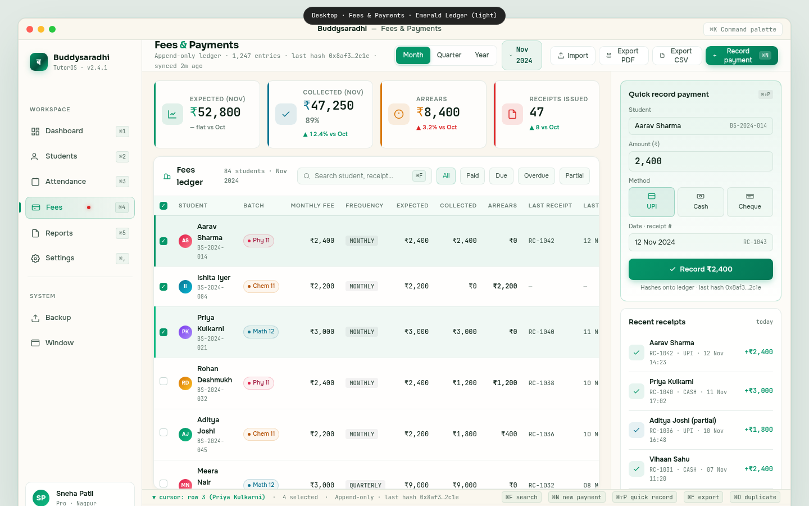

# 03 — Desktop Fees & Payments

> The financial spine of the Buddysaradhi Tauri v2 desktop app. The widest, densest, most keyboard-heavy screen in the system — a tabular-numerals-rich ledger table that lets a tutor reconcile 80+ students' monthly fees in a single sitting. This file is the visual + interaction contract for the desktop fees mockup at `mockups/desktop/03_fees.html`.

**Cross-references.** `00_Design_System_Overview.md` §5, `01_Color_Palettes.md` Palette 3 (Emerald Ledger), `02_Typography_System.md` (tabular numerics), `03_Component_Library.md` (data table, KPI), `04_Motion_and_Microinteractions.md`, `05_Accessibility_Contract.md`, `buddysaradhi_Planning/07_Fees_and_Payments.md` (business logic), `buddysaradhi_Planning/11_Data_Model.md` §4.6 (ledger_entries), `buddysaradhi_Planning/12_Business_Rules.md` BR-LED-01..10, `buddysaradhi_Planning/desktop/01_Architecture.md`.

---

## §1 — Page Identity

| Property | Value |
|---|---|
| **Platform** | Desktop (Tauri v2) |
| **Viewport** | 1440 × 900 px |
| **Palette** | `emerald-ledger` (`data-palette="emerald-ledger" data-theme="light"`) |
| **Default theme** | Light (sand `#FAF6EE`) |
| **Primary CTA** | "Record payment" button (top-right of topbar) → opens quick-record panel |
| **Window chrome** | macOS title bar (38px) + traffic lights + ⌘K chip |
| **Sidebar** | 220px (collapsible to 64px) |
| **Topbar height** | 56px |
| **Ledger pane** | flex 1 (~800px typical) |
| **Right rail** | 320px |
| **Status bar** | 26px |
| **Sticky footer** | 38px |

### Keyboard shortcuts (visible on this page)

| Shortcut | Action | Where shown |
|---|---|---|
| `⌘K` | Command palette | Title bar chip |
| `⌘N` | Record new payment (full form) | Topbar Record payment button |
| `⌘⇧P` | Quick record payment (right-rail mini-form) | Right rail card title |
| `⌘F` | Search student / receipt | Ledger search pill |
| `⌘E` | Export to CSV | Topbar Export button |
| `⌘⇧E` | Export to PDF | Topbar Export PDF button |
| `⌘D` | Duplicate focused row's last payment | Status bar |
| `⌘I` | Import from CSV | Topbar Import button |
| `↑` `↓` | Move cursor row | Status bar |
| `↵` | Open focused student's payment history | Status bar |
| `Space` | Toggle row selection | implicit |
| `⌘A` | Select all rows | implicit |
| `⌘1`–`⌘5` | Switch workspace | Sidebar |
| `⌘,` | Settings | Sidebar |

---

## §2 — Layout Anatomy

```
┌──────────────────────────────────────────────────────────────────────────────┐
│ Title bar (38px)                                                              │
├───────────────┬──────────────────────────────────────────────────────────────┤
│ Sidebar       │ Topbar (56px · "Fees & Payments" · period toggle · month ·  │
│ (220px)       │ Import · Export PDF · Export CSV · Record payment)           │
│               ├─────────────────────────────────────────┬────────────────────┤
│  • Brand      │ Ledger pane (flex 1)                    │ Right rail (320px)│
│  • Workspace  │  ┌────────────────────────────────────┐ │  • Quick record   │
│    nav        │  │ KPI row · 4 cards                   │ │    payment form   │
│    (Fees      │  │ Expected · Collected · Arrears ·    │ │  • Recent receipts│
│     active)   │  │ Receipts                            │ │    list (5)       │
│  • System     │  ├────────────────────────────────────┤ │  • Today's totals │
│    nav        │  │ Ledger card                         │ │    mini card      │
│  • User card  │  │  • Head: title + search + filters   │ │                   │
│               │  │  • Table: 13 cols × 15 rows + total │ │                   │
│               │  │  • Footer row: totals               │ │                   │
│               │  └────────────────────────────────────┘ │                   │
│               ├─────────────────────────────────────────┴────────────────────┤
│               │ Status bar (26px · "cursor: row 3 · ⌘F · ⌘N · ⌘⇧P · ⌘E")    │
│               ├──────────────────────────────────────────────────────────────┤
│               │ Sticky footer (38px)                                          │
└───────────────┴──────────────────────────────────────────────────────────────┘
```

### Region 1 — Sidebar (220px)

Shared sidebar, **Fees active**. The Fees item carries a red badge dot indicating overdue count (4 students).

### Region 2 — Topbar (56px)

- **Left.** "Fees & Payments" (18px Sora bold, emerald ampersand). Below: "Append-only ledger · 1,247 entries · last hash 0x8af3…2c1e · synced 2m ago" (11px JetBrains Mono).
- **Centre.** Period toggle [Month | Quarter | Year] (Month active) + month pill "Nov 2024" (emerald 8% tint + 1px emerald 22% border, with chevron).
- **Right.** Import · Export PDF · Export CSV · **Record payment** (emerald primary, with `⌘N` chip).

### Region 3 — Ledger pane + Right rail

#### Ledger pane (flex 1)

**KPI row (4 cards).** Equal widths, 12px gap. Each card: 38×38 icon square (emerald/teal/amber/red) + label + figure (22px JetBrains Mono) + delta line.

| Card | Accent | Figure | Delta |
|---|---|---|---|
| Expected (Nov) | emerald `#059669` | ₹52,800 | — flat vs Oct |
| Collected (Nov) | teal `#0E7490` | ₹47,250 89% | ▲ 12.4% vs Oct |
| Arrears | amber `#D97706` | ₹8,400 | ▲ 3.2% vs Oct |
| Receipts issued | red `#DC2626` | 47 | ▲ 8 vs Oct |

**Ledger card.** Glass-strong card containing:

1. **Head (12px padding).** Title "Fees ledger · 84 students · Nov 2024" with ledger icon. Right: search pill (240×30, "Search student, receipt… ⌘F") + 5 filter pills (All active / Paid / Due / Overdue / Partial).
2. **Table.** 13 columns × 15 rows + totals footer. **The widest, densest table in the entire app.**
3. **Footer row.** Sand-tinted (`#E8F5EE` 70%), 2px emerald top border, bold JetBrains Mono tabular-nums.

#### Right rail (320px)

Three cards stacked:

1. **Quick record payment (accent card).** Emerald-tinted gradient bg + 1px emerald border. Title with `⌘⇧P` chip. Form: Student selector (showing Aarav Sharma) · Amount (₹2,400 in 16px mono) · Method grid (UPI active / Cash / Cheque) · Date + receipt #. Submit button "Record ₹2,400" + helper "Hashes onto ledger · last hash 0x8af3…2c1e".
2. **Recent receipts (today, 5 items).** Each item: 28×28 emerald check icon · name + receipt# + method + datetime · right-aligned amount in emerald mono.
3. **Today's totals.** 4 rows (Collected +₹5,400 · Receipts 3 · By UPI ₹4,200 · By Cash ₹1,200) + divider + grand total "Net today +₹5,400" in emerald.

---

## §3 — Section-by-Section Content Spec

### 3.1 Ledger table — the column contract (13 cols)

Per `buddysaradhi_Planning/12_Business_Rules.md` BR-LED-01..10 and `11_Data_Model.md` §4.6 (ledger_entries) + §4.7 (receipts):

| # | Column | Width | Align | Format | Notes |
|---|---|---|---|---|---|
| 1 | Checkbox | 32px | centre | — | Emerald fill when checked |
| 2 | Student | flex (min 160px) | left | Avatar (24px) + Name (12.5px, 600) + Code (10px mono) | — |
| 3 | Batch | 90px | left | Pill (Phy 11 / Math 12 / Chem 11) | Coloured dot |
| 4 | Monthly fee | 90px | right | ₹ + tabular-nums | — |
| 5 | Frequency | 90px | left | Mono chip (MONTHLY / QUARTERLY) | — |
| 6 | Expected | 90px | right | ₹ + tabular-nums | For current period |
| 7 | Collected | 90px | right | ₹ + tabular-nums, emerald | — |
| 8 | Arrears | 80px | right | ₹ + tabular-nums, colour-coded | ₹0 muted · ₹1-999 amber · ≥₹1000 red |
| 9 | Last receipt | 90px | left | RC-#### (mono) or "—" | — |
| 10 | Last date | 70px | left | "12 Nov" (mono) | — |
| 11 | Method | 80px | left | Method chip (UPI/CASH/CHEQUE/—) | Colour-coded |
| 12 | Status | 100px | left | Status chip (Paid/Due/Overdue/Partial) | Dot + label |
| 13 | ⋯ | 60px | centre | Row action menu (Receipt + More) | — |

**Money column rule.** Columns 4, 6, 7, 8 are `text-align: right; font-family: var(--font-mono); font-variant-numeric: tabular-nums; font-feature-settings: "tnum";`. **Zero money is muted** (`--text-muted` at 50% opacity) so the eye skips zeroes and lands on real figures.

### 3.2 Ledger table — 15 sample rows

The mockup shows 15 rows of real Indian students with realistic fee states:

- **Row 1 (cursor + selected).** Aarav Sharma · Physics 11 · ₹2,400 · MONTHLY · ₹2,400 · ₹2,400 · ₹0 · RC-1042 · 12 Nov · UPI · Paid
- **Row 2 (selected).** Ishita Iyer · Chemistry 11 · ₹2,200 · MONTHLY · ₹2,200 · ₹0 · ₹2,200 (red) · — · — · — · Overdue
- **Row 3 (cursor).** Priya Kulkarni · Maths 12 · ₹3,000 · MONTHLY · ₹3,000 · ₹3,000 · ₹0 · RC-1040 · 11 Nov · CASH · Paid
- Row 4. Rohan Deshmukh · ₹2,400 · partial ₹1,200 / ₹1,200 overdue · CHEQUE
- Row 5. Aditya Joshi · ₹2,200 · partial ₹1,800 / ₹400 due · UPI
- Row 6. Meera Nair · ₹3,000 · quarterly ₹9,000 paid in full · UPI
- Row 7. Vihaan Sahu · ₹2,400 · paid · CASH
- Row 8. Ananya Banerjee · ₹3,000 · paid · UPI
- Row 9. Kabir Reddy · ₹2,200 · ₹2,200 overdue · — · Overdue
- Row 10. Sara D'Souza · ₹3,000 · paid · CHEQUE
- Row 11. Arjun Thakur · ₹2,400 · paid · UPI
- Row 12. Riya Verma · ₹2,200 · partial ₹1,100 / ₹1,100 due · CASH
- Row 13. Nikhil Vaidya · ₹2,400 · paid · UPI
- Row 14. Tanvi Pillai · ₹3,000 · ₹0 collected / ₹3,000 due · — · Due
- Row 15. Diya Kapadia · ₹2,200 · paid · CASH

### 3.3 Ledger footer (totals row)

Sand-tinted, 2px emerald top border:
- Col 1: empty
- Col 2: "84 students · 15 shown"
- Col 3: "3 batches"
- Col 4: "avg ₹2,524"
- Col 5: empty
- Col 6: ₹52,800 (expected total)
- Col 7: ₹47,250 (collected total, emerald)
- Col 8: ₹8,400 (arrears total, red)
- Col 9-10: "47 receipts issued"
- Col 11-12: "UPI 28 · CASH 14 · CHEQUE 5"
- Col 13: empty

### 3.4 Quick record payment form (right rail, accent card)

Per `12_Business_Rules.md` BR-LED-02 (record_payment command):

- **Student.** Pre-filled with the cursor row's student (Aarav Sharma · BS-2024-014). Click to change → student picker modal.
- **Amount (₹).** Pre-filled with the student's expected monthly fee (₹2,400). Editable. 16px JetBrains Mono, weight 600.
- **Method.** 3-tile grid: UPI (active, emerald) · Cash · Cheque. Click to select.
- **Date · receipt #.** Pre-filled today (12 Nov 2024) + next receipt sequence (RC-1043). Date editable via date picker; receipt # is read-only (auto-assigned by `settings.next_receipt_seq`).
- **Submit.** "Record ₹2,400" button. On click → `record_payment` Tauri command → INSERT into `ledger_entries` with `this_hash = sha256(prev_hash || payload || created_at)` → INSERT into `receipts` → atomically update `students.balance_after_paise` + `settings.next_receipt_seq`.
- **Helper.** "Hashes onto ledger · last hash 0x8af3…2c1e" — communicates the append-only hash chain.

### 3.5 Recent receipts list (right rail)

5 most recent receipts issued today. Each item:
- 28×28 icon square (emerald tinted check icon, or cyan for partial)
- Name + receipt# + method + datetime (10px mono)
- Right-aligned amount in emerald mono

### 3.6 Today's totals mini card (right rail)

4 rows + divider + grand total. All figures JetBrains Mono, tabular-nums, right-aligned. Grand total in emerald, 14px (one step up from rows).

### 3.7 Status bar

- **Left.** "▼ cursor: row 3 (Priya Kulkarni)" (emerald) · "4 selected" · "Append-only · last hash 0x8af3…2c1e"
- **Right.** 5 kbd-hint pills: ⌘F search · ⌘N new payment · ⌘⇧P quick record · ⌘E export · ⌘D duplicate

---

## §4 — Interaction Model

### Keyboard-first (the desktop advantage)

The ledger table is operated entirely from the keyboard. This is where the desktop app earns its keep vs. the web app.

| Key | Context | Action |
|---|---|---|
| `↑` `↓` | Table | Move cursor row; right-rail "Quick record" updates to cursor student |
| `↵` | Table | Open focused student's full payment history in a modal |
| `Space` | Table | Toggle selection (does NOT move cursor) |
| `⌘A` | Table | Select all rows matching current filter |
| `⌘D` | Table | Duplicate focused row's last payment (creates a new payment with same amount + method, today's date) |
| `⌘N` | Topbar | Open full Record Payment modal (form with student picker, amount, method, date, notes) |
| `⌘⇧P` | Topbar | Focus the right-rail Quick Record form |
| `⌘F` | Topbar | Focus the ledger search pill |
| `⌘E` | Topbar | Export current view to CSV |
| `⌘⇧E` | Topbar | Export current view to PDF (receipt-style summary) |
| `⌘I` | Topbar | Open Import CSV modal |
| `Tab` | Quick Record form | Cycle: Student → Amount → Method → Date → Submit |
| `↵` | Quick Record form (on Submit) | Fire `record_payment` command |
| `Esc` | Any modal | Close, restore focus to last table cell |

### Cursor vs. selection

Same as Students page (§4 of `02_Desktop_Students.md`): cursor is a single row marked with a 3px emerald left bar + 6% emerald tint. Selection is zero or more rows marked with 8% tint + checked checkbox. The right rail's Quick Record form follows the cursor (not the selection).

### Money editing

- **Amount field.** Numeric only. Cursor enters digit → field reformats with thousands separators on blur. Backend stores paise (integer); display formats rupee.
- **Method.** Cycle with `M` key when amount field is focused: UPI → Cash → Cheque → UPI.
- **Date.** `T` sets today. `+`/`-` adjusts by 1 day.

### Hash chain transparency

Per `11_Data_Model.md` §8 (hash chain), every payment INSERT computes `this_hash = sha256(prev_hash || payload || created_at)`. The status bar shows the last hash (`0x8af3…2c1e`) so the tutor can verify the chain is intact. The Quick Record helper echoes this hash → reinforces trust.

### Motion variants

| Element | Variant | Duration |
|---|---|---|
| KPI card hover | `card-tint-4%` (no lift — financial context demands calm) | 150ms |
| Ledger row hover | `row-tint-4%` | 100ms |
| Ledger row cursor | `row-tint-6%` + 3px emerald left bar | instant |
| Ledger row selected | `row-tint-8%` + 3px emerald left bar | instant |
| Method tile select | `tile-tint-2%` + emerald border | 150ms |
| Quick Record submit | `btn-press-1px` + spinner 800ms (Rust IPC round-trip) | 150ms + 800ms |
| New row appears (after payment) | `row-slide-in-from-top-8px` | 200ms `--ease-out` |
| Receipt toast | `toast-rise-from-bottom-8px` | 200ms `--ease-out` |

**Reduced motion.** All transitions collapse. New-row slide-in becomes instant appear. Toast appears without rise.

---

## §5 — Data Bindings

### Tauri commands (per `desktop/01_Architecture.md` §2)

| Region | Command | Rust function | SQL read |
|---|---|---|---|
| KPI Expected | `get_fee_kpis` | `commands::ledger::get_kpis` | `SELECT SUM(amount_paise) FROM fee_schedule_items WHERE due_date >= date('now','start of month') AND due_date < date('now','start of month','+1 month')` |
| KPI Collected | `get_fee_kpis` | same | `SELECT SUM(amount_paise) FROM ledger_entries WHERE type='PAYMENT_RECEIVED' AND occurred_on >= date('now','start of month')` |
| KPI Arrears | `get_fee_kpis` | same | `SELECT SUM(amount_paise) FROM fee_schedule_items WHERE status='OPEN' AND due_date < date('now')` |
| KPI Receipts | `get_fee_kpis` | same | `SELECT COUNT(*) FROM receipts WHERE issued_on >= date('now','start of month')` |
| Ledger rows | `get_ledger_view` | `commands::ledger::get_ledger_view` | per-student aggregation joining `students` ↔ `fee_schedule_items` ↔ `ledger_entries` ↔ `receipts` |
| Quick record | `record_payment` | `commands::ledger::record_payment` | INSERT into `ledger_entries` (with `this_hash`) + INSERT into `receipts` + UPDATE `settings.next_receipt_seq`, all in one `$transaction` |
| Recent receipts | `get_recent_receipts` | `commands::ledger::get_recent_receipts` | `SELECT r.*, s.name, s.code FROM receipts r JOIN students s ON r.student_id = s.id ORDER BY r.issued_on DESC LIMIT 5` |
| Today's totals | `get_todays_totals` | `commands::ledger::get_todays_totals` | `SELECT SUM(amount_paise), COUNT(*), method FROM ledger_entries WHERE type='PAYMENT_RECEIVED' AND occurred_on = date('now') GROUP BY method` |
| Export CSV | `export_ledger_csv` | `commands::ledger::export_csv` | streamed CSV via `tauri-plugin-dialog` save-as |
| Export PDF | `export_ledger_pdf` | `commands::ledger::export_pdf` | streamed PDF via `tauri-plugin-dialog` save-as |
| Import CSV | `import_ledger_csv` | `commands::ledger::import_csv` | parses CSV, validates via Zod, INSERTs in batch |

### Hash chain (per `11_Data_Model.md` §8 + `12_Business_Rules.md` BR-LED-04)

Every `record_payment` call:

1. Reads `prev_hash` from the latest `ledger_entries` row.
2. Computes `payload = canonical_json({student_id, amount_paise, method, occurred_on, receipt_id})`.
3. Computes `this_hash = sha256(prev_hash || payload || created_at_iso)`.
4. INSERTs the new row with `this_hash` + `prev_hash` + `void_of_id = NULL`.
5. Verifies the chain post-INSERT by re-reading the last 10 rows and recomputing hashes; aborts the transaction if any mismatch.

### Money handling (P-DM2)

All ₹ figures cross the IPC boundary as `i64` paise. The renderer's `formatINR(paise)` does the ₹ + thousands separator + tabular-nums formatting. **No float ever crosses.** Period.

### Append-only + VOID (per `11_Data_Model.md` P-DM3)

`ledger_entries` accepts INSERT only. Triggers (`0002_ledger_triggers.sql`) abort any UPDATE or DELETE. Corrections are new `type='VOID'` rows referencing the original via `void_of_id`. The UI never exposes a "delete payment" action — only "Void" (which writes a new row).

### Receipt sequence

`settings.next_receipt_seq` is incremented inside the same `$transaction` as the `ledger_entries` INSERT. Format: `RC-{year}-{seq:04d}` → e.g. `RC-2024-1043`. The sequence is per-tutor, per-year, monotonically increasing.

---

## §6 — Accessibility

### Keyboard map

| Key | Action |
|---|---|
| `Tab` | Cycle: topbar → ledger search → table → right rail |
| `↑` `↓` | Within table: move cursor row |
| `←` `→` | Within table: move cursor column (for cell-level actions) |
| `↵` | Open focused row's payment history modal |
| `Space` | Toggle row selection |
| `⌘A` | Select all (matching current filter) |
| `⌘N` | Open full Record Payment modal |
| `⌘⇧P` | Focus Quick Record form |
| `⌘F` | Focus search |
| `⌘E` / `⌘⇧E` | Export CSV / PDF |
| `Esc` | Close modal / clear selection |

### Focus rings

3px emerald 35% ring on `:focus-visible`. Every cell in the ledger table is focusable (so the cursor can land on any column). The Quick Record form fields each show the ring when focused.

### Screen reader

- **Landmarks.** `<aside aria-label="Workspace navigation">` · `<main aria-label="Fees ledger">` · `<aside aria-label="Quick record payment">`.
- **Table.** `<table>` with `<caption>` "Fees ledger for November 2024, 84 students". Column headers `<th scope="col">`. Row headers = student-name cell, `scope="row"`.
- **Money cells.** `aria-label` includes the spoken form: "Two thousand four hundred rupees, paid".
- **Status chips.** `aria-label="Paid in full"` / `aria-label="Overdue, one thousand two hundred rupees"`.
- **Hash chain.** The status bar's "last hash" line is `aria-live="polite"` so when a new payment is recorded, the screen reader announces "Ledger hash updated to 0x…".
- **Quick Record form.** Standard `<form>` with `<label>` per field. Submit button has `aria-label="Record payment of two thousand four hundred rupees for Aarav Sharma"`.

### Contrast

Emerald Ledger light hits WCAG AAA on body text (17.2:1) and AA on emerald-on-sand (4.8:1) per `01_Color_Palettes.md` §Palette 3.

---

## §7 — Edge Cases

### Offline

- All reads continue (local SQLite).
- All writes continue (record_payment writes to local SQLite + `sync_outbox`).
- Status bar shows "Offline · last sync 2h 14m ago". Hash chain continues to grow locally; sync to Turso flushes when online.
- Export PDF / CSV continue (writes to local file).

### Sync conflict on a ledger entry

Per `14_Edge_Cases.md` EC-SYNC-03: ledger entries use UUIDv7, so two devices writing payments simultaneously produce two different rows (no collision). Both rows sync to Turso. The ledger view shows both.

If a student was edited on two devices (e.g. name spelling), last-write-wins applies. The detail pane shows an amber banner "Student record updated on another device. [Show diff]".

### Void / correction

- Clicking ⋯ → "Void receipt" on a paid row opens a confirmation modal: "Void RC-1042 (₹2,400 from Aarav Sharma)? This writes a new VOID entry on the hash chain. The original entry remains. [Cancel] [Void]".
- On confirm, a new `ledger_entries` row is INSERTed with `type='VOID'`, `void_of_id = <original.id>`. The original row's `status` is unchanged (append-only), but the view-layer treats it as voided (red strikethrough).
- The status chip becomes "Voided" (grey). The arrears column re-includes the voided amount.

### Receipt sequence gap

If the Tauri process crashes between INSERTing `ledger_entries` and incrementing `settings.next_receipt_seq`, the next receipt skips a number (e.g. RC-1044 after RC-1042). The gap is logged in `audit_log` and surfaced in Reports → Audit → "Receipt sequence gaps".

### Large dataset (500+ students)

- Ledger table virtualises beyond 100 visible rows.
- KPIs and totals row use `SUM` aggregation in SQL (no client-side sum) — performs in <5ms on a 500-student DB.
- Filter pills update with 100ms debounce.

### Low memory

- Right rail collapses if `performance.memory.usedJSHeapSize > 80 MB` — Quick Record form becomes a modal instead.
- Status bar shows "Memory saver · right rail hidden".

### Period toggle (Month → Quarter → Year)

- Month: shows November fees (current month).
- Quarter: shows Oct + Nov + Dec expected/collected/arrears (Q3 2024–25 Indian fiscal).
- Year: shows Apr 2024 → Mar 2025 (Indian fiscal year per `12_Business_Rules.md` BR-FY-01).
- Totals row aggregates across the selected period.
- The KPI cards recompute their deltas vs. the previous equivalent period.

### Window resize

- Below 1280px width, right rail hides (Quick Record becomes a modal triggered by ⌘⇧P).
- Below 1100px, columns 5 (Frequency) and 9 (Last receipt) hide.
- Below 1024px, OS prevents further shrink.

---

## §8 — Image Reference



**Screenshot capture contract.** Render at 1440 × 900 in Chrome (WebView2 mode). 2× DPI. Save as `images/desktop/03_fees.png`. Pixel-diff < 2% vs previous build.

---

## §9 — Status

- **Author.** UI/UX Lead (Task 13-DESKTOP-MOCKUPS)
- **State.** COMPLETED
- **Mockup.** `mockups/desktop/03_fees.html` (1020 lines, standalone HTML, links `shared/styles.css`)
- **Consumers.** Desktop agent (Tauri v2 implementation), QA
- **Dependencies.** `buddysaradhi_Planning/07_Fees_and_Payments.md`, `buddysaradhi_Planning/11_Data_Model.md` §4.6 (ledger_entries), `buddysaradhi_Planning/12_Business_Rules.md` BR-LED-01..10, `buddysaradhi_Planning/desktop/01_Architecture.md`
