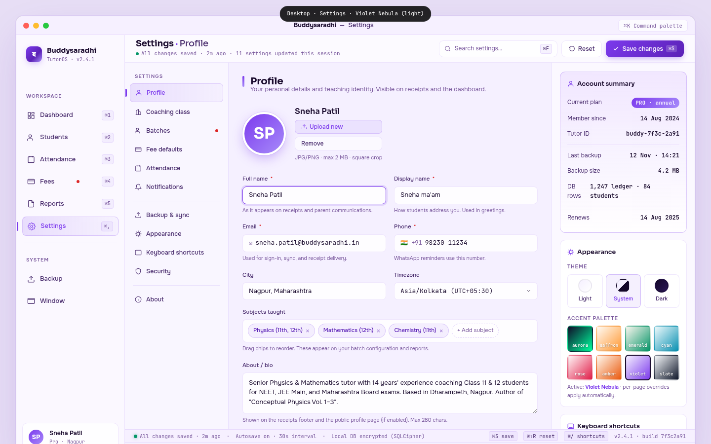

# 04 — Desktop Settings

> The back-of-house of the Buddysaradhi Tauri v2 desktop app. A 3-pane layout (sections nav · form · context rail) where the tutor configures their profile, coaching class, batches, fee defaults, attendance rules, notifications, backup, appearance, keyboard shortcuts, and security. This file is the visual + interaction contract for the desktop settings mockup at `mockups/desktop/04_settings.html`.

**Cross-references.** `00_Design_System_Overview.md` §5, `01_Color_Palettes.md` Palette 7 (Violet Nebula), `02_Typography_System.md`, `03_Component_Library.md` (form inputs, toggles, swatches), `04_Motion_and_Microinteractions.md`, `05_Accessibility_Contract.md`, `buddysaradhi_Planning/08_Settings.md` (business logic), `buddysaradhi_Planning/desktop/01_Architecture.md`.

---

## §1 — Page Identity

| Property | Value |
|---|---|
| **Platform** | Desktop (Tauri v2) |
| **Viewport** | 1440 × 900 px |
| **Palette** | `violet-nebula` (`data-palette="violet-nebula" data-theme="light"`) |
| **Default theme** | Light (lavender-mist `#F5F0FF`) |
| **Primary CTA** | "Save changes" button (top-right of topbar) → persists all dirty fields |
| **Window chrome** | macOS title bar (38px) + traffic lights + ⌘K chip |
| **Sidebar** | 220px (collapsible to 64px) |
| **Topbar height** | 56px |
| **Pane 1 (sections nav)** | 210px |
| **Pane 2 (form)** | flex 1 (~600px) |
| **Pane 3 (context rail)** | 290px |
| **Status bar** | 26px |
| **Sticky footer** | 38px |

### Keyboard shortcuts

| Shortcut | Action | Where shown |
|---|---|---|
| `⌘K` | Command palette | Title bar chip |
| `⌘S` | Save changes | Topbar Save button, save bar |
| `⌘⇧R` | Reset to defaults | Topbar Reset button |
| `⌘F` | Search settings | Topbar search |
| `⌘,` | Open Settings (already here; focuses sections nav) | Sidebar |
| `⌘/` | Show all keyboard shortcuts | Help |
| `↑` `↓` | Cycle sections nav (Pane 1) | implicit |
| `Tab` | Cycle form fields (Pane 2) | implicit |
| `⌘1`–`⌘5` | Switch workspace | Sidebar |
| `Esc` | Clear focus / close any open select | implicit |

---

## §2 — Layout Anatomy

```
┌──────────────────────────────────────────────────────────────────────────────┐
│ Title bar (38px)                                                              │
├───────────────┬──────────────────────────────────────────────────────────────┤
│ Sidebar       │ Topbar (56px · "Settings · Profile" · saved status · search │
│ (220px)       │ · Reset · Save changes)                                       │
│               ├──────────┬─────────────────────────────────┬─────────────────┤
│  • Brand      │ Sections │ Form (flex 1 · ~600px)           │ Context rail    │
│  • Workspace  │ nav      │  • Title + sub                  │ (290px)         │
│    nav        │ (210px)  │  • Avatar row                   │  • Account      │
│    (Settings  │  • Profile│  • Form grid (2 cols)          │    summary      │
│     active)   │  • Coaching│  • Subjects chip row          │  • Appearance    │
│  • System     │  • Batches│  • About textarea              │    (theme +     │
│    nav        │  • Fee    │  • Save bar                    │    palette      │
│  • User card  │  • Attend │                                 │    swatches)    │
│               │  • Notif  │                                 │  • Keyboard     │
│               │  • Backup │                                 │    shortcuts    │
│               │  • Appear │                                 │    card         │
│               │  • Keys   │                                 │                 │
│               │  • Secur  │                                 │                 │
│               │  • About  │                                 │                 │
│               ├──────────┴─────────────────────────────────┴─────────────────┤
│               │ Status bar (26px · "All changes saved · autosave on")        │
│               ├──────────────────────────────────────────────────────────────┤
│               │ Sticky footer (38px)                                          │
└───────────────┴──────────────────────────────────────────────────────────────┘
```

### Region 1 — Sidebar (220px)

Shared sidebar, **Settings active**. The Settings icon is the gear.

### Region 2 — Topbar (56px)

- **Left.** "Settings · Profile" (18px Sora bold, violet accent dot). Below: "● All changes saved · 2m ago · 11 settings updated this session" (11px JetBrains Mono, with emerald saved-dot glyph).
- **Centre.** Search pill (240×34) "Search settings… ⌘F".
- **Right.** Reset button (ghost) · **Save changes** button (violet primary, with `⌘S` chip). Save is the primary CTA; disabled when no dirty fields.

### Region 3 — Three panes

#### Pane 1 — Sections nav (210px, left)

Vertical nav with 11 sections + 2 dividers. Sections:

**Settings group:**
1. **Profile** (active) — personal details, avatar, bio
2. Coaching class — institute name, address, branding
3. Batches — batch CRUD, room/timetable assignment (red badge: 1 unsaved change)
4. Fee defaults — monthly/quarterly templates, frequency rules
5. Attendance — session rules, late-window, auto-lock
6. Notifications — WhatsApp/email templates, reminder schedules

**System group:**
7. Backup & sync — manual/auto backup, restore, sync frequency
8. Appearance — theme, palette, density, font size
9. Keyboard shortcuts — rebind all shortcuts
10. Security — PIN, biometric, audit log

**About group:**
11. About — version, license, credits

#### Pane 2 — Form (flex 1, ~600px)

The form pane is scrollable. For the Profile section (the mockup's active section), it contains:

1. **Section title.** "Profile" (20px Sora bold) with a violet accent bar to the left. Sub-line below: "Your personal details and teaching identity. Visible on receipts and the dashboard."
2. **Avatar row.** 88×88 gradient circle (4px white border + violet shadow), name "Sneha Patil", two action buttons (Upload new, Remove), helper "JPG/PNG · max 2 MB · square crop".
3. **Form grid (2 columns).** 8 fields:
   - Full name * (focused state — violet border + 3px violet 15% ring)
   - Display name * ("Sneha ma'am")
   - Email * (with ✉ prefix, mono font)
   - Phone * (with 🇮🇳 +91 prefix, mono font, Indian formatting)
   - City ("Nagpur, Maharashtra")
   - Timezone ("Asia/Kolkata (UTC+05:30)" with chevron — dropdown)
   - Subjects taught (chip row — full width)
   - About / bio (textarea — full width)
   - Languages
   - Experience (years, mono)
4. **Save bar.** Violet 6% tint + 1px violet 22% border. Left: "● All changes saved · 2m ago · autosave on". Right: Discard + Save now (violet primary, ⌘S chip).

#### Pane 3 — Context rail (290px, right)

Three cards stacked:

1. **Account summary (accent card).** Violet-tinted gradient bg + 1px violet border. 7 rows:
   - Current plan: "PRO · annual" (violet pill)
   - Member since: 14 Aug 2024 (mono)
   - Tutor ID: buddy-7f3c-2a91 (mono)
   - Last backup: 12 Nov · 14:21 (mono)
   - Backup size: 4.2 MB (mono)
   - DB rows: 1,247 ledger · 84 students (mono)
   - Renews: 14 Aug 2025 (mono)
2. **Appearance card.** Two sub-sections:
   - **Theme.** 3-pill row: Light / System (active) / Dark. Each pill has a 28px swatch.
   - **Accent palette.** 4×2 grid of 8 swatches: aurora, saffron, emerald, cyan, rose, amber, violet (active), slate. Each swatch is a gradient square with the palette name in 9px mono at the bottom.
3. **Keyboard shortcuts card.** 7 rows + "View all 47 shortcuts →" link:
   - Command palette: ⌘K
   - New student: ⌘N
   - Search: ⌘F
   - Record payment: ⌘⇧P
   - Settings: ⌘,
   - Backup now: ⌘⇧B
   - Toggle theme: ⌘⇧L

---

## §3 — Section-by-Section Content Spec

### 3.1 Sections nav (Pane 1) — full list

Per `buddysaradhi_Planning/08_Settings.md` §2 (Settings sections):

| # | Section | Icon | Notes |
|---|---|---|---|
| 1 | Profile | user | Active in mockup |
| 2 | Coaching class | building | Institute name, address, logo, GSTIN |
| 3 | Batches | users | Red badge = 1 unsaved batch change |
| 4 | Fee defaults | credit-card | Monthly/quarterly templates, late-fee rules |
| 5 | Attendance | calendar | Session rules, late-window, auto-lock-after |
| 6 | Notifications | bell | WhatsApp/email templates, reminder schedules |
| 7 | Backup & sync | upload-cloud | Manual/auto backup, restore, sync frequency |
| 8 | Appearance | sun | Theme, palette, density, font size |
| 9 | Keyboard shortcuts | keyboard | Rebind all shortcuts |
| 10 | Security | shield | PIN, biometric, audit log |
| 11 | About | info | Version, license, credits |

### 3.2 Profile form (Pane 2) — field contract

Per `buddysaradhi_Planning/08_Settings.md` §3 (Profile schema) + `11_Data_Model.md` §4.1 (settings singleton):

| Field | Type | Required | Validation | Persisted to |
|---|---|---|---|---|
| Avatar | file upload (JPG/PNG, ≤2MB) | no | ImageMagick validation | `settings.tutor_avatar_path` (local file) |
| Full name | text | yes | 2–80 chars, no emojis | `settings.tutor_name` |
| Display name | text | yes | 1–40 chars | `settings.tutor_display_name` |
| Email | email | yes | RFC 5322 + DNS MX check on blur | `settings.tutor_email` |
| Phone | tel (Indian) | yes | +91 + 10 digits, E.164 | `settings.tutor_phone` |
| City | text | no | 2–80 chars | `settings.tutor_city` |
| Timezone | select | yes | IANA tz database | `settings.tutor_timezone` |
| Subjects taught | chip multi-select | no | Must map to `batches.subject` enum | `settings.tutor_subjects` (JSON array) |
| About / bio | textarea | no | 0–280 chars | `settings.tutor_bio` |
| Languages | text | no | Comma-separated | `settings.tutor_languages` (JSON array) |
| Experience (years) | number | no | 0–70 | `settings.tutor_experience_years` |

### 3.3 Avatar row

- 88×88 gradient circle (violet→lavender) with 4px white border + 24px violet-tinted shadow.
- Initials "SP" rendered at 32px Sora bold white.
- Two stacked action buttons:
  - **Upload new** (violet 8% tint + 1px violet 22% border + violet text). Opens native file picker via `tauri-plugin-dialog`.
  - **Remove** (ghost, white 60% bg + glass border + muted text).
- Helper text below: "JPG/PNG · max 2 MB · square crop".

### 3.4 Subjects chip row

- Each chip: violet 8% bg + 1px violet 22% border + violet text + × closer.
- 3 chips shown: "Physics (11th, 12th)", "Mathematics (12th)", "Chemistry (11th)".
- "+ Add subject" dashed pill at the end. Click → subject picker modal (multi-select with grade-level filter).

### 3.5 About textarea

- Min-height 84px, vertical resize.
- Pre-filled with realistic bio: "Senior Physics & Mathematics tutor with 14 years' experience coaching Class 11 & 12 students for NEET, JEE Main, and Maharashtra Board exams. Based in Dharampeth, Nagpur. Author of 'Conceptual Physics Vol. 1–3'."
- Helper: "Shown on the receipts footer and the public profile page (if enabled). Max 280 chars."
- Character counter appears when bio > 240 chars.

### 3.6 Save bar

Violet 6% tint + 1px violet 22% border, 10px radius. Two regions:
- **Left.** "● All changes saved · 2m ago · autosave on" (12px, with emerald glow dot).
- **Right.** Discard (ghost) + Save now (violet primary, ⌘S chip).

### 3.7 Account summary card (Pane 3, accent)

7 rows + 2 dividers. All values JetBrains Mono, tabular-nums:
1. Current plan: PRO · annual (violet pill)
2. Member since: 14 Aug 2024
3. Tutor ID: buddy-7f3c-2a91
4. — divider —
5. Last backup: 12 Nov · 14:21
6. Backup size: 4.2 MB
7. DB rows: 1,247 ledger · 84 students
8. — divider —
9. Renews: 14 Aug 2025

### 3.8 Appearance card (Pane 3)

**Theme sub-section:**
- 3 pills (Light / System / Dark). System is active.
- Each pill: 28×28 swatch (Light = lavender→white gradient, Dark = midnight→plum gradient, System = half-and-half).

**Accent palette sub-section:**
- 4×2 grid of 8 swatches. Each swatch: aspect-ratio 1, 7px radius, 2px transparent border (violet when active).
- Each swatch is a diagonal gradient: pale variant → signature hue.
- Palette name (9px mono, white, text-shadow) at the bottom of each swatch.
- Below the grid: "Active: Violet Nebula · per-page overrides apply automatically."

### 3.9 Keyboard shortcuts card (Pane 3)

7 rows of label + key chips. Each key chip: violet 6% bg + 1px glass border + violet-tinted text + JetBrains Mono 10.5px + 1px drop shadow (kbd-key aesthetic).
- "View all 47 shortcuts →" link at the bottom (violet, mono, centred).

---

## §4 — Interaction Model

### Keyboard-first

| Key | Context | Action |
|---|---|---|
| `⌘,` | Global | Open Settings; focus sections nav (Pane 1) |
| `↑` `↓` | Sections nav | Cycle sections |
| `↵` | Sections nav | Switch form to focused section |
| `Tab` | Form | Cycle fields in tab-index order |
| `Shift+Tab` | Form | Reverse cycle |
| `⌘S` | Topbar / Save bar | Save all dirty fields |
| `⌘⇧R` | Topbar | Reset current section to defaults (confirms via modal) |
| `⌘F` | Topbar | Focus settings search → fuzzy-matches section names + field labels |
| `Esc` | Search / Select | Clear search, close dropdown |

### Autosave vs. manual save

- **Autosave.** On by default. Each field saves 1.5s after blur (debounced). The status bar shows "● All changes saved · 2m ago · autosave on".
- **Manual save.** `⌘S` or the Save button forces an immediate save of all dirty fields. Useful when the tutor wants to verify the save before navigating away.
- **Discard.** The Discard button reverts all dirty fields to their last-saved state. Confirms via modal: "Discard 4 unsaved changes? [Cancel] [Discard]".

### Validation

- **On blur.** Field-level validation runs. Invalid fields show a 1px red border + red helper text below.
- **On save.** Form-level validation runs. If any required field is empty or invalid, save aborts and the first invalid field scrolls into view + focuses.
- **Email** specifically validates RFC 5322 + DNS MX lookup (async, 500ms timeout). Failing MX → amber warning "Could not verify email domain; saving anyway."

### Avatar upload

1. Click "Upload new" → `tauri-plugin-dialog` opens native file picker (filtered to JPG/PNG).
2. Selected file is validated (max 2MB, image type).
3. File is read into a `SecureBuffer` (`crypto/SecureBuffer`), processed by `image` crate (resize to 512×512 square, encode as WebP quality 85).
4. Saved to `app_data_dir/avatars/{tutor_id}.webp`. Path stored in `settings.tutor_avatar_path`.
5. UI updates with the new avatar (crossfade).

### Palette switch

When the tutor clicks a palette swatch in Pane 3:
1. `data-palette` on `<body>` updates to the chosen palette.
2. CSS variables cascade — every element re-themes instantly (150ms transition on `background-color`, `color`, `border-color`).
3. The active swatch gets a 2px violet border + slight scale-up (1.05).
4. The choice persists to `settings.preferred_palette` (default: per-page assignment).
5. A toast appears: "Palette changed to Emerald Ledger. Per-page overrides still apply on Fees, Students, etc."

### Theme switch

When the tutor clicks Light / System / Dark:
1. `data-theme` on `<body>` updates.
2. CSS variables cascade to the chosen theme's tokens.
3. Choice persists to `settings.preferred_theme` (`light` / `dark` / `system`).
4. If `system`, the app listens to the OS theme preference via `tauri-plugin-window-state` and re-themes on OS change.

### Motion variants

| Element | Variant | Duration |
|---|---|---|
| Sections nav active | `nav-fade-12%` + 3px violet left bar | 150ms |
| Form field focus | `input-ring-3px-violet-15%` | 150ms |
| Save button press | `btn-press-1px` + spinner 600ms (Rust IPC) | 150ms + 600ms |
| Palette swatch select | `swatch-scale-1.05` + violet border | 150ms |
| Theme switch | `bg-color-150ms` (background, text, border all transition) | 150ms |
| Toast (save confirmation) | `toast-rise-from-bottom-8px` | 200ms `--ease-out` |
| Modal open (Reset confirmation) | `modal-rise-8px` + `backdrop-fade` | 200ms |

**Reduced motion.** All transitions collapse to instant. Palette swatch select becomes instant border change. Theme switch is instant re-theme.

---

## §5 — Data Bindings

### Tauri commands (per `desktop/01_Architecture.md` §2)

| Region | Command | Rust function | SQL |
|---|---|---|---|
| Load profile | `get_settings` | `commands::settings::get_settings` | `SELECT * FROM settings WHERE tenant_id = ?` |
| Save profile | `update_settings` | `commands::settings::update_settings` | `UPDATE settings SET ... WHERE tenant_id = ?` inside `$transaction` + INSERT `audit_log` |
| Avatar upload | `upload_avatar` | `commands::settings::upload_avatar` | reads file, processes, saves to disk, `UPDATE settings SET tutor_avatar_path = ?` |
| Account summary · plan | `get_account_summary` | `commands::settings::get_account_summary` | reads `settings.plan_tier`, `settings.member_since` |
| Account summary · backup | `get_backup_status` | `commands::backup::get_status` | reads `backup_manifest` last entry |
| Account summary · DB stats | `get_db_stats` | `commands::settings::get_db_stats` | `PRAGMA page_count * page_size` + `SELECT COUNT(*) FROM ledger_entries` + `SELECT COUNT(*) FROM students` |
| Reset to defaults | `reset_settings_section` | `commands::settings::reset_section` | `UPDATE settings SET <section fields> = <defaults>` + INSERT `audit_log` |
| Get audit log | `get_audit_log` | `commands::settings::get_audit_log` | `SELECT * FROM audit_log ORDER BY created_at DESC LIMIT 50` |

### Settings singleton (per `11_Data_Model.md` §4.1)

The `settings` table is a singleton — one row per tenant. All Profile fields are columns on this table:

- `tutor_name` (TEXT)
- `tutor_display_name` (TEXT)
- `tutor_email` (TEXT)
- `tutor_phone` (TEXT, E.164)
- `tutor_city` (TEXT)
- `tutor_timezone` (TEXT, IANA)
- `tutor_subjects` (TEXT, JSON array)
- `tutor_bio` (TEXT)
- `tutor_languages` (TEXT, JSON array)
- `tutor_experience_years` (INTEGER)
- `tutor_avatar_path` (TEXT, nullable)
- `preferred_theme` (TEXT, `light`/`dark`/`system`)
- `preferred_palette` (TEXT, palette name or `per-page`)

### Audit log (per `11_Data_Model.md` §4.12)

Every `update_settings` call INSERTs a row into `audit_log`:

- `actor` = tutor_id (self)
- `action` = `UPDATE_SETTINGS`
- `entity_type` = `settings`
- `entity_id` = tenant_id
- `before` = JSON snapshot of changed fields
- `after` = JSON snapshot of new values
- `created_at` = ISO UTC

The audit log is append-only (`P-DM4`) — never UPDATEd or DELETEd.

### Avatar storage

Per `desktop/01_Architecture.md` §2 + `10_Security.md` §6:

- The original uploaded file is read into a `SecureBuffer` (zeroized on drop).
- The `image` crate resizes to 512×512 square (centre crop) and encodes as WebP quality 85.
- The processed file is written to `app_data_dir/avatars/{tutor_id}.webp` with permissions 0600.
- The path is stored in `settings.tutor_avatar_path`.
- The original file is securely deleted (`zeroize` + `fs::remove_file`).

### Sync

Settings sync to Turso via the `sync/outbox` flusher. The tutor's settings are a singleton row, so conflict resolution is last-write-wins. If two devices edit settings simultaneously, the later write wins; the earlier write is preserved in `audit_log`.

---

## §6 — Accessibility

### Keyboard map

| Key | Action |
|---|---|
| `Tab` | Cycle: sections nav → form fields → context rail cards |
| `↑` `↓` | Within sections nav: cycle sections |
| `↵` | Activate (switch section, toggle field, fire button) |
| `Space` | Toggle checkbox / radio / palette swatch |
| `⌘S` | Save |
| `⌘⇧R` | Reset |
| `⌘F` | Search |
| `Esc` | Close dropdown / clear search |

### Focus rings

3px violet 35% ring on `:focus-visible`. Form fields, sections nav items, palette swatches, theme pills, and keyboard-shortcut card all show the ring.

### Screen reader

- **Landmarks.** `<aside aria-label="Workspace navigation">` (sidebar) · `<nav aria-label="Settings sections">` (Pane 1) · `<main aria-label="Settings form">` (Pane 2) · `<aside aria-label="Account and appearance">` (Pane 3).
- **Form.** Standard `<label>` per field. Required fields marked with `aria-required="true"` and a visible red asterisk.
- **Validation.** Invalid fields have `aria-invalid="true"` + `aria-describedby` linking to the error text.
- **Save status.** The save bar's status text is `aria-live="polite"` so the screen reader announces "All changes saved" after each save.
- **Avatar.** The avatar image has `alt="Profile photo of Sneha Patil"`. The upload button has `aria-label="Upload new profile photo"`.
- **Palette swatches.** Each swatch has `aria-label` "Aurora Cosmic palette" / "Saffron Marigold palette" / etc. The active swatch has `aria-pressed="true"`.
- **Keyboard shortcuts card.** Each row is a `<dl>` with `<dt>` (label) and `<dd>` (key chips). The key chips have `aria-label` like "Command K".

### Contrast

Violet Nebula light hits WCAG AAA on body text (16.5:1) and AA on violet-on-lavender (4.6:1) per `01_Color_Palettes.md` §Palette 7.

---

## §7 — Edge Cases

### Reset to defaults

Clicking Reset opens a modal:
"Reset Profile to defaults? This will discard your customisations to 7 fields and revert to factory values. Your students, batches, and ledger are NOT affected. [Cancel] [Reset]"

On confirm, `reset_settings_section('profile')` runs:
- `UPDATE settings SET tutor_name = 'Tutor', tutor_display_name = 'Tutor', ... WHERE tenant_id = ?`
- INSERT `audit_log` with `action = RESET_SETTINGS`
- The form re-renders with default values.

### Avatar upload failures

- **File too large.** Toast: "File exceeds 2 MB. Choose a smaller image."
- **Wrong type.** Toast: "Only JPG and PNG are supported."
- **Disk full.** Modal: "Cannot save avatar. Your disk is full. Free up space and try again. [OK]"
- **Permission denied.** Modal: "Cannot write to app data directory. Check your OS file permissions. [Open docs]"

### Offline

- All reads continue (local SQLite).
- All writes continue (local SQLite + `sync_outbox`).
- The "Last backup" row in Account summary continues to update from local state.
- The "synced" indicator in the topbar shows "Offline · last sync 2h 14m ago".

### Sync conflict

Per `14_Edge_Cases.md` EC-SYNC-03: settings is a singleton, so last-write-wins. If two devices edit settings, the later write wins. The earlier write is preserved in `audit_log`. A non-blocking banner appears: "Settings were updated on another device 5m ago. [Show diff] [Keep local]".

### Large bio

- The bio textarea has a 280-char limit. A character counter appears when bio > 240 chars: "267 / 280".
- At 280 chars, further typing is blocked (no paste-overflow).

### Many subjects (chip overflow)

- The chip row wraps. If more than 8 chips, the row expands vertically. A "Show all (12)" link collapses the extra chips.

### Window resize

- Below 1280px width, Pane 3 (context rail) hides. Account summary / Appearance / Keyboard shortcuts become a collapsible drawer accessible from the topbar.
- Below 1100px, Pane 1 (sections nav) collapses to icons only.
- Below 1024px, OS prevents further shrink.

### Theme switch mid-session

- Switching theme does NOT reload the page. CSS variables cascade instantly.
- The avatar gradient and palette swatches re-render with the new theme's tokens.
- The tutor's unsaved form data is preserved (no state loss).

### Palette switch mid-session

- Same as theme switch: instant cascade, no reload.
- Per-page palette overrides (e.g. Fees always renders Emerald Ledger) still apply on navigation.
- The Settings page itself stays in Violet Nebula (its assigned palette) regardless of the user's preferred palette choice — UNLESS the tutor explicitly selects a different palette AND toggles "Use preferred palette everywhere" (off by default).

### Security: PIN required for sensitive changes

Per `10_Security.md` §4: changing the Security section's PIN, biometric, or audit-log settings requires re-entering the current PIN. A modal prompts: "Enter your PIN to continue. [PIN input] [Cancel] [Confirm]".

### Biometric prompt

On macOS with Touch ID / Windows Hello available, sensitive actions (reset, export, change PIN) trigger a biometric prompt via `tauri-plugin-biometric`. Falls back to PIN if biometric is unavailable or fails 3 times.

---

## §8 — Image Reference



**Screenshot capture contract.** Render at 1440 × 900 in Chrome (WebView2 mode). 2× DPI. Save as `images/desktop/04_settings.png`. Pixel-diff < 2% vs previous build.

---

## §9 — Status

- **Author.** UI/UX Lead (Task 13-DESKTOP-MOCKUPS)
- **State.** COMPLETED
- **Mockup.** `mockups/desktop/04_settings.html` (796 lines, standalone HTML, links `shared/styles.css`)
- **Consumers.** Desktop agent (Tauri v2 implementation), QA
- **Dependencies.** `buddysaradhi_Planning/08_Settings.md`, `buddysaradhi_Planning/11_Data_Model.md` §4.1 (settings), `buddysaradhi_Planning/10_Security.md` §4 (PIN/biometric), `buddysaradhi_Planning/desktop/01_Architecture.md`
