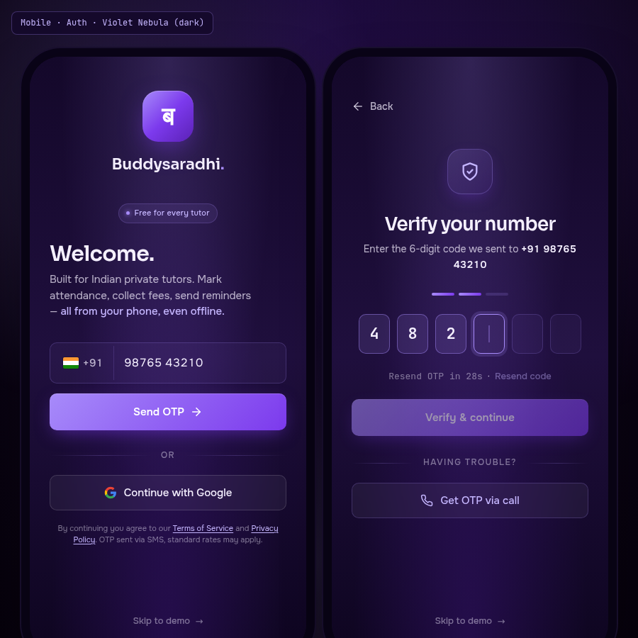

# 01 — Mobile · Auth

> The first screen every Indian tutor sees. Two states — phone entry, then OTP verification — wrapped in a single aurora-violet gradient surface. No bottom nav (full-screen branded flow). Built on the **Violet Nebula** palette, dark variant — the only palette permitted to use violet as a primary (`#7C3AED` plum-warm, NOT indigo).



---

## §1. Page Identity

| Property | Value |
|---|---|
| Platform | Mobile (React Native / Expo) |
| Mockup | `mockups/mobile/01_auth.html` |
| Viewport | 390 × 844 px (iPhone 14 Pro frame, 1×) |
| Palette | `violet-nebula` |
| Theme default | `dark` (full-screen aurora-violet gradient; light variant = lavender mist) |
| Signature hue | Violet `#A78BFA` (lit-violet) over gradient `#14082A → #1F0F3D → #0E0520` |
| Primary CTA | **Send OTP** (frame 1) → **Verify & continue** (frame 2) |
| Bottom nav | NONE — full-screen branded flow, no chrome |
| Frame strategy | TWO mobile frames side-by-side in the same HTML: (1) phone entry, (2) OTP verification |
| Brand element | "ब" Devanagari glyph in the Buddysaradhi logo mark — signals the Indian-tutor identity from second one |

### Why this palette / why dark

Auth is the **back-of-house** moment. The tutor is about to trust us with their students' data. Aurora-violet signals "you are entering a protected, premium space" — distinct from the cold Stripe-indigo every other SaaS uses. Dark variant because the auth flow happens once, on first install, often at night; the aurora-violet gradient creates a memorable first impression that scales down to a compact OTP screen without feeling clinical.

---

## §2. Layout Anatomy

### 2.1 Frame structure (both phones)

```html
<body data-palette="violet-nebula" data-theme="dark">
  <div class="frame-pair">           <!-- flex, gap 36px, wraps on small screens -->
    <div>
      <div class="mobile-frame">     <!-- 390×844, iPhone bezel shadow -->
        <div class="mobile-frame-content">
          <div class="auth-screen">  <!-- full-bleed flex column -->
            …brand + form + skip-link…
          </div>
        </div>
      </div>
      <div class="frame-label">01 / 02 · Phone entry</div>
    </div>
    <div>
      <div class="mobile-frame">…OTP frame…</div>
      <div class="frame-label">02 / 02 · OTP verification</div>
    </div>
  </div>
</body>
```

### 2.2 The auth-screen layout

```
┌─────────────────────────────────────┐
│   [safe-area-inset-top: 48px]       │
│                                     │
│         ┌─────────────┐             │  ← logo: 72×72 rounded square
│         │      ब       │             │     gradient violet, white glyph
│         └─────────────┘             │     glow-shadow halo
│         Buddysaradhi.               │  ← wordmark, 22px Sora 600
│                                     │
│      ⬤ Free for every tutor         │  ← feature pill, violet on glass
│                                     │
│   Welcome.                          │  ← H1, 30px Sora 600
│   Built for Indian private tutors.  │  ← subhead, 15px Onest 400
│   Mark attendance, collect fees,    │     max-width 290px
│   send reminders — all from your    │
│   phone, even offline.              │
│                                     │
│   ┌─────────────────────────────┐   │  ← phone input wrap (glass-strong)
│   │ 🇮🇳 +91 │ 98765 43210        │   │     50px tall, focus ring violet
│   └─────────────────────────────┘   │
│                                     │
│   ┌─────────────────────────────┐   │  ← Send OTP button (gradient)
│   │   Send OTP           →       │   │     52px, full-width
│   └─────────────────────────────┘   │
│                                     │
│   ──────── or ────────              │  ← divider with label
│                                     │
│   ┌─────────────────────────────┐   │  ← Google button (glass)
│   │  G  Continue with Google     │   │     50px, white border
│   └─────────────────────────────┘   │
│                                     │
│   By continuing you agree to our    │  ← terms text, 11px muted
│   Terms of Service and Privacy      │
│   Policy. OTP sent via SMS.         │
│                                     │
│   ───────────────────────────       │
│   Skip to demo →                    │  ← bottom link, mt-auto
│   [safe-area-inset-bottom: 36px]    │
└─────────────────────────────────────┘
```

### 2.3 Frame 2 — OTP verification

Same aurora-violet gradient, same safe-area insets. Replaces brand block with:

- **Back button** (top-left, 44×44 tap target)
- **Shield icon** in violet-tinted rounded square (64×64)
- H1 "Verify your number" (centered, 26px)
- Sub-text "Enter the 6-digit code we sent to **+91 98765 43210**"
- 3-dot progress indicator (filled = phone-entry step done)
- **6 OTP cells** — 44×56 each, mono 22px, gap 10px. Cells 1-3 are `.filled` (showing `4` `8` `2`), cell 4 has `.active` class (blinking caret animation, focus ring), cells 5-6 empty
- Resend timer: "Resend OTP in 28s" (mono, muted) · "Resend code" link (disabled, opacity 0.45 until timer expires, then `.ready` class enables + underline)
- Verify button (disabled state — 3 of 6 entered, opacity 0.55, `cursor: not-allowed`)
- "having trouble?" divider
- "Get OTP via call" glass button (alternative delivery)
- "Skip to demo →" link

---

## §3. Section-by-Section Content Spec

### 3.1 Brand block (frame 1 only)

| Element | Spec |
|---|---|
| Logo container | 72×72 px, border-radius 22px, `linear-gradient(135deg, #A78BFA, #7C3AED, #5B21B6)` |
| Logo glyph | "ब" Devanagari letter, Sora 700, 36px, #FFFFFF |
| Logo shadow | `0 12px 36px -8px rgba(124,58,237,0.55)`, inset `0 1px 0 rgba(255,255,255,0.25)` |
| Logo halo | `::after` pseudo-element, blur(8px), violet glow |
| Wordmark | "Buddysaradhi" Sora 600 22px, "." dot in `#A78BFA` |
| Feature pill | "Free for every tutor" — 11px, violet-tinted glass, 5×5 violet dot with glow |

### 3.2 Headline + subhead

- **H1** "Welcome." — 30px, Sora 600, `--text-primary`, letter-spacing -0.025em, line-height 1.15
- **Subhead** — 15px Onest 400, `--text-secondary`, line-height 1.5, max-width 290px
- Inline emphasis: "all from your phone, even offline." wrapped in `<strong>` styled `#C4B5FD` 500 weight (NOT bold — emphasis via colour, not weight)

### 3.3 Phone input

```html
<div class="phone-input-wrap">              <!-- focus-within: ring 3px violet 0.22 -->
  <div class="phone-prefix">                 <!-- 12×14 padding, 15px medium -->
    <span class="phone-prefix-flag"></span>   <!-- 22×16 India tricolour gradient -->
    <span>+91</span>
  </div>
  <input class="phone-input"                 <!-- flex:1, transparent, 16px tabular-nums -->
         type="tel" inputmode="numeric"
         placeholder="98765 43210"
         value="98765 43210" />
</div>
```

- Prefix block has right border `1px rgba(167,139,250,0.18)` separating country code from number
- India flag is a CSS gradient `linear-gradient(180deg, #FF9933 33%, #FFFFFF 33% 66%, #138808 66%)` — 22×16, 2px radius, 1px dark border for crispness on dark background
- `inputmode="numeric"` brings up the numeric keypad on iOS/Android
- Placeholder format uses Indian grouping (5-5) for memorability
- Validation: 10 digits required, leading 6-9 (Indian mobile range). Invalid input shows `aria-invalid` + red 1px border

### 3.4 Send OTP button

| Property | Value |
|---|---|
| Background | `linear-gradient(135deg, #A78BFA 0%, #7C3AED 100%)` |
| Text colour | #FFFFFF |
| Font | Sora 600, 15px, letter-spacing 0.01em |
| Height | 52px (≥44px touch target ✓) |
| Border-radius | var(--radius-md) = 10px |
| Shadow | `0 8px 24px -6px rgba(124,58,237,0.55)`, inset `0 1px 0 rgba(255,255,255,0.18)` |
| Hover | translateY(-1px), shadow 0 12px 32px |
| Icon | Right-arrow 18×18, stroke 2.2, line+polyline |

### 3.5 "or" divider

Flex with two gradient lines `linear-gradient(90deg, transparent, rgba(167,139,250,0.22), transparent)`. Label is 12px uppercase 0.12em letter-spacing, weight 500, colour muted.

### 3.6 Google button

Glass button: `rgba(255,255,255,0.05)` background, `1px rgba(255,255,255,0.14)` border, backdrop-blur 12px. 50px tall. Google "G" logo is a multi-coloured SVG (4 paths — blue, green, yellow, red — the standard Google logo). Label "Continue with Google" in 15px Onest 500.

### 3.7 Terms + Skip link

- Terms text: 11px, `--text-muted`, line-height 1.45, padding 0 8px, centered. Links ("Terms of Service", "Privacy Policy") in `#C4B5FD` with underline offset 2px.
- Skip link: `mt-auto` pushes it to bottom of screen, 13px 500 weight, `--text-muted` default, hover `#C4B5FD`. Arrow "→" inline with `translateY(1px)`.

### 3.8 OTP cells (frame 2)

| State | Styling |
|---|---|
| `.empty` (default) | bg `rgba(167,139,250,0.06)`, border `1.5px rgba(167,139,250,0.20)`, no content |
| `.filled` | bg `rgba(167,139,250,0.14)`, border `1.5px rgba(167,139,250,0.45)`, mono 22px digit |
| `.active` (focused) | border `#A78BFA`, `box-shadow: 0 0 0 4px rgba(167,139,250,0.18)`, bg `rgba(167,139,250,0.10)`. `::after` pseudo-element is a 2×24px violet caret with `@keyframes blink` (1s infinite, 50% opacity 0) |

- Cells are 44×56 px (touch target ≥44px ✓)
- 6 cells × 44px + 5 gaps × 10px = 314px (fits in 390-frame with 38px side margins)
- Auto-advance: typing in cell N moves focus to cell N+1; backspace in cell N (when empty) moves focus back to cell N-1 and clears it
- Paste handling: paste a 6-digit string into any cell distributes to all 6 cells

### 3.9 Resend OTP

Two-part element:
- Timer: "Resend OTP in 28s" — mono, muted, tabular-nums. Decrements every second from 30s on OTP send.
- Link: "Resend code" — disabled (opacity 0.45, pointer-events none) until timer hits 0s, then gains `.ready` class → opacity 1, pointer-events auto, underline

---

## §4. Interaction Model

| Action | Trigger | Motion variant | Effect |
|---|---|---|---|
| Send OTP | Tap "Send OTP" button | `buttonPress` (scale 0.97 100ms) | Phone input collapses; transitions to OTP frame (in real app: native `react-navigation` push). In mockup: JS scrolls frame 2 into view. |
| Edit phone | Tap "Back" on frame 2 | `pageTransitionBack` (fade+slide-x) | Returns to frame 1 |
| Type OTP | Per-cell tap or keyboard input | `listItemEnter` (instant) | Cell fills; auto-advances |
| Paste OTP | Long-press → Paste | instant | Distributes 6 digits across cells |
| Resend OTP | Tap "Resend code" (when `.ready`) | `buttonPress` | Triggers new SMS; resets timer to 30s |
| Get OTP via call | Tap call button | `buttonPress` | Triggers voice OTP (twilio/fallback) |
| Continue with Google | Tap Google button | `buttonPress` | Opens Google sign-in sheet (Expo AuthSession) |
| Skip to demo | Tap skip link | `pageTransitionForward` | Loads demo dashboard with seed data |
| Reduce motion | OS setting | `MotionConfig reducedMotion="user"` | All transitions collapse to instant; caret blink stops |

### Microinteractions

- **Focus ring** on phone input: 3px violet at 0.22 opacity, 150ms ease-out transition on `:focus-within`
- **OTP cell fill**: 150ms ease-spring on background/border-color change
- **Active cell caret**: 1s blink (suppressed under reduced-motion)
- **Resend timer ready state**: 150ms ease-out transition on opacity and text-decoration

---

## §5. Data Bindings

### 5.1 Phone entry

| Field | Source | Validation |
|---|---|---|
| Phone number | Local state (Zustand) | Indian mobile regex `^[6-9]\d{9}$` |
| Country code | Fixed `+91` | n/a |
| Device ID | `expo-constants` `deviceId` | Sent with OTP request for rate-limiting |
| App version | `expo-application` `nativeApplicationVersion` | Sent for migration gating |

### 5.2 OTP request payload

```ts
POST /auth/otp/send
{
  phone: "+919876543210",
  device_id: "...",
  app_version: "1.0.0",
  channel: "sms" | "voice"
}
```

Response: `{ otp_request_id, expires_at, attempts_remaining }`. The `otp_request_id` is held in MMKV (encrypted) — NOT in SecureStore (it's not a credential, just a request token). Sent back with the verify call.

### 5.3 OTP verify payload

```ts
POST /auth/otp/verify
{
  phone: "+919876543210",
  otp_request_id: "...",
  otp: "482___",  // 6 digits
  device_id: "..."
}
```

Response on success: `{ access_token, refresh_token, user, tenant_id }`. The tokens are stored in `expo-secure-store` biometric-protected (`buddysaradhi_Planning/mobile/02_Native_Modules_and_Storage.md` §1 Tier 3). The user object is cached in MMKV for fast splash-to-dashboard.

### 5.4 Google sign-in

Uses `expo-auth-session` with Google OAuth. On success, exchanges Google ID token for a Buddysaradhi session token via `POST /auth/google`. Falls back to phone-entry flow if Google account has no phone number on file (required for OTP fallback).

### 5.5 Skip to demo

Pre-seeds a local SQLite DB with the demo dataset (84 students, 6 months of fees, 24 attendance sessions). Sets a `demo_mode` flag in MMKV that disables sync and shows a "Demo mode" banner on every screen. Real sign-up later promotes the demo data to the user's real tenant DB (one-time, irreversible).

### 5.6 Offline-first

The auth flow itself requires connectivity (no offline OTP). However, the **token refresh** is offline-tolerant: if the JWT expires while offline, the app uses the refresh token; if even that fails, the user is shown a re-auth screen on next foreground, NOT a hard logout. See `buddysaradhi_Planning/mobile/04_Offline_Sync_and_Conflict_Resolution.md` §3.

---

## §6. Accessibility

### 6.1 Touch targets

Every interactive element ≥ 44×44 px:
- Send OTP button: 390×52 ✓
- Google button: 390×50 ✓
- OTP cells: 44×56 each ✓
- Skip link: padding 24px top, 13px text — total tap area >44×44 ✓
- Back button: 44×44 ✓

### 6.2 Screen reader (VoiceOver / TalkBack)

| Element | `accessibilityLabel` |
|---|---|
| Phone input | "Phone number, 10 digit Indian mobile" |
| Phone input (filled) | "Phone number, +91 98765 43210" |
| Send OTP button | "Send one-time password to this number" |
| Google button | "Continue with Google account" |
| OTP cell (empty, focused) | "Enter digit 4 of 6" |
| OTP cell (filled) | "Digit 4, value 2. Double-tap to edit" |
| Resend timer | "Resend code available in 28 seconds" |
| Resend link (disabled) | "Resend code, disabled, wait 28 seconds" |
| Resend link (ready) | "Resend code, double-tap to send new code" |
| Skip link | "Skip to demo mode without signing in" |

### 6.3 Dynamic type

- All text uses `var(--text-*)` tokens which respect iOS Dynamic Type and Android font scale
- H1 scales 30 → 38px at largest accessibility size
- OTP cells grow to 56×64 at largest size; cells wrap to 3×2 grid if 6-in-a-row doesn't fit
- Button heights grow to 60px at largest size

### 6.4 Colour contrast

- Violet `#A78BFA` on cosmic-violet gradient: 8.5:1 AAA
- White on `#7C3AED` button: 5.6:1 AA+
- Muted `rgba(245,240,255,0.45)` on dark surface: 5.8:1 AA ✓

### 6.5 Keyboard (external Bluetooth)

- Tab order: phone input → Send OTP → Google → Skip to demo
- OTP frame: back button → cells 1-6 → Verify → Get via call → Skip
- Enter on phone input triggers Send OTP

---

## §7. Edge Cases

### 7.1 Invalid phone number

- Border turns red `var(--accent-danger)` immediately on regex fail
- Helper text below input: "Enter a valid 10-digit Indian mobile number"
- Send OTP button becomes disabled (opacity 0.55)
- Screen reader announces `aria-invalid="true"` and reads error

### 7.2 Rate-limited OTP

If 3 OTPs sent in 10 min, the Send OTP button is replaced by: "Too many attempts. Try again in 8 min 42s" — countdown text, no button. The same gate applies to "Resend code" on frame 2.

### 7.3 Wrong OTP

- All 6 cells shake (200ms ease-spring, translateX ±4px) and clear
- Toast: "Incorrect code. 2 attempts remaining"
- After 5 wrong attempts: `otp_request_id` invalidated, user sent back to frame 1 with toast "Too many wrong attempts. Please request a new code."

### 7.4 Expired OTP

After 5 minutes, the OTP expires. On verify attempt: toast "Code expired. Please request a new one." → Resend link becomes `.ready` immediately (skipping the 30s timer).

### 7.5 No SMS received

After 30s, the "having trouble?" divider appears with "Get OTP via call" button (already shown in mockup). Tapping it triggers a voice OTP — the same 6-digit code spoken in English/Hindi based on the device locale.

### 7.6 Offline state

Auth requires connectivity. If `NetInfo` reports offline when Send OTP is tapped:
- Toast: "No internet. Connect to send OTP."
- Send OTP button becomes disabled until connectivity returns
- The Skip to demo link remains enabled — demo mode works fully offline

### 7.7 Empty state

N/A — auth has no empty state. Every screen has a defined default state.

### 7.8 Loading skeleton

- Send OTP button shows a 20×20 spinner (violet on transparent) replacing the arrow icon during request
- Verify button shows spinner during verify call
- Both buttons are `disabled` during the in-flight request

### 7.9 Google sign-in failure

- Toast: "Google sign-in cancelled" (user dismissed sheet) — silent, no error
- Toast: "Google sign-in failed. Try phone OTP instead." — for OAuth errors
- The Google button is re-enabled immediately

### 7.10 Backgrounding during OTP entry

If the user backgrounds the app while on frame 2:
- OTP cells retain their values (state in MMKV persists)
- Timer pauses (not real elapsed time — based on `expires_at` from server, so countdown resumes correctly)
- On foreground: if `expires_at` has passed, show "Code expired" state immediately

---

## §8. Image Reference


The screenshot should show both frames side-by-side on a wide canvas (≥900px wide), each in their iPhone bezel, with the aurora-violet body background extending behind. Frame labels visible below each phone.

---

## §9. Implementation Notes

- **React Native**: built with `expo-router` file `app/auth.tsx`. The two frames are two screens, not two states of one screen — the phone-entry screen pushes the OTP screen via `router.push('/auth/otp')`.
- **Form state**: `react-hook-form` + `zod` resolver. Phone regex `^[6-9]\d{9}$`. OTP regex `^\d{6}$`.
- **OTP input**: `react-native-otp-entry` (community lib) or hand-rolled with 6 `TextInput` refs and a focus manager.
- **Haptics**: `expo-haptics.impactAsync(ImpactFeedbackStyle.Light)` on each OTP digit entry; `NotificationFeedbackType.Success` on verify success; `NotificationFeedbackType.Error` on wrong OTP.
- **Token storage**: `expo-secure-store` with `keychainAccessible: WHEN_UNLOCKED_THIS_DEVICE_ONLY` (per `02_Native_Modules_and_Storage.md` §1).
- **Analytics**: `auth_otp_sent`, `auth_otp_verified`, `auth_otp_failed`, `auth_google_success`, `auth_demo_skipped` events.

---

## §10. Status

- **Author:** UI/UX Lead (Task 13-MOBILE-MOCKUPS)
- **State:** COMPLETED
- **Mockup:** `mockups/mobile/01_auth.html` (standalone, renders in any browser)
- **Spec:** `mobile/01_Mobile_Auth.md` (this file)
- **Depends on:** `01_Color_Palettes.md` §Violet Nebula, `02_Typography_System.md` §Onest+Sora+JetBrains, `05_Accessibility_Contract.md` §touch targets + screen reader, `buddysaradhi_Planning/mobile/02_Native_Modules_and_Storage.md` §1 (3-tier storage), `buddysaradhi_Planning/mobile/04_Offline_Sync_and_Conflict_Resolution.md` §3 (offline-tolerant refresh)
