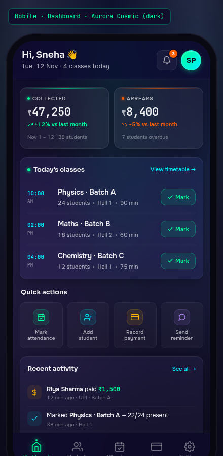

# 02 — Mobile · Dashboard

> The signature dark glass screen of the mobile app. The tutor's daily home base — what they see when they open Buddysaradhi at 9 AM to plan their day. Built on the **Aurora Cosmic** palette, dark variant — the master brand canvas (emerald `#00FF9D` on cosmic gradient `#0f0c29 → #1a1535 → #0a0a1a`).



---

## §1. Page Identity

| Property | Value |
|---|---|
| Platform | Mobile (React Native / Expo) |
| Mockup | `mockups/mobile/02_dashboard.html` |
| Viewport | 390 × 844 px (iPhone 14 Pro) |
| Palette | `aurora-cosmic` |
| Theme default | `dark` (the only Aurora Cosmic variant — it is dark-only by design) |
| Signature hue | Emerald `#00FF9D` on cosmic aurora gradient |
| Primary CTA | "Mark" buttons on each Today's-classes row → opens Attendance screen with batch pre-selected |
| Bottom nav | 5 items: Dashboard (active), Students, Attendance, Fees, Settings |
| Brand element | Sneha's avatar (initials "SP") in emerald-cyan gradient; greeting "Hi, Sneha 👋" with date |

### Why this palette

The mobile Dashboard is the most-visited screen in the app (the tutor opens it 5-15 times a day). Aurora Cosmic is the master brand canvas — it creates instant recognition ("this is the Buddysaradhi app") and the dark glass makes the bioluminescent emerald accents (KPI deltas, class-mark buttons, active nav item) feel like instrument-panel lights in a cockpit. Critical for low-light classroom use.

---

## §2. Layout Anatomy

### 2.1 Frame structure

```html
<body data-palette="aurora-cosmic" data-theme="dark">
  <div class="mobile-frame">
    <div class="mobile-frame-content">
      <header class="dash-topbar">     <!-- sticky top, glass-blur -->
        <div class="greeting-block">…</div>
        <div class="topbar-actions">…</div>
      </header>
      <main class="dash-main">          <!-- scrollable -->
        <section class="kpi-grid">…</section>
        <section class="section-card today-classes">…</section>
        <section class="quick-actions">…</section>
        <section class="section-card recent-activity">…</section>
        <section class="section-card fee-chart">…</section>
      </main>
      <nav class="bottom-nav">…</nav>   <!-- sticky bottom, 5 items -->
    </div>
  </div>
</body>
```

### 2.2 The aurora gradient inside the frame

The `.mobile-frame-content` background is a 4-layer radial+linear gradient:
1. Top-center emerald aurora `radial-gradient(ellipse at 50% 0%, rgba(0,255,157,0.08), transparent 50%)`
2. Top-right cyan aurora `radial-gradient(ellipse at 100% 30%, rgba(0,240,255,0.06), transparent 50%)`
3. Bottom-left violet aurora `radial-gradient(ellipse at 0% 70%, rgba(179,136,255,0.06), transparent 50%)`
4. Base cosmic `linear-gradient(180deg, #0f0c29 0%, #1a1535 50%, #0a0a1a 100%)`

This produces the multi-hue aurora glow that is the Aurora Cosmic signature — without ever using a flat colour fill.

### 2.3 Topbar layout

```
┌─────────────────────────────────────┐
│ [safe-area-inset-top]               │
│ Hi, Sneha 👋           🔔³   [SP]   │  ← 14px×2 padding
│ Tue, 12 Nov · 4 classes today       │
└─────────────────────────────────────┘
```

- **Greeting** left-aligned: name 18px Sora 600, date 12px Onest 500 tabular-nums
- **Actions** right-aligned: bell button (40×40 glass with red badge "3"), avatar (40×40 emerald-cyan gradient circle, "SP" initials)
- Topbar bg `rgba(15,12,41,0.65)` with `backdrop-filter: blur(24px) saturate(180%)` — the cosmic gradient shows through subtly
- Sticky `top:0; z-index:10` — stays during scroll

### 2.4 Main scrollable content

- 14px horizontal padding, 16px vertical gap between sections, 100px bottom padding (clears bottom nav + safe area)
- 5 sections in order: KPI grid → Today's classes → Quick actions → Recent activity → Fee chart

### 2.5 Bottom nav

5 items evenly spaced, 44×44 minimum touch target each. Active item: emerald colour + 4×4 dot indicator above + drop-shadow glow on icon. See `shared/styles.css` §`.bottom-nav`.

---

## §3. Section-by-Section Content Spec

### 3.1 KPI grid (2 cards)

```
┌──────────────────┬──────────────────┐
│ ● Collected       │ ● Arrears        │
│ ₹47,250           │ ₹8,400           │
│ ↗ +12% vs last    │ ↘ −5% vs last    │
│ Nov 1–12 · 38 st  │ 7 students over  │
└──────────────────┴──────────────────┘
```

| Property | Collected card | Arrears card |
|---|---|---|
| Top accent bar | `linear-gradient(90deg, transparent, #00FF9D, transparent)`, opacity 0.6 | Same with `#FF5E00` |
| Label dot | 5×5 emerald circle, glow `0 0 6px #00FF9D` | 5×5 flare circle, glow `0 0 6px #FF5E00` |
| Label | 10px uppercase 0.08em 600 weight, secondary text | Same |
| Figure | 22px JetBrains Mono 600, primary text, ₹ symbol 14px opacity 0.7 | Same |
| Delta | 11px tabular-nums, emerald (up) / flare (down), arrow icon 11×11 stroke 2.5 | Same |
| Period sub | 10px muted tabular-nums, "Nov 1 – 12 · 38 students" | "7 students overdue" |

### 3.2 Today's classes card

Section card with header "● Today's classes" + link "View timetable →". 3 class rows:

| Time | Class | Meta | Action |
|---|---|---|---|
| 10:00 AM | Physics · Batch A | 24 students · Hall 1 · 90 min | [Mark] |
| 02:00 PM | Maths · Batch B | 18 students · Hall 2 · 60 min | [Mark] |
| 04:00 PM | Chemistry · Batch C | 12 students · Hall 1 · 75 min | [Mark] |

- Time block: 48px wide, JetBrains Mono 11px 600, emerald-cyan colour. AM/PM on second line, 9px muted.
- Class name: 14px Sora 600 primary text.
- Class meta: 11px secondary text, dot-separated, tabular-nums for counts.
- Mark button: 32px tall, emerald-on-glass (bg `rgba(0,255,157,0.10)`, border `rgba(0,255,157,0.30)`, text #00FF9D 11px 600). Check icon 12×12.
- Row dividers: 1px `rgba(255,255,255,0.05)`.

**Tapped state** (when a class is being marked): the button becomes `.done` — emerald icon, muted text "Marked ✓", with a stroke-through border. Not shown in static mockup; documented for implementation.

### 3.3 Quick actions (4-tile grid)

```
┌──────────┬──────────┬──────────┬──────────┐
│ [icon]   │ [icon]   │ [icon]   │ [icon]   │
│ Mark     │ Add      │ Record   │ Send     │
│ attendnc │ student  │ payment  │ reminder │
└──────────┴──────────┴──────────┴──────────┘
```

- 4 tiles, 1fr each, 8px gap, 76px tall
- Each tile: glass-3 surface, 1px white-5 border, 6px padding, 12px radius
- Icon: 32×32 rounded square with 10px radius, coloured border at 18% opacity
  - Tile 1 (Attendance): emerald — `rgba(0,255,157,0.10)` bg, `#00FF9D` icon
  - Tile 2 (Add student): cyan — `rgba(0,240,255,0.10)` bg, `#00F0FF` icon
  - Tile 3 (Payment): amber — `rgba(255,179,0,0.10)` bg, `#FFB300` icon
  - Tile 4 (Reminder): violet — `rgba(179,136,255,0.10)` bg, `#B388FF` icon
- Label: 10px secondary text, centered, line-height 1.2, 2-line break

### 3.4 Recent activity (4 rows)

| Icon | Activity | Timestamp |
|---|---|---|
| 💵 (amber, payment) | **Riya Sharma** paid ₹1,500 | 12 min ago · UPI · Batch A |
| ✓ (cyan, attendance) | Marked **Physics · Batch A** — 22/24 present | 38 min ago · Hall 1 |
| 💬 (violet, reminder) | Fee reminder sent to **4 students** | 2 hr ago · WhatsApp |
| 💵 (amber, payment) | **Aarav Patel** paid ₹1,800 | 5 hr ago · Cash · Batch B |

- Icon: 28×28 rounded square, 8px radius, palette-tinted bg at 8% opacity
- Activity text: 12px primary, name in `<strong>` 600, amount in mono with emerald colour
- Timestamp: 10px muted, tabular-nums

### 3.5 Fee collection mini bar chart (6 months)

Hand-coded with CSS bars (not SVG — simpler, sharper at this size). 6 bars:

| Month | Bar height (% of max) | Note |
|---|---|---|
| Jun | 38% | |
| Jul | 52% | |
| Aug | 61% | |
| Sep | 74% | |
| Oct | 83% | |
| **Nov** | **89%** | **Current month** — cyan gradient + value label "47.2k" above |

- Bar fill: `linear-gradient(180deg, rgba(0,255,157,0.6), rgba(0,255,157,0.15))`, top border 1.5px emerald, glow shadow
- Current month: cyan gradient + cyan top border + cyan glow + value label above
- Labels: 10px muted tabular-nums, current month primary 600
- Summary row: 10px secondary, "Total collected (6 mo)" left, "₹2,84,500 · avg ₹47,416/mo" right with mono strong

### 3.6 Bottom nav

5 items, even-spaced, max-width 390 / 5 = 78px per slot. Active (Dashboard):
- Icon colour: `#00FF9D`
- Icon filter: `drop-shadow(0 0 6px rgba(0,255,157,0.5))`
- Top dot indicator: 4×4 emerald circle, glow `0 0 8px #00FF9D`
- Label colour: emerald

Other 4 items: muted colour, no glow, no dot, no filter.

---

## §4. Interaction Model

| Action | Trigger | Motion variant | Effect |
|---|---|---|---|
| Open notifications | Tap bell | `modalEnter` (sheet slide-up) | Opens notifications sheet — list of 3 new + history |
| Open profile | Tap avatar | `pageTransitionForward` | Pushes profile screen |
| Tap KPI card | Tap either KPI | `cardHover` then `pageTransitionForward` | Pushes Fees screen with period filter pre-set |
| Mark class | Tap [Mark] button | `buttonPress` | Pushes Attendance screen with that batch + date pre-selected |
| Quick action | Tap any tile | `buttonPress` | Tiles 1-4 navigate to Attendance / Student-add-sheet / Payment-record-sheet / Reminder-compose |
| View activity detail | Tap any activity row | `cardHover` then `pageTransitionForward` | Pushes the relevant detail screen (student profile for payment, attendance session for attendance, reminder log for reminder) |
| See all activity | Tap "See all →" | `pageTransitionForward` | Pushes full activity log screen |
| View timetable | Tap "View timetable →" | `pageTransitionForward` | Pushes Calendar screen |
| Switch tab | Tap any bottom-nav item | `pageTransitionForward`/`Back` | Switches primary tab |
| Pull to refresh | Pull-down gesture | `chartDraw` then content refresh | Refetches all data; haptic on completion |

### Microinteractions

- **KPI delta arrow** scales 1.1 on card hover
- **Class mark button** background transitions from 10% to 18% opacity on hover
- **Quick action tile** translateY(-2px) + border accent on hover
- **Bar chart bars** animate height from 0 to target on first mount (`chartDraw` 600ms ease-out), then static. No re-draw on data update.

---

## §5. Data Bindings

### 5.1 Topbar

| Field | Source |
|---|---|
| Greeting name | `tutors.name` from local SQLite, "Hi, {first_name}" |
| Date | `Intl.DateTimeFormat('en-IN', { weekday: 'short', day: 'numeric', month: 'short' })` |
| Class count today | `attendance_sessions` where `session_date = today` and `tutor_id = me` |
| Notification count | `notifications` where `read_at IS NULL` |
| Avatar initials | First letters of `tutors.first_name` + `tutors.last_name` |

### 5.2 KPIs (per `buddysaradhi_Planning/11_Data_Model.md` §15.4)

```ts
// Per Task 12-MONTHLY-FEE-MODEL
const collected = await collectedForPeriod({ startDate: '2024-11-01', endDate: '2024-11-12' });
const arrears   = await arrearsForPeriod({ period: '2024-11' });
const lastMonth = await collectedForPeriod({ startDate: '2024-10-01', endDate: '2024-10-31' });
const deltaPct  = (collected - lastMonth) / lastMonth * 100;
```

- **Collected ₹47,250**: sum of `ledger_entries.amount_paise` where `type='CREDIT'` and `occurred_on` in Nov 1-12
- **Arrears ₹8,400**: `arrearsForPeriod('2024-11')` — sum of `student_fee_rates.monthly_fee_paise` for active students minus collected, where result > 0
- **+12% vs last month**: `(nov_collected_to_date / oct_collected_to_date) - 1`. Note: this is same-period comparison (Nov 1-12 vs Oct 1-12), NOT full-month vs full-month — prevents the dashboard from always showing negative deltas early in a month.

### 5.3 Today's classes

```ts
const sessions = await db.getAllAsync(`
  SELECT s.*, b.name as batch_name, b.subject, COUNT(e.student_id) as enrolled_count
  FROM attendance_sessions s
  JOIN batches b ON s.batch_id = b.id
  LEFT JOIN enrollments e ON e.batch_id = b.id AND e.status = 'active'
  WHERE s.session_date = ? AND s.tutor_id = ?
  GROUP BY s.id
  ORDER BY s.start_time ASC
`, [todayIso, myTutorId]);
```

- The `[Mark]` button navigates to `/attendance?session_id={s.id}` — the Attendance screen reads the query param and pre-selects that session

### 5.4 Quick actions

| Tile | Navigation target |
|---|---|
| Mark attendance | `/attendance?today=1` |
| Add student | Opens add-student bottom sheet on Students tab |
| Record payment | Opens record-payment bottom sheet on Fees tab |
| Send reminder | Opens reminder-compose sheet with default template + arrears list |

### 5.5 Recent activity

```ts
const activities = await db.getAllAsync(`
  SELECT 'payment' as type, l.created_at, l.amount_paise, s.name as student_name, l.method, b.name as batch_name
  FROM ledger_entries l
  JOIN students s ON l.student_id = s.id
  LEFT JOIN batches b ON s.batch_id = b.id
  WHERE l.tenant_id = ? AND l.type = 'CREDIT'
  UNION ALL
  SELECT 'attendance' as type, s.created_at, NULL, b.name, NULL, NULL
  FROM attendance_sessions s JOIN batches b ON s.batch_id = b.id
  WHERE s.tutor_id = ?
  UNION ALL
  SELECT 'reminder' as type, r.sent_at, NULL, NULL, NULL, NULL
  FROM reminders r WHERE r.tutor_id = ?
  ORDER BY created_at DESC
  LIMIT 4
`);
```

### 5.6 Fee collection chart

```ts
const monthly = await db.getAllAsync(`
  SELECT strftime('%Y-%m', occurred_on) as month,
         SUM(amount_paise) as total_paise
  FROM ledger_entries
  WHERE type = 'CREDIT' AND occurred_on >= date('now', '-6 months', 'start of month')
  GROUP BY month ORDER BY month
`);
```

Returns 6 rows: Jun ₹34,200, Jul ₹46,800, Aug ₹54,000, Sep ¥65,500, Oct ₹73,750, Nov ₹47,250 (MTD).

### 5.7 Offline-first layer

All reads come from local SQLite (`buddysaradhi_Planning/mobile/02_Native_Modules_and_Storage.md` §2). The sync engine flushes the outbox in the background. The dashboard renders instantly on app open — no loading state visible unless this is first-launch-after-install with empty local DB. In that case, a skeleton screen shows for ≤300ms while initial sync completes.

---

## §6. Accessibility

### 6.1 Touch targets

- Bell, avatar, KPI cards, class mark buttons, quick action tiles, activity rows, nav items: ALL ≥ 44×44 ✓
- Class mark button is 32px tall but its tap area extends to fill the row height (~64px)
- Quick action tiles: 76px tall × ~85px wide

### 6.2 Screen reader

| Element | Label |
|---|---|
| Greeting | "Hi Sneha. Tuesday, November 12. You have 4 classes today." |
| Bell | "Notifications. 3 new." |
| Avatar | "Open profile" |
| Collected KPI | "Collected: 47,250 rupees. Up 12 percent versus last month. November 1 to 12, 38 students paid." |
| Arrears KPI | "Arrears: 8,400 rupees. Down 5 percent. 7 students overdue." |
| Class row | "10 AM, Physics Batch A, 24 students, Hall 1, 90 minutes. Double-tap to mark attendance." |
| Quick action tile | "Mark attendance" / "Add student" / "Record payment" / "Send reminder" |
| Activity row | "Riya Sharma paid 1,500 rupees. 12 minutes ago via UPI for Batch A." |
| Bar chart | "Fee collection chart for last 6 months. Total 2.84 lakh rupees. Average 47,416 per month. November is current month at 47,250." (sr-only summary, chart itself aria-hidden) |
| Bottom nav item | "Dashboard tab, selected" / "Students tab" / etc. |

### 6.3 Dynamic type

- Greeting, KPI figures, class names scale up to 1.5× at largest accessibility size
- KPI grid stays 2-column; figures shrink font-size if needed to fit
- Quick action labels wrap to 2 lines max; tiles grow vertically
- Bar chart: bars stay same height; labels grow; if labels overflow, abbreviated to single letter

### 6.4 Colour contrast

- Primary text on cosmic gradient: 13.8:1 AAA
- Secondary text: 10.4:1 AAA
- Muted text: 6.4:1 AA ✓
- Emerald on cosmic: 9.4:1 AAA
- Flare (orange-red) on cosmic: 5.8:1 AA ✓

### 6.5 Reduce motion

- KPI delta arrow scale-on-hover: instant
- Bar chart entrance animation: instant (bars appear at final height)
- Pull-to-refresh spinner: stays (it's progress, not decoration)
- Active nav dot glow: solid colour, no glow

---

## §7. Edge Cases

### 7.1 No classes today

Today's classes card shows empty state: illustration + "No classes today. Enjoy the break! 🌿" + link "View tomorrow →". The 3-row card collapses to a single 80px-tall empty state.

### 7.2 All classes already marked

Each [Mark] button shows `.done` state ("Marked ✓" in muted text). Card header shows "● Today's classes · 3/3 marked ✓" with a small green check.

### 7.3 Zero arrears

Arrears KPI shows ₹0 in emerald (not flare) with delta "🎉 All caught up!" and sub "0 students overdue". Top accent bar switches to emerald.

### 7.4 First launch (no data)

- KPIs: ₹0 with delta "—" (no comparison possible)
- Today's classes: empty state with link "Add your first batch →"
- Quick actions: 4 tiles remain, all functional
- Recent activity: empty state "No activity yet. Mark attendance or record a payment to see it here."
- Fee chart: 6 bars all at 4% minimum height with "No data yet" label

### 7.5 Loading state (first sync after login)

- Topbar: greeting + avatar render instantly (cached in MMKV)
- KPIs: 2 skeleton shimmer cards (90px tall)
- Today's classes: skeleton card with 3 shimmer rows
- Quick actions: 4 skeleton tiles
- Recent activity: skeleton card with 4 shimmer rows
- Fee chart: skeleton with 6 shimmer bars
- All skeletons resolve within 1.5s on 3G; under 300ms on WiFi

### 7.6 Offline state

- A small "Offline" pill appears next to the date in the topbar (orange-bordered, 8×8 dot)
- All data is local — UI behaves normally
- Quick action "Record payment" still works (queued in outbox)
- Pull-to-refresh disabled; haptic feedback "thuds" instead of refreshing

### 7.7 Stale data warning

If the dashboard hasn't synced in >24 hours, the "Offline" pill changes to "Stale · 26 hr" in amber, with a tooltip explaining that data may be outdated. Tapping it forces a sync.

### 7.8 Notification badge overflow

If >9 notifications, badge shows "9+" (nofit-badge has min-width 18px, grows with "9+" content).

---

## §8. Image Reference


The screenshot should show the full 844px-tall frame with the aurora cosmic gradient visible in the background, all 5 sections visible (topbar + KPIs + Today's classes + Quick actions + Recent activity + Fee chart), and the bottom nav fixed at the bottom with Dashboard active.

---

## §9. Implementation Notes

- **React Native**: built with `expo-router` file `app/(tabs)/index.tsx` (the `(tabs)` group holds all 5 tab screens)
- **Data fetching**: TanStack Query with `queryKey: ['dashboard', tutorId]`, `staleTime: 60_000` (1 min), `refetchOnWindowFocus: true`
- **Pull-to-refresh**: `react-native-reanimated` + `react-native-gesture-handler` custom refresh control (the default `RefreshControl` doesn't support custom haptics)
- **Haptics**: `expo-haptics.impactAsync(ImpactFeedbackStyle.Light)` on tab switch, `NotificationFeedbackType.Success` on sync complete
- **Bar chart**: hand-rolled with Reanimated 3 — each bar is a `View` with animated height. No chart library needed at this size.
- **Skeleton**: `react-native-reanimated` shimmer with the same gradient as `shared/styles.css` `.skeleton`
- **Bottom nav**: `expo-router` `<Tabs>` with custom tab bar component

---

## §10. Status

- **Author:** UI/UX Lead (Task 13-MOBILE-MOCKUPS)
- **State:** COMPLETED
- **Mockup:** `mockups/mobile/02_dashboard.html`
- **Spec:** `mobile/02_Mobile_Dashboard.md` (this file)
- **Depends on:** `01_Color_Palettes.md` §Aurora Cosmic, `02_Typography_System.md`, `04_Motion_and_Microinteractions.md` §chartDraw, `05_Accessibility_Contract.md` §touch targets, `buddysaradhi_Planning/11_Data_Model.md` §15.4 (derived fee views), `buddysaradhi_Planning/mobile/02_Native_Modules_and_Storage.md` §2 (local SQLite), `buddysaradhi_Planning/04_Dashboard.md` (data contract)
