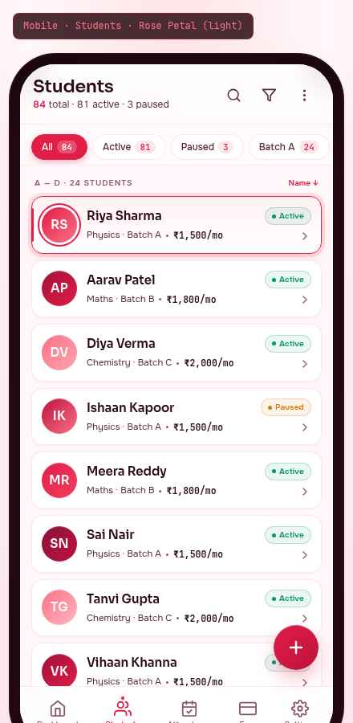

# 03 — Mobile · Students

> The roster. Every student the tutor teaches, in their pocket. Built on the **Rose Petal** palette, light variant — the warmest, most personal accent in the system. Rose appears on the active row indicator, the FAB, the active nav item. Everything else is ivory + text.



---

## §1. Page Identity

| Property | Value |
|---|---|
| Platform | Mobile (React Native / Expo) |
| Mockup | `mockups/mobile/03_students.html` |
| Viewport | 390 × 844 px (iPhone 14 Pro) |
| Palette | `rose-petal` |
| Theme default | `light` (warm ivory `#FFF7F8` canvas) |
| Signature hue | Rose `#E11D48` on blush `#FFE4E9` raised surface |
| Primary CTA | FAB "+" (bottom-right, 56×56, rose gradient) → opens add-student sheet |
| Bottom nav | 5 items, Students active (rose) |
| Brand element | Rose avatars with initials, rose ring on selected card |

### Why this palette

Students are people, not rows. Rose is the warmest, most personal accent — it signals "this is someone's child, not a fee payer". Used sparingly (the master list is still mostly ivory + text), the rose appears on the active-row indicator, the avatar ring, the FAB. The rose is the *only* saturated colour on the screen, so it pulls the eye exactly where it should go.

---

## §2. Layout Anatomy

### 2.1 Frame structure

```html
<body data-palette="rose-petal" data-theme="light">
  <div class="mobile-frame">
    <div class="mobile-frame-content">
      <header class="students-topbar">      <!-- sticky, glass-blur -->
        <div class="topbar-title-block">…</div>
        <div class="topbar-actions">…</div>
      </header>
      <div class="filter-strip">…</div>      <!-- horizontal-scroll chips -->
      <main class="students-main">           <!-- scrollable -->
        <div class="list-section-label">…</div>
        <div class="student-card selected">…</div>
        <div class="student-card">…</div>    <!-- × 7 -->
      </main>
      <button class="fab">+</button>          <!-- floating, bottom-right -->
      <nav class="bottom-nav">…</nav>
    </div>
  </div>
</body>
```

### 2.2 Topbar layout

```
┌─────────────────────────────────────┐
│ [safe-area-inset-top]               │
│ Students          🔍  ▽  ⋮          │  ← title 22px Sora 600
│ 84 total · 81 active · 3 paused     │  ← count 12px secondary
└─────────────────────────────────────┘
```

- Title block left: "Students" (22px Sora 600) + count summary (12px secondary, **84** in rose 600)
- Actions right: 3 icon buttons (search, filter, more) — each 40×40 transparent with hover background `rgba(225,29,72,0.06)`
- Topbar bg `rgba(255,255,255,0.78)` with `backdrop-filter: blur(20px) saturate(160%)`

### 2.3 Filter chip strip

Horizontally scrollable, 6px gap, 12px×14px padding, hidden scrollbar. 6 chips in default mockup:

| Chip | Count badge | Default state |
|---|---|---|
| All | 84 | **Active** (rose filled) |
| Active | 81 | inactive |
| Paused | 3 | inactive |
| Batch A | 24 | inactive |
| Batch B | 18 | inactive |
| Physics 11th | 32 | inactive |

- Inactive chip: white bg, `--border-default` 1px, secondary text
- Active chip: rose bg, white text, count badge in `rgba(255,255,255,0.22)` (white-on-rose)
- Count badge: 11px JetBrains Mono, padding 1px×6px, 8px radius
- Hover: border becomes `--border-accent`, text becomes rose

### 2.4 Student list

- 8px gap between cards
- List section label above first card: "A — D · 24 students" (10px uppercase 0.10em 600, secondary text) + sort indicator "Name ↓" (rose, 10px)
- 8 cards visible in mockup (Riya, Aarav, Diya, Ishaan, Meera, Sai, Tanvi, Vihaan)

### 2.5 Card anatomy

```
┌─────────────────────────────────────────────────────┐
│ ┃ (RS)  Riya Sharma            ● Active   ›         │  ← selected card (rose ring)
│ ┃      Physics · Batch A · ₹1,500/mo                │
└─────────────────────────────────────────────────────┘
```

| Element | Spec |
|---|---|
| Card | 12px padding, `--bg-surface` white, `--border-default` 1px, 14px radius, 1px+3px shadow |
| Selected card | `--accent-primary` 1.5px border + 4px outer ring `rgba(225,29,72,0.10)` + 3px rose left-bar (decorative, not in HTML — uses `::before`) |
| Hover | translateY(-1px), border `--border-accent`, shadow grows |
| Avatar | 44×44 round, gradient bg (rose family), white initials 15px Sora 600, inset top highlight |
| Selected avatar | 3px white ring + 5px rose ring outside (the ring is the "you tapped this" signal) |
| Name | 15px Sora 600 primary text, letter-spacing -0.005em |
| Meta | 11.5px secondary text, dot-separated. Monthly fee in JetBrains Mono 600 primary |
| Status chip | Active: emerald-tinted 10px 600 with dot. Paused: amber-tinted |
| Chevron | 16×16, muted colour, stroke 2 |

### 2.6 FAB

- 56×56 round, `linear-gradient(135deg, #E11D48, #BE123C)`, white + icon 24×24 stroke 2.4
- Shadow: `0 12px 28px -6px rgba(225,29,72,0.45)`, inset top highlight
- Position: absolute right 18px, bottom `calc(90px + env(safe-area-inset-bottom))` — clears bottom nav
- Hover: `scale(1.06) rotate(90deg)` — the rotation hints at "open new form"
- z-index: 11 (above list, below modals)

### 2.7 Bottom nav

Standard 5-item, Students active. Active item: rose colour + 4×4 dot indicator + glow.

---

## §3. Section-by-Section Content Spec

### 3.1 Topbar

Already covered in §2.2. The search button opens a full-screen search overlay with a numeric keypad hint (search by roll # or phone) AND a text input (search by name). The filter button opens a bottom sheet with multi-select filters (batch, status, subject, fee range, joining date). The ⋮ button opens a context menu: Import from Excel, Export, Sort by, Group by.

### 3.2 Filter chips

Each chip is a `role="tab"` in a `role="tablist"`. Selecting one filters the list below and updates the count in the topbar. The "All" chip always shows the total count (84). Long-press on a batch chip shows a context menu with "Edit batch" / "Archive batch". The horizontal scroll respects `prefers-reduced-motion` (no momentum scroll).

### 3.3 Student cards (8 in mockup, 84 total in app)

| Roll | Name | Batch | Monthly fee | Status |
|---|---|---|---|---|
| #01 | Riya Sharma | Physics · Batch A | ₹1,500/mo | Active (selected) |
| #02 | Aarav Patel | Maths · Batch B | ₹1,800/mo | Active |
| #03 | Diya Verma | Chemistry · Batch C | ₹2,000/mo | Active |
| #04 | Ishaan Kapoor | Physics · Batch A | ₹1,500/mo | **Paused** |
| #05 | Meera Reddy | Maths · Batch B | ₹1,800/mo | Active |
| #06 | Sai Nair | Physics · Batch A | ₹1,500/mo | Active |
| #07 | Tanvi Gupta | Chemistry · Batch C | ₹2,000/mo | Active |
| #08 | Vihaan Khanna | Physics · Batch A | ₹1,500/mo | Active |

All names are real Indian names (Hindi/Marathi/Tamil/Telugu/Gujarati). Monthly fees are realistic (₹1,500-2,000/mo is the typical range for Indian private coaching). All amounts in tabular-nums via JetBrains Mono.

### 3.4 List section label

Above the first card: "A — D · 24 students" — the alphabetical grouping breaks the list into manageable chunks. As the user scrolls, the label updates to the current group ("E — H · 18 students", etc.). Sort indicator "Name ↓" is tappable — opens sort menu (Name ↑/↓, Monthly fee ↑/↓, Joining date ↑/↓, Attendance %).

### 3.5 FAB

The "+" FAB is the only entry point to add a new student. Tap → opens add-student bottom sheet (60% height) with: name input, phone input, batch selector, monthly fee input, joining date. The sheet uses the rose palette throughout — same gradient on the primary "Save student" button.

---

## §4. Interaction Model

| Action | Trigger | Motion variant | Effect |
|---|---|---|---|
| Search | Tap search icon | `modalEnter` (sheet slide-up) | Full-screen search overlay |
| Filter | Tap filter icon | `modalEnter` | Multi-select filter bottom sheet |
| More menu | Tap ⋮ icon | `tooltipEnter` (dropdown) | Context menu opens below |
| Apply filter chip | Tap any chip | `listItemEnter` (stagger 30ms) | List re-renders with filtered cards |
| Long-press chip | Long-press batch chip | `tooltipEnter` | Edit/Archive batch menu |
| Select student | Tap card | `cardHover` then `pageTransitionForward` | Pushes student profile screen |
| Long-press card | Long-press | haptic medium + action sheet | Quick actions: Mark absent today, Record payment, Send reminder, Pause, Archive |
| Swipe-left card | Swipe-left gesture | `cardHover` then `listItemEnter` | Reveals "Pause" red action; full swipe = archive |
| Swipe-right card | Swipe-right gesture | `cardHover` then `listItemEnter` | Reveals "Record payment" green action |
| Add student | Tap FAB | `modalEnter` + FAB rotate 90° | Opens add-student sheet |
| Sort | Tap sort indicator | `tooltipEnter` | Sort menu |
| Switch tab | Tap any bottom-nav item | `pageTransitionForward`/`Back` | Switches primary tab |

### Microinteractions

- **Card tap**: brief rose flash on the left-bar before transitioning
- **FAB hover**: rotate 90° (animated 250ms ease-spring) — sets up the "+" → "×" morph for when sheet opens
- **Filter chip tap**: 150ms ease-spring scale 0.96 → 1.0
- **Selected card avatar ring**: 200ms ease-spring on appearance (rings grow from 0)
- **Pull-to-refresh**: refetches student list from local SQLite (instant) + queues a remote sync

---

## §5. Data Bindings

### 5.1 Topbar

| Field | Source |
|---|---|
| Total count | `COUNT(*) FROM students WHERE archived_at IS NULL` |
| Active count | `COUNT(*) FROM students WHERE status = 'active' AND archived_at IS NULL` |
| Paused count | `COUNT(*) FROM students WHERE status = 'paused' AND archived_at IS NULL` |

### 5.2 Filter chips

Each chip is backed by a count query:

```ts
// "Active" chip count
db.getFirst(`SELECT COUNT(*) as n FROM students
             WHERE status = 'active' AND archived_at IS NULL
             AND tenant_id = ?`, [tenantId]);

// "Batch A" chip count
db.getFirst(`SELECT COUNT(*) as n FROM students s
             JOIN enrollments e ON e.student_id = s.id
             WHERE e.batch_id = ? AND e.status = 'active'
             AND s.archived_at IS NULL`, [batchAId]);
```

### 5.3 Student cards

```ts
const students = await db.getAllAsync(`
  SELECT s.id, s.code, s.first_name, s.last_name, s.status,
         s.monthly_fee_paise, s.fee_frequency,
         b.subject, b.name as batch_name
  FROM students s
  LEFT JOIN enrollments e ON e.student_id = s.id AND e.status = 'active'
  LEFT JOIN batches b ON e.batch_id = b.id
  WHERE s.archived_at IS NULL
  ORDER BY s.first_name ASC
  LIMIT 50 OFFSET ?
`, [offset]);
```

- `s.monthly_fee_paise` is the denormalised cache (per Task 12-MONTHLY-FEE-MODEL)
- Display: `formatINR(s.monthly_fee_paise)` → "₹1,500" + "/mo" suffix
- Avatar initials: first letter of first_name + first letter of last_name, uppercased
- Status: 'active' → green chip, 'paused' → amber chip

### 5.4 Selected card

The selected state in the mockup shows card #01 (Riya Sharma) as selected. In the real app, this is a transient state — tapping a card immediately navigates to the profile screen. The "selected" styling is shown in the mockup to demonstrate the rose-ring feedback that occurs DURING the tap (before navigation completes).

### 5.5 FAB → add-student sheet

The add-student sheet on submit:
1. Validates inputs (Zod schema — name required, phone 10-digit, batch required, fee > 0)
2. Writes to local SQLite `students` + `enrollments` + `student_fee_rates` tables in a single `$transaction`
3. Queues a `sync_outbox` entry with `entity='student'`, `operation='INSERT'`, `payload={...}`
4. Shows success toast "Student added" + haptic success
5. Closes sheet; new card animates in at the top of the list (or alphabetically)

### 5.6 Offline-first layer

All reads come from local SQLite (`buddysaradhi_Planning/mobile/02_Native_Modules_and_Storage.md` §2). The list renders instantly on screen open (cached data from last sync). The sync engine flushes mutations in the background. No loading state visible unless first-launch-after-install.

---

## §6. Accessibility

### 6.1 Touch targets

- Topbar icons (search, filter, ⋮): 40×40 ✓
- Filter chips: 32px tall (target extends to 44px via padding)
- Student cards: ~68px tall × 362px wide ✓
- FAB: 56×56 ✓
- Bottom nav: 44×44+ per item ✓

### 6.2 Screen reader

| Element | Label |
|---|---|
| Title | "Students. 84 total. 81 active. 3 paused." |
| Search button | "Search students by name, roll number, or phone" |
| Filter button | "Filter students" |
| More button | "More options: import, export, sort, group" |
| Filter chip (All, active) | "All filter, selected, 84 students" |
| Filter chip (Active, inactive) | "Active filter, 81 students. Double-tap to apply." |
| Student card (Riya) | "Riya Sharma, roll number 1, Physics Batch A, 1500 rupees per month, Active. Double-tap to open profile." |
| FAB | "Add new student" |
| Bottom nav item | "Students tab, selected" |

### 6.3 Dynamic type

- Title and count scale with dynamic type
- Student name 15px → 19px at largest
- Monthly fee stays in mono — scales to 14px at largest
- Cards grow in height to accommodate larger text; never truncate names (wrap to 2 lines if needed)

### 6.4 Colour contrast

- Primary text on ivory: 17.0:1 AAA
- Secondary text on white surface: 9.4:1 AAA
- Rose `#E11D48` on ivory: 4.8:1 AA ✓ (for the active chip text, white-on-rose is 5.0:1 AA+)
- Muted text: 5.5:1 AA ✓

### 6.5 Reduce motion

- FAB rotate-on-hover: instant
- Card tap flash: instant
- Stagger on filter change: instant (all cards render simultaneously)
- Selected avatar ring: instant (no scale animation)

### 6.6 Swipe gestures (alternative)

Long-press → action sheet is the primary accessibility path for quick actions. Swipe gestures are a power-user shortcut; they are documented in the help center but not required.

---

## §7. Edge Cases

### 7.1 No students yet (first launch)

List shows empty state: illustration of an empty classroom + "No students yet" + "Add your first student to get started" + a primary "Add student" button (rose). The FAB remains visible as a secondary entry point.

### 7.2 Filter returns zero results

Below the filter chips: "No students match these filters." + "Try clearing some filters" link. The clear button resets all filters to "All".

### 7.3 Paused student

Card shows amber "Paused" chip. Tapping the card still navigates to profile, where the user can resume the student. Paused students are excluded from attendance marking and fee calculations (per Task 12 BR-FEE-23).

### 7.4 Student with no fee set

Card shows "—" instead of monthly fee (per Task 12 EC-F-19). Tapping the fee area in the profile screen opens the fee-setup sheet.

### 7.5 Long student names

Names >20 characters wrap to 2 lines. The card grows to accommodate. If the name is >40 characters, it truncates with ellipsis and shows full name on long-press.

### 7.6 Loading state

The list area shows 8 skeleton cards (68px tall, shimmer). The topbar + filter chips render instantly (cached counts). Skeleton resolves within 300ms on WiFi.

### 7.7 Offline state

A small "Offline" pill appears in the topbar next to the count. All data is local — list behaves normally. The FAB and add-student sheet still work (queued in outbox). The "More" menu's "Import from Excel" is disabled offline.

### 7.8 Search with no results

The search overlay shows "No matches for '{query}'" + a "Try a different name or roll number" hint. Recent searches appear below the input.

### 7.9 Scroll pagination

The list uses infinite scroll — loads 50 students at a time. As the user approaches the bottom, a "Loading more..." footer appears for 200ms while the next 50 load from local SQLite (instant). The list section label updates as the user scrolls through alphabetical groups.

### 7.10 Bulk select mode

Long-press on any card enters bulk-select mode (checkboxes appear on each card, topbar changes to "0 selected" with Select All / Pause / Archive / Send reminder actions). Cancel via X in topbar. Not shown in mockup; documented for implementation.

---

## §8. Image Reference


The screenshot should show the full 844px-tall frame with: topbar (title + count + actions), filter chip strip (All active), 8 student cards visible (first one selected with rose ring), FAB bottom-right, bottom nav with Students active.

---

## §9. Implementation Notes

- **React Native**: built with `expo-router` file `app/(tabs)/students.tsx`
- **List rendering**: `FlashList` from `@shopify/flash-list` (handles 1000s of students without lag) instead of `FlatList`
- **Swipe gestures**: `react-native-gesture-handler` + `react-native-reanimated` for swipe-to-reveal-actions
- **Filter chips**: horizontally scrollable `ScrollView` with `horizontal` prop
- **FAB**: `react-native-reanimated` for the rotate-90° on tap (morphing "+" to "×")
- **Search overlay**: full-screen modal with `expo-router` `app/students/search.tsx`
- **Add-student sheet**: `@gorhom/bottom-sheet` with 4 snap points
- **Haptics**: `expo-haptics.impactAsync(ImpactFeedbackStyle.Medium)` on card long-press, `ImpactFeedbackStyle.Light` on FAB tap
- **Analytics**: `students_list_viewed`, `students_filter_applied`, `student_card_tapped`, `student_add_started`, `student_add_completed` events

---

## §10. Status

- **Author:** UI/UX Lead (Task 13-MOBILE-MOCKUPS)
- **State:** COMPLETED
- **Mockup:** `mockups/mobile/03_students.html`
- **Spec:** `mobile/03_Mobile_Students.md` (this file)
- **Depends on:** `01_Color_Palettes.md` §Rose Petal, `03_Component_Library.md` §chip/avatar/FAB recipes, `05_Accessibility_Contract.md` §touch targets + screen reader, `buddysaradhi_Planning/11_Data_Model.md` §4 (students + enrollments), `buddysaradhi_Planning/05_Students.md` (data contract), `buddysaradhi_Planning/mobile/02_Native_Modules_and_Storage.md` §2 (local SQLite)
