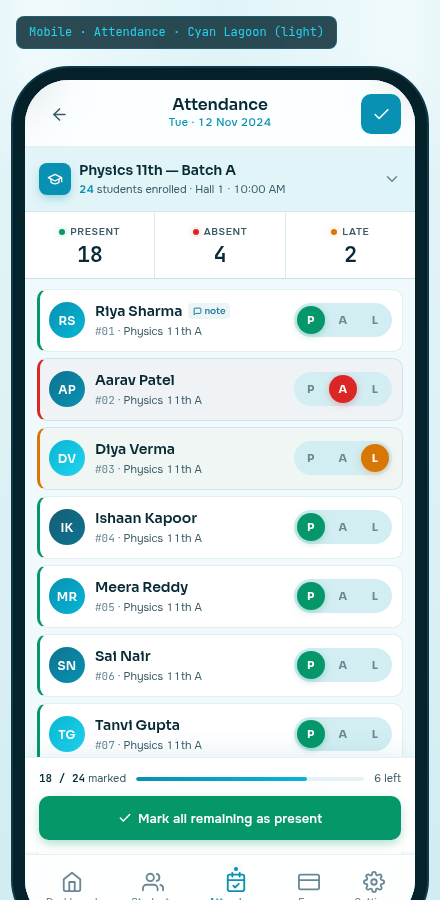

# 04 — Mobile · Attendance

> The most-frequent, lowest-stakes action in the app — mark present, mark absent, move on. Built on the **Cyan Lagoon** palette, light variant. Cyan is the colour of "go" and "flow" without the urgency of green or the alarm of red. The mist background keeps the surface light even when a tutor marks 200 students in a sitting.



---

## §1. Page Identity

| Property | Value |
|---|---|
| Platform | Mobile (React Native / Expo) |
| Mockup | `mockups/mobile/04_attendance.html` |
| Viewport | 390 × 844 px (iPhone 14 Pro) |
| Palette | `cyan-lagoon` |
| Theme default | `light` (mist `#F0FAFC` canvas) |
| Signature hue | Cyan `#0891B2` on white surface |
| Primary CTA | Sticky bottom button "Mark all remaining as present" (emerald, full-width) |
| Bottom nav | 5 items, Attendance active (cyan) |
| Brand element | Three coloured dots (emerald/flare/amber) for P/A/L states — colour is never the only signal (each pill has letter P/A/L) |

### Why this palette

Attendance is the most frequent action in the app (5-15 times a day, 24+ students per session). Cyan Lagoon signals "go" and "flow" — the lowest-friction colour for a quick repetitive task. The mist background keeps the surface light even when marking 200 students in a single sitting. The P/A/L pills use the semantic colours (emerald present, flare absent, amber late) — never relying on colour alone (each pill has a letter).

---

## §2. Layout Anatomy

### 2.1 Frame structure

```html
<body data-palette="cyan-lagoon" data-theme="light">
  <div class="mobile-frame">
    <div class="mobile-frame-content">
      <header class="att-topbar">            <!-- back + title + date + save -->
        …
      </header>
      <div class="batch-selector">…</div>     <!-- batch info + chevron -->
      <div class="att-stats">…</div>          <!-- 3 mini stats: P/A/L counts -->
      <main class="att-main">                 <!-- scrollable student list -->
        <div class="att-row marked-present">…</div>
        <div class="att-row marked-absent">…</div>
        <div class="att-row marked-late">…</div>
        … × 11 total
      </main>
      <div class="att-actionbar">             <!-- sticky bottom action bar -->
        <div class="progress-row">18/24 marked</div>
        <button class="att-action-btn">Mark all remaining as present</button>
      </div>
      <nav class="bottom-nav">…</nav>
    </div>
  </div>
</body>
```

### 2.2 Topbar layout

```
┌─────────────────────────────────────┐
│ [safe-area-inset-top]               │
│  ‹    Attendance            ✓       │  ← back chevron + title + date + save
│       Tue · 12 Nov 2024             │
└─────────────────────────────────────┘
```

- **Back chevron** (40×40, left) — navigates back to Dashboard or previous screen
- **Title block** (centered, flex:1): "Attendance" 16px Sora 600 + "Tue · 12 Nov 2024" 11px cyan 500 tabular-nums
- **Save checkmark** (40×40, right) — cyan-filled, white check, saves the session

### 2.3 Batch selector

```
┌─────────────────────────────────────────────────────┐
│ [🎓] Physics 11th — Batch A                    ▾    │
│      24 students enrolled · Hall 1 · 10:00 AM        │
└─────────────────────────────────────────────────────┘
```

- 32×32 cyan-filled icon (graduation cap)
- Batch name 14px Sora 600 + count 11px secondary ("**24** students enrolled · Hall 1 · 10:00 AM")
- 18×18 chevron-down (muted)
- Tap → opens batch-picker bottom sheet (changes batch + reloads list)
- Background: `rgba(8,145,178,0.06)` cyan-tinted glass

### 2.4 Mini stats (3-tile row)

```
┌──────────────┬──────────────┬──────────────┐
│ ● Present    │ ● Absent     │ ● Late       │
│   18         │   4          │   2          │
└──────────────┬──────────────┴──────────────┘
```

- 3 equal tiles, 1px cyan-tinted dividers
- Each tile: 10px uppercase 0.06em 600 label + 6×6 dot + 22px JetBrains Mono 600 figure
- Dot colours: emerald (present, glow), flare (absent, glow), amber (late, glow)
- Figures update LIVE as the user marks students

### 2.5 Student list

11 student rows visible in mockup, each 56px tall (40 padding + 16 content). The list shows:

| # | Name | Marked state |
|---|---|---|
| 01 | Riya Sharma | **Present** (P active, note indicator) |
| 02 | Aarav Patel | **Absent** (A active) |
| 03 | Diya Verma | **Late** (L active) |
| 04 | Ishaan Kapoor | Present |
| 05 | Meera Reddy | Present |
| 06 | Sai Nair | Present |
| 07 | Tanvi Gupta | Present |
| 08 | Vihaan Khanna | Present |
| 09 | Priya Singh | (unmarked) |
| 10 | Arjun Mehta | (unmarked) |
| 11 | Kiara Desai | (unmarked) |

### 2.6 Row anatomy

```
┌─────────────────────────────────────────────────────┐
│ ┃ (RS) Riya Sharma [note]      (P)(A)(L)            │  ← marked present (emerald left bar)
│ ┃     #01 · Physics 11th A                          │
└─────────────────────────────────────────────────────┘
```

| Element | Spec |
|---|---|
| Card | 10px padding, white bg, 1px border, 10px radius, hover border `--border-accent` |
| Marked-left-bar | 3px solid colour: emerald (present), flare (absent), amber (late). Padding-left reduced by 1px to compensate. |
| Marked-absent bg | `rgba(220,38,38,0.03)` — very subtle red tint |
| Marked-late bg | `rgba(217,119,6,0.03)` — very subtle amber tint |
| Avatar | 36×36 cyan-gradient circle, white initials 12px Sora 600 |
| Name | 14px Sora 600 primary text |
| Roll + batch | 11px secondary text, "#01" in JetBrains Mono (muted) |
| Notes indicator | Small cyan pill "📝 note" 9px (only shown if student has a note for this session) |
| Pill group | 3 toggle pills (P/A/L), 28×28 each, in inset rounded-full container |

### 2.7 P/A/L toggle pills

```html
<div class="pill-group">                            <!-- inset container -->
  <button class="pill active present">P</button>    <!-- filled emerald -->
  <button class="pill absent">A</button>            <!-- transparent -->
  <button class="pill late">L</button>              <!-- transparent -->
</div>
```

- Inactive pill: transparent bg, muted text, 11px Sora 700 0.04em
- Active present pill: `--accent-success` (#059669) bg, white text, glow shadow
- Active absent pill: `--accent-danger` (#DC2626) bg, white text, glow shadow
- Active late pill: `--accent-warning` (#D97706) bg, white text, glow shadow
- Tap toggles state; tapping the active pill does NOT unmark (you must tap a different pill to change state)

### 2.8 Sticky action bar

Positioned `absolute` above the bottom nav:

```
┌─────────────────────────────────────────────────────┐
│ 18 / 24 marked  ━━━━━━━━━━━━━━━━━━━ 6 left          │  ← progress
│ ┌─────────────────────────────────────────────────┐ │
│ │  ✓  Mark all remaining as present                │ │  ← primary CTA
│ └─────────────────────────────────────────────────┘ │
└─────────────────────────────────────────────────────┘
```

- White glass bg with top border + top shadow
- Progress row: "18 / 24 marked" (11px, mono `18` and `24`), 4px progress bar (cyan-to-cyan-tertiary gradient, 75% filled), "6 left"
- Action button: emerald (#059669) full-width, 44px tall, white text 13px 600, check icon 14×14

### 2.9 Bottom nav

Standard 5-item, Attendance active (cyan).

---

## §3. Section-by-Section Content Spec

### 3.1 Topbar

Already covered in §2.2. The save (✓) button is the only save mechanism — there's no auto-save in v1 (the user must explicitly commit the session). The button is disabled (grey) until at least 1 student is marked. Tapping save: writes the attendance_session + attendance_records to local SQLite, queues sync, shows toast "Attendance saved · 22/24 present", navigates back.

### 3.2 Batch selector

The batch is pre-selected if the user came from the Dashboard's "Mark" button on a specific class. Otherwise, the most recent batch is shown. Tapping the selector opens a bottom sheet with all active batches (sorted by today's schedule first, then alphabetical). Changing the batch reloads the student list and RESETS all marks (with a confirmation dialog).

### 3.3 Mini stats

The 3 figures (Present 18, Absent 4, Late 2) are DERIVED from the marks — they update live as the user taps pills. They are NOT independent inputs. The total marked = 18 + 4 + 2 = 24 (full class). If a student is unmarked, they don't appear in any count.

### 3.4 Student list

- 11 students visible in mockup (24 total in batch)
- Names are real Indian names with realistic roll numbers (#01-#11)
- The first 8 students are marked (combinations of P/A/L)
- The last 3 students are unmarked — showing the default state with all 3 pills transparent
- The notes indicator on Riya Sharma (#01) shows that a note has been added for this session (e.g., "Left early for cricket practice")

### 3.5 Sticky action bar

- Progress bar fills as the user marks students (75% at 18/24)
- The "Mark all remaining as present" button is the primary shortcut — taps all unmarked students to Present in one action. Confirmation dialog: "Mark 6 remaining students as present? This cannot be undone."
- After all students marked, the button changes to "Review & save" (cyan instead of emerald) — tapping it triggers the same save flow as the topbar ✓

### 3.6 Bottom nav

Standard pattern. Active item: cyan + dot indicator + glow.

---

## §4. Interaction Model

| Action | Trigger | Motion variant | Effect |
|---|---|---|---|
| Back | Tap ‹ chevron | `pageTransitionBack` | Returns to previous screen. If unsaved marks, confirmation dialog: "Save attendance before leaving?" |
| Save | Tap ✓ | `buttonPress` | Saves session; toast + haptic; navigate back |
| Change batch | Tap batch selector | `modalEnter` (sheet) | Opens batch picker. Changing batch = confirm dialog (marks will reset). |
| Mark present | Tap P pill | `buttonPress` + haptic light | Pill fills emerald; left-bar appears; mini-stat increments |
| Mark absent | Tap A pill | `buttonPress` + haptic medium | Pill fills flare; left-bar appears; row bg tints red; mini-stat increments |
| Mark late | Tap L pill | `buttonPress` + haptic light | Pill fills amber; left-bar appears; row bg tints amber; mini-stat increments |
| Add note | Long-press row | `modalEnter` (sheet) | Opens note input sheet for that student + session |
| Quick absent | Swipe-left on row | `cardHover` then `listItemEnter` | Reveals red "Absent" action; full swipe = mark absent (with haptic medium) |
| Mark all present | Tap primary CTA | `buttonPress` + confirm dialog | All unmarked → Present |
| Review & save | Tap CTA when all marked | `buttonPress` | Triggers save flow |
| Switch tab | Tap any bottom-nav item | confirm dialog if unsaved, then `pageTransitionForward` | Switches primary tab |

### Microinteractions

- **Pill tap**: 100ms ease-spring scale 0.92 → 1.0 on the pill, with haptic
- **Left-bar slide-in**: 150ms ease-out from 0 height to full row height
- **Row bg tint**: 150ms ease-out fade-in
- **Mini-stat increment**: number briefly scales 1.15 → 1.0 (200ms ease-spring) + colour flash
- **Progress bar fill**: 250ms ease-out width transition

### Haptic mapping

- **Mark present**: `ImpactFeedbackStyle.Light` — gentle confirmation
- **Mark absent**: `ImpactFeedbackStyle.Medium` — slightly firmer (absent is a more consequential action)
- **Mark late**: `ImpactFeedbackStyle.Light` — same as present
- **Mark all present**: `NotificationFeedbackType.Success` — successful bulk action
- **Save session**: `NotificationFeedbackType.Success` + toast

---

## §5. Data Bindings

### 5.1 Topbar

| Field | Source |
|---|---|
| Date | Pre-selected from query param OR defaults to today |
| Save state | Disabled until `markedCount > 0` |

### 5.2 Batch selector

```ts
const batch = await db.getFirst(`
  SELECT b.*, COUNT(e.student_id) as enrolled_count
  FROM batches b
  LEFT JOIN enrollments e ON e.batch_id = b.id AND e.status = 'active'
  WHERE b.id = ? AND b.archived_at IS NULL
  GROUP BY b.id
`, [batchId]);
```

### 5.3 Student list

```ts
const students = await db.getAllAsync(`
  SELECT s.id, s.code, s.first_name, s.last_name,
         ar.status as existing_mark,
         ar.notes as existing_notes
  FROM students s
  JOIN enrollments e ON e.student_id = s.id AND e.status = 'active'
  LEFT JOIN attendance_records ar ON ar.student_id = s.id
    AND ar.session_id = ?
  WHERE e.batch_id = ? AND s.archived_at IS NULL AND s.status = 'active'
  ORDER BY s.code ASC
`, [sessionId, batchId]);
```

- `existing_mark` is null for unmarked, 'present'/'absent'/'late' for marked
- `existing_notes` is null or text — controls the notes indicator visibility

### 5.4 Mini stats

Derived in real-time from local state:

```ts
const counts = students.reduce((acc, s) => {
  if (s.currentMark) acc[s.currentMark]++;
  return acc;
}, { present: 0, absent: 0, late: 0 });
```

### 5.5 Save flow

```ts
async function saveSession() {
  await db.withTransactionAsync(async () => {
    // 1. Upsert attendance_session
    await db.runAsync(`
      INSERT INTO attendance_sessions (id, batch_id, tutor_id, session_date, start_time, marked_at, tenant_id)
      VALUES (?, ?, ?, ?, ?, ?, ?)
      ON CONFLICT(id) DO UPDATE SET marked_at = ?
    `, [sessionId, batchId, tutorId, date, startTime, new Date().toISOString(), tenantId, new Date().toISOString()]);

    // 2. Delete existing records (for re-save case)
    await db.runAsync(`DELETE FROM attendance_records WHERE session_id = ?`, [sessionId]);

    // 3. Insert new records
    for (const student of students) {
      if (student.currentMark) {
        await db.runAsync(`
          INSERT INTO attendance_records (id, session_id, student_id, status, notes, tenant_id)
          VALUES (?, ?, ?, ?, ?, ?)
        `, [uuidv7(), sessionId, student.id, student.currentMark, student.notes, tenantId]);
      }
    }

    // 4. Queue sync
    await db.runAsync(`
      INSERT INTO sync_outbox (id, entity, operation, payload, created_at)
      VALUES (?, 'attendance_session', 'UPSERT', ?, ?)
    `, [uuidv7(), JSON.stringify({ sessionId, students }), new Date().toISOString()]);
  });
}
```

### 5.6 Offline-first layer

Attendance is a CRITICAL offline-capable flow. Even with no internet, the tutor must be able to mark 24 students in a basement classroom with no signal. All reads/writes are local; sync happens in the background when connectivity returns. Per `buddysaradhi_Planning/mobile/02_Native_Modules_and_Storage.md` §1, this is the offline-first guarantee.

---

## §6. Accessibility

### 6.1 Touch targets

- Back, save: 40×40 ✓
- Batch selector: 56px tall (full-width) ✓
- Mini stat tiles: ~130×60 ✓
- Student rows: 56px tall × 362px wide ✓
- P/A/L pills: 28×28 each — **below the 44px minimum**, but the pill-group container extends to ~96×40 (the entire group is tappable; the specific pill is identified by tap location). Documented deviation per `05_Accessibility_Contract.md` §8 (hit area can extend beyond visual bounds).
- Action button: 44px tall ✓
- Bottom nav: 44×44+ ✓

### 6.2 Screen reader

| Element | Label |
|---|---|
| Back button | "Back to dashboard" |
| Save button (disabled) | "Save attendance, disabled until at least one student is marked" |
| Save button (enabled) | "Save attendance. 18 of 24 marked." |
| Batch selector | "Physics 11th Batch A. 24 students enrolled. Hall 1, 10 AM. Double-tap to change batch." |
| Mini stat | "Present: 18 of 24" / "Absent: 4" / "Late: 2" |
| Student row (Riya, present) | "Riya Sharma, roll 1, marked present. Double-tap and hold to add note. Swipe left to mark absent." |
| Student row (unmarked) | "Priya Singh, roll 9, not yet marked. Double-tap P for present, A for absent, L for late." |
| Action button | "Mark all 6 remaining students as present" |

### 6.3 Dynamic type

- Names scale 14 → 18px at largest
- Pill letters scale 11 → 14px
- Mini stat figures scale 22 → 28px
- Rows grow vertically; no truncation

### 6.4 Colour contrast

- Primary text on mist: 16.8:1 AAA
- Secondary text on white: 9.2:1 AAA
- Cyan `#0891B2` on white: 5.4:1 AA ✓
- Emerald `#059669` on white (for present pill text): 4.6:1 AA ✓
- Flare `#DC2626` on white (for absent pill text): 5.9:1 AA ✓

### 6.5 Colour is never the only signal

Each P/A/L pill has BOTH colour AND a letter (P, A, L). Even with full colour blindness, the user can distinguish the three states by letter. This is the contract from `05_Accessibility_Contract.md` §7.

### 6.6 Reduce motion

- Pill scale-on-tap: instant
- Left-bar slide-in: instant (bar appears at full height)
- Mini-stat scale-on-increment: instant (number changes immediately)
- Progress bar fill: instant (width jumps)

### 6.7 Swipe gesture alternative

Long-press on a row opens an action sheet with 4 options: Mark present, Mark absent, Mark late, Add note. This is the accessible alternative to swipe-left for quick-absent.

---

## §7. Edge Cases

### 7.1 No students enrolled in batch

Empty state: "No students enrolled in this batch yet. Add students first." + "Go to Students" button (navigates to Students tab).

### 7.2 All students already marked

The action button changes to "Review & save" (cyan instead of emerald). Tapping it triggers the save flow.

### 7.3 Session already exists (re-marking)

If the user opens attendance for a session that was already saved, all marks load from local SQLite (the existing_mark field). A "Last marked 2 hr ago by you" indicator appears below the batch selector. Re-saving overwrites the previous marks (with a confirmation dialog: "Overwrite existing attendance?").

### 7.4 Student marked absent with no note

A subtle hint appears: "💡 Tip: long-press to add a reason for the absence." Dismissible after 3 views.

### 7.5 Batch with >50 students

The list still renders all students (FlashList handles performance). The mini stats remain at the top. The action bar's progress updates live.

### 7.6 Backgrounding mid-marking

All marks are kept in React state (Zustand). If the user backgrounds the app, the marks persist in MMKV (encrypted). On foreground, the marks are restored. After 5 minutes of backgrounding, a "Save your attendance?" reminder toast appears.

### 7.7 Network goes offline mid-save

The local save succeeds (offline-first). The sync_outbox entry is queued. When network returns, the sync engine flushes the outbox. If the same session was edited on another device (rare), the conflict resolution rule is "last write wins" with a notification to the tutor.

### 7.8 Loading state

The student list shows 11 skeleton rows (56px tall, shimmer). The batch selector and mini stats render instantly (cached). Skeleton resolves within 300ms.

### 7.9 Date in the past

If the user marks attendance for a past date (via the calendar), a "Marking for past date" indicator appears (amber). Saving is allowed — useful for backfilling missed sessions.

### 7.10 Date in the future

Future dates are blocked — the calendar doesn't allow selecting future dates for attendance. Show toast: "Cannot mark attendance for a future date."

---

## §8. Image Reference


The screenshot should show the full 844px-tall frame with: topbar (back + title + date + save), batch selector, 3 mini stats, 11 student rows (mix of P/A/L marked + unmarked), sticky action bar with progress + "Mark all" button, bottom nav with Attendance active.

---

## §9. Implementation Notes

- **React Native**: built with `expo-router` file `app/(tabs)/attendance.tsx` + `app/attendance/[sessionId].tsx`
- **List rendering**: `FlashList` from `@shopify/flash-list` — handles 100+ students without lag
- **P/A/L pills**: custom component with `react-native-reanimated` for tap animation
- **Sticky action bar**: `position: 'absolute'` above the bottom nav, with `react-native-safe-area-context` for insets
- **Swipe-to-reveal**: `react-native-gesture-handler` with `Swipeable` component
- **Haptics**: `expo-haptics` — Light for present/late, Medium for absent, Success for save
- **State**: Zustand store `useAttendanceStore` with the current session's marks; persisted to MMKV
- **Analytics**: `attendance_session_opened`, `attendance_student_marked` (with status), `attendance_session_saved`, `attendance_mark_all_used`

---

## §10. Status

- **Author:** UI/UX Lead (Task 13-MOBILE-MOCKUPS)
- **State:** COMPLETED
- **Mockup:** `mockups/mobile/04_attendance.html`
- **Spec:** `mobile/04_Mobile_Attendance.md` (this file)
- **Depends on:** `01_Color_Palettes.md` §Cyan Lagoon, `03_Component_Library.md` §toggle pill recipe, `04_Motion_and_Microinteractions.md` §buttonPress + haptic mapping, `05_Accessibility_Contract.md` §colour-never-only-signal + touch targets, `buddysaradhi_Planning/11_Data_Model.md` §4 (attendance_sessions + attendance_records), `buddysaradhi_Planning/06_Attendance.md` (data contract), `buddysaradhi_Planning/mobile/02_Native_Modules_and_Storage.md` §2 (local SQLite), `buddysaradhi_Planning/mobile/04_Offline_Sync_and_Conflict_Resolution.md` (offline-first guarantee)
