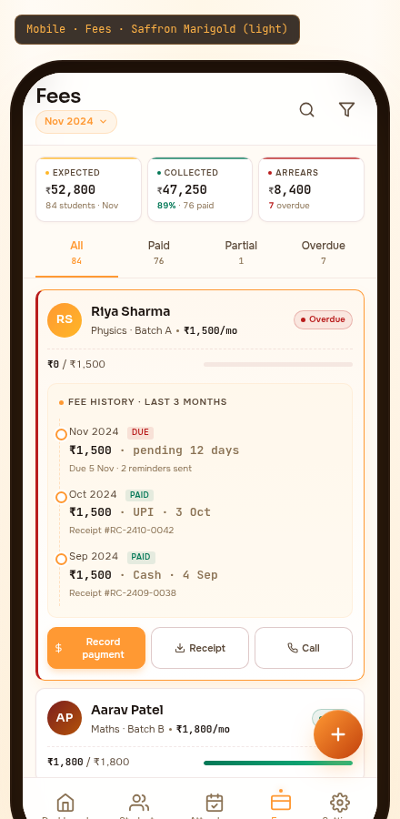

# 05 — Mobile · Fees

> The money screen. Where the tutor collects what they've earned. Built on the **Saffron Marigold** palette, light variant — saffron `#FF9933` + maroon `#7B1E1E` + marigold `#FFB627`. The colours of Indian celebration: the threads, the flowers, the prasad. A tutor collecting fees is performing a small monthly ritual; the surface should honour that.



---

## §1. Page Identity

| Property | Value |
|---|---|
| Platform | Mobile (React Native / Expo) |
| Mockup | `mockups/mobile/05_fees.html` |
| Viewport | 390 × 844 px (iPhone 14 Pro) |
| Palette | `saffron-marigold` |
| Theme default | `light` (warm cream `#FFFBF5` canvas) |
| Signature hue | Saffron `#FF9933` + marigold `#FFB627` gradients on cream |
| Primary CTA | Per-card "Record payment" buttons on overdue cards + FAB "+" for new payment |
| Bottom nav | 5 items, Fees active (saffron) |
| Brand element | Saffron-marigold gradient on primary actions + FAB; maroon on secondary text |

### Why this palette

Saffron and marigold are the colours of Indian celebration. A tutor collecting fees is performing a small monthly ritual — the surface should honour that, not feel like a Stripe checkout. Maroon anchors it (the warmth of old ledger books, the register a tutor's grandfather kept). The cream background is warmer than paper-white — it feels like a prasad plate, not a bank statement.

---

## §2. Layout Anatomy

### 2.1 Frame structure

```html
<body data-palette="saffron-marigold" data-theme="light">
  <div class="mobile-frame">
    <div class="mobile-frame-content">
      <header class="fees-topbar">           <!-- title + period chip + actions -->
        …
      </header>
      <section class="kpi-row">…</section>     <!-- 3 mini KPI cards -->
      <div class="tab-strip">…</div>           <!-- All / Paid / Partial / Overdue -->
      <main class="fees-main">                 <!-- scrollable fee cards -->
        <div class="fee-card expanded overdue">…</div>   <!-- Riya — expanded -->
        <div class="fee-card">…</div>          <!-- Aarav — paid -->
        <div class="fee-card overdue">…</div>  <!-- Diya — overdue + button -->
        … × 8 total
      </main>
      <button class="fab">+</button>           <!-- new payment FAB -->
      <nav class="bottom-nav">…</nav>
    </div>
  </div>
</body>
```

### 2.2 Topbar layout

```
┌─────────────────────────────────────┐
│ [safe-area-inset-top]               │
│ Fees           🔍  ▽                 │  ← title 22px Sora 600 + actions
│ [Nov 2024 ▾]                        │  ← period chip (saffron-tinted glass)
└─────────────────────────────────────┘
```

- Title block left: "Fees" 22px Sora 600 + period chip "Nov 2024 ▾" (saffron-tinted, 11px 600)
- Actions right: search icon, filter icon (40×40 each)
- Period chip tap → opens month picker bottom sheet (last 12 months + "Custom range")

### 2.3 KPI mini cards (3-tile row)

```
┌────────────┬────────────┬────────────┐
│ ● Expected │ ● Collected│ ● Arrears  │
│ ₹52,800    │ ₹47,250    │ ₹8,400     │
│ 84 st · Nov│ 89% · 76 pd│ 7 overdue  │
└────────────┴────────────┴────────────┘
```

- 3 equal tiles, 6px gap, 10px×10px padding
- Each tile has a 2px top accent bar (marigold for expected, emerald for collected, flare for arrears)
- Label: 9px uppercase 0.08em 600 + 4×4 coloured dot
- Figure: 14px JetBrains Mono 600, ₹ symbol 10px opacity 0.7
- Sub: 9.5px muted tabular-nums, with percentage in coloured strong

### 2.4 Tab strip

```
┌──────────┬──────────┬──────────┬──────────┐
│ All (84) │ Paid (76)│ Partial  │ Overdue  │
│          │          │ (1)      │ (7)      │
└──────────┴──────────┴──────────┴──────────┘
```

- 4 equal tabs, 12px×4px padding
- Active tab: saffron text + saffron bottom border 2px
- Inactive: secondary text
- Each tab shows count below label (9.5px mono muted, active = saffron)

### 2.5 Fee list

8 cards visible in mockup:

| # | Student | Status | Special |
|---|---|---|---|
| 1 | Riya Sharma | Overdue | **EXPANDED** — fee history timeline + 3 action buttons |
| 2 | Aarav Patel | Paid | Standard |
| 3 | Diya Verma | Overdue | Standard + Record payment button |
| 4 | Ishaan Kapoor | Partial | Standard (₹1,000 / ₹1,500) |
| 5 | Meera Reddy | Paid | Standard |
| 6 | Sai Nair | Paid | Standard |
| 7 | Tanvi Gupta | Overdue | Standard + Record payment button |
| 8 | Vihaan Khanna | Paid | Standard |

### 2.6 Standard card anatomy

```
┌─────────────────────────────────────────────────────┐
│ ┃ (RS) Riya Sharma                ● Overdue          │  ← overdue left bar
│ ┃      Physics · Batch A · ₹1,500/mo                 │
│ ┃ ────────────────────────────────────────────────  │
│ ┃ ₹0 / ₹1,500   ━━━━━━━━━━━━━━━━━━ (0%)             │  ← progress row
│ ┌─────────────────────────────────────────────────┐ │
│ │  ₹  Record payment · pending 12 days             │ │  ← action button
│ └─────────────────────────────────────────────────┘ │
└─────────────────────────────────────────────────────┘
```

| Element | Spec |
|---|---|
| Card | 12px padding, white bg, 1px border, 10px radius |
| Overdue left bar | 3px flare solid (only on overdue cards) |
| Expanded border | 1.5px saffron + outer glow shadow |
| Avatar | 38×38 saffron-family gradient, white initials 13px |
| Name | 14px Sora 600 primary |
| Meta | 11px secondary, monthly fee in mono 600 |
| Status chip | 9.5px 600, coloured border + dot. Paid=emerald, Partial=amber, Overdue=flare |
| Progress row | dashed top border, 5px bar, mono amounts |
| Action button | Saffron-marigold gradient, white text, 36px tall, full-width |

### 2.7 Expanded card (Riya)

The expanded card adds 2 sections below the standard card:

**Fee history timeline** (3 entries):
```
Fee history · last 3 months
│
●── Nov 2024 [DUE]    ₹1,500 · pending 12 days
│   Due 5 Nov · 2 reminders sent
│
●── Oct 2024 [PAID]   ₹1,500 · UPI · 3 Oct
│   Receipt #RC-2410-0042
│
●── Sep 2024 [PAID]   ₹1,500 · Cash · 4 Sep
    Receipt #RC-2409-0038
```

- Saffron-tinted background `rgba(255,247,232,0.6)`, 1px saffron-10 border
- Title: 10px uppercase 0.08em 600 + 5×5 saffron dot
- Timeline: 1.5px dashed saffron-25 left border, 9×9 dots with saffron border + 2px white outer ring
- Each entry: period (11px) + status badge (8.5px paid=emerald / unpaid=flare) + amount (13px mono 600) + meta (10px muted)

**3-button action row**:
```
[Record payment] [Receipt] [Call]
   primary        ghost       ghost
```

- Primary button: saffron-marigold gradient, 36px tall, white text 11px 600
- Ghost buttons: white bg, maroon-24 border, secondary text
- Each button has icon (12×12) + label

### 2.8 FAB

- 54×54 round, `linear-gradient(135deg, #FF9933, #C2410C)`, white + icon 22×22
- Position: absolute right 16px, bottom `calc(90px + env(safe-area-inset-bottom))`
- Hover: `scale(1.06) rotate(90deg)` — same pattern as Students FAB

### 2.9 Bottom nav

Standard 5-item, Fees active (saffron).

---

## §3. Section-by-Section Content Spec

### 3.1 Topbar

The period chip "Nov 2024" is tappable — opens a month picker bottom sheet showing the last 12 months + a "Custom range" option at the bottom. Changing the period reloads the KPI cards and the fee list.

### 3.2 KPI mini cards

| KPI | Source | Calculation |
|---|---|---|
| Expected ₹52,800 | `expectedForPeriod({period: '2024-11'})` | Sum of `student_fee_rates.monthly_fee_paise` for all active students where the rate is effective for Nov 2024 (per Task 12 BR-CALC-09) |
| Collected ₹47,250 | `collectedForPeriod({startDate, endDate})` | Sum of `ledger_entries.amount_paise` where `type='CREDIT'` and `occurred_on` in Nov 1-12 |
| Arrears ₹8,400 | `arrearsForPeriod({period: '2024-11'})` | `expected - collected` where result > 0 (per Task 12 BR-CALC-11) |

The 89% under Collected is `47250 / 52800 * 100`. The "76 paid" is `COUNT(DISTINCT student_id) FROM ledger_entries WHERE type='CREDIT' AND occurred_on BETWEEN '2024-11-01' AND '2024-11-12'`.

### 3.3 Tab strip

4 tabs filter the fee list:
- **All** (84) — every active student in the period
- **Paid** (76) — students who have paid their full monthly fee
- **Partial** (1) — students who have paid part of their monthly fee
- **Overdue** (7) — students with 0 collected for the period AND the period due date has passed

Counts update live as the user records payments.

### 3.4 Fee cards (8 in mockup)

Each card represents one student's fee status for the selected period:

| Student | Batch | Monthly fee | Status | Collected | Notes |
|---|---|---|---|---|---|
| Riya Sharma | Physics · A | ₹1,500 | Overdue | ₹0 / ₹1,500 | Expanded with history |
| Aarav Patel | Maths · B | ₹1,800 | Paid | ₹1,800 / ₹1,800 | Full |
| Diya Verma | Chemistry · C | ₹2,000 | Overdue | ₹0 / ₹2,000 | + Record button |
| Ishaan Kapoor | Physics · A | ₹1,500 | Partial | ₹1,000 / ₹1,500 | 67% |
| Meera Reddy | Maths · B | ₹1,800 | Paid | ₹1,800 / ₹1,800 | Full |
| Sai Nair | Physics · A | ₹1,500 | Paid | ₹1,500 / ₹1,500 | Full |
| Tanvi Gupta | Chemistry · C | ₹2,000 | Overdue | ₹0 / ₹2,000 | + Record button, pending 15 days |
| Vihaan Khanna | Physics · A | ₹1,500 | Paid | ₹1,500 / ₹1,500 | Full |

All amounts are tabular-nums via JetBrains Mono. The "/ ₹X" expected amount is muted; the collected amount is primary.

### 3.5 Expanded card (Riya)

Tap a card to expand/collapse. Expanded shows:
- Fee history timeline (last 3 months) — most recent first
- 3-button action row: Record payment / Receipt / Call

The "Receipt" button opens a receipt PDF for the most recent PAID month. The "Call" button opens the phone dialer with the guardian's number. The "Record payment" button opens the record-payment sheet (same as the per-card button).

### 3.6 FAB

The "+" FAB opens the record-payment bottom sheet (60% height) with:
- Student search input (defaults to first overdue student)
- Amount input (defaults to student's monthly fee)
- Method selector: UPI / Cash / Cheque / Bank transfer
- Date input (defaults to today)
- Receipt toggle (send WhatsApp receipt on save)
- Save button (saffron gradient)

On save: creates a `ledger_entries` row with `type='CREDIT'`, generates a receipt (PDF + WhatsApp share), updates the local SQLite + sync outbox, shows toast "Payment recorded · ₹1,500 from Riya Sharma".

### 3.7 Bottom nav

Standard pattern. Active item: saffron + dot indicator + glow.

---

## §4. Interaction Model

| Action | Trigger | Motion variant | Effect |
|---|---|---|---|
| Search | Tap search icon | `modalEnter` (sheet) | Full-screen payment search overlay |
| Filter | Tap filter icon | `modalEnter` | Filter bottom sheet (batch, amount range, method) |
| Change period | Tap period chip | `modalEnter` (sheet) | Month picker bottom sheet |
| Switch tab | Tap any tab | `listItemEnter` (stagger 30ms) | List re-renders with filtered cards |
| Expand card | Tap card | `cardHover` then `listItemEnter` | Card expands to show history + actions |
| Collapse card | Tap expanded card | `cardHover` then `listItemEnter` | Card collapses |
| Record payment (button) | Tap "Record payment" | `modalEnter` (sheet) | Opens record-payment sheet pre-filled |
| Record payment (FAB) | Tap FAB | `modalEnter` + FAB rotate 90° | Opens record-payment sheet (blank) |
| Send receipt | Tap "Receipt" | `tooltipEnter` (toast) | Generates PDF + opens share sheet |
| Call guardian | Tap "Call" | system dialer | Opens phone app with guardian number |
| Pull to refresh | Pull-down | `chartDraw` then content refresh | Refetches all data; haptic on completion |

### Microinteractions

- **Card tap**: brief saffron flash on the left-bar before expanding
- **Status chip**: subtle scale 1.05 on hover
- **Progress bar fill**: 250ms ease-out width transition when card first mounts
- **Tab switch**: underline slides between tabs (200ms ease-out)
- **Record payment success**: confetti animation (saffron/marigold particles) + haptic success + toast slide-up

---

## §5. Data Bindings

### 5.1 KPI mini cards

Per Task 12-MONTHLY-FEE-MODEL, the three KPIs come from the derived fee functions:

```ts
const expected  = await expectedForPeriod({ period: '2024-11' });      // 5,280,000 paise
const collected = await collectedForPeriod({ startDate: '2024-11-01', endDate: '2024-11-12' });
const arrears   = await arrearsForPeriod({ period: '2024-11' });
const collectedPct = (collected / expected) * 100;                    // 89%
const paidCount = await db.getFirst(`SELECT COUNT(DISTINCT student_id) as n
                                      FROM ledger_entries
                                      WHERE type='CREDIT' AND occurred_on BETWEEN ? AND ?`,
                                    ['2024-11-01', '2024-11-12']);
const overdueCount = await db.getFirst(`SELECT COUNT(*) as n FROM students
                                         WHERE monthly_fee_paise > 0
                                         AND status='active'
                                         AND id NOT IN (SELECT DISTINCT student_id FROM ledger_entries
                                                        WHERE type='CREDIT' AND occurred_on BETWEEN ? AND ?)`,
                                       ['2024-11-01', '2024-11-12']);
```

### 5.2 Fee cards

```ts
const feeCards = await db.getAllAsync(`
  SELECT s.id, s.first_name, s.last_name, s.monthly_fee_paise,
         b.subject, b.name as batch_name,
         COALESCE(SUM(CASE WHEN l.type='CREDIT' THEN l.amount_paise ELSE 0 END), 0) as collected_paise,
         CASE
           WHEN COALESCE(SUM(CASE WHEN l.type='CREDIT' THEN l.amount_paise ELSE 0 END), 0) = 0 THEN 'overdue'
           WHEN COALESCE(SUM(CASE WHEN l.type='CREDIT' THEN l.amount_paise ELSE 0 END), 0) < s.monthly_fee_paise THEN 'partial'
           ELSE 'paid'
         END as status
  FROM students s
  LEFT JOIN enrollments e ON e.student_id = s.id AND e.status = 'active'
  LEFT JOIN batches b ON e.batch_id = b.id
  LEFT JOIN ledger_entries l ON l.student_id = s.id
       AND l.occurred_on BETWEEN ? AND ?
       AND l.type = 'CREDIT'
  WHERE s.archived_at IS NULL AND s.status = 'active'
  GROUP BY s.id
  ORDER BY
    CASE WHEN ? = 'overdue' THEN 0
         WHEN ? = 'partial' THEN 1
         ELSE 2 END,
    s.first_name ASC
`, [periodStart, periodEnd, activeTab, activeTab]);
```

### 5.3 Fee history timeline (expanded card)

```ts
const history = await db.getAllAsync(`
  SELECT
    strftime('%Y-%m', l.occurred_on) as month,
    'paid' as status,
    l.amount_paise,
    l.method,
    l.occurred_on,
    l.id as receipt_id
  FROM ledger_entries l
  WHERE l.student_id = ? AND l.type = 'CREDIT'
  ORDER BY l.occurred_on DESC
  LIMIT 3
`, [studentId]);

// Plus the current period as "due" if not yet paid
if (currentPeriodCollected === 0) {
  history.unshift({
    month: currentPeriod,
    status: 'unpaid',
    amount_paise: student.monthly_fee_paise,
    method: null,
    occurred_on: null,
    receipt_id: null
  });
}
```

### 5.4 Record payment flow

```ts
async function recordPayment({ studentId, amountPaise, method, date, sendReceipt }) {
  await db.withTransactionAsync(async () => {
    // 1. Create ledger entry
    const entryId = uuidv7();
    const prevHash = await getPrevHash(studentId);
    const thisHash = sha256(prevHash + JSON.stringify(payload) + new Date().toISOString());

    await db.runAsync(`
      INSERT INTO ledger_entries (id, student_id, type, amount_paise, method, occurred_on,
                                   balance_after_paise, prev_hash, this_hash, tenant_id, created_at)
      VALUES (?, ?, 'CREDIT', ?, ?, ?, ?, ?, ?, ?, ?)
    `, [entryId, studentId, amountPaise, method, date, newBalance, prevHash, thisHash, tenantId, now]);

    // 2. Queue sync
    await db.runAsync(`INSERT INTO sync_outbox (id, entity, operation, payload, created_at)
                       VALUES (?, 'ledger_entry', 'INSERT', ?, ?)`,
                      [uuidv7(), JSON.stringify({...}), now]);

    // 3. Generate receipt PDF (async)
    if (sendReceipt) {
      const receipt = await generateReceiptPDF(entryId);
      await sendWhatsAppReceipt(studentId, receipt);
    }
  });

  // 4. UI feedback
  toast.success(`Payment recorded · ${formatINR(amountPaise)} from ${student.name}`);
  hapticSuccess();
}
```

### 5.5 Offline-first layer

All reads/writes are local SQLite. The ledger is append-only and hash-chained (per `11_Data_Model.md` §8) — even offline, the chain stays consistent. The sync engine flushes the outbox when network returns. Receipts are generated locally (no server round-trip) — the tutor can record a payment in a basement classroom with no signal and immediately show the parent a receipt on screen.

---

## §6. Accessibility

### 6.1 Touch targets

- Topbar icons (search, filter): 40×40 ✓
- KPI mini cards: 130×~70 ✓ (entire tile tappable)
- Tab strip items: ~90×44 ✓
- Fee cards: ~110px tall × 362px wide ✓
- Card action buttons: 36px tall (extends to 44px via padding) ✓
- FAB: 54×54 ✓
- Bottom nav: 44×44+ ✓

### 6.2 Screen reader

| Element | Label |
|---|---|
| Title | "Fees. November 2024." |
| Period chip | "Period: November 2024. Double-tap to change." |
| Expected KPI | "Expected this month: 52,800 rupees. 84 students." |
| Collected KPI | "Collected: 47,250 rupees. 89 percent. 76 students paid." |
| Arrears KPI | "Arrears: 8,400 rupees. 7 students overdue." |
| Tab (All, active) | "All tab, selected, 84 students" |
| Tab (Overdue) | "Overdue tab, 7 students. Double-tap to filter." |
| Fee card (Riya) | "Riya Sharma, Physics Batch A, 1500 rupees per month. Overdue. 0 of 1500 collected. Pending 12 days. Double-tap to expand." |
| Expanded card (Riya) | "Riya Sharma, expanded. November due 1500 rupees, pending 12 days, 2 reminders sent. October paid 1500 rupees via UPI on October 3, receipt number RC-2410-0042. September paid 1500 rupees via cash on September 4, receipt number RC-2409-0038." |
| Record payment button | "Record payment from Riya Sharma" |
| FAB | "Record new payment" |

### 6.3 Dynamic type

- KPI figures scale 14 → 18px at largest
- Fee card monthly fee scales 11 → 14px
- Action button labels scale 12 → 14px (no truncation — buttons grow)
- Timeline amounts scale 13 → 16px

### 6.4 Colour contrast

- Primary text on cream: 16.4:1 AAA
- Secondary text on white: 9.8:1 AAA
- Saffron `#FF9933` on cream: 4.9:1 AA ✓ (note: saffron is at the AA floor — used only for large text and accents, never body text)
- Maroon `#7B1E1E` on cream: 7.8:1 AAA
- White on saffron gradient (button): 5.2:1 AA ✓

### 6.5 Colour is never the only signal

Status chips have BOTH colour AND text ("Paid" / "Partial" / "Overdue"). The progress bar has both colour (gradient = paid, full emerald = paid, flare = overdue) AND a textual "₹0 / ₹1,500" indicator. The timeline badges have both colour AND text ("PAID" / "DUE").

### 6.6 Reduce motion

- Card expand/collapse: instant
- Tab underline slide: instant (jumps between tabs)
- Progress bar fill: instant (jumps to width)
- Confetti on payment success: suppressed (replaced with toast only)

---

## §7. Edge Cases

### 7.1 No students yet

Empty state on fee list: "No students enrolled yet. Once you add students, their fees will appear here." + "Go to Students" button.

### 7.2 All fees paid

Empty state on Overdue tab: "🎉 All caught up! No overdue fees this month." + subtle illustration. KPI arrears shows ₹0 in emerald.

### 7.3 Student with no fee set

Card shows "—" instead of monthly fee. Tapping the card opens profile with fee-setup prompt. Per Task 12 EC-F-19.

### 7.4 Paused student

Paused students are excluded from the fee list (per Task 12 BR-FEE-23 — paused = 0 expected). The KPI counts also exclude them.

### 7.5 Fee change mid-month

If a student's fee was changed mid-month (per Task 12 EC-F-18), the card shows the rate EFFECTIVE ON THE PERIOD END DATE. The history timeline shows both rates transparently: "₹1,500 (effective 1-15 Nov) + ₹1,800 (effective 16 Nov onwards)".

### 7.6 Annual payer with discount

Annual payers (12× monthly minus 1 month discount) show as "Paid" once a year. The card shows "Annual plan · ₹18,000 paid 4 Jan" with the discount shown as a credit. Per Task 12 BR-FEE-24.

### 7.7 Loading state

KPI row shows 3 skeleton cards. Fee list shows 8 skeleton cards (110px tall, shimmer). Skeleton resolves within 300ms.

### 7.8 Offline state

A small "Offline" pill appears next to the period chip. The KPIs and fee list load from local SQLite. The Record Payment sheet works (queued in outbox). The "Send receipt" toggle is disabled offline (receipts can't be WhatsApp'd without internet, but PDF can still be saved locally).

### 7.9 Filter returns zero

Below the tabs: "No students match this filter for November 2024." + "Try a different tab or change the period" link.

### 7.10 Large batch (200+ students)

The list uses FlashList with infinite scroll — 50 cards at a time. The KPIs reflect the full batch (not just the visible cards).

---

## §8. Image Reference


The screenshot should show the full 844px-tall frame with: topbar (title + period chip + actions), 3 KPI mini cards, tab strip (All active), 8 fee cards (first one expanded with timeline + 3 buttons), FAB bottom-right, bottom nav with Fees active.

---

## §9. Implementation Notes

- **React Native**: built with `expo-router` file `app/(tabs)/fees.tsx`
- **List rendering**: `FlashList` from `@shopify/flash-list`
- **Card expand/collapse**: `react-native-reanimated` `useAnimatedStyle` + `Layout Animation`
- **Timeline**: custom component with absolute-positioned dots + dashed left border
- **FAB**: same pattern as Students FAB (`@gorhom/bottom-sheet` integration)
- **Record payment sheet**: `@gorhom/bottom-sheet` with snap points [40%, 60%, 90%]
- **Receipt PDF**: `react-native-pdf-lib` or `expo-print` for HTML-to-PDF
- **WhatsApp sharing**: `expo-sharing` + WhatsApp deep link `whatsapp://send?text=...`
- **Hash chaining**: `expo-crypto` for SHA-256 (per `11_Data_Model.md` §8)
- **Haptics**: `expo-haptics` — Medium on card tap, Success on payment recorded
- **Analytics**: `fees_list_viewed`, `fees_tab_changed`, `fees_card_expanded`, `fees_payment_recorded` (with method + amount)

---

## §10. Status

- **Author:** UI/UX Lead (Task 13-MOBILE-MOCKUPS)
- **State:** COMPLETED
- **Mockup:** `mockups/mobile/05_fees.html`
- **Spec:** `mobile/05_Mobile_Fees.md` (this file)
- **Depends on:** `01_Color_Palettes.md` §Saffron Marigold, `03_Component_Library.md` §chip/card/button recipes, `04_Motion_and_Microinteractions.md` §confetti-on-success, `05_Accessibility_Contract.md` §colour-never-only-signal, `buddysaradhi_Planning/11_Data_Model.md` §4 (ledger_entries + student_fee_rates) + §8 (hash chaining) + §15.4 (derived fee views), `buddysaradhi_Planning/07_Fees_and_Payments.md` (data contract), `buddysaradhi_Planning/12_Business_Rules.md` BR-FEE-20..25 (monthly fee model), `buddysaradhi_Planning/mobile/02_Native_Modules_and_Storage.md` §2 (local SQLite)
