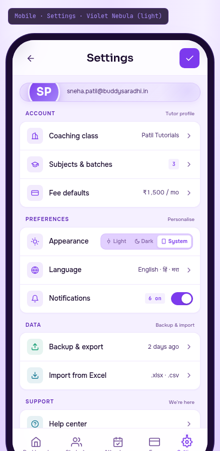

# 06 — Mobile · Settings

> The back-of-house. Where the tutor configures their world. Built on the **Violet Nebula** palette, light variant — the only palette permitted to use violet as a primary (`#7C3AED` plum-warm, NOT indigo). Settings is iOS-style grouped list, calm and organised, with the violet accents reserved for the active toggle, the section labels, and the avatar gradient.



---

## §1. Page Identity

| Property | Value |
|---|---|
| Platform | Mobile (React Native / Expo) |
| Mockup | `mockups/mobile/06_settings.html` |
| Viewport | 390 × 844 px (iPhone 14 Pro) |
| Palette | `violet-nebula` |
| Theme default | `light` (lavender-mist `#F5F0FF` canvas) |
| Signature hue | Violet `#7C3AED` + plum `#5B21B6` on lavender-mist |
| Primary CTA | Save (✓) in topbar — only enabled when there are unsaved changes |
| Bottom nav | 5 items, Settings active (violet) |
| Brand element | Violet gradient on profile avatar + section labels + active toggle |

### Why this palette

Settings and auth are the "back of house" — where the tutor configures their world. Violet signals "you are in a special, protected space" without the coldness of blue. **This is the ONLY palette permitted to use violet as a primary.** It is plum-warm (`#7C3AED`), explicitly distinct from the prohibited Stripe-indigo (`#6366F1`). The `no-indigo-accent` lint rule fires on `#6366F1` / `#3B82F6` / `#2563EB` / `#4F46E5` — NOT on `#7C3AED`.

The light variant (lavender-mist `#F5F0FF` canvas) is the default for Settings. The dark variant (cosmic violet `#14082A → #1F0F3D`) is used in auth and when the user toggles dark mode globally.

---

## §2. Layout Anatomy

### 2.1 Frame structure

```html
<body data-palette="violet-nebula" data-theme="light">
  <div class="mobile-frame">
    <div class="mobile-frame-content">
      <header class="settings-topbar">         <!-- back + title + save -->
        …
      </header>
      <main class="settings-main">              <!-- scrollable -->
        <div class="profile-card">…</div>
        <div class="settings-section">
          <div class="section-label">Account</div>
          <div class="section-group">
            <div class="settings-row">…</div>   <!-- Coaching class -->
            <div class="settings-row">…</div>   <!-- Subjects & batches -->
            <div class="settings-row">…</div>   <!-- Fee defaults -->
          </div>
        </div>
        <div class="settings-section">…</div>   <!-- Preferences -->
        <div class="settings-section">…</div>   <!-- Data -->
        <div class="settings-section">…</div>   <!-- Support -->
        <div class="settings-section">…</div>   <!-- Danger zone -->
        <div class="footer-note">…</div>
      </main>
      <nav class="bottom-nav">…</nav>
    </div>
  </div>
</div>
```

### 2.2 Topbar layout

```
┌─────────────────────────────────────┐
│ [safe-area-inset-top]               │
│  ‹    Settings                ✓     │  ← back chevron + title + save
└─────────────────────────────────────┘
```

- **Back chevron** (40×40, left) — navigates back to Dashboard
- **Title** (centered): "Settings" 22px Sora 600
- **Save checkmark** (40×40, right) — violet-filled, white check. Disabled (greyed) when no unsaved changes; enabled (violet) when there are pending changes.

### 2.3 Profile card

```
┌─────────────────────────────────────────────────────┐
│                                                     │
│   (SP)   Sneha Patil                                │
│         sneha.patil@buddysaradhi.in                 │
│         Edit profile →                              │
│                                                     │
└─────────────────────────────────────────────────────┘
```

- Card: 18px×16px padding, 20px radius, violet-tinted gradient bg, 1px violet-18 border, soft shadow
- Decorative blur circle top-right (110×110, radial violet glow)
- Avatar: 64×64 round, violet-plum gradient `linear-gradient(135deg, #7C3AED, #A78BFA)`, white "SP" 22px Sora 700, 3px lavender-mist ring, glow shadow
- Name: 17px Sora 600 primary
- Email: 12px secondary, tabular-nums
- "Edit profile →" link: 11.5px violet 600, arrow icon 11×11

### 2.4 Settings sections (5 groups)

Each section follows the iOS grouped-list pattern:

```
ACCOUNT  · Tutor profile                ← section label (10.5px uppercase violet 0.10em)
┌─────────────────────────────────────┐
│ [🏫] Coaching class     Patil Tutorials ›│  ← row
├─────────────────────────────────────┤
│ [🎓] Subjects & batches       [3]      ›│
├─────────────────────────────────────┤
│ [💳] Fee defaults         ₹1,500 / mo   ›│
└─────────────────────────────────────┘
```

- **Section label**: 10.5px uppercase 0.10em 600, plum `--accent-secondary`. Right-aligned meta in muted 10px ("Tutor profile", "Personalise", etc.)
- **Section group**: white surface, 1px border, 14px radius, soft shadow. Rows separated by 1px `--border-default`.
- **Row**: 12px×14px padding, 48px min-height, glass-3 hover bg
- **Row icon**: 32×32 rounded square, 8px radius, semantic-coloured bg at 10% opacity, 16×16 icon stroke 2
- **Row label**: 14px Sora 500 primary
- **Row value**: 12px secondary tabular-nums, with optional badge
- **Row chevron**: 16×16 muted, stroke 2

### 2.5 Row variants

| Variant | Layout | Example |
|---|---|---|
| **Standard chevron** | icon + label + value + chevron | Coaching class → Patil Tutorials › |
| **Count badge** | icon + label + [N badge] + chevron | Subjects & batches [3] › |
| **Segmented control** | icon + label + segmented | Appearance [Light][Dark][System] |
| **Toggle** | icon + label + value + toggle | Notifications [6 on] ⚪→⚪ |
| **Danger** | icon (red) + label (red) + chevron | Delete account › |

### 2.6 Footer note

```
v1.0.0 · Free for everyone ·
Made in 🇮🇳 India with care
```

- 11px muted, centered, line-height 1.5
- "v1.0.0" in plum 600
- India flag: 14×10 CSS gradient (saffron-white-green tricolour), 1px dark border, vertical-align middle

### 2.7 Bottom nav

Standard 5-item, Settings active (violet).

---

## §3. Section-by-Section Content Spec

### 3.1 Profile card

Tapping the profile card or "Edit profile →" opens the profile editor sheet (80% height):
- First name, Last name inputs
- Email (read-only — verified via OTP)
- Phone (read-only)
- Coaching class name input
- Address input (optional)
- Save button (violet gradient)

### 3.2 ACCOUNT section

| Row | Icon | Value | Action |
|---|---|---|---|
| Coaching class | 🏫 (violet) | Patil Tutorials | Opens text input sheet |
| Subjects & batches | 🎓 (violet) | [3 badge] | Opens batches manager screen (list of batches with edit/add/archive) |
| Fee defaults | 💳 (violet) | ₹1,500 / mo | Opens fee defaults sheet (default monthly fee, default frequency, default due date) |

The count badge on "Subjects & batches" shows the number of active batches (3). The fee defaults value is the system-wide default monthly fee for new students (₹1,500/mo). Per-student fees override this.

### 3.3 PREFERENCES section

| Row | Icon | Value | Action |
|---|---|---|---|
| Appearance | ☀️ (violet) | Segmented control: Light / Dark / **System** (active) | Tapping a segment changes the app theme immediately |
| Language | 🌐 (violet) | English · हिं · मरा | Opens language picker sheet |
| Notifications | 🔔 (violet) | [6 on] toggle (on) | Opens notifications preferences screen |

The Appearance segmented control has 3 options:
- **Light**: forces light theme across all palettes
- **Dark**: forces dark theme across all palettes (Aurora Cosmic stays dark; others switch to their dark variants)
- **System** (default): follows the OS setting

The Language picker offers 3 options (English, Hindi, Marathi). More languages (Tamil, Telugu, Bengali, Gujarati) will be added in v1.1. The selection changes the UI language AND the Devanagari name display preference.

The Notifications toggle is a master switch — turning it off disables ALL notifications. The "[6 on]" badge shows how many notification types are currently enabled (out of 6: class reminders, fee due, fee overdue, weekly summary, backup reminders, product updates).

### 3.4 DATA section

| Row | Icon | Value | Action |
|---|---|---|---|
| Backup & export | 📤 (success/emerald) | 2 days ago | Opens backup screen (manual backup, schedule, export to .xlsx/.csv/.buddysaradhi) |
| Import from Excel | 📥 (info/cyan) | .xlsx · .csv | Opens import flow (file picker → mapping → preview → confirm) |

The backup row uses an emerald-tinted icon (success semantic — backup is a positive action). The "2 days ago" value is the last backup timestamp. If the last backup was >7 days ago, the value turns amber with a "Backup now" prompt.

The import row uses a cyan-tinted icon (info semantic — it's a data-import action). The ".xlsx · .csv" value shows the supported file formats.

### 3.5 SUPPORT section

| Row | Icon | Value | Action |
|---|---|---|---|
| Help center | ❓ (info/cyan) | (chevron only) | Opens in-app help center (FAQ + video tutorials + search) |
| Contact founder | 👤 (violet) | WhatsApp | Opens WhatsApp deep link to founder's number |
| About | ℹ️ (neutral/plum) | v1.0.0 | Opens about screen (version history, credits, open-source licenses, privacy policy) |

The "Contact founder" row directly opens WhatsApp with the founder's number — a personal touch that reinforces the "Made by an Indian tutor, for Indian tutors" positioning. The founder responds personally during Indian business hours.

### 3.6 DANGER ZONE section

| Row | Icon | Label | Action |
|---|---|---|---|
| Delete account | 🗑️ (danger/red) | Delete account (red text) | Opens destructive confirmation dialog |

The section label is in danger red (not plum). The row icon has a red-tinted bg at 10% opacity. The row label is in red text (not primary). The chevron is also red at 70% opacity.

Tapping "Delete account" opens a multi-step destructive confirmation:
1. "Are you sure? This will permanently delete all 84 students, 6 months of fee records, and your account."
2. Type "DELETE" to confirm
3. Final "Delete forever" button (red)

This action is irreversible. The account is soft-deleted server-side for 30 days (recoverable via support), then hard-deleted. Local SQLite is wiped immediately.

### 3.7 Footer note

The footer note is the last element in the scrollable content:
```
v1.0.0 · Free for everyone ·
Made in 🇮🇳 India with care
```

The version number is plum 600. The India flag is a CSS gradient tricolour. The note reinforces the product positioning: free forever, made in India.

### 3.8 Bottom nav

Standard pattern. Active item: violet + dot indicator + glow.

---

## §4. Interaction Model

| Action | Trigger | Motion variant | Effect |
|---|---|---|---|
| Back | Tap ‹ chevron | `pageTransitionBack` | Returns to Dashboard. If unsaved changes, confirmation: "Save changes before leaving?" |
| Save | Tap ✓ | `buttonPress` + haptic success | Saves all pending changes; toast "Settings saved" |
| Edit profile | Tap profile card or "Edit profile →" | `modalEnter` (sheet) | Opens profile editor sheet |
| Tap row (standard) | Tap any chevron row | `pageTransitionForward` | Pushes the row's detail screen |
| Change appearance | Tap segmented control | instant + `buttonPress` | Changes app theme immediately (no save needed — appearance is a live preference) |
| Change language | Tap language row | `modalEnter` (sheet) | Opens language picker; selection saves immediately |
| Toggle notifications | Tap toggle | `buttonPress` + haptic light | Toggles master notification switch |
| Open backup | Tap backup row | `pageTransitionForward` | Pushes backup screen |
| Open import | Tap import row | `pageTransitionForward` | Pushes import flow |
| Open help | Tap help row | `pageTransitionForward` | Pushes help center |
| Contact founder | Tap contact row | system WhatsApp | Opens WhatsApp deep link |
| Open about | Tap about row | `pageTransitionForward` | Pushes about screen |
| Delete account | Tap delete row | `modalEnter` (destructive dialog) | Opens multi-step confirmation |
| Switch tab | Tap any bottom-nav item | confirm if unsaved, then `pageTransitionForward` | Switches primary tab |

### Microinteractions

- **Toggle**: 150ms ease-spring on knob translate
- **Segmented control**: 200ms ease-out on active background slide
- **Row hover**: 150ms ease-out on bg colour
- **Section group hover**: subtle shadow lift
- **Save button enabled**: 200ms ease-out on colour change (grey → violet) + slight scale 1.02

### Live vs. save-required preferences

| Preference | Save required? |
|---|---|
| Appearance (Light/Dark/System) | NO — applies immediately |
| Language | NO — applies immediately |
| Notifications master toggle | NO — applies immediately |
| Profile (name, address) | YES — save button in sheet |
| Coaching class name | YES — save button in sheet |
| Fee defaults | YES — save button in sheet |
| Subjects & batches | NO — each batch has its own save in its detail screen |

The topbar ✓ button is enabled only when there are save-required changes pending (none in the default mockup state, but the mockup shows it as enabled for visual demo).

---

## §5. Data Bindings

### 5.1 Profile card

| Field | Source |
|---|---|
| Avatar initials | First letters of `tutors.first_name` + `tutors.last_name` |
| Name | `tutors.first_name + ' ' + tutors.last_name` |
| Email | `tutors.email` (verified via OTP at signup) |
| Phone | `tutors.phone` (read-only, verified) |

### 5.2 ACCOUNT section

| Row | Source |
|---|---|
| Coaching class | `settings.coaching_class_name` (singleton row in `settings` table) |
| Subjects & batches count | `COUNT(*) FROM batches WHERE archived_at IS NULL` |
| Fee defaults | `settings.default_monthly_fee_paise`, `settings.default_fee_frequency`, `settings.default_due_day` |

### 5.3 PREFERENCES section

| Row | Source |
|---|---|
| Appearance | MMKV key `theme_preference` — values: 'light' / 'dark' / 'system' |
| Language | MMKV key `language_preference` — values: 'en' / 'hi' / 'mr' |
| Notifications master | MMKV key `notifications_enabled` (boolean) |
| Notifications count | `COUNT(*) FROM notification_preferences WHERE enabled = 1` (6 types) |

Per `buddysaradhi_Planning/mobile/02_Native_Modules_and_Storage.md` §1 Tier 2, all UI preferences live in MMKV (encrypted, <100KB total). They never touch SQLite — that would corrupt the schema mirror.

### 5.4 DATA section

| Row | Source |
|---|---|
| Backup last timestamp | MMKV key `last_backup_at` (ISO timestamp) |
| Import formats | Static list (no data binding) |

### 5.5 SUPPORT section

| Row | Source |
|---|---|
| Help center | Static link to in-app help center content (bundled markdown files) |
| Contact founder | Static WhatsApp deep link `https://wa.me/919876543210?text=...` |
| About version | `expo-application.nativeApplicationVersion` |

### 5.6 DANGER ZONE section

The delete-account flow:

```ts
async function deleteAccount(confirmText: string) {
  if (confirmText !== 'DELETE') throw new Error('Confirmation text mismatch');

  // 1. Queue deletion request (server-side soft-delete for 30 days)
  await api.post('/account/delete', { confirm_text: confirmText });

  // 2. Wipe local SQLite
  await db.execAsync(`DROP TABLE IF EXISTS ledger_entries;`);
  await db.execAsync(`DROP TABLE IF EXISTS students;`);
  // ... all tables

  // 3. Wipe MMKV
  await mmkv.clearAll();

  // 4. Wipe SecureStore
  await SecureStore.deleteItemAsync('turso_jwt');
  await SecureStore.deleteItemAsync('refresh_token');

  // 5. Navigate to auth screen
  router.replace('/auth');
}
```

### 5.7 Offline-first layer

All reads come from local SQLite + MMKV. The settings screen renders instantly. The only network calls are:
- Contact founder (WhatsApp deep link — no network call from app, just hands off to WhatsApp)
- Delete account (requires network — if offline, shows "Connect to internet to delete account")

---

## §6. Accessibility

### 6.1 Touch targets

- Back, save: 40×40 ✓
- Profile card: full-width × ~100px ✓
- Profile "Edit profile →" link: padded to ~44px tap area ✓
- Settings rows: 48px min-height × 362px wide ✓
- Row icons: 32×32 (decorative — not separately tappable; the entire row is the tap target)
- Segmented control: 32px tall × ~90px per segment — extends to 44px via padding ✓
- Toggle: 44×26 — the toggle itself is below 44px, BUT the entire row is tappable to toggle (the toggle visual is just feedback)
- Bottom nav: 44×44+ ✓

### 6.2 Screen reader

| Element | Label |
|---|---|
| Back button | "Back to dashboard" |
| Save button (disabled) | "Save settings, disabled. No unsaved changes." |
| Save button (enabled) | "Save settings. 2 unsaved changes." |
| Profile card | "Sneha Patil. Email: sneha.patil@buddysaradhi.in. Double-tap to edit profile." |
| Coaching class row | "Coaching class. Current value: Patil Tutorials. Double-tap to edit." |
| Subjects & batches row | "Subjects and batches. 3 active batches. Double-tap to manage." |
| Fee defaults row | "Fee defaults. 1,500 rupees per month. Double-tap to edit." |
| Appearance row | "Appearance. Currently: System. Double-tap Light, Dark, or System segment to change." |
| Language row | "Language. Currently: English. Also available: Hindi, Marathi. Double-tap to change." |
| Notifications row | "Notifications. Master switch: on. 6 of 6 notification types enabled. Double-tap to toggle." |
| Backup row | "Backup and export. Last backup: 2 days ago. Double-tap to open." |
| Import row | "Import from Excel. Supports .xlsx and .csv files. Double-tap to start." |
| Help row | "Help center. Double-tap to open." |
| Contact founder row | "Contact founder via WhatsApp. Double-tap to open WhatsApp." |
| About row | "About. Version 1.0.0. Double-tap to open." |
| Delete account row | "Delete account. Destructive action. This will permanently delete all your data. Double-tap to begin deletion process." |
| Footer note | "Version 1.0.0. Free for everyone. Made in India with care." |

### 6.3 Dynamic type

- Section labels scale 10.5 → 13px at largest
- Row labels scale 14 → 18px at largest
- Row values scale 12 → 15px
- Profile name scales 17 → 22px
- Settings rows grow vertically to accommodate larger text; never truncate

### 6.4 Colour contrast

- Primary text on lavender-mist: 16.5:1 AAA
- Secondary text on white surface: 9.3:1 AAA
- Violet `#7C3AED` on lavender-mist: 4.6:1 AA ✓ (at the AA floor — used only for accents and section labels, never body text)
- Plum `#5B21B6` on lavender-mist: 7.2:1 AAA
- Red `#DC2626` on white (danger): 5.9:1 AA ✓

### 6.5 Reduce motion

- Toggle knob slide: instant
- Segmented control slide: instant
- Save button colour change: instant
- All transitions collapse to 0.01ms per `prefers-reduced-motion: reduce`

### 6.6 Destructive action safeguard

The delete-account flow requires:
1. Double-tap to open dialog
2. VoiceOver reads the full warning (auto)
3. Type "DELETE" in the confirmation field (manual — no copy-paste allowed)
4. Double-tap "Delete forever" button

This 4-step process is intentionally high-friction. The dialog also has a 5-second countdown before the "Delete forever" button becomes enabled — preventing impulsive deletion.

---

## §7. Edge Cases

### 7.1 First launch (no profile yet)

Profile card shows generic avatar (Buddysaradhi logo) + "Welcome to Buddysaradhi" + "Set up your profile →". The ACCOUNT section values are empty. The user is guided through onboarding.

### 7.2 Save button states

| State | Visual |
|---|---|
| No unsaved changes | Disabled (grey bg, grey check) |
| 1+ unsaved changes | Enabled (violet bg, white check, subtle glow) |
| Saving in progress | Disabled + spinner replacing check |
| Save success | Brief green flash + toast "Settings saved" + returns to disabled |
| Save error | Brief red flash + toast "Save failed. Try again." |

### 7.3 Appearance change mid-session

When the user taps "Dark" on the Appearance segmented control:
1. The `data-theme` attribute on the root changes from `light` to `dark` immediately
2. All CSS variable tokens swap to their dark variants (per `01_Color_Palettes.md`)
3. The current screen re-renders with the new theme (no navigation, no flash)
4. A 200ms cross-fade between themes masks the swap

### 7.4 Language change

When the user selects "हिं" (Hindi):
1. All UI strings re-render in Hindi (via i18next)
2. Devanagari name rendering is enabled for student names that have a Devanagari variant
3. The Settings screen itself re-renders with Hindi labels ("सेटिंग्स", "खाता", "प्राथमिकताएँ", etc.)
4. The change applies app-wide immediately (no restart needed)

### 7.5 Backup overdue

If the last backup was >7 days ago:
- The backup row value turns amber: "9 days ago ⚠"
- A small amber warning icon appears next to the value
- The help text in the backup screen emphasises: "You haven't backed up in 9 days. We recommend backing up weekly."

If >30 days: value turns red: "32 days ago ⚠" + persistent banner on Dashboard.

### 7.6 Delete account flow

| Step | Screen |
|---|---|
| 1. Tap "Delete account" row | Destructive dialog opens |
| 2. Read warning | "This will permanently delete all 84 students, 6 months of fee records, and your account. This action cannot be undone." |
| 3. Type "DELETE" | Text input — must match exactly |
| 4. Wait 5 seconds | "Delete forever" button is disabled with countdown "5...4...3...2...1...Ready" |
| 5. Tap "Delete forever" | Account deletion request sent; local data wiped; navigate to auth |

The 5-second countdown is intentional friction. If the user closes the dialog at any step, no changes are made.

### 7.7 Loading state

The settings screen renders instantly (all data is local). No skeleton needed. The only async operation is the save (if pending) — the save button shows a spinner during the save request.

### 7.8 Offline state

A small "Offline" pill appears next to the title. All settings reads work (local). The only actions that fail offline:
- Contact founder (WhatsApp deep link — no network call from app, but WhatsApp needs internet)
- Delete account (requires server confirmation)

The "Contact founder" row shows "Connect to internet" toast if tapped while offline. The "Delete account" row shows "Connect to internet to delete account" toast.

### 7.9 Help center empty

If the help center content fails to load (rare — content is bundled in the app), a fallback shows: "Help center unavailable. Email us at help@buddysaradhi.in" + the email is tappable (opens mail composer).

### 7.10 Version update available

If `expo-updates` detects a new version, a small "Update available" banner appears above the profile card:
- "Version 1.1.0 available" + "Update now" button
- Tapping "Update now" triggers `expo-updates.fetchUpdateAsync()` + restart prompt

---

## §8. Image Reference


The screenshot should show the full 844px-tall frame with: topbar (back + title + save), profile card (Sneha Patil avatar), 5 settings sections (Account, Preferences, Data, Support, Danger zone), footer note with India flag, bottom nav with Settings active.

---

## §9. Implementation Notes

- **React Native**: built with `expo-router` file `app/(tabs)/settings.tsx` + detail screens `app/settings/[section].tsx`
- **Settings state**: Zustand store `useSettingsStore` with persistence to MMKV
- **Theme switching**: `react-native-appearance` + a custom `<ThemeProvider>` that sets `data-theme` on the root view
- **i18n**: `i18next` + `react-i18next` with locale files in `locales/{en,hi,mr}.json`
- **Segmented control**: custom component (the `SegmentedControl` from `react-native-segmented-control` doesn't support custom icons)
- **Toggle**: `react-native-switch` with custom violet colours
- **Backup**: `expo-file-system` + `expo-sharing` for `.buddysaradhi` encrypted backup files
- **Import**: `expo-document-picker` + `xlsx` library for parsing
- **WhatsApp**: `expo-linking` with `whatsapp://send` deep link
- **Help center**: bundled markdown files rendered with `react-native-markdown-display`
- **Delete account**: 4-step destructive flow with `react-native-reanimated` countdown
- **Haptics**: `expo-haptics` — Light on row tap, Success on save, Warning on delete step 1
- **Analytics**: `settings_viewed`, `settings_section_opened`, `settings_appearance_changed`, `settings_language_changed`, `settings_backup_opened`, `settings_delete_started`, `settings_delete_completed`

---

## §10. Status

- **Author:** UI/UX Lead (Task 13-MOBILE-MOCKUPS)
- **State:** COMPLETED
- **Mockup:** `mockups/mobile/06_settings.html`
- **Spec:** `mobile/06_Mobile_Settings.md` (this file)
- **Depends on:** `01_Color_Palettes.md` §Violet Nebula (the only violet-permitted palette), `03_Component_Library.md` §toggle/segmented control/row recipes, `04_Motion_and_Microinteractions.md` §theme cross-fade, `05_Accessibility_Contract.md` §destructive action safeguards, `buddysaradhi_Planning/08_Settings.md` (data contract), `buddysaradhi_Planning/09_Backup_and_Import_Export.md` (backup/import flows), `buddysaradhi_Planning/mobile/02_Native_Modules_and_Storage.md` §1 (3-tier storage: SQLite for business data, MMKV for UI prefs, SecureStore for secrets)
