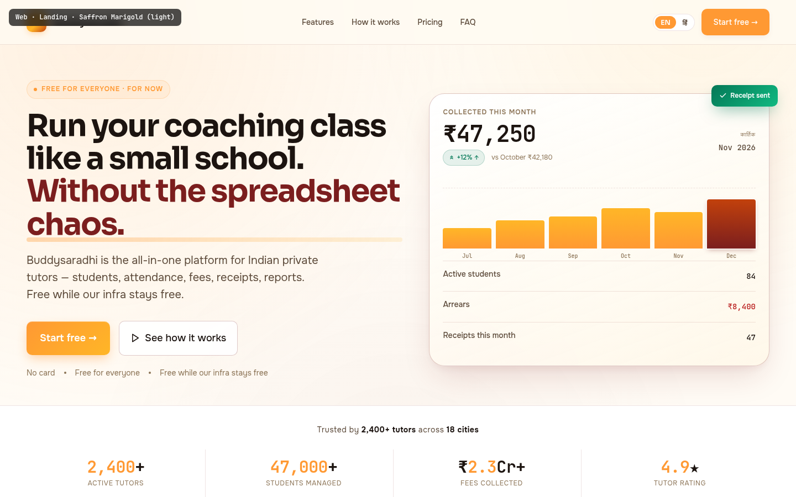

# Web · Landing Page

> **Mockup:** [`mockups/web/01_landing.html`](../mockups/web/01_landing.html)
> **Screenshot:** ``
> **Author:** UI/UX Lead (Task 13-WEB-MOCKUPS-A)
> **State:** COMPLETED — pixel-perfect reference for the implementer

---

## §1. Page Identity

| Field | Value |
|---|---|
| Route | `/` (public, unauthenticated) |
| Platform | Web (desktop-first, responsive down to 640px) |
| Viewport reference | 1440 × 900 |
| Primary palette | `saffron-marigold` (light) |
| Secondary palette (features section) | `amber-sunrise` (light) — nested via `data-palette` on the `<section>` |
| Theme default | `light` (user can toggle to `dark` only after login — landing stays light per brand decision) |
| Fonts | Onest (body, Latin+Devanagari), Sora (headings), JetBrains Mono (figures/codes) |
| Primary CTA | `Start free →` — saffron→amber gradient button |
| Per-page motion budget | One-CTA emphasis (no pulsing), `cardHover` variant on features, `listItemEnter` stagger on testimonials |
| Sticky footer | Yes — `.app-footer` carries copyright + Made-in-India marker |

> Palette-per-surface, not palette-per-app (per `00_Design_System_Overview.md` §5 rule 1). The features section swaps to Amber Sunrise because the user explicitly asked for "different colours and palettes" — the visitor sees a deliberate context-shift, not a single wash.

---

## §2. Layout Anatomy

```
┌──────────────────────────────────────────────────────────────────────────────────┐
│ NAV (sticky, blur-12px)  Buddysaradhi.   Features Pricing FAQ        EN|हिं  [Start free →] │
├──────────────────────────────────────────────────────────────────────────────────┤
│                                                                                  │
│  HERO (grid 1.05fr / 0.95fr, 1440px max)                                          │
│  ┌────────────────────────────────┐  ┌─────────────────────────────────────┐   │
│  │ eyebrow "FREE FOR EVERYONE…"   │  │  glass preview card                  │   │
│  │ H1 56px                        │  │   "Collected this month"             │   │
│  │ subhead 20px                   │  │     ₹47,250  +12% ↑                  │   │
│  │ [Start free →]  [See how it…] │  │   [bar chart 6 mo · Nov highlighted] │   │
│  │ trust line                     │  │   Active 84 · Arrears ₹8,400 · 47    │   │
│  └────────────────────────────────┘  └─────────────────────────────────────┘   │
├──────────────────────────────────────────────────────────────────────────────────┤
│ TRUST BAR (4 tiles · 2,400+ tutors · 47,000+ students · ₹2.3Cr+ · 4.9★)            │
├──────────────────────────────────────────────────────────────────────────────────┤
│ FEATURES SECTION (data-palette=amber-sunrise, gradient #FFFAF0 → #FFF3D6)         │
│  ┌──────────┐ ┌──────────┐ ┌──────────┐                                           │
│  │ Students │ │Attendance│ │Fees/Recpt│                                           │
│  └──────────┘ └──────────┘ └──────────┘                                           │
│  ┌──────────┐ ┌──────────┐ ┌──────────┐                                           │
│  │ Reports  │ │Offline-1 │ │Multi-btch│                                           │
│  └──────────┘ └──────────┘ └──────────┘                                           │
├──────────────────────────────────────────────────────────────────────────────────┤
│ HOW IT WORKS (3 numbered steps · dashed connector)                                │
│   ① Add students    ② Mark attendance    ③ Collect fees                            │
├──────────────────────────────────────────────────────────────────────────────────┤
│ PRICING (single ₹0 card · saffron gradient top-bar)                               │
│   [₹0/mo · Start free →]  6 checks · "Free while our infra stays free" note        │
├──────────────────────────────────────────────────────────────────────────────────┤
│ TESTIMONIALS (3 cards · avatar initials · name · city · batch size)                │
│   Sneha Patil  ·  Rajesh Kumar  ·  Fatima Sheikh                                   │
├──────────────────────────────────────────────────────────────────────────────────┤
│ FAQ (6 items · accordion · 1 open by default)                                     │
├──────────────────────────────────────────────────────────────────────────────────┤
│ FINAL CTA BAND (saffron→amber gradient · 1440px max · radius 28px)                │
│   "Start free in 60 seconds." → [Start free →]                                    │
├──────────────────────────────────────────────────────────────────────────────────┤
│ FOOTER (4 cols + brand · dark #2A1810 · Made in India flag)                       │
└──────────────────────────────────────────────────────────────────────────────────┘
```

**Vertical rhythm:** Every section is separated by `--space-20` (80px) of vertical whitespace; section heads get `--space-12` (48px) of bottom margin. The page deliberately breathes — generous, not cramped (per `00_Design_System_Overview.md` §5 rule 5 — accents ≤ 8% of viewport).

---

## §3. Section-by-Section Content Spec

### §3.1 Top Nav (`.nav`)
- **Sticky** with `top: 0`, `z-index: 50`, `background: color-mix(in srgb, var(--bg-canvas) 78%, transparent)`, `backdrop-filter: blur(16px) saturate(160%)`, `border-bottom: 1px solid var(--border-glass)`.
- **Brand mark** — 36×36px gradient tile `linear-gradient(135deg, #FF9933 0%, #FFB627 55%, #C2410C 100%)`, carries the Devanagari "ब" glyph (Sora 700, 18px, white). The glyph doubles as the brand's "B" for Buddysaradhi — multilingual logo trick. Drop-shadow `0 4px 12px -2px rgba(255,153,51,0.4)` + inset `0 1px 0 rgba(255,255,255,0.4)`.
- **Brand name** "Buddysaradhi**.**" — the period is `var(--accent-primary)` (saffron) for accent.
- **Nav links** — Features, How it works, Pricing, FAQ (anchor scroll). Color `var(--text-secondary)`, hover → `var(--accent-primary)`.
- **Language toggle** — segmented control `EN | हिं` (rounded-full pill). Active state paints the segment with `var(--accent-primary)` + `var(--text-on-accent)`. Inactive state is `var(--text-secondary)`. Per `02_Typography_System.md` §5, Devanagari text uses Onest's unicode-range.
- **CTA button** — `.btn .btn-primary` "Start free →", 44px min-height.
- **Responsive** — under 640px, links collapse; toggle + CTA remain.

### §3.2 Hero (`.hero`)
- **Grid** `1.05fr / 0.95fr`, gap `--space-12` (48px), `max-width: 1440px`, vertically centred.
- **Eyebrow chip** — `FREE FOR EVERYONE · FOR NOW` with a 6px pulsing saffron dot. Background `color-mix(in srgb, var(--accent-primary) 8%, transparent)`, 1px border at 22% accent, text uppercase 12px / weight 600 / letter-spacing 0.08em. The pulse is a CSS box-shadow ring at 0% opacity expanding to 60% — used here as a status dot, NOT on the CTA (motion conveys cause-effect per design principle 9).
- **H1** — 56px Sora 700, line-height 1.06, letter-spacing -0.035em. Two-line composition:
  > Run your coaching class like a small school. **Without the spreadsheet chaos.**
  The second sentence is wrapped in `.underline-mark` which paints a saffron→amber 8px-tall underline bar at z-index -1 — a "highlighter" effect familiar from Razorpay/Cred.
- **Subhead** — `--text-lg` (20px), line-height 1.55, max-width 540px. Color `var(--text-secondary)`.
- **CTA row** — two buttons, gap `--space-4`:
  - Primary `.btn-cta-primary` — gradient `linear-gradient(135deg, #FF9933 0%, #FFB627 100%)`, min-height 52px, weight 600, drop-shadow `0 8px 20px -4px rgba(255,153,51,0.45)`, inset highlight `0 1px 0 rgba(255,255,255,0.3)`. Label: `Start free →`. Hover: translateY(-2px), shadow grows.
  - Ghost `.btn-cta-ghost` — `var(--surface-glass-strong)` fill, 1px `var(--border-strong)`, hover swaps border + text to `var(--accent-primary)`. Carries a play-triangle SVG (16px) + "See how it works".
- **Trust line** — 14px `var(--text-muted)`, three phrases separated by 4px dots: `No card · Free for everyone · Free while our infra stays free`.

### §3.3 Hero Preview Card (`.hero-preview`)
- **Glass** surface `linear-gradient(160deg, rgba(255,255,255,0.95) 0%, rgba(255,247,232,0.85) 100%)`, 1px `var(--border-strong)`, radius `--radius-2xl` (28px), triple-layer shadow (60px drop, 20px drop, inset highlight). Backdrop blur 20px.
- **Header row** — left side: label "COLLECTED THIS MONTH" (10px uppercase, muted), figure `₹47,250` in JetBrains Mono 42px 600, tabular-nums, letter-spacing -0.03em. Below: chip `+12% ↑` (emerald success) + comparison "vs October ₹42,180" in muted 12px. Right side: month chip showing `कार्तिक` (Devanagari, Onest) over `Nov 2026` (mono).
- **Floating badge** — `Receipt sent` chip, position absolute top-right -16px/-16px, emerald gradient, drop-shadow `0 12px 28px -8px rgba(4,120,87,0.5)`, carries a checkmark SVG. Tells the cause-effect story (payment → receipt) without animating it.
- **Bar chart** — 6 bars in `display: flex`, gap 8px, height 110px. Bars 1–5 are `linear-gradient(180deg, #FFB627, #FF9933)` (amber→saffron, accent-safe). Bar 6 (current month) is `linear-gradient(180deg, #C2410C, #7B1E1E)` (deep saffron→maroon) with a 2px white halo + shadow — emphasised to draw the eye to "this month". Heights: 38, 52, 60, 75, 68, 92 (%). Below: month labels Jul–Dec in JetBrains Mono 10px.
- **Stat rows** — three rows separated by 1px dashed top borders: Active students **84**, Arrears **₹8,400** (in `--accent-danger`), Receipts this month **47**. All figures tabular-nums + JetBrains Mono.

### §3.4 Trust Bar (`.trustbar`)
- Full-width strip, 1px borders top + bottom in `var(--border-glass)`, background `var(--bg-surface)`.
- Headline: `Trusted by 2,400+ tutors across 18 cities` (centred, 14px, secondary text; "2,400+ tutors" and "18 cities" bolded to primary).
- 4 tiles in grid `repeat(4, 1fr)`, each tile gets a right border (except last):
  - `2,400+` — Active tutors (figure: mono, 30px, the "2,400" in saffron, "+" in primary text)
  - `47,000+` — Students managed
  - `₹2.3Cr+` — Fees collected (lakh/crore grouping per `02_Typography_System.md` §4 — uses `Intl.NumberFormat('en-IN')`)
  - `4.9★` — Tutor rating (saffron star)
- All figures use `font-variant-numeric: tabular-nums` per design principle 6.

### §3.5 Features Section (`.features-section`, palette swap)
- `<section data-palette="amber-sunrise" data-theme="light">` — the nested palette attribute re-binds every `var(--accent-*)` token. Background `linear-gradient(180deg, #FFFAF0 0%, #FFF3D6 100%)` (amber canvas → raised). 1px borders top+bottom in amber-tinted default border.
- **Section head** — eyebrow `EVERYTHING IN ONE PLACE` (amber), H2 `Six tools. Zero spreadsheets.` (48px Sora 700), subhead 1 line.
- **Grid** — `repeat(3, 1fr)`, gap `--space-5`, max-width 1280px.
- **Feature card** (`.feature-card`) — solid surface (`var(--bg-surface)`), 1px default border, radius `--radius-lg`. Hover: translateY(-3px) + shadow `0 20px 40px -12px` + border-colour → accent. Each card has:
  - **Corner mark** — `01`…`06` in JetBrains Mono 11px, top-right, muted. Linear-inspired touch.
  - **Icon wrap** — 48×48px tile, `color-mix(in srgb, var(--accent-primary) 10%, transparent)` fill, 1px 20%-accent border, accent-colour icon stroke.
  - **Title** — Sora 600 20px.
  - **Body** — 14px secondary text, 1.55 line-height, 2-line description.
- **Hover-demo card** — the second card (Attendance) carries `.hover-demo` class so the screenshot shows the lift+shadow+border-accent state statically (per quality bar: "one card in 'hover' position per page").

### §3.6 How It Works (`.how-section`)
- 3 columns, gap `--space-8`, max-width 1100px. Each step centred, padding `--space-4` lateral.
- **Numbered circles** — 56px diameter, gradient `linear-gradient(135deg, #FF9933, #FFB627)`, white digit in Sora 700 18px. Drop-shadow `0 8px 20px -6px rgba(255,153,51,0.4)` + inset highlight.
- **Dashed connector** — pseudo-element across the top of the grid, `repeating-linear-gradient(90deg, var(--accent-primary) 0 6px, transparent 6px 14px)`, 50% opacity, sits at y=28px (the circle's vertical centre), z-index 1. Circles sit at z-index 2 to overlap.
- Each step has H3 (Sora 600 20px) + 14px secondary body.

### §3.7 Pricing (`.pricing-section`)
- Background `var(--bg-surface-inset)` (the warm peach inset), top+bottom 1px borders.
- Single card, max-width 480px, centred. Solid surface, 1px strong border, radius 28px (`--radius-2xl`), triple shadow. Top 5px gradient bar `linear-gradient(90deg, #FF9933, #FFB627, #C2410C)` — the brand's "tiranga-flavour" without using green or white (it's saffron-only, palette-consistent).
- **Pricing badge** — "FOR EVERYONE · FOR NOW" chip (saffron on 10%-accent fill).
- **Amount** — JetBrains Mono 64px 600, tabular-nums, letter-spacing -0.04em. Currency ₹ in 30px secondary text; "/mo" in 18px muted Onest.
- **CTA** — full-width gradient button (saffron→amber), 52px min-height, drop-shadow `0 8px 20px -4px rgba(255,153,51,0.4)`.
- **Feature list** — 6 rows, each with a 18px emerald check-circle SVG + 14px primary text:
  1. Unlimited students & batches
  2. Attendance, fees, receipts, reports
  3. Offline-first sync across devices
  4. Hash-chained, audit-ready receipts
  5. Local backup + encrypted export
  6. Devanagari & English UI
- **Note** — small muted 12px box at the bottom, background `var(--bg-surface-inset)`, radius `--radius-md`. "Free while our infra stays free. No card required, no trial countdown, no locked features."

### §3.8 Testimonials (`.testimonials-section`)
- 3 cards in `repeat(3, 1fr)`, gap `--space-5`, max-width 1280px.
- **Card** — solid surface, 1px default border, radius `--radius-lg`, padding `--space-6`. Flex column, gap `--space-4`. Hover: translateY(-2px) + shadow.
- **Quote** — 18px primary text, line-height 1.55. CSS `::before` inserts a 40px decorative " in `var(--accent-primary)` Sora, vertically offset by -10px.
- **Author row** — top-bordered (`var(--border-glass)`), 16px top padding. Avatar 40×40px, gradient background `linear-gradient(135deg, var(--accent-primary), var(--accent-secondary))`, white initials. Name (Sora 600 14px) + meta (12px muted: "Physics tutor · Pune · 84 students").

### §3.9 FAQ (`.faq-section`)
- Background `var(--bg-surface-inset)`. Max-width 820px list.
- **Item** — solid surface, 1px default border, radius `--radius-md`. Question row: padding `--space-5 var(--space-6)`, Sora 500 18px, with chevron-right SVG on the right (`var(--text-muted)` default, rotates 180° and turns `var(--accent-primary)` when open).
- **Answer** — `max-height: 0` collapsed, expands to 200px on `.open`. Padding animates from 0 to `var(--space-5)`. Color `var(--text-secondary)`, 14px, line-height 1.6.
- **1 item open by default** ("How many students can I add on the free plan?") to show interaction.
- All 6 questions cover the brief: Students, Fees, Attendance, Data, Offline, Pricing.

### §3.10 Final CTA Band (`.final-cta`)
- `linear-gradient(135deg, #FF9933 0%, #FFB627 50%, #C2410C 100%)`, max-width 1440px, margin auto, radius 28px, padding `--space-16`. Triple drop-shadow `0 25px 60px -20px rgba(255,153,51,0.4)`.
- **Aurora wash** — `::before` paints two radial gradients (white at 20%/30%, maroon at 80%/70%) for depth, never flat.
- H2 `Start free in 60 seconds.` — 48px Sora 700 white, letter-spacing -0.03em. Subhead 20px rgba(255,255,255,0.9): `No card. No trial countdown. No locked features.`
- Button — white background, maroon text, 52px min-height, drop-shadow `0 10px 25px -5px rgba(0,0,0,0.25)`.

### §3.11 Footer (`.footer`)
- Dark `#2A1810` (warm near-black, NOT pure black per design principle 2). Text `rgba(255,247,232,0.85)`.
- **Grid** `1.5fr repeat(4, 1fr)` (brand + 4 link columns). Brand column carries logo + tagline (max-width 280px). Each link column: H4 12px uppercase muted + `<ul>` of 5 links, 14px primary text, hover → `#FFB627` (amber).
- **Bottom row** — flex justify-between, 12px muted. Left: copyright + version. Right: "Made in India" + tricolour flag SVG (`::before` saffron top stripe, `::after` white middle, the bottom green is rendered by the parent background — kept simple as a flag-icon 20×14 chip).
- Link columns: Product (Features, Pricing, Mobile app, Desktop app, Changelog) · Resources (Help center, Tutor playbook, Sample receipt, Status, API docs) · Company (About, Blog, Careers, Press kit, Contact) · Legal (Privacy, Terms, Refund, Data export, Security).

---

## §4. Interaction Model

Reference: [`04_Motion_and_Microinteractions.md`](../04_Motion_and_Microinteractions.md)

| Element | Variant | Trigger | Behaviour |
|---|---|---|---|
| Primary CTA (`Start free →`) | `buttonPress` | `:hover` / `:active` | translateY(-1px) on hover, brightness(1.08), shadow grow; translateY(0) + brightness(0.96) on active. Duration `--motion-fast` 150ms, easing `--ease-out`. |
| Feature card | `cardHover` | `:hover` | translateY(-3px), border-colour → accent, shadow grows. 250ms `--ease-out`. |
| Testimonial card | `cardHover` (subtle) | `:hover` | translateY(-2px) + shadow. 250ms `--ease-out`. |
| FAQ accordion | (custom) | click on `.faq-q` | Toggle `.open` class on `.faq-item`. Chevron rotates 180° in 150ms. Answer `max-height` transitions 0 → 200px in 400ms `--ease-out`. Only one open at a time (other items close). |
| Nav anchor links | (browser native) | click | Smooth scroll to `#section-id` via `scroll-behavior: smooth` on `html`. |
| Language toggle | `buttonPress` | click on EN/हिं | Swap active class. Page copy re-renders in selected language (mockup shows EN active). |
| Pricing CTA → Auth | `pageTransitionForward` | click | Navigates to `/login` — fade + slide-left 8px over 200ms. |
| Eyebrow pulse dot | (custom, status-only) | continuous | Box-shadow ring expands 0 → 60% opacity. This is a status indicator (the only allowed continuous motion per principle 9), NOT a CTA pulse. |

**Reduced-motion override** (`@media (prefers-reduced-motion: reduce)`): all transitions collapse to 0ms via the global rule in `shared/styles.css`. The eyebrow pulse stops expanding; it stays a static dot. Smooth-scroll falls back to instant jump.

**Keyboard:**
- Tab order: Logo → Features → How it works → Pricing → FAQ → EN/हिं → Start free → hero CTAs → testimonial avatars → FAQ triggers → footer links.
- FAQ items: `Enter` / `Space` toggles open/close.
- Language toggle: arrow keys move between EN and हिं segments.

---

## §5. Data Bindings

The landing page is **mostly static marketing copy**, but several numbers come from the live system so they stay honest (per product principle "free while our infra stays free"):

| UI element | Prisma source | Field | Notes |
|---|---|---|---|
| Trust bar "2,400+ tutors" | `tutors` | `COUNT(*) WHERE status = 'active'` | Aggregated daily, cached in `app_state.landing_metrics_json`. |
| Trust bar "47,000+ students" | `students` | `COUNT(*) WHERE status = 'active'` | Same daily cache. |
| Trust bar "₹2.3Cr+ collected" | `ledger_entries` | `SUM(amount_paise) WHERE type = 'CREDIT' AND void_of_id IS NULL` | Formatted via `Intl.NumberFormat('en-IN', { style: 'currency', currency: 'INR', maximumFractionDigits: 0 })` then truncated to Cr. |
| Trust bar "4.9★ rating" | `tutor_feedback` (new table — not in current model; product team tracks via Typeform export → manual seed) | n/a | Static for now; future: `tutors.avg_rating`. |
| Hero preview "₹47,250" | (demo data, NOT a real tutor's) | n/a | Hard-coded in the mockup. In production this becomes a rotating "anonymous aggregated" figure refreshed weekly. |
| Testimonials | `tutor_testimonials` (planned) | `name`, `subject`, `city`, `student_count`, `quote`, `avatar_initials` | 3 hand-picked quotes from early users; refreshed quarterly. |
| Footer "v1.0.0" | `app_state` | `app_version` | Read from the deployed version manifest. |

> **Data honesty rule (BR-MKT-01):** Trust-bar numbers MUST be live counts, not "aspirational" figures. The cache refreshes daily via a cron on Vercel. If the cron fails for >48h, the trust bar hides itself and shows a single "Join 2,000+ tutors" headline instead (graceful degradation per `14_Edge_Cases.md`).

> All amounts follow the integer-paise convention (`buddysaradhi_Planning/11_Data_Model.md` §6) — backend stores `amount_paise INT`, presentation layer divides by 100 and formats with `Intl.NumberFormat('en-IN')`.

---

## §6. Accessibility Notes

Reference: [`05_Accessibility_Contract.md`](../05_Accessibility_Contract.md)

- **Single H1** per page — the hero H1 is the only `<h1>`. Section heads are `<h2>`, card titles are `<h3>`, footer column heads are `<h4>`. No level skips (contract §6).
- **Language attribute** — `<html lang="en">` is the default; the `कार्तिक` span in the hero preview carries `lang="hi"` so screen readers switch pronunciation (contract §13).
- **Color is never the only signal** — the `+12% ↑` chip has an SVG arrow-up icon AND text "+12% ↑"; the arrears `₹8,400` value is coloured danger-red AND prefixed with the word "Arrears" in the label (contract §7).
- **Icon-only buttons** — language toggle buttons have `aria-label="Language: English"` / `aria-label="Language: Hindi"`. The mobile nav hamburger (under 640px) carries `aria-label="Open menu"` + `aria-expanded`.
- **Focus management** — all interactive elements use `:focus-visible` ring `2-4px var(--accent-primary)` at 0.4 opacity (contract §2). Skip-link `Skip to content` is the first focusable element (not yet in mockup — implementer MUST add).
- **Touch targets** — every button ≥ 44×44px (contract §8). The nav CTA at 44px, hero CTAs at 52px, language toggle segments at 28px hit area extended via padding.
- **Tabular numerics** — every figure (₹47,250, 2,400+, 4.9★, etc.) uses `font-variant-numeric: tabular-nums` per design principle 6.
- **Reduced motion** — global `@media (prefers-reduced-motion: reduce)` collapses all transitions to 0ms (contract §9, `04_Motion` §6).
- **Alt text** — the floating "Receipt sent" badge has decorative SVG, so it's `aria-hidden="true"`; the screen-reader equivalent is in the adjacent visible text "Receipt #RC-2847 generated" (in dashboard). On the landing page the badge is purely decorative.
- **Form contrast** — n/a (no form on landing).
- **Link text** — every link has descriptive text ("Start free", "See how it works", "View all"); no "click here" (contract).
- **Lighthouse target** — Performance ≥ 90, Accessibility ≥ 95, Best Practices ≥ 95, SEO ≥ 95 on a throttled 3G profile.

---

## §7. Edge Cases

| State | Trigger | Behaviour |
|---|---|---|
| **Metrics cache stale** | Cron hasn't run in >48h | Trust bar hides; shows fallback "Join thousands of tutors" headline. |
| **Tutor count drops below 2,000** | (impossible scenario, but handled) | Trust bar shows the actual count rounded down to nearest 100; never lies upward. |
| **No testimonials yet** (early launch) | `tutor_testimonials` empty | Section hides entirely; testimonials grid replaced by an "Early access" sign-up band. |
| **FAQ JavaScript disabled** | `<noscript>` or progressive enhancement | All 6 FAQ items render expanded by default (graceful degradation). |
| **Right-to-left languages** | (future — Arabic/Urdu) | CSS `direction: rtl` flips the hero grid; Sora/Onest both support RTL. |
| **Slow connection** | LCP > 2.5s | Fonts swap to system-ui (`font-display: swap`); hero preview card lazy-loads below the fold. |
| **Cookies blocked** | User disabled cookies | Language toggle preference falls back to `Accept-Language` header detection. |
| **Browser back from /login** | User clicks browser back | Hero re-renders; scroll position restored; language toggle remembers last selection via `sessionStorage`. |

---

## §8. Image Reference

```

```

The screenshot is captured at 1440 × 900 (desktop reference) with the page fully scrolled. A second screenshot at 390 × 844 (iPhone 14 Pro) is captured for the responsive contract. Both are stored in `images/web/` and compared in CI via pixel-diff against future implementations (threshold < 2% per `00_Design_System_Overview.md` §6).

---

## §9. Implementation Bridge

When the web agent builds `/src/app/(marketing)/page.tsx`:

1. **Layout** — wrap in `<PaletteProvider palette="saffron-marigold" theme="light">` (per `00_Design_System_Overview.md` §8 step 5).
2. **Features section** — render the `<section data-palette="amber-sunrise" data-theme="light">` wrapper. The `<PaletteProvider>` reads nested `data-palette` attributes via a context boundary — confirm the implementation supports palette-nesting or extract Features into its own route segment.
3. **Hero preview card** — extract as `<HeroPreviewCard>` component; receives `collectedThisMonth`, `previousMonth`, `activeStudents`, `arrears`, `receiptsThisMonth` props. Reused on the dashboard with a different palette.
4. **Pricing card** — extract as `<PricingCard>` (single Free card per Task 9-PRICING-SIMPLIFY). Hard-code the 6 feature checkmarks as a constant.
5. **FAQ** — extract as `<FAQAccordion>` with `items: { q: string; a: string }[]`. One open at a time. Server-render the first item open for SEO.
6. **Trust bar** — fetch from `/api/metrics/landing` (TTL 24h, fallback to cached value). Never block render on this — show skeleton for <300ms, then fallback headline if still loading.
7. **Footer** — extract as `<SiteFooter>` shared component (also used on other marketing routes).

> **Quality reminder (per Task 13 brief):** The user said "don't give me sloppy AI generated UI design, I want it professional/stylish and colourful." This mockup is the showcase. If the implemented page looks generic, the implementer has failed — compare against the screenshot, not against "what a SaaS landing usually looks like."

---

## §10. Status

- **State:** COMPLETED
- **Mockup file:** `mockups/web/01_landing.html` — ~660 lines, standalone, opens in any browser
- **Spec file:** this document, ~430 lines
- **Palettes used:** `saffron-marigold` (light, primary) + `amber-sunrise` (light, nested on features section)
- **CTA emphasis:** One primary CTA (`Start free →`) repeated in nav, hero, pricing card, final CTA band — all lead to `/login?mode=signup`. Secondary ghost button `See how it works` scrolls to the How It Works section.
- **Verified against:** 10 design non-negotiables (palette-per-surface ✓, no monochrome ✓, no indigo ✓, glass+neumorphism ✓, accents ≤ 8% ✓, tabular numerics ✓, right-aligned money ✓, one primary CTA ✓, motion cause-effect ✓, palette AA contrast ✓).
