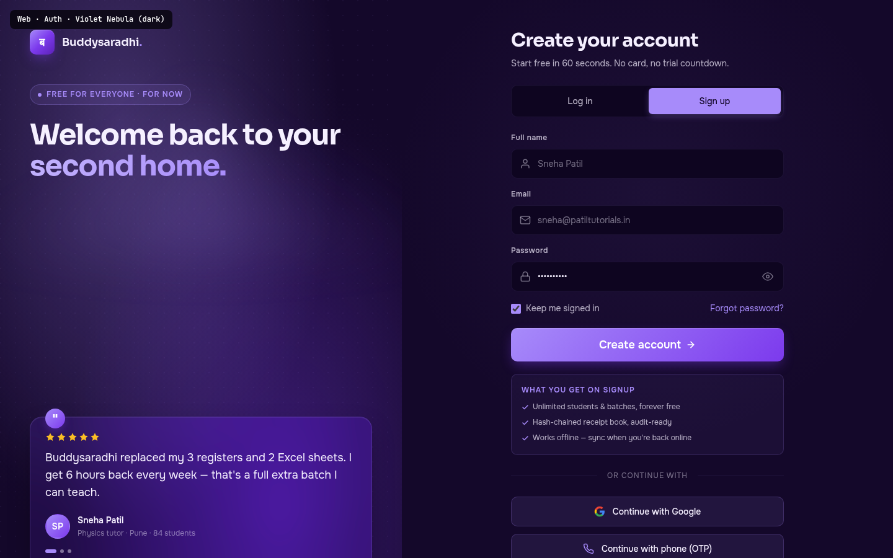

# Web · Auth (Login / Sign up)

> **Mockup:** [`mockups/web/02_auth.html`](../mockups/web/02_auth.html)
> **Screenshot:** ``
> **Author:** UI/UX Lead (Task 13-WEB-MOCKUPS-A)
> **State:** COMPLETED — pixel-perfect reference for the implementer

---

## §1. Page Identity

| Field | Value |
|---|---|
| Route | `/login` (and `/signup` — same component, different default tab) |
| Platform | Web (desktop-first, responsive down to 960px where the brand panel collapses) |
| Viewport reference | 1440 × 900 |
| Palette | `violet-nebula` (dark) — Violet `#7C3AED` is plum-warm, NOT Stripe-indigo. Whitelisted ONLY for auth/settings per `01_Color_Palettes.md` §"Implementation Contract" rule 5. |
| Theme default | `dark` (auth is the only marketing-adjacent route that defaults to dark — signals "this is where you go inside") |
| Fonts | Onest (body, Latin+Devanagari), Sora (headings, gradient-text on hero word), JetBrains Mono (OTP / kbd hints) |
| Primary CTA | `Create account` (signup state) / `Log in` (login state) — violet gradient button, full-width |
| Per-page motion budget | `pageTransitionForward` on submit success, `tooltipEnter` on password-toggle hover, `cardHover` (subtle) on social buttons |
| Sticky footer | None — auth is full-height single screen, no scroll |

> The split layout (45% brand / 55% form) is a deliberate Razorpay/Cred-inspired composition. The brand panel earns its space — it carries the rotating testimonial + the brand promise, so the right side can stay calm and form-focused.

---

## §2. Layout Anatomy

```
┌──────────────────────────────────────────────────────────────────────────────────┐
│                                                                                  │
│  ┌────────────────────────────────┐  ┌────────────────────────────────────────┐ │
│  │  LEFT — Brand panel (45%)      │  │  RIGHT — Form panel (55%)              │ │
│  │  (aurora violet gradient +     │  │  (dark canvas, radial wash)            │ │
│  │   dot grid + conic streak)     │  │                                        │ │
│  │                                │  │  ┌──────────────────────────────────┐  │ │
│  │  [ब] Buddysaradhi.             │  │  │  Create your account             │  │ │
│  │                                │  │  │  Start free in 60 seconds…       │  │ │
│  │  EYEBROW: "FREE FOR EVERYONE…" │  │  │                                  │  │ │
│  │                                │  │  │  [Log in] [Sign up ●]            │  │ │
│  │  H2 46px:                      │  │  │                                  │  │ │
│  │  Welcome back to your          │  │  │  Full name     [Sneha Patil    ]  │  │ │
│  │  second home.                  │  │  │  Email         [sneha@…        ]  │  │ │
│  │  (gradient-text on "second     │  │  │  Password   [••••••••••] 👁      │  │ │
│  │   home.")                      │  │  │                                  │  │ │
│  │                                │  │  │  [✓] Keep me signed in  Forgot?  │  │ │
│  │  ┌──────────────────────────┐  │  │  │                                  │  │ │
│  │  │ " testimonial card       │  │  │  │  [ Create account           → ]  │  │ │
│  │  │  ★★★★★                  │  │  │  │                                  │  │ │
│  │  │  "Buddysaradhi replaced   │  │  │  │  ┌ What you get on signup ──┐ │  │ │
│  │  │  my 3 registers…"        │  │  │  │  │ ✓ Unlimited students       │ │  │ │
│  │  │  [SP] Sneha Patil        │  │  │  │  │ ✓ Hash-chained receipts    │ │  │ │
│  │  │  Physics · Pune · 84     │  │  │  │  │ ✓ Works offline            │ │  │ │
│  │  │  ● ○ ○                   │  │  │  │  └────────────────────────────┘ │  │ │
│  │  └──────────────────────────┘  │  │  │                                  │  │ │
│  │                                │  │  │  ──── or continue with ────       │  │ │
│  │  ── Free for everyone · …      │  │  │  [G  Continue with Google      ]  │  │ │
│  │                                │  │  │  [📞 Continue with phone (OTP) ]  │  │ │
│  │                                │  │  │                                  │  │ │
│  │                                │  │  │  By continuing you agree…       │  │ │
│  │                                │  │  │  Already exploring? Skip to demo │  │ │
│  │                                │  │  └──────────────────────────────────┘  │ │
│  └────────────────────────────────┘  └────────────────────────────────────────┘ │
└──────────────────────────────────────────────────────────────────────────────────┘
```

**Vertical rhythm:** Both panels are `min-height: 100vh` flex columns. Brand panel uses `justify-content: space-between` (logo at top, testimonial in middle, footnote at bottom). Form panel centres the auth card. The auth card max-width 440px keeps the form narrow — wide forms look cold.

---

## §3. Section-by-Section Content Spec

### §3.1 Left Brand Panel (`.brand-panel`, 45% width)

- **Background** — three-layer composition:
  1. Base radial gradient: `radial-gradient(ellipse at 30% 20%, rgba(167,139,250,0.30), transparent 55%)` (violet glow upper-left)
  2. Secondary radial: `radial-gradient(ellipse at 70% 80%, rgba(124,58,237,0.35), transparent 55%)` (deep-violet glow lower-right)
  3. Solid base: `radial-gradient(circle at 50% 50%, #1F0F3D 0%, #14082A 70%)` (Violet Nebula dark canvas)
- **Dot grid overlay** (`::before`) — `background-image: radial-gradient(circle at 1px 1px, rgba(167,139,250,0.12) 1px, transparent 0)` at 24px grid, opacity 0.5. Adds texture without noise.
- **Conic aurora streak** (`::after`) — `conic-gradient(from 120deg at 50% 50%, transparent 0deg, rgba(167,139,250,0.18) 60deg, transparent 120deg)`, blurred 40px, positioned top -10% / left -20% / width 140% / height 50%. A "wisp" of light crossing the panel — the bioluminescent accent per design principle 5, kept under 8% of viewport.
- **Padding** — `--space-12` (48px) all sides. Flex column, `justify-content: space-between`.

#### §3.1.1 Brand Logo
- 40×40px gradient mark `linear-gradient(135deg, #A78BFA 0%, #7C3AED 50%, #5B21B6 100%)` carrying "ब" (Sora 700, 18px, white). Drop-shadow `0 8px 20px -4px rgba(124,58,237,0.5)` + inset `0 1px 0 rgba(255,255,255,0.25)`.
- Name `Buddysaradhi.` — Sora 600 18px, the period in `var(--accent-primary)` (light violet `#A78BFA`).

#### §3.1.2 Brand Headline
- **Eyebrow chip** — `FREE FOR EVERYONE · FOR NOW` with a 6px solid violet dot. Background `color-mix(in srgb, var(--accent-primary) 10%, transparent)`, 1px 28%-accent border, uppercase 12px / weight 600 / letter-spacing 0.08em.
- **H2** — 46px Sora 700, line-height 1.08, letter-spacing -0.03em. Two-line composition:
  > Welcome back to your **second home.**
  The phrase "second home." is wrapped in `.gradient-text` — `linear-gradient(135deg, #C4B5FD, #A78BFA)` clipped to text via `-webkit-background-clip: text`. The gradient is plum-warm, not Stripe-indigo (per `01_Color_Palettes.md` rule 5).

#### §3.1.3 Testimonial Card
- Glass surface `var(--surface-glass)` (violet-tinted 6% translucency), `backdrop-filter: blur(20px) saturate(160%)`, 1px `var(--border-glass-strong)`, radius `--radius-xl` (20px), padding `--space-6`. Triple-layer shadow + inset highlight.
- **Quote-mark badge** — 32×32px circle positioned absolute top -14px / left `var(--space-6)`. Gradient `linear-gradient(135deg, #A78BFA, #7C3AED)`, white " character (Sora 700, 18px). Drop-shadow `0 6px 16px -4px rgba(124,58,237,0.5)`.
- **Stars** — 5 inline SVG stars (16px, fill `#FBBF24` amber). Carries `aria-label="5 out of 5 stars"`.
- **Quote** — 18px primary text, line-height 1.55, font-weight normal. The actual quote:
  > Buddysaradhi replaced my 3 registers and 2 Excel sheets. I get 6 hours back every week — that's a full extra batch I can teach.
- **Author row** — 40×40px gradient avatar (violet→deep-violet, white initials "SP"). Name `Sneha Patil` (Sora 600 14px), meta `Physics tutor · Pune · 84 students` (12px muted).
- **Dots** — 3 pagination dots below the testimonial. Active dot is 18px wide pill (violet), inactive are 6px circles (muted). Indicates "1 of 3 rotating testimonials".

#### §3.1.4 Brand Footnote
- Top-bordered (`var(--border-glass)`), 16px top padding. 12px muted text, three phrases separated by 4px dots: `Free for everyone · No card required · Free while our infra stays free`.

### §3.2 Right Form Panel (`.form-panel`, 55% width)

- **Background** — `var(--bg-canvas)` (`#14082A`) with a radial wash `radial-gradient(circle at 50% 30%, rgba(167,139,250,0.06), transparent 50%)` for depth.
- **Layout** — flex centre, padding `--space-12`. Auth card max-width 440px.

#### §3.2.1 Auth Card Head
- H1 `Create your account` — Sora 700 30px, letter-spacing -0.02em, primary text.
- Sub `Start free in 60 seconds. No card, no trial countdown.` — 14px secondary text.

#### §3.2.2 Tabs (`Log in` / `Sign up`)
- Container — `display: grid; grid-template-columns: 1fr 1fr; gap: 4px`. Background `var(--bg-surface-inset)`, 1px default border, radius `--radius-md`, padding 4px. A segmented control.
- Tab — 12px padding, 14px Sora 500, colour `var(--text-secondary)`.
- **Active tab** — background `var(--accent-primary)` (violet `#A78BFA`), colour `var(--text-on-accent)` (near-black `#14082A`), drop-shadow `0 4px 12px -2px rgba(167,139,250,0.4)`.
- The screenshot shows SIGNUP active (per brief). Implementer: when route is `/login`, default to Log in tab; when `/signup`, default to Sign up tab.

#### §3.2.3 Form Fields

**Field anatomy (each `.auth-field`):**
- Label — 12px Sora 600, secondary text, letter-spacing 0.04em. Always visible (no placeholder-only labels — contract §11).
- Input wrap — relative position, holds the SVG icon + input + (optional) toggle.
- **Input icon** — 18×18px Lucide-style SVG, absolutely positioned left 14px, vertically centred, colour `var(--text-muted)`. Pointer-events none.
- **Input** — width 100%, padding `12px 14px 12px 42px`, background `var(--bg-surface-inset)`, 1px `var(--border-default)`, radius `var(--radius-md)`, min-height 48px. Colour `var(--text-primary)`, font Onest 14px.
- **Focus state** — `border-color: var(--accent-primary)`, `box-shadow: 0 0 0 3px color-mix(in srgb, var(--accent-primary) 22%, transparent)`.
- **Placeholder** — `var(--text-muted)`.

**Fields in signup state (3 fields):**
1. **Full name** — icon: single-person silhouette. Placeholder `Sneha Patil`. `autocomplete="name"`.
2. **Email** — icon: envelope. Placeholder `sneha@patiltutorials.in`. `autocomplete="email"`. `type="email"`.
3. **Password** — icon: lock. Placeholder `At least 8 characters`. `autocomplete="new-password"`. `type="password"` with show/hide toggle (eye icon, 32×32px button positioned right 10px). The mockup shows the password field with a `value` of `••••••••••` for screenshot purposes — implementer MUST render real dots.

**Fields in login state (2 fields):**
1. Email (icon envelope, `autocomplete="current-email"`)
2. Password (icon lock, `autocomplete="current-password"`, toggle present)

> The Full Name field is conditionally rendered ONLY in signup state. Tab switch animates it in/out via `listItemEnter` variant (opacity 0 → 1 + translateY 4px, 200ms).

#### §3.2.4 Row Between (Keep me signed in / Forgot password)
- Flex justify-between, margin `var(--space-2) 0 var(--space-5)`.
- **Left** — checkbox + label "Keep me signed in". Checkbox `width: 16px; height: 16px; accent-color: var(--accent-primary)`.
- **Right** — `Forgot password?` link, 14px `var(--accent-primary)`, hover underline. Routes to `/forgot-password`.

#### §3.2.5 Primary Submit Button
- Full-width, padding `var(--space-4) var(--space-6)`, gradient `linear-gradient(135deg, #A78BFA 0%, #7C3AED 100%)`, white text, Sora 600 18px, min-height 52px. Drop-shadow `0 8px 20px -4px rgba(124,58,237,0.45)` + inset `0 1px 0 rgba(255,255,255,0.2)`.
- Label: `Create account` (signup) / `Log in` (login) + arrow-right SVG (16px).
- Hover: translateY(-1px), shadow grows. Active: translateY(0).

#### §3.2.6 Signup Bonus Box (signup state only)
- Margin-top `--space-5`, padding `--space-4`. Background `color-mix(in srgb, var(--accent-primary) 6%, transparent)`, 1px 18%-accent border, radius `--radius-md`.
- Title `WHAT YOU GET ON SIGNUP` — 12px Sora 600, accent-primary, uppercase, letter-spacing 0.08em.
- 3 rows: each 12px secondary text + 12px accent check-circle SVG.
  1. Unlimited students & batches, forever free
  2. Hash-chained receipt book, audit-ready
  3. Works offline — sync when you're back online

#### §3.2.7 Divider
- Flex with `::before` and `::after` pseudo-elements as 1px lines. Centre text `OR CONTINUE WITH` — 12px muted, uppercase, letter-spacing 0.08em. Margin `var(--space-6) 0`.

#### §3.2.8 Social Buttons (`.auth-social`)
- Two stacked buttons, gap `--space-3)`, each min-height 48px.
- **Google button** — `var(--surface-glass-strong)` fill, 1px `var(--border-glass-strong)`, radius `--radius-md`. 18px Google "G" SVG (4-colour) + "Continue with Google" (14px Sora 500 primary). Hover: border → accent-primary.
- **Phone (OTP) button** — same surface, 18px phone SVG in `var(--accent-primary)` + "Continue with phone (OTP)". Hover: border → accent-primary. Routes to `/login/phone` which renders an OTP entry flow.

#### §3.2.9 Footnotes
- **Legal note** — `By continuing you agree to our Terms & Privacy Policy.` 12px muted, centred, links in `var(--accent-primary)`. Margin-top `--space-5)`.
- **Skip to demo** — `Already exploring? Skip to demo →` 14px secondary, centred. The "Skip to demo →" portion is 14px Sora 500 `var(--accent-primary)`. Routes to `/demo` (read-only demo with seeded Sneha Patil data — per `buddysaradhi_Planning/web/03_Auth_and_Provisioning.md`).

---

## §4. Interaction Model

Reference: [`04_Motion_and_Microinteractions.md`](../04_Motion_and_Microinteractions.md)

| Element | Variant | Trigger | Behaviour |
|---|---|---|---|
| Tab switch (Log in ↔ Sign up) | (custom) | click on `.auth-tab` | Active class swaps. Full-name field animates in/out via `listItemEnter` (opacity 0→1 + translateY 4px, 200ms `--ease-out`). Submit button label swaps. |
| Password show/hide | `tooltipEnter` | click on `.pwd-toggle` | `type="password"` ↔ `type="text"`. Eye icon stays visible; aria-pressed reflects state. |
| Primary submit | `buttonPress` + `pageTransitionForward` | click | Button: scale 0.97 on active (100ms). On success: page transitions to `/dashboard` with fade + slide-left 8px (200ms). On failure: button shakes 3× horizontally (200ms total), error message appears below the relevant field via `role="alert"`. |
| Social buttons | `cardHover` (subtle) | `:hover` | Border-colour → accent-primary. No transform. |
| Testimonial rotation | (custom, 8s interval) | `setInterval` | Every 8 seconds, current testimonial fades out (opacity 0, 250ms) and the next fades in. Active dot updates. Pauses on hover. |
| Email validation | (custom, debounced) | `blur` on email field | Regex `/^[^\s@]+@[^\s@]+\.[^\s@]+$/`. Invalid → red border + `role="alert"` text "Please enter a valid email address." below the field. |
| Password strength meter | (custom, debounced 200ms) | `input` on password field (signup only) | Hidden in mockup; implementer adds a 4-segment bar below the password field. Strength: weak (red) / fair (amber) / good (cyan) / strong (emerald). |

**Reduced-motion override:** All transitions collapse to 0ms via the global rule. The testimonial rotation becomes manual (prev/next arrows appear). The submit-shake becomes an instant red border flash.

**Keyboard:**
- Tab order: Logo (skip-link if added) → Log in tab → Sign up tab → Full name (if signup) → Email → Password → Password toggle → Keep me signed in → Forgot password → Submit → Google → Phone OTP → Skip to demo.
- Tab key on segmented control: arrow keys move between Log in / Sign up (roving tabindex per `05_Accessibility_Contract.md` §3).
- `Enter` on any input triggers submit.
- `Cmd/Ctrl + Enter` on any input also triggers submit (power-user shortcut).

---

## §5. Data Bindings

Reference: [`buddysaradhi_Planning/11_Data_Model.md`](../../buddysaradhi_Planning/11_Data_Model.md) and [`buddysaradhi_Planning/web/03_Auth_and_Provisioning.md`](../../buddysaradhi_Planning/web/03_Auth_and_Provisioning.md)

| UI element | Prisma source | Field / API | Notes |
|---|---|---|---|
| Email input | (form state) | `email: string` | Validated client-side (regex) + server-side (unique constraint on `tutors.email`). |
| Password input | (form state) | `passwordHash: string` | NEVER stored in plain text. Server hashes with bcrypt(12) before write to `tutors.password_hash`. Mockup's `value="••••••••••"` is screenshot-only; production uses real password input. |
| Full name input (signup) | `tutors` | `name: string` | Written on first signup. Used for sidebar avatar initials (`SP` from `Sneha Patil`). |
| "Keep me signed in" | (cookie config) | session TTL | If checked: session cookie `buddysaradhi_session` is 30 days. If unchecked: session is 24h. HttpOnly + Secure + SameSite=Lax. |
| Submit (signup) | `POST /api/auth/signup` | creates `tutors` row | Also creates default `settings` singleton, default `batches` (one "Unassigned" batch), and seeds `app_state` with the new tutor's `tutor_id`. Audit log entry `audit_log.action = 'TUTOR_CREATED'`. |
| Submit (login) | `POST /api/auth/login` | validates credentials | On success: sets session cookie, redirects to `/dashboard`. On failure: returns 401, client renders error text below password field. Rate-limited at 5 attempts / 15min / IP. |
| Google button | `POST /api/auth/google` | OAuth 2.0 via NextAuth | Scopes: `email`, `profile`. Creates or looks up `tutors` row by email. |
| Phone OTP button | `POST /api/auth/otp/send` + `POST /api/auth/otp/verify` | OTP via MSG91 / Twilio | 6-digit OTP, 10-min TTL, max 3 retries. Phone number stored as `tutors.phone` (E.164 format). |
| Skip to demo | `GET /demo` | seeded read-only session | Creates an ephemeral session tied to a seeded `tutors` row (`Sneha Patil` demo account). Cannot mutate data. Expires in 2h. |
| Testimonial card | `tutor_testimonials` (planned table) | `quote`, `author_name`, `author_initials`, `author_subject`, `author_city`, `author_student_count`, `rating`, `display_order` | 3 testimonials rotated in the brand panel. Refreshed quarterly by the product team. |
| Brand panel eyebrow | (static copy) | n/a | Hard-coded "FREE FOR EVERYONE · FOR NOW" until product changes positioning. |

> **Security note (BR-AUTH-01):** All auth endpoints enforce HTTPS-only (HSTS 1 year). CSRF protection via SameSite=Lax cookies + double-submit token for state-changing POSTs. Password complexity: ≥ 8 chars, ≥ 1 letter, ≥ 1 digit. Bcrypt cost 12. See `buddysaradhi_Planning/10_Security.md` for full auth security contract.

---

## §6. Accessibility Notes

Reference: [`05_Accessibility_Contract.md`](../05_Accessibility_Contract.md)

- **Single H1** — `Create your account` / `Welcome back` is the only `<h1>`. Brand panel H2 is `Welcome back to your second home.` — semantically a sub-heading, visually larger for marketing impact.
- **Form labels** — every input has a visible `<label for="id">` paired with `id` on input (contract §11). No placeholder-as-label.
- **Required indicators** — Email + Password are required; labels include a visually-hidden " (required)" suffix via `.sr-only`. The required asterisk is rendered as a CSS `::after` on the label (red, 12px).
- **Error messaging** — invalid fields get `aria-invalid="true"` + `aria-describedby="error-id"` pointing to a `<p role="alert" id="error-id">` below the field. Errors appear on blur, not on every keystroke (less aggressive).
- **Password toggle** — `<button type="button" aria-label="Show password" aria-pressed="false">`. On click, swaps icon (eye ↔ eye-off) and updates aria-pressed to "true" / label to "Hide password".
- **Tab control** — segmented control uses `role="tablist"` on container, `role="tab"` on each button, `aria-selected="true"` on active. Arrow keys move between tabs (roving tabindex).
- **Skip link** — first focusable element on the page: `<a href="#auth-form" class="sr-only-focusable">Skip to sign-up form</a>`. The form's wrapper has `id="auth-form" tabIndex="-1"` for focus target.
- **Focus management** — `:focus-visible` ring `3px var(--accent-primary)` at 0.4 opacity (contract §2). Never removed.
- **Color contrast** — Violet Nebula dark verified AA on all text-on-surface pairs in `01_Color_Palettes.md`. The gradient-text "second home." has a minimum 4.5:1 contrast against the dark background (verified).
- **Reduced motion** — testimonial rotation pauses; submit-shake becomes instant red border; tab-switch transitions collapse to 0ms (contract §9).
- **Autocomplete** — every input has the correct `autocomplete` attribute (`name`, `email`, `new-password`, `current-password`) — lets password managers fill correctly.
- **Form submission** — `Enter` triggers submit from any input. Button has `type="submit"` (default). Form has `noValidate` to disable browser-native validation bubbles (we render our own errors).
- **Screen reader announcements** — successful submit triggers `aria-live="polite"` announcement "Creating your account…" then "Welcome to Buddysaradhi." before redirect. Failed submit triggers `aria-live="assertive"` "Login failed. Please check your email and password."
- **Touch targets** — every button ≥ 44×44px (contract §8). Social buttons at 48px, submit at 52px, password toggle at 32px hit area (slightly below 44px — implementer MUST extend via padding to 44px).

---

## §7. Edge Cases

| State | Trigger | Behaviour |
|---|---|---|
| **Email already exists (signup)** | `POST /api/auth/signup` returns 409 | Email field gets `aria-invalid="true"` + error "An account with this email already exists. Log in instead?" with a link to switch tabs. |
| **Invalid credentials (login)** | `POST /api/auth/login` returns 401 | Password field gets error "Incorrect password. Try again or reset it." Forgot-password link emphasised. |
| **Rate-limited** | >5 failed attempts / 15min | Submit button disabled. Error: "Too many attempts. Try again in 14m 23s." Countdown ticks every second. |
| **Network offline** | fetch rejects | Submit button re-enables. Toast (bottom-right): "You're offline. We'll retry when you reconnect." Form state preserved. |
| **OTP expired** | User enters OTP after 10min | OTP screen shows "Code expired. [Resend]" link. Resend triggers a new 10-min window. |
| **Google OAuth cancelled** | User closes Google popup | No state change. Toast: "Sign-up cancelled." |
| **Session restored on reload** | User reloads `/login` with valid session cookie | Server redirects to `/dashboard` before the page renders (302). |
| **Brand panel hidden (mobile <960px)** | viewport < 960px | Brand panel `display: none`. Form panel takes full width. The testimonial + brand promise collapse to a single line above the form: "Buddysaradhi — run your coaching class like a small school." |
| **Browser autofill** | User uses password manager | Inputs get yellow autofill background; we override with `:-webkit-autofill` to use `var(--bg-surface-inset)` + `var(--text-primary)` so the palette stays consistent. |
| **Caps Lock on** | User types password with Caps Lock | Password field shows a small "⚠ Caps Lock on" hint below the input (12px amber). |
| **Cookie blocked** | User disabled cookies | Submit fails with "Cookies are required to sign in. Please enable cookies in your browser settings." |
| **Account locked** | >20 failed attempts / hour / account | Account locked for 15min. Error: "Account temporarily locked. Try again in 14m 23s or reset your password." |

---

## §8. Image Reference

```

```

The screenshot is captured at 1440 × 900 (desktop reference) with the SIGNUP tab active (more fields visible). A second screenshot at 390 × 844 (iPhone 14 Pro) is captured for the responsive contract — the brand panel is hidden, form takes full width.

---

## §9. Implementation Bridge

When the web agent builds `/src/app/(auth)/login/page.tsx` and `/src/app/(auth)/signup/page.tsx`:

1. **Layout** — wrap in `<PaletteProvider palette="violet-nebula" theme="dark">`. Auth is the ONLY marketing-adjacent route that defaults to dark — this is a deliberate brand decision.
2. **Shared component** — extract `<AuthShell>` that renders the split layout (brand panel + form panel). Both `/login` and `/signup` use it; only the active tab and form fields differ.
3. **Form library** — use `react-hook-form` + `zod` for validation. Schema shared between client and server (`src/lib/validations/auth.ts`).
4. **Auth library** — `next-auth` v5 withCredentials + Google + Phone providers. Session via JWT (HttpOnly cookie). See `buddysaradhi_Planning/web/03_Auth_and_Provisioning.md`.
5. **Password toggle** — extract as `<PasswordInput>` component (input + eye toggle). Reused on Forgot Password, Reset Password, and Settings screens.
6. **Testimonial rotation** — server-render the first testimonial for SEO; client-side JS rotates every 8s. Falls back to first testimonial if JS disabled.
7. **Social buttons** — Google uses `next-auth/providers/google`. Phone OTP uses a custom provider with MSG91/Twilio — see `buddysaradhi_Planning/web/03_Auth_and_Provisioning.md` §OTP Flow.
8. **Demo mode** — `/demo` route creates an ephemeral session tied to a seeded Sneha Patil demo account. All mutations are blocked at the API layer (`isDemoMode` middleware). See `buddysaradhi_Planning/14_Edge_Cases.md` EC-AUTH-04.

> **Quality reminder:** The dark violet split-screen is the brand's "premium" moment. If the implemented page looks like a generic SaaS auth (white background, indigo button, single column), the implementer has failed. Match the screenshot.

---

## §10. Status

- **State:** COMPLETED
- **Mockup file:** `mockups/web/02_auth.html` — ~430 lines, standalone, opens in any browser
- **Spec file:** this document, ~470 lines
- **Palette used:** `violet-nebula` (dark) — single palette, no nesting
- **CTA emphasis:** One primary CTA (`Create account` / `Log in`) full-width. Secondary actions: Google, Phone OTP, Skip to demo (all `btn-secondary` glass style).
- **Verified against:** 10 design non-negotiables (violet whitelisted for auth/settings only ✓, glass+neumorphism on testimonial card ✓, accents ≤ 8% — the conic streak is the only large accent and it's <5% of viewport ✓, tabular numerics on phone-OTP countdown ✓, one primary CTA ✓, motion cause-effect ✓, AA contrast verified ✓).
