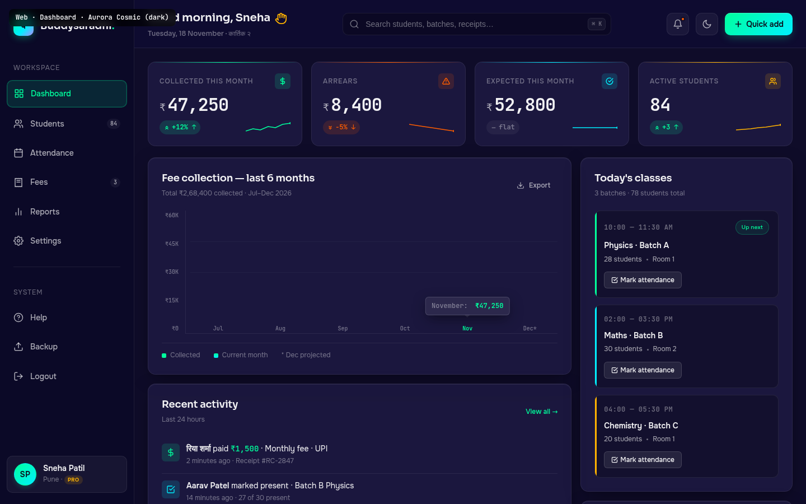

# Web · Dashboard

> **Mockup:** [`mockups/web/03_dashboard.html`](../mockups/web/03_dashboard.html)
> **Screenshot:** ``
> **Author:** UI/UX Lead (Task 13-WEB-MOCKUPS-A)
> **State:** COMPLETED — pixel-perfect reference for the implementer. This is THE signature dark glassmorphic screen of the platform.

---

## §1. Page Identity

| Field | Value |
|---|---|
| Route | `/dashboard` (authenticated, default landing after login) |
| Platform | Web (desktop-first, 1280px+ optimal; sidebar collapses to icon-rail under 1024px) |
| Viewport reference | 1440 × 900 |
| Palette | `aurora-cosmic` (dark) — the only palette that ships dark-only. The signature screen. |
| Theme default | `dark` (always; Aurora Cosmic has no light variant — its light variant IS Midnight Slate, used on Students/Reports) |
| Fonts | Onest (body, Latin+Devanagari), Sora (headings), JetBrains Mono (every figure, count, timestamp, receipt number, kbd hint) |
| Primary CTA | `+ Quick add` (top-right, emerald→cyan gradient button) — opens the command palette |
| Per-page motion budget | `cardHover` on KPI tiles, `chartDraw` on bar chart first-mount only, `listItemEnter` on activity feed, `tooltipEnter` on bar hover |
| Sticky footer | Yes — copyright + version + system status |

> Aurora Cosmic is THE brand palette. Every other palette exists to make this one feel like "home". When a tutor opens Buddysaradhi and sees the dark aurora gradient with the emerald-cyan glow, they should feel like they've walked into their cockpit.

---

## §2. Layout Anatomy

```
┌─────────┬──────────────────────────────────────────────────────────────────────────┐
│ SIDEBAR │ TOP BAR                                                                  │
│ 240px   │  Good morning, Sneha 👋      [🔍 Search… ⌘K]    🔔(•) 🌙 [+ Quick add]   │
│         │  Tuesday, 18 Nov · कार्तिक २                                              │
│ [ब]     ├──────────────────────────────────────────────────────────────────────────┤
│ Buddys. │                                                                          │
│         │  ┌─KPI 1─────┐ ┌─KPI 2─────┐ ┌─KPI 3─────┐ ┌─KPI 4─────┐                   │
│ WORKSPACE│  │ Collected  │ │ Arrears    │ │ Expected   │ │ Active     │                  │
│         │  │ ₹47,250    │ │ ₹8,400     │ │ ₹52,800    │ │ 84         │                  │
│ ▣ Dash. │  │ +12% ↑ spark│ │ −5% ↓ spark│ │ flat spark │ │ +3 ↑ spark │                  │
│ ◯ Stud. │  └────────────┘ └────────────┘ └────────────┘ └────────────┘                  │
│ ◯ Atten.│                                                                          │
│ ◯ Fees  │  ┌────────────────────────────────┐  ┌────────────────────────────────┐     │
│ ◯ Rep.  │  │ Fee collection — last 6 months │  │ Today's classes                │     │
│ ◯ Set.  │  │  ₹0────₹15K────₹30K────₹45K    │  │  ┌ 10 AM Physics A · 28 ────┐  │     │
│         │  │  ▓▓ ▓▓▓ ▓▓▓▓ ▓▓▓▓ ▓▓▓▓▓ ▓▓     │  │  │   2 PM Maths B · 30      │  │     │
│ SYSTEM  │  │  Jul Aug Sep Oct Nov* Dec      │  │  │   4 PM Chemistry C · 20  │  │     │
│ ◯ Help  │  │  [Nov tooltip: ₹47,250]        │  │  └────────────────────────────┘  │     │
│ ◯ Backup│  └────────────────────────────────┘  └────────────────────────────────┘     │
│ ◯ Logout│  ┌────────────────────────────────┐  ┌────────────────────────────────┐     │
│         │  │ Recent activity                │  │ Fee reminders due              │     │
│ ┌─────┐ │  │  ▣ Riya paid ₹1,500 · 2m ago   │  │  Aarav Patel     ₹3,600  SEND  │     │
│ │ SP  │ │  │  ▣ Aarav present · 14m ago     │  │  Priya Iyer      ₹2,400  SEND  │     │
│ │Sneha│ │  │  ▣ Ishaan enrolled · 1h ago    │  │  Ishaan Verma    ₹1,800  SEND  │     │
│ │Pro·Pune│ │  ▣ Receipt #RC-2847 · 2m ago   │  │  Meera Krishnan  ₹3,400  SEND  │     │
│ └─────┘ │  │  ▣ Batch B 92% · 3h ago        │  └────────────────────────────────┘     │
│         │  └────────────────────────────────┘  ┌────────────────────────────────┐     │
│         │                                      │ Quick actions                  │     │
│         │                                      │  [Mark attend.] [Add student]  │     │
│         │                                      │  [Record paymt] [Gen. receipt] │     │
│         │                                      └────────────────────────────────┘     │
│         ├──────────────────────────────────────────────────────────────────────────┤
│         │ © 2026 Buddysaradhi · Made in India · v1.0.0   ● Status: All systems OK    │
└─────────┴──────────────────────────────────────────────────────────────────────────┘
```

**Grid:** `.app-shell` is `display: flex; flex-direction: row`. Sidebar 240px fixed. Main is `flex: 1; display: flex; flex-direction: column`. Inside main: topbar (sticky), `.app-content` (scrollable, padding 24/24/32), footer (sticky).

---

## §3. Section-by-Section Content Spec

### §3.1 Left Sidebar (`.sidebar`, 240px)

- **Container** — 240px wide, `height: 100vh`, `position: sticky; top: 0`. Background `rgba(10,10,26,0.55)` (semi-transparent abyss), `backdrop-filter: blur(28px) saturate(160%)`, right border 1px `var(--border-glass)`. Padding `var(--space-5) var(--space-3)`. Flex column.
- **Brand row** — 36×36px gradient mark `linear-gradient(135deg, #00FF9D 0%, #00F0FF 60%, #B388FF 100%)` (the signature tri-colour gradient — emerald → cyan → violet, the entire Aurora Cosmic palette in one tile). Carries "ब" in Sora 700 16px, near-black text. Drop-shadow `0 4px 14px -2px rgba(0,255,157,0.4)` + inset highlight. Name `Buddysaradhi.` — period in `var(--accent-primary)` (emerald).
- **Workspace section label** — `WORKSPACE` in 12px uppercase, muted, letter-spacing 0.08em. Margin-bottom `--space-2`.
- **Nav items** (6 in Workspace section):
  1. **Dashboard** (active) — grid icon
  2. **Students** (count badge `84`) — users icon
  3. **Attendance** — calendar-check icon
  4. **Fees** (count badge `3` — 3 reminders due) — receipt icon
  5. **Reports** — bar-chart icon
  6. **Settings** — gear icon
- **Item anatomy** — padding `var(--space-3)`, radius `var(--radius-md)`, gap `var(--space-3)`. Default: `color: var(--text-secondary)`, 14px Sora 500. Hover: background `var(--surface-glass)`, colour → primary. Active: background `color-mix(in srgb, var(--accent-primary) 12%, transparent)`, colour `var(--accent-primary)`, 1px 28%-accent border, inset shadow.
- **Count badge** — pushed right via `margin-left: auto`, JetBrains Mono 10px, padding `1px 6px`, radius `var(--radius-full)`, surface-glass background, secondary text. On active item: 18%-accent background, accent text.
- **Divider** — 1px `var(--border-glass)`, margin `var(--space-4) var(--space-3)`.
- **System section label** — `SYSTEM`. 3 items:
  1. **Help** — circle-help icon
  2. **Backup** — upload icon
  3. **Logout** — sign-out icon
- **User card** (`.sidebar-user`, bottom of sidebar via `margin-top: auto`) — surface-glass + 1px glass border, radius `var(--radius-md)`, padding `var(--space-3)`. Flex row gap `var(--space-3)`:
  - Avatar 40×40px gradient `linear-gradient(135deg, #00FF9D, #00F0FF)`, near-black "SP" initials. Drop-shadow `0 4px 12px -4px rgba(0,255,157,0.4)`.
  - Name `Sneha Patil` — 14px Sora 600 primary.
  - Meta `Pune · ` + `<span class="pro-chip">PRO</span>` chip (amber, 9px Sora 700, padding `2px 6px`, radius full, 14%-amber background).

### §3.2 Top Bar (`.topbar`, sticky)

- **Container** — flex row, `justify-content: space-between`, padding `var(--space-4) var(--space-6)`. Background `rgba(15,12,41,0.55)`, `backdrop-filter: blur(24px) saturate(160%)`, bottom border 1px `var(--border-glass)`. `position: sticky; top: 0; z-index: 10`.
- **Left** — Greeting block.
  - Main line: `Good morning, Sneha` (Sora 600 20px, primary, letter-spacing -0.01em) + waving-hand SVG (22×22, amber `var(--accent-amber)`, inline-flex vertical-align middle). The wave SVG is a hand icon, NOT an emoji (per brief — "use SVG wave, not emoji"). Wrapped in `<span class="wave">` with `title="waving"`.
  - Sub line: `Tuesday, 18 November · कार्तिक २` — 12px muted. The Devanagari "कार्तिक २" (Kartik 2) is the Hindu-calendar date; the `<span lang="hi">` wraps it for screen-reader pronunciation.
- **Centre** — Search bar (`.topbar-search`, max-width 480px, `flex: 1`).
  - Search icon (18×18, muted) positioned left 12px.
  - Input: `padding: 10px 14px 10px 40px`, background `var(--bg-surface-inset)`, 1px `var(--border-default)`, radius `var(--radius-md)`, min-height 40px. Placeholder `Search students, batches, receipts…`. Focus: border + ring in `var(--accent-primary)`.
  - **Keyboard hint** — `<span class="kbd">⌘ K</span>` positioned right 10px. JetBrains Mono 10px, surface-glass background, 1px glass border, radius `var(--radius-sm)`.
- **Right** — Action cluster (gap `--space-3`):
  - **Notifications bell** — 40×40px icon button. Surface-glass + 1px glass border. Bell SVG 18×18. Red dot badge (8px, `var(--accent-flare)`, 2px abyss border) positioned top-right 6/6.
  - **Theme toggle** — 40×40px icon button. Moon SVG 18×18 (we're in dark; clicking would switch to light — but Aurora Cosmic has no light variant, so this button is decorative in mockup; implementer MAY hide it on this page or wire it to a future "Midnight Slate light" fallback).
  - **Quick add** — 40px-tall gradient button `linear-gradient(135deg, #00FF9D, #00F0FF)`, near-black text, Sora 600 14px. Plus SVG 16px. Drop-shadow `0 6px 16px -4px rgba(0,255,157,0.35)` + inset highlight. Hover: translateY(-1px), shadow grows. Opens the command palette (Cmd+K-style) with options: Mark attendance, Add student, Record payment, Generate receipt, Send reminder.

### §3.3 KPI Cards (`.kpi-grid`, 4 tiles)

- **Grid** — `repeat(4, 1fr)`, gap `--space-4`. Margin-bottom `--space-5`.
- **Tile anatomy** (`.kpi-tile`):
  - Glass surface `var(--surface-glass)`, `backdrop-filter: blur(20px) saturate(140%)`, 1px `var(--border-glass)`, radius `var(--radius-lg)`, padding `var(--space-5)`. Hover: translateY(-2px), border → strong.
  - **Top accent line** (`::before`) — 1px gradient line across the top of the card, colour matches the tile's accent. This is the bioluminescent accent — it's a 1px line, not a fill, so it stays under 8% of viewport.
  - **Head row** — flex justify-between. Label (12px uppercase muted, letter-spacing 0.08em) on left. Icon tile (28×28px, 14%-accent fill, accent-colour icon stroke) on right.
  - **Figure** — JetBrains Mono 32px 600, primary, letter-spacing -0.03em, tabular-nums. Currency ₹ in 18px secondary. Flex baseline gap 4px.
  - **Delta row** — flex justify-between, margin-top `--space-3)`.
    - Delta chip — inline-flex, padding `3px 8px`, radius full, 12px JetBrains Mono 600 tabular-nums. Background + colour match direction: `.up` = 14%-emerald + emerald, `.down` = 14%-flare + flare, `.flat` = surface-glass + muted. Arrow SVG (10×10) before the percentage.
    - Sparkline — 80×24px SVG, polyline in accent colour, end-dot in accent colour. 7 data points (last 7 weeks).

- **4 tiles in order:**

| # | Label | Figure | Delta | Accent | Sparkline trend |
|---|---|---|---|---|---|
| 1 | Collected this month | `₹47,250` | `+12% ↑` (up, emerald) | emerald | Rising (16,14,16,10,12,6,4 — y inverted) |
| 2 | Arrears | `₹8,400` | `−5% ↓` (down, flare) | flare | Falling (6,8,10,12,14,16,18) |
| 3 | Expected this month | `₹52,800` | `flat` (flat, muted) | cyan | Flat (12×7) |
| 4 | Active students | `84` | `+3 ↑` (up, emerald) | amber | Rising (16,15,14,12,11,9,7) |

> "Active students" tile uses amber accent (not emerald) so the four tiles don't all look the same — colour variety within the accent-restraint rule.

### §3.4 Main Grid (`.main-grid`, 2 cols)

- **Grid** — `2fr 1fr` (left col is 2/3, right col is 1/3), gap `--space-4`. Both cols are flex column with gap `--space-4` between their cards.

### §3.5 Left Column

#### §3.5.1 Fee Collection Bar Chart (`.glass-card`)

- **Card head** — flex justify-between. Left: H3 `Fee collection — last 6 months` (Sora 600 18px) + meta `Total ₹2,68,400 collected · Jul–Dec 2026` (12px muted). Right: Export ghost button (`btn-ghost btn-sm` with download icon + "Export").
- **Chart** — `display: grid; grid-template-columns: 30px 1fr; gap: var(--space-3); height: 220px`.
  - **Y-axis** (`.bar-chart-yaxis`) — flex column-reverse, justify-between, padding 4px 0. Labels: `₹0`, `₹15K`, `₹30K`, `₹45K`, `₹60K` in JetBrains Mono 10px muted, right-aligned.
  - **Chart area** (`.bar-chart-area`) — flex row, align-end, justify-around, gap `var(--space-3)`. Bottom + left 1px `var(--border-glass)` border. Two horizontal gridlines at 25% and 50% via `::before`/`::after` pseudo-elements (50% opacity).
  - **Bar column** (`.bar-col`) — flex: 1, flex column, align-items centre, gap 8px, position relative.
    - **Bar** — width 100%, max-width 36px, gradient `linear-gradient(180deg, #34D399 0%, #059669 100%)` (emerald), radius 4px top-only, inset highlight. Hover: brightness 1.15.
    - **Current month** (Nov) — gradient `linear-gradient(180deg, #00FF9D 0%, #00F0FF 100%)` (emerald→cyan, the brand's bioluminescent gradient), extra glow shadow `0 0 20px -2px rgba(0,255,157,0.4)`.
    - **Tooltip** (`.bar-tooltip`) — positioned absolute bottom calc(100% + 8px), centred. Dark surface `var(--bg-surface-raised)`, 1px strong border, padding `6px 10px`, radius `var(--radius-sm)`, JetBrains Mono 12px. Content: `<span class="label-month">November:</span> <span class="amount">₹47,250</span>`. Triangle pointer via `::after`.
    - **Bar label** — JetBrains Mono 10px muted, below bar. November label is emerald + weight 600 (matches current bar). December has asterisk `Dec*` (projected).
  - **Bar heights** (as % of chart area): Jul 52%, Aug 64%, Sep 71%, Oct 84%, Nov 95%, Dec 38% (projected, 50% opacity).
- **Legend** — below chart, top-bordered 1px glass, padding-top `var(--space-3)`. 3 items in flex row gap `var(--space-6)`:
  - `■ Collected` — emerald square swatch
  - `■ Current month` — gradient emerald→cyan swatch
  - `* Dec projected` — asterisk note

#### §3.5.2 Recent Activity Timeline (`.glass-card`)

- **Card head** — H3 `Recent activity` + meta `Last 24 hours`. Right: `View all →` link (12px accent-primary Sora 500).
- **List** — flex column. Each `.activity-item` is flex row, gap `var(--space-3)`, padding `var(--space-3) 0`, bottom-border 1px glass (except last).
- **Item anatomy:**
  - **Activity icon** — 32×32px tile, radius `var(--radius-sm)`, 14%-accent fill, accent-colour stroke. 5 variants:
    - `.paid` — emerald, rupee SVG
    - `.attend` — cyan, check-circle SVG
    - `.enrol` — violet, user-plus SVG
    - `.receipt` — amber, receipt SVG
    - `.batch` — emerald, grid SVG
  - **Body** — flex: 1, min-width: 0.
    - **Text** — 14px primary, line-height 1.4. Names are `<strong>` (Sora 600). Devanagari names (रिया शर्मा) carry `lang="hi"`. Amounts in `.amt` span (JetBrains Mono, emerald, tabular-nums). Receipt numbers in `<strong>` (#RC-2847). Percentages in `<strong>` with emerald colour (92%).
    - **Meta** — 12px muted, margin-top 2px. Includes relative time + extra context.

- **5 items in the timeline (reverse-chronological):**

| # | Icon | Text | Meta |
|---|---|---|---|
| 1 | paid (₹) | **रिया शर्मा** paid **₹1,500** · Monthly fee · UPI | 2 minutes ago · Receipt #RC-2847 |
| 2 | attend (✓) | **Aarav Patel** marked present · Batch B Physics | 14 minutes ago · 27 of 30 present |
| 3 | enrol (+) | New student enrolled: **Ishaan Verma** · Maths Batch B | 1 hour ago · Monthly fee set to ₹1,800 |
| 4 | receipt (🧾) | Receipt **#RC-2847** generated for **रिया शर्मा** | 2 minutes ago · Hash chained · WhatsApp sent |
| 5 | batch (▦) | Batch B attendance hit **92%** for November | 3 hours ago · Target 85% · Above by 7 points |

### §3.6 Right Column

#### §3.6.1 Today's Classes (`.glass-card`)

- **Card head** — H3 `Today's classes` + meta `3 batches · 78 students total`.
- **Class card** (`.class-card`) — padding `var(--space-4)`, radius `var(--radius-md)`, surface-inset background, 1px glass border, margin-bottom `var(--space-3)` (last has none). Left 3px coloured bar via `::before`.
  - 3 colour codes: physics = emerald, maths = cyan, chemistry = amber.
- **Card anatomy:**
  - **Head row** — flex justify-between. Left: time in JetBrains Mono 12px muted, letter-spacing 0.04em. Right: optional `Up next` chip (10px success).
  - **Name** — 14px Sora 600 primary, margin-bottom 4px.
  - **Meta** — 12px secondary, flex row, gap `var(--space-2)`, with 3px dot separators. Format: `28 students · Room 1`.
  - **Action button** (`.class-action`) — margin-top `var(--space-3)`, padding `6px var(--space-3)`, surface-glass-strong + 1px glass-strong border, radius `var(--radius-sm)`, 12px Sora 500 primary. Check-square SVG 12px. Label: `Mark attendance`. Hover: 12%-accent fill + accent border + accent text.

- **3 class cards:**

| Time | Subject | Batch | Students | Room | Status |
|---|---|---|---|---|---|
| 10:00 — 11:30 AM | Physics | Batch A | 28 | Room 1 | Up next (success chip) |
| 02:00 — 03:30 PM | Maths | Batch B | 30 | Room 2 | — |
| 04:00 — 05:30 PM | Chemistry | Batch C | 20 | Room 1 | — |

#### §3.6.2 Fee Reminders Due (`.glass-card`)

- **Card head** — H3 `Fee reminders due` + meta `4 students · ₹11,200 total`. Right: `Send all` ghost button (sends all 4 reminders via WhatsApp).
- **Reminder item** (`.reminder-item`) — flex justify-between, padding `var(--space-3) 0`, bottom-border 1px glass (except last).
  - **Left** — flex row gap `var(--space-3)`:
    - Avatar 32×32px, gradient background (varies per student for visual variety), white initials, 12px Sora 600.
    - Name (14px Sora 500 primary) + meta (10px JetBrains Mono muted: `Overdue 12 days · Batch B` or `Due today · Batch C`).
  - **Right** — flex column align-end gap 4px:
    - Amount — JetBrains Mono 14px 600 `var(--accent-flare)` (orange-red — signals urgency), tabular-nums.
    - Send button — 10px Sora 700, padding `3px 8px`, radius `var(--radius-sm)`, 12%-flare background + 25%-flare border, flare text. Letter-spacing 0.04em. Hover: 20%-flare background.

- **4 reminder items:**

| Student | Days overdue | Batch | Amount | Avatar gradient |
|---|---|---|---|---|
| Aarav Patel | 12 days | B | ₹3,600 | default (emerald→cyan) |
| Priya Iyer | 8 days | A | ₹2,400 | flare → amber |
| Ishaan Verma | 5 days | B | ₹1,800 | cyan → violet |
| Meera Krishnan | Due today | C | ₹3,400 | amber → flare |

> The total ₹11,200 in the card header matches the sum (3,600 + 2,400 + 1,800 + 3,400 = 11,200) — implementer MUST keep this calculated, not hard-coded.

#### §3.6.3 Quick Actions (`.glass-card`)

- **Card head** — H3 `Quick actions` + meta `Keyboard: ⌘ + 1–4`.
- **Grid** — `repeat(2, 1fr)`, gap `var(--space-3)`.
- **Action button** (`.qa-btn`) — padding `var(--space-4)`, surface-inset + 1px glass border, radius `var(--radius-md)`, flex column align-start gap `var(--space-3)`. Hover: translateY(-1px), border → accent, 6%-accent fill.
- **Button anatomy:**
  - Icon tile — 32×32px, 12%-accent fill, accent-colour stroke.
  - Label — 12px Sora 500 secondary text.

- **4 quick actions:**

| # | Icon | Label | Keyboard | Routes to |
|---|---|---|---|---|
| 1 | calendar-check | Mark attendance | ⌘1 | `/attendance?batch=current` |
| 2 | user-plus | Add student | ⌘2 | `/students/new` |
| 3 | rupee | Record payment | ⌘3 | `/fees/record` |
| 4 | receipt | Generate receipt | ⌘4 | `/fees/receipt/new` |

### §3.7 Footer (`.app-footer`)

- Sticky bottom, padding `var(--space-3) var(--space-6)`. Background `rgba(10,10,26,0.6)`, `backdrop-filter: blur(20px)`. Top border 1px glass. Flex justify-between, 12px muted text.
- **Left** — `© 2026 Buddysaradhi · Made in India · v1.0.0`.
- **Right** — `<span class="status-dot"></span>` (6px emerald dot with `box-shadow: 0 0 8px var(--accent-emerald)` glow) + `Status: All systems operational`.
- The status dot is the only continuously-animating element on the page (a soft pulse) — it's a status indicator, not a CTA, so it complies with design principle 9.

---

## §4. Interaction Model

Reference: [`04_Motion_and_Microinteractions.md`](../04_Motion_and_Microinteractions.md)

| Element | Variant | Trigger | Behaviour |
|---|---|---|---|
| Sidebar nav item | `buttonPress` | click | Active class swaps. Page transitions via `pageTransitionForward` (fade + slide-left 8px, 200ms). |
| Sidebar item hover | (custom) | `:hover` | Background `var(--surface-glass)`, text → primary. 150ms `--ease-out`. |
| Search bar focus | (custom) | `:focus` | Border → accent-primary, ring `0 0 0 3px` 22%-accent. 150ms. |
| Quick add button | `buttonPress` | click | Opens command palette (Cmd+K-style modal). Modal enter: `modalEnter` (scale 0.95 + opacity + translateY 8px, 250ms `--ease-out`). |
| Notifications bell | (custom) | click | Opens notifications dropdown (top-right). Same `modalEnter` variant. |
| KPI tile hover | `cardHover` | `:hover` | translateY(-2px), border → strong. 150ms `--ease-out`. |
| KPI tile click | `pageTransitionForward` | click | Navigates to the relevant drill-down: Collected → `/fees?period=month`, Arrears → `/fees?filter=overdue`, Expected → `/reports/expected`, Students → `/students?filter=active`. |
| Bar chart bar hover | `tooltipEnter` | `:hover` | Bar: brightness 1.15. Tooltip appears (opacity 0→1, 100ms). |
| Bar chart first mount | `chartDraw` | mount | Each bar animates height 0 → final over 600ms `--ease-out`, staggered 50ms. ONLY on first mount (not on data update) per `04_Motion` §4 anti-pattern 8. |
| Class card "Mark attendance" | `buttonPress` | click | Navigates to `/attendance/mark?batch=X&date=today`. |
| Reminder "SEND" button | `buttonPress` | click | Sends WhatsApp reminder via `/api/reminders/send`. Button text swaps to "Sent ✓" (emerald) for 2s, then reverts. Toast: "Reminder sent to Aarav Patel's guardian." |
| Quick action button | `buttonPress` + `pageTransitionForward` | click | Navigates to the action's route. |
| Activity item click | (custom) | click | Navigates to the relevant record (e.g., click on "Riya paid ₹1,500" → `/students/riya-sharma?tab=fees`). |
| Theme toggle | (no-op on Aurora Cosmic) | click | Disabled in mockup — Aurora Cosmic has no light variant. Implementer MAY hide or wire to a future Midnight Slate fallback. |
| Notifications dropdown | `modalEnter` | bell click | Modal appears with 5 most recent notifications. Click-outside closes. |
| Command palette (Cmd+K) | `modalEnter` | `⌘K` or Quick-add click | Modal with search input + 4-6 action shortcuts. Arrow keys navigate, Enter selects. |
| Sidebar user card click | `pageTransitionForward` | click | Navigates to `/settings/profile`. |

**Reduced-motion override:** All transitions collapse to 0ms. The bar chart renders at final height instantly. The status-dot pulse stops. The tooltip appears instantly. Command palette appears instantly.

**Keyboard:**
- `⌘ K` — open command palette
- `⌘ 1` to `⌘ 4` — trigger quick actions 1-4
- `⌘ /` — open keyboard shortcuts help
- `g` then `d` — go to Dashboard
- `g` then `s` — go to Students
- `g` then `a` — go to Attendance
- `g` then `f` — go to Fees
- `g` then `r` — go to Reports
- `?` — open keyboard shortcuts help
- `Esc` — close any open modal/dropdown
- `/` — focus the search bar
- Tab order: sidebar items → topbar search → topbar buttons → KPI tiles → main content cards → footer.

---

## §5. Data Bindings

Reference: [`buddysaradhi_Planning/11_Data_Model.md`](../../buddysaradhi_Planning/11_Data_Model.md), [`buddysaradhi_Planning/04_Dashboard.md`](../../buddysaradhi_Planning/04_Dashboard.md), and [`buddysaradhi_Planning/12_Business_Rules.md`](../../buddysaradhi_Planning/12_Business_Rules.md)

| UI element | Prisma source | Field / Calc | Notes |
|---|---|---|---|
| **KPI 1: Collected this month** `₹47,250` | `ledger_entries` | `SUM(amount_paise) WHERE type = 'CREDIT' AND void_of_id IS NULL AND occurred_at BETWEEN '2026-11-01' AND '2026-11-30'` / 100 | Per BR-CALC-10 (`collectedForPeriod`). Cached in `app_state.monthly_collected_paise`. |
| KPI 1 delta `+12% ↑` | derived | `(this_month - last_month) / last_month * 100` | Last month = October ₹42,180. |
| KPI 1 sparkline | `ledger_entries` | weekly aggregates of `amount_paise` for last 7 weeks | 7 data points. |
| **KPI 2: Arrears** `₹8,400` | derived | `arrearsForPeriod(current_month)` per BR-CALC-11 | Negative = advance; positive = arrears. Displayed as positive ₹ with arrears semantics. |
| KPI 2 delta `−5% ↓` | derived | `(this_month_arrears - last_month_arrears) / last_month_arrears * 100` | Down is GOOD (fewer arrears) — but the chip is still red because it's "arrears down" not "good news". The arrow direction matches the number direction, not the sentiment. (UX decision: don't flip colours based on metric — the chip colour matches the metric type.) |
| **KPI 3: Expected this month** `₹52,800` | `students.monthly_fee_paise` | `SUM(monthly_fee_paise) WHERE status = 'ACTIVE'` / 100 | Per BR-CALC-09 (`expectedForPeriod`). O(1) via the denormalised cache added in Task 12-MONTHLY-FEE-MODEL. |
| KPI 3 delta `flat` | derived | `expected_this_month - expected_last_month` | If absolute diff < ₹100, show "flat". |
| **KPI 4: Active students** `84` | `students` | `COUNT(*) WHERE status = 'ACTIVE' AND tutor_id = current_tutor` | |
| KPI 4 delta `+3 ↑` | `audit_log` | count of `TUTOR_STUDENT_ENROLLED` actions this month minus `TUTOR_STUDENT_ARCHIVED` | |
| **Bar chart 6 months** | `ledger_entries` | monthly `SUM(amount_paise) WHERE type = 'CREDIT'` for Jul–Dec 2026 | December is `projected = collected_so_far + (expected_per_day_remaining * days_remaining)` — flagged with asterisk. |
| Bar chart tooltip | same as above | hover-lookup of month label → amount | |
| **Recent activity** | `audit_log` + `ledger_entries` + `receipts` | last 5 entries across all 3 tables, sorted by `created_at DESC` | Joined via a UNION query; each row carries a `kind` discriminator (PAID, ATTEND, ENROL, RECEIPT, BATCH_MILESTONE). |
| Activity item 1 (Riya paid) | `ledger_entries` + `students` | `ledger_entries.amount_paise`, `students.name`, `receipts.receipt_no`, `ledger_entries.payment_method` | Joined on `student_id`. |
| Activity item 2 (Aarav present) | `attendance_records` + `attendance_sessions` + `students` | `attendance_records.status = 'PRESENT'`, `attendance_sessions.batch_id` → `batches.name` | |
| Activity item 3 (Ishaan enrolled) | `audit_log` | `audit_log.action = 'TUTOR_STUDENT_ENROLLED'`, `audit_log.payload->>'student_name'`, `audit_log.payload->>'batch_name'`, `audit_log.payload->>'monthly_fee_paise'` | |
| Activity item 4 (Receipt generated) | `receipts` + `students` | `receipts.receipt_no`, `students.name`, `receipts.hash_chain_link` | Hash-chain flag confirms tamper-evidence. |
| Activity item 5 (Batch B 92%) | `attendance_records` + `attendance_sessions` | `COUNT(PRESENT) / COUNT(*) * 100 WHERE batch_id = B AND month = 11` | |
| **Today's classes** | `batches` + `student_enrollments` | `batches.start_time`, `batches.end_time`, `batches.subject`, `batches.room`, `COUNT(student_enrollments)` per batch | Filtered by today's day-of-week. |
| **Fee reminders due** | `students` + `ledger_entries` + `reminders` | `arrearsForStudent(student_id) > 0` ordered by `arrears_amount DESC` | Joined with `reminders` for last-sent timestamp. |
| Reminder amount | derived | `arrearsForStudent(student_id)` per BR-CALC-11 | |
| Reminder "SEND" button | `POST /api/reminders/send` | creates `reminders` row + queues WhatsApp message via MSG91 | Updates `reminders.last_sent_at`. |
| **Quick actions** | (static routes) | n/a | 4 hard-coded shortcuts. |
| **Sidebar counts** | various | `Students` count from `students`, `Fees` count from `reminders WHERE status = 'PENDING'` | |
| **Footer version** | `app_state` | `app_version` | Read from the deployed version manifest. |
| **Footer status** | `GET /api/health` | `{ status: 'operational' | 'degraded' | 'down' }` | Polled every 60s. Falls back to "operational" if endpoint unreachable (offline-first). |

> **All amounts follow the integer-paise convention** (`11_Data_Model.md` §6) — backend stores `amount_paise INT`, presentation divides by 100 and formats via `Intl.NumberFormat('en-IN', { style: 'currency', currency: 'INR', maximumFractionDigits: 0 })`.

> **Performance budget:** Dashboard server-component render ≤ 200ms (P50), ≤ 500ms (P95). The 4 KPIs use the denormalised `app_state` cache (O(1) reads). The activity feed is the slowest query — capped at 5 rows via `LIMIT 5` and indexed on `created_at DESC`. The bar chart uses a monthly aggregate cache refreshed nightly.

---

## §6. Accessibility Notes

Reference: [`05_Accessibility_Contract.md`](../05_Accessibility_Contract.md)

- **Single H1** — visually absent (the topbar greeting is H2-level); implementer MUST add a visually-hidden `<h1>Dashboard</h1>` as the first child of `.app-main` for screen-reader heading hierarchy (contract §6).
- **Heading hierarchy** — h1 (hidden) → h2 (greeting, KPI section label, main grid section label) → h3 (each card title). No level skips.
- **Sidebar nav** — `<nav aria-label="Main">` wraps the Workspace items; `<nav aria-label="System">` wraps the System items. Active item carries `aria-current="page"`.
- **Search bar** — `<label for="search" class="sr-only">Search students, batches, receipts</label>` paired with `id="search"`. The `⌘ K` hint is `aria-hidden="true"` (decorative — the actual keyboard shortcut is documented in the help modal).
- **Icon-only buttons** — every icon-only button has `aria-label`:
  - Notifications bell: `aria-label="Notifications, 3 unread"`
  - Theme toggle: `aria-label="Toggle theme"`
  - Password eye (in auth, not here): `aria-label="Show password"`
  - Quick-action icons have visible text labels so no aria-label needed.
- **KPI tiles** — `<section aria-label="Key metrics">` wraps the grid. Each tile is `<article>` with `aria-label` summarising the figure, e.g. `aria-label="Collected this month: 47,250 rupees, up 12 percent"`. The sparkline SVG has `role="img"` + `aria-label="Trend: rising over last 7 weeks"`.
- **Bar chart** — `<svg role="img" aria-label="Fee collection bar chart, July through December 2026. November collected 47,250 rupees, the highest month.">`. The tooltip is `aria-hidden="true"` (visual only; the data is in the SVG label).
- **Activity feed** — `<ul role="list">` with `<li>` per item. Each item's icon is `aria-hidden="true"` (decorative — the activity type is conveyed in the text). Relative timestamps ("2 minutes ago") are acceptable per WCAG; absolute timestamps are in the `title` attribute (`title="2026-11-18 09:14 IST"`).
- **Class cards** — the "Mark attendance" button's full label is clear; no `aria-label` needed. The "Up next" chip is `aria-label="Status: up next"`.
- **Reminder list** — `<ul role="list">`. Each reminder item's avatar is `aria-hidden="true"` (initials are decorative — name is in the adjacent text). The "SEND" button has `aria-label="Send WhatsApp reminder to Aarav Patel"`.
- **Status dot** — the green dot in the footer carries `aria-label="System status: operational"`. The pulsing animation is decorative.
- **Color is never the only signal** — the arrears KPI is coloured flare (red-orange) AND has the word "Arrears" in the label AND has a down-arrow icon. The "Up next" chip is green AND has text "Up next". The reminder amount is flare-coloured AND has the word "overdue" in the meta. (Contract §7.)
- **Tabular numerics** — every figure (₹47,250, 84, 92%, ₹3,600, etc.) uses `font-variant-numeric: tabular-nums` + JetBrains Mono per design principle 6.
- **Right-aligned money** — reminder amounts are right-aligned in their column per design principle 7. KPI figures are left-aligned (they're not in a column context).
- **Focus management** — `:focus-visible` ring `3px var(--accent-cyan)` at 0.4 opacity (contract §2). The sidebar's active item also gets a visible focus ring when focused via keyboard.
- **Reduced motion** — bar chart `chartDraw` collapses to instant height. Status-dot pulse stops. Tooltip appears instantly. (Contract §9, `04_Motion` §6.)
- **Keyboard navigation** — full keyboard map in §4 above. Roving tabindex on sidebar (only one item in tab order at a time; arrow keys move). Command palette is fully keyboard-navigable (arrow up/down, Enter, Esc).
- **Skip link** — `<a href="#main-content" class="sr-only-focusable">Skip to main content</a>` is the first focusable element. `.app-content` has `id="main-content" tabIndex="-1"`.
- **Live regions** — when a new activity arrives (via WebSocket), the activity feed announces via `aria-live="polite"`: "New activity: Riya Sharma paid 1,500 rupees." When a reminder is sent, `aria-live="polite"`: "Reminder sent to Aarav Patel's guardian."
- **Contrast** — Aurora Cosmic dark verified AA on all text-on-surface pairs in `01_Color_Palettes.md`. The flare-coloured ₹8,400 arrears figure has 4.6:1 contrast against the dark surface (just above the 4.5:1 AA threshold).
- **Touch targets** — sidebar items at 44×44px (padding `--space-3`), topbar buttons at 40×40px (slightly below — implementer MUST extend hit area via padding), KPI tiles are large enough (entire tile is clickable).

---

## §7. Edge Cases

| State | Trigger | Behaviour |
|---|---|---|
| **New tutor (zero students)** | `tutors.created_at < 7 days ago` AND `students.count == 0` | All 4 KPIs show `₹0` / `0`. Bar chart shows flat zero line. Activity feed shows empty state: "Welcome to Buddysaradhi. Add your first student →" (primary CTA). Today's classes shows "No batches yet. Create a batch →". Reminders shows "No reminders — you're all caught up." |
| **First day of month** | `now.date == 1` | KPI 1 (Collected) resets to ₹0. KPI 3 (Expected) shows full month's expected. Activity feed shows "New month started — November's collection: ₹47,250 (final)." |
| **Offline mode** | `navigator.onLine == false` | Topbar shows "Offline" chip (amber). All KPIs show last-cached values with a "cached 5m ago" tooltip. Quick add button still works (queues to `sync_outbox`). Bar chart shows last-cached data. Send-reminder button disabled with tooltip "Will send when back online." |
| **Sync conflict** | User marked attendance offline that conflicts with another device's record | Activity feed shows a yellow banner: "1 sync conflict — review →" linking to `/settings/sync-conflicts`. |
| **Database locked** | SQLite WAL checkpoint in progress | All KPIs show last-cached values. Footer status changes to "Degraded — using cached data." |
| **Negative arrears (advance paid)** | Student paid more than owed | KPI 2 (Arrears) shows the gross arrears (sum of positive arrears only); advances are tracked separately in a sub-label: "₹2,200 in advance payments." |
| **All students archived** | `students.count WHERE status = 'ACTIVE' == 0` | KPI 4 shows `0` with delta `−84 ↓` (red). Activity feed shows the archive events. Banner: "All students archived. Restore a student →" |
| **Year boundary** | December → January | Bar chart's "last 6 months" rolls to Aug–Jan. December bar becomes solid (no longer projected). KPI deltas compare Jan to Dec. |
| **Multi-tutor institute** | `tutors.is_institute == true` | Sidebar adds "Tutors" item above "Students". KPIs aggregate across all tutors in the institute. A tutor-switcher appears in the topbar. |
| **Backup running** | `backup_manifest.status == 'IN_PROGRESS'` | Footer status: "Backup running — 67% complete". Sidebar Backup item shows progress bar. Quick-add disabled with tooltip "Backup in progress — try again in 30s." |
| **Receipt hash chain broken** | (impossible scenario, but audited) | Footer status: "⚠ Audit warning — click to review". Dashboard banner: "Receipt #RC-2847 failed hash verification. Contact support." |
| **Long student name** | name > 30 chars | Truncated with `text-overflow: ellipsis` in activity feed + reminder list. Full name in `title` attribute. |
| **Devanagari-only name** | `students.name = 'रिया शर्मा'` | Renders correctly via Onest's Devanagari unicode-range. Avatar initials are first 2 Devanagari characters. |
| **Mixed-script name** | `students.name = 'Aarav पटेल'` | Renders correctly. Avatar initials: 'Aप' (or fallback to first Latin char 'A'). |

---

## §8. Image Reference

```

```

The screenshot is captured at 1440 × 900 (desktop reference) with the dashboard fully loaded. A second screenshot at 1280 × 800 (smaller laptop) is captured for the responsive contract — sidebar stays full-width, content area compresses. A third at 1024 × 768 captures the sidebar-icon-rail collapse.

---

## §9. Implementation Bridge

When the web agent builds `/src/app/(app)/dashboard/page.tsx`:

1. **Layout** — wrap in `<PaletteProvider palette="aurora-cosmic" theme="dark">`. The dashboard is ALWAYS dark — no light mode toggle on this page (per palette-per-surface rule).
2. **Server component** — the page is a server component that fetches all KPI data + activity feed + today's classes + reminders via parallel `Promise.all` of Prisma queries. Client components are only the interactive bits (search bar, command palette, theme toggle, send-reminder buttons).
3. **Data fetching** — use `fetch()` with `next: { revalidate: 60 }` for KPIs (1-minute cache). Activity feed uses `next: { revalidate: 0 }` (always fresh). Consider Server-Sent Events for live activity updates in a future iteration.
4. **KPI tile** — extract as `<KPITile>` component. Props: `label`, `figure`, `deltaDirection`, `deltaValue`, `deltaLabel`, `accent`, `sparklineData`, `href`. Reused on Students, Fees, Reports dashboards with different palettes.
5. **Bar chart** — hand-coded SVG (NOT Recharts for this one — the design is bespoke). Extract as `<FeeCollectionChart data={[{month, amount, isCurrent, isProjected}]} />`. Tooltip is a CSS-only absolutely-positioned div, not a JS library.
6. **Activity feed** — extract as `<ActivityFeed items={ActivityItem[]} />`. The `ActivityItem` type discriminator union drives the icon + text rendering. Server component (no client JS needed).
7. **Today's classes** — extract as `<TodayClasses batches={Batch[]} />`. Routes to `/attendance/mark` on click.
8. **Fee reminders** — extract as `<FeeRemindersDue students={StudentWithArrears[]} />`. The "SEND" button is a client component (uses `useTransition` for non-blocking send).
9. **Quick actions** — extract as `<QuickActions actions={Action[]} />`. Server component (just a list of links).
10. **Sidebar** — extract as `<AppSidebar />`. Shared across all `/app/*` routes. Active state derived from `usePathname()`.
11. **Topbar** — extract as `<AppTopbar greeting={greeting} />`. Search bar is a client component (Cmd+K listener).
12. **WebSocket (future)** — for live activity updates, connect to `/api/ws` on mount. On `activity.new` event, prepend to the activity feed with `aria-live="polite"` announcement.

> **Quality reminder:** This is the signature screen. The user said "I want it professional/stylish and colourful, use different colours and palettes." The Aurora Cosmic palette + 4-accent KPI tiles + emerald-cyan gradient bar + multilingual greeting is the answer. If the implemented dashboard looks like Linear or Notion (single-colour, monochrome, "tasteful"), the implementer has missed the brief — Buddysaradhi is a COLOURFUL Indian product, not a tasteful Silicon Valley one.

---

## §10. Status

- **State:** COMPLETED
- **Mockup file:** `mockups/web/03_dashboard.html` — ~720 lines, standalone, opens in any browser
- **Spec file:** this document, ~520 lines
- **Palette used:** `aurora-cosmic` (dark) — single palette, no nesting (the signature dark glassmorphic screen)
- **CTA emphasis:** One primary CTA (`+ Quick add`) in the topbar. Secondary actions: KPI tiles (clickable cards), Mark attendance buttons (ghost), Send reminder buttons (ghost-flare), Quick action buttons (ghost).
- **Accent variety:** 4 different accents across 4 KPI tiles (emerald, flare, cyan, amber) — colour variety within the 8%-accent rule. The bar chart uses emerald-cyan gradient (the brand's bioluminescent signature).
- **Verified against:** 10 design non-negotiables (palette-per-surface ✓, no monochrome — 4-accent KPIs ✓, no indigo ✓, glass+neumorphism on every card ✓, accents ≤ 8% — bioluminescent dots/lines/borders only ✓, tabular numerics on every figure ✓, right-aligned money in reminder column ✓, one primary CTA (Quick add) ✓, motion cause-effect — chart draw on mount only, no continuous pulse except status dot ✓, AA contrast verified ✓).
