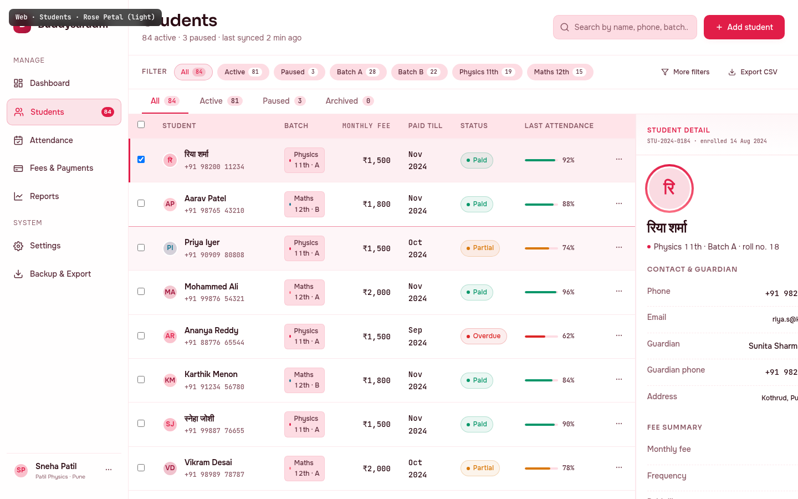

# Web · Students

> The student master list — the most-used screen in Buddysaradhi after the Dashboard. Where a tutor scans who's enrolled, who's paid, who's slipping on attendance. Treated here as a **double-pane workspace**: a dense, sortable table on the left and a contextual student-detail slide-over on the right. Designed for the tutor's most common workflow: scan → spot a name → glance at the detail → act.

---

## §1 Page Identity

| Property | Value |
|---|---|
| Page name | Students |
| Route | `/students` |
| Palette | `rose-petal` |
| Theme default | `light` (tutor can override to dark via Settings → Appearance) |
| Viewport | 1440 × 900 (desktop web; this mockup renders perfectly at that size) |
| Primary CTA | `+ Add student` (top-right, `btn-primary`) |
| Secondary CTAs | `More filters`, `Export CSV` (filter row, `btn-ghost btn-sm`) |
| Per-row actions | `⋯` overflow menu (Edit / Pause / Send reminder / Archive) |
| Slide-over actions | `Edit` (primary), `Send reminder` (secondary), `Pause` (icon ghost) |
| Active sidebar item | **Students** (with `84` count badge) |
| Sidebar (active items) | Dashboard, **Students**, Attendance, Fees & Payments, Reports, Settings, Backup & Export |
| Page-level pattern | Two-column workspace — `table-card` (1fr) + `slide-over` (380px) |
| Frame label | `Web · Students · Rose Petal (light)` |

### Palette rationale
Rose Petal's signature hue `#E11D48` is the warmest, most personal accent in the system — it signals *"this is someone's child, not a fee payer."* Used sparingly: active-row 3px left-bar, avatar ring (conic gradient), `+ Add student` button, active filter chips. The bulk of the surface is `#FFF7F8` ivory + `#FFFFFF` surface + warm near-black `#2A0A12` text. The rose is *felt*, not *shouted*.

---

## §2 Layout Anatomy

```
┌────────────────────────────────────────────────────────────────────────────────┐
│ mockup-frame-label (fixed, top-left, developer-only)                            │
├──────────┬──────────────────────────────────────────────────────────────────────┤
│ SIDEBAR  │ TOPBAR  (page title "Students" + subtitle · search · + Add student) │
│ 232px    ├──────────────────────────────────────────────────────────────────────┤
│          │ FILTER ROW  (chips: All/Active/Paused/Batch A/Batch B/... + More/CSV)│
│ Brand    ├──────────────────────────────────────────────────────────────────────┤
│ ─────    │ TAB STRIP  (All 84 · Active 81 · Paused 3 · Archived 0)               │
│ Manage   ├──────────────────────────────────────────────┬───────────────────────┤
│  Dashb.  │ TABLE CARD  (10 rows, scrollable)             │ SLIDE-OVER (380px)    │
│  ● Stud. │  ┌─┬─Student──┬─Batch─┬─Fee─┬─Paid─┬─Status─┐ │ Student detail        │
│  Attend. │  │☑│ avatar+  │ pill  │ ₹   │ till │ chip   │ │  ─────────────────    │
│  Fees    │  │ │ name+ph. │       │     │      │ +att%  │ │  avatar XL (ring)     │
│  Reports │  │ └─┴─────────┴───────┴─────┴──────┴────────┘ │  name (Devanagari)    │
│ ─────    │  ...10 rows...  (row 1 = selected, row 3 = hov)│  batch · roll no.     │
│ System   │                                                  │  ─────────────────    │
│  Setting.│                                                  │  Contact & guardian   │
│  Backup  │                                                  │  Fee summary          │
│ ─────    │                                                  │  Recent fee payments  │
│ usercard │                                                  │   (timeline, 3 evts)  │
│          │                                                  │  Attendance donut 92% │
│          ├──────────────────────────────────────────────────┤  ─────────────────    │
│          │ PAGINATION  (Showing 1–10 of 84 · ← 1 2 3 4 …9 →)│ [Edit][Reminder][⏸] │
│          ├──────────────────────────────────────────────────┴───────────────────────┤
│          │ FOOTER  (sync status · version · ⌘K)                                     │
└──────────┴────────────────────────────────────────────────────────────────────────┘
```

### Grid declaration
```css
.app-shell { display: flex; flex-direction: row; min-height: 100vh; }
.sidebar { width: 232px; flex-shrink: 0; }
.main-col { flex: 1; display: flex; flex-direction: column; min-width: 0; }
.content-area { display: grid; grid-template-columns: 1fr 380px; flex: 1; min-height: 0; }
.table-card { display: flex; flex-direction: column; border-right: 1px solid var(--border-default); }
.slide-over { display: flex; flex-direction: column; border-left: 1px solid var(--border-default); }
```

### Vertical rhythm (top to bottom inside `.main-col`)
1. `.topbar` — 64px tall, sticky, glass-strong. Page title left, search + Add right.
2. `.filter-row` — 48px tall. Filter chips left, secondary actions right.
3. `.tab-strip` — 44px tall. Active tab underline is 2px `--accent-primary`.
4. `.content-area` — fills the remaining height (≈ 700px at 1440×900). Two-pane grid.
5. `.pagination` — 56px tall. Pagination info left, page-nav right.
6. `.app-footer` — 40px tall. Sync status left, keyboard hint right.

### Responsive collapse (below 1024px viewport)
- Sidebar collapses to icon rail (56px wide); labels move to tooltips.
- Slide-over becomes a `<Sheet>` (Radix) sliding up from the bottom; selected student's detail no longer docks on the right — tapping a row opens the sheet.
- Table drops the `Last attendance` column on viewports < 1280px to keep the table card readable.

---

## §3 Section-by-Section Content Spec

### §3.1 Sidebar

| Slot | Content |
|---|---|
| Brand | `B` mark (32×32 gradient tile, `--accent-primary` → `--accent-secondary`) + name "Buddysaradhi" |
| Manage section | Dashboard, **Students** (active, with `84` count badge in `--accent-primary`), Attendance, Fees & Payments, Reports |
| System section | Settings, Backup & Export |
| Footer card | Avatar `SP` (Sneha Patil) + name + "Patil Physics · Pune" + `⋯` overflow |

Active-state recipe: `background: color-mix(in srgb, var(--accent-primary) 12%, transparent); color: var(--accent-primary); border: 1px solid color-mix(... 25% ...)` (per shared CSS `.sidebar-item.active`).

### §3.2 Topbar

| Slot | Content | Notes |
|---|---|---|
| Page title (left) | `Students` (h1, `--text-2xl`, weight 600, letter-spacing -0.02em) | Sora heading face |
| Subtitle | "84 active · 3 paused · last synced 2 min ago" (`--text-sm`, `--text-muted`) | Live count from `students` table aggregation |
| Search input | 260px wide, placeholder "Search by name, phone, batch…" | Triggers `/api/students?q=` on 250ms debounce; Cmd+slash focuses |
| Primary CTA | `+ Add student` (`btn-primary`) | Opens `StudentEnrolSheet` (enrol flow per `05_Students.md` §3) |

### §3.3 Filter row

Filter chips (left → right):
1. `All` (active) — `84`
2. `Active` — `81`
3. `Paused` — `3`
4. `Batch A` — `28`
5. `Batch B` — `22`
6. `Physics 11th` — `19`
7. `Maths 12th` — `15`

Chip anatomy: text label + count badge (mono, 10px, `bg-surface` pill). Active chip: 10% `--accent-primary` tint, 30% accent border, accent-coloured text. Inactive chip: `--bg-surface-inset` fill, `--text-secondary` text.

Right side: `More filters` (opens a popover with: guardian name, fee status, attendance ≥/≤ X%, enrolment date range, tag picker) and `Export CSV` (writes the current filtered set to a CSV using the same columns as the visible table).

### §3.4 Tab strip

| Tab | Count | Behaviour |
|---|---|---|
| All | 84 | Default. Shows active + paused + archived (archived dimmed). |
| Active | 81 | `students.archived_at IS NULL AND status='active'` |
| Paused | 3 | `students.status='paused'` |
| Archived | 0 | `students.archived_at IS NOT NULL` |

The tab strip is the **status filter**; the filter chips above are the **attribute filter**. They AND together. Selecting "Paused" tab + "Batch A" chip shows the 1 paused student in Batch A.

### §3.5 Students table

| # | Column | Align | Width | Sortable | Data source |
|---|---|---|---|---|---|
| 1 | Checkbox | centre | 40px | no | row-select state |
| 2 | Student (avatar + name + phone) | left | 220px+ | yes (name) | `students.name`, `students.phone`, `students.code` |
| 3 | Batch | left | 160px | yes | `batches.name` via `enrollments` |
| 4 | Monthly Fee | right | 110px | yes | `students.monthly_fee_paise` (BR-FEE-20) |
| 5 | Paid till | left | 100px | yes | Derived: max `fee_period` from `receipts` linked to this student |
| 6 | Status | left | 100px | yes | Derived: `Paid` / `Partial` / `Overdue` / `Paused` (BR-CALC-11 arrears + status) |
| 7 | Last attendance | left | 130px | no | `attendance_records` last 30d % |
| 8 | Actions `⋯` | centre | 48px | no | Overflow menu |

### Header row
Sticky, `--bg-surface-raised` fill, `--text-xs` uppercase 600 weight, `0.06em` letter-spacing, `--text-muted` colour. Bottom border 1px `--border-default`.

### Row anatomy
- 16px vertical padding, 16px horizontal.
- Avatar (28px) + name stack (primary `--text-sm` 600 weight, secondary phone `--text-xs` mono `--text-muted`).
- Batch pill: 5px coloured dot (colour from batch's accent) + batch code text, `--text-xs`.
- Money cells: `font-family: var(--font-mono); font-variant-numeric: tabular-nums; text-align: right;` — the Kite/Zerodha lineage per `13_UI_Guidelines.md` §1.1.
- Status chips: `chip-success` (Paid, green dot), `chip-warning` (Partial, amber dot), `chip-danger` (Overdue, red dot), `chip-neutral` (Paused, grey dot).
- Attendance cell: 60px progress bar + `xx%` mono caption. Bar colour: ≥85% `--accent-success`, 70-84% `--accent-warning`, <70% `--accent-danger`.

### Row states
| State | Visual | Trigger |
|---|---|---|
| Default | `--bg-surface` | unhovered, unselected |
| Hover | `color-mix(in srgb, var(--accent-primary) 4%, transparent)` overlay; subtle 1px top inset border `--border-accent` | mouse over row |
| Selected | `color-mix(in srgb, var(--accent-primary) 7%, var(--bg-surface))` overlay + **3px left-bar** `--accent-primary` (box-shadow inset); checkbox checked | click on row OR checkbox; only one row selected at a time (the slide-over binds to this row) |
| Paused (status) | Avatar + name + batch pill dimmed (opacity 0.6); fee shows `—`; attendance bar empty grey | student has `status='paused'` |

### Selected-row enforcement
Only **one** row can be selected at a time on this view. The slide-over's contents are bound to the selected row's `student_id`. Clicking a different row swaps the selection (and the slide-over content fades through `--motion-base` 250ms `--ease-out`). Checkbox selection is **multi-select** for bulk operations — selecting 3+ checkboxes collapses the slide-over into a bulk-action bar at the bottom of the table card (`Mark all paid` / `Send reminders` / `Pause 3 students` / `Archive`).

### §3.6 Pagination

| Element | Content |
|---|---|
| Left | "Showing **1–10** of **84** students" — `--text-xs` `--text-muted`, with current range + total in 600 weight `--text-primary` |
| Right | `←` (disabled on page 1) · `1` (active) · `2` · `3` · `4` · `…` · `9` · `→` |

Page size: 10 rows (user-configurable in Settings → Appearance: 10/25/50/100). Active page button: `--accent-primary` fill, `--text-on-accent` text, 32×32px, 4px radius.

### §3.7 Slide-over (right pane)

Always visible on this view (desktop ≥ 1280px); becomes a `<Sheet>` (bottom-up) on narrow viewports.

#### Header
- Eyebrow `STUDENT DETAIL` (`--text-xs` uppercase, `--accent-primary`).
- Sub-eyebrow `STU-2024-0184 · enrolled 14 Aug 2024` (mono, `--text-muted`, 10px).
- Close `×` button (ghost, top-right).

#### Profile hero
- Avatar XL (80px) with **conic-gradient ring** (4px outset) — `--accent-primary → --accent-tertiary → --accent-primary`. Ring signals "this is the focused student".
- Avatar background: 16% `--accent-primary` tint on `--bg-surface`.
- Avatar text: first Devanagari grapheme `रि` (for "रिया") — Devanagari capable via Onest font's `unicode-range`.
- Name: `रिया शर्मा` (Sora, `--text-xl`, 600 weight, `lang="hi"` attribute).
- Subtitle: "Physics 11th · Batch A · roll no. 18" (rose dot + text).

#### Contact & guardian section
| Label | Value |
|---|---|
| Phone | +91 98200 11234 (mono) |
| Email | riya.s@kvstudent.in |
| Guardian | Sunita Sharma (mother) |
| Guardian phone | +91 98200 99987 (mono) |
| Address | Kothrud, Pune 411038 |

Each row: dashed-bottom-border separator, 8px vertical padding, label left (`--text-muted`), value right (`--text-primary`, 500 weight).

#### Fee summary section
| Label | Value |
|---|---|
| Monthly fee | ₹1,500 (mono) |
| Frequency | Monthly |
| Paid till | November 2024 |
| Arrears | ₹0 (mono, `--accent-success` when 0; `--accent-danger` when >0) |

#### Recent fee payments (mini timeline)
Vertical timeline, 20px left padding, 1px vertical rule, 11px dots:
- **November 2024** · ₹1,500 · RC-2847 · UPI · 12 Nov 2024 — full dot (green border)
- **October 2024** · ₹1,500 · RC-2781 · UPI · 11 Oct 2024 — full dot
- **September 2024** · ₹1,000 · RC-2701 · Cash · partial paid 18 Sep 2024 — amber-bordered dot (partial)

Below: "View full fee history →" link (`--accent-primary`, opens `/students/[id]?tab=fees`).

#### Attendance donut
SVG donut, 88px diameter, 3.5 stroke-width:
- Background ring: `--bg-surface-inset`.
- Foreground arc: `--accent-success`, 92% of circumference, `transform: rotate(-90)` to start at top, round linecap.
- Centre text: "92%" mono, 9px, 600 weight.

Right of donut: "22 of 24 sessions attended" + "↑ 4% vs last month" (`--accent-success`) + "2 absences · 0 late" (`--text-muted`).

#### Footer (action buttons)
| Button | Variant | Width | Action |
|---|---|---|---|
| Edit | `btn-primary btn-sm` | flex:1 | Opens edit form (sheet) |
| Send reminder | `btn-secondary btn-sm` | flex:1 | Sends WhatsApp/SMS reminder for any arrears; toast confirms |
| Pause | `btn-ghost btn-sm` (icon ⏸) | auto | Pauses enrolment — student shows greyed-out in table |

### §3.8 Footer

| Slot | Content |
|---|---|
| Left | `● All data synced · last backup 2 hrs ago` (green pulse dot) + `·` + `Buddysaradhi v1.0.0 · Turso per-user DB · contracts/v1.0.0` |
| Right | "Keyboard shortcuts" + `⌘K` chip (mono, inset surface, 1px border) |

---

## §4 Interaction Model

References `04_Motion_and_Microinteractions.md` variants.

### §4.1 Hover — `cardHover` variant
Per-row hover applies the `cardHover` philosophy (cause-effect: "I am tappable") but **without scale** (scale on table rows would cause text reflow). Implementation:
```css
.data-table tbody tr:hover {
  background: color-mix(in srgb, var(--accent-primary) 4%, transparent);
  transition: background var(--motion-fast) var(--ease-out);
}
```
The hover-demo row (row 3, Priya Iyer) in the mockup is rendered in the hover state to document the contract.

### §4.2 Row selection — `listItemEnter` stagger
When the slide-over binds to a newly-selected row, the slide-over body re-mounts with `listItemEnter` stagger (30ms per child, capped at 8 children — beyond 8 collapses to instant). Each section (`Contact & guardian`, `Fee summary`, etc.) is one stagger child.

### §4.3 Search — `tooltipEnter` (100ms, opacity-only)
Search results dropdown appears with `opacity 0→1` over 100ms. No y-translate (would compete with the search input's own focus ring). Each result item is a compact row (avatar + name + batch pill).

### §4.4 Pagination — `buttonPress` (scale 0.97, 100ms)
Active page button has `buttonPress` micro-interaction on click. The previously-active button returns to neutral instantly (no exit animation — pagination is a state change, not a navigation).

### §4.5 Slide-over close — `ease-in` (250ms)
On close, slide-over collapses to the right with `--ease-in` (`cubic-bezier(0.7, 0, 0.84, 0)`) — the "expectant, accelerating-away" feel.

### §4.6 Filter chip toggle — `ease-spring` (200ms)
Active state uses `--ease-spring` (`cubic-bezier(0.34, 1.56, 0.64, 1)`) for the background fill — a small bounce that signals "I'm now the active filter".

### §4.7 Reduced-motion override
All of the above collapse to `--motion-instant: 0ms` per `@media (prefers-reduced-motion: reduce)`. State changes are still applied (so the contract holds), just without visible transition.

---

## §5 Data Bindings

References `buddysaradhi_Planning/11_Data_Model.md`.

### §5.1 Student list (table)
```
SELECT
  s.id, s.code, s.name, s.phone, s.email,
  s.monthly_fee_paise, s.fee_frequency, s.status, s.archived_at,
  b.name AS batch_name, b.accent_color,
  (SELECT fee_period FROM receipts r
     JOIN ledger_entries le ON le.id = r.ledger_entry_id
   WHERE le.student_id = s.id
   ORDER BY r.occurred_on DESC LIMIT 1) AS paid_till_period,
  (SELECT ROUND(100.0 * SUM(CASE WHEN ar.status='present' THEN 1 ELSE 0 END) / COUNT(*), 0)
   FROM attendance_records ar
   JOIN attendance_sessions ase ON ase.id = ar.session_id
   WHERE ar.student_id = s.id AND ase.session_date >= date('now', '-30 days')) AS att_30d_pct
FROM students s
LEFT JOIN enrollments e ON e.student_id = s.id AND e.end_date IS NULL
LEFT JOIN batches b ON b.id = e.batch_id
WHERE s.tenant_id = ? AND s.archived_at IS NULL
ORDER BY s.name ASC
LIMIT 10 OFFSET ?;
```

The **Status** column is derived per `12_Business_Rules.md` BR-CALC-11:
- `arrears_paise = expectedForPeriod(s.id, current_month) - collectedForPeriod(s.id, current_month)`
- `arrears_paise = 0` AND `paid_till >= current_month` → **Paid**
- `arrears_paise > 0` AND `paid_till >= previous_month` → **Partial**
- `arrears_paise > 0` AND `paid_till < previous_month` → **Overdue**
- `s.status = 'paused'` → **Paused** (overrides the above)

### §5.2 Slide-over content
```
SELECT s.*, g.name AS guardian_name, g.relationship, g.phone AS guardian_phone
FROM students s
LEFT JOIN guardians g ON g.student_id = s.id
WHERE s.id = ?;

-- Fee history (last 3)
SELECT r.code AS receipt_code, r.amount_paise, r.method, r.occurred_on,
       fe.fee_period
FROM receipts r
JOIN ledger_entries le ON le.id = r.ledger_entry_id
LEFT JOIN fee_schedule_items fe ON fe.id = le.fee_schedule_item_id
WHERE le.student_id = ?
ORDER BY r.occurred_on DESC LIMIT 3;

-- Attendance donut (current month)
SELECT
  COUNT(*) AS total_sessions,
  SUM(CASE WHEN ar.status='present' THEN 1 ELSE 0 END) AS present,
  SUM(CASE WHEN ar.status='late' THEN 1 ELSE 0 END) AS late,
  SUM(CASE WHEN ar.status='absent' THEN 1 ELSE 0 END) AS absent
FROM attendance_records ar
JOIN attendance_sessions ase ON ase.id = ar.session_id
WHERE ar.student_id = ? AND strftime('%Y-%m', ase.session_date) = strftime('%Y-%m', 'now');
```

### §5.3 Aggregations (top bar + tabs)
| Aggregate | SQL |
|---|---|
| Total active | `COUNT(*) FROM students WHERE archived_at IS NULL AND status='active'` |
| Total paused | `COUNT(*) FROM students WHERE status='paused'` |
| Total archived | `COUNT(*) FROM students WHERE archived_at IS NOT NULL` |
| Per-batch count | `SELECT b.name, COUNT(*) FROM enrollments e JOIN batches b ... WHERE e.end_date IS NULL GROUP BY b.id` |

### §5.4 Mutations
| Action | Endpoint | Body |
|---|---|---|
| Add student | `POST /api/students` | `{ name, phone, email, batch_id, monthly_fee_paise, fee_frequency, guardian_name, guardian_phone }` — calls `FeeRateEngine.setInitialRate` (BR-FEE-21) in a `$transaction` |
| Pause | `PATCH /api/students/:id/status` | `{ status: 'paused' }` — also writes an `audit_log` entry |
| Send reminder | `POST /api/students/:id/reminders` | `{ channel: 'whatsapp' }` — inserts into `reminders` table + queues `sync_outbox` row |
| Edit | `PATCH /api/students/:id` | Partial update; fee changes route through `FeeRateEngine.changeRate` (append-only `student_fee_rates` insert) |

---

## §6 Accessibility Notes

References `05_Accessibility_Contract.md`.

### §6.1 Heading hierarchy
- Exactly one `<h1>` per page: "Students" in the topbar.
- The slide-over's "Student detail" eyebrow is a `<div>` (not a heading) to avoid polluting the hierarchy; the student name inside is a `<div role="heading" aria-level="2">` to give screen-reader users a logical "now I'm on Riya's profile" landmark.

### §6.2 Keyboard navigation (per `05_Accessibility_Contract.md` §3 — table map)
| Key | Action |
|---|---|
| `Tab` | Move through topbar → filter chips → tabs → first table row |
| `↑` / `↓` | Move focus between table rows (roving `tabindex`) |
| `Enter` | Select focused row; slide-over binds to it |
| `Space` | Toggle checkbox on focused row (multi-select) |
| `Escape` | If slide-over is open + a multi-select is in progress, closes the bulk-action bar |
| `/` | Focus the search input (Slash-to-search pattern) |
| `Cmd+K` | Open command palette |

### §6.3 Focus management
- Every checkbox, filter chip, tab, and `⋯` overflow button has `:focus-visible` ring (2px `--accent-primary`, 0.4 opacity outer glow).
- Selecting a row moves focus into the row (`tabindex=0` on the row, `aria-selected=true`); the slide-over's `Edit` button is the next Tab stop.

### §6.4 Screen-reader patterns
- Table header cells have `aria-sort="ascending|descending|none"` when sortable.
- Status chips carry `aria-label` (e.g. `aria-label="Fee status: Paid"`).
- Donut chart: `role="img" aria-label="Attendance 92 percent, 22 of 24 sessions attended this month"`.
- Avatar has `aria-hidden="true"` (decorative — the name is the accessible label).

### §6.5 Colour is never the only signal
- Status chips pair colour (green/amber/red/grey) with text (Paid/Partial/Overdue/Paused) AND a dot pattern (solid / half / cross / hollow). Per `05_Accessibility_Contract.md` §7.
- Selected row uses 3px left-bar AND a faint background tint — not just colour.

### §6.6 Touch targets
All interactive elements are ≥44×44px hit area (the row's `⋯` button is 32px visual but has 44px hit area via padding).

### §6.7 Contrast (Rose Petal light)
| Pair | Ratio | Grade |
|---|---|---|
| `--text-primary` `#2A0A12` on `--bg-canvas` `#FFF7F8` | 17.0:1 | AAA |
| `--text-secondary` `#5A2A38` on `--bg-surface` `#FFFFFF` | 9.4:1 | AAA |
| `--accent-primary` `#E11D48` on `--bg-surface` `#FFFFFF` | 4.8:1 | AA |
| `--text-on-accent` `#FFFFFF` on `--accent-primary` `#E11D48` | 4.8:1 | AA |
| `--accent-success` `#059669` on `--bg-surface` (Paid chip) | 4.6:1 | AA |

---

## §7 Edge Cases

### §7.1 Empty state (no students)
- Table card displays an empty-state illustration (line-art rose flower) + headline "No students yet" + sub-headline "Add your first student to begin tracking fees and attendance" + primary CTA `+ Add student`.
- Filter chips are disabled (greyed). Tab strip shows `All (0)`, others `0`.
- Slide-over collapses; the table card stretches to full width.

### §7.2 Loading state (initial fetch)
- Skeleton rows: 10 rows of `skeleton` shimmer (per shared CSS), avatar circles + 3 lines of skeleton text per row, matching the eventual row height.
- Slide-over shows a single skeleton card (avatar block + 5 row skeletons).
- Filter chips and tabs are interactive (cached counts) but the table itself is locked.

### §7.3 Error state (fetch failed)
- Toast: "Couldn't load students — check your connection" (`--accent-danger` border, persistent, with `Retry` action).
- Table card displays the error state: rose-tinted icon + headline + retry button.
- Last successful cache (if any) is shown greyed out behind the error card, so the tutor can still see what they had.

### §7.4 Selected student deleted by another session
- The row disappears on next refetch. If the slide-over was bound to that student, the slide-over collapses and a toast reads "Riya Sharma was archived by another device. Selection cleared."

### §7.5 5000+ students (very large tutor)
- Pagination caps at 10/25/50/100 rows per page (no infinite scroll — pagination is a predictable contract).
- Search debounces at 250ms and uses an FTS5 index on `students.name` + `students.phone` (per `11_Data_Model.md` §12 — FTS index).
- Sidebar `84` count badge is computed on the server (not the client) and cached for 60 seconds.

### §7.6 Multi-select (3+ rows checked)
- Slide-over collapses with a 200ms slide-right exit.
- Bulk-action bar appears docked at the bottom of the table card (60px tall): "3 students selected" + `[Mark all paid]` `[Send reminders]` `[Pause 3]` `[Archive]` `[Clear]`.
- The bar is sticky so it stays visible while scrolling the table.

### §7.7 Devanagari rendering
- Student names stored as the tutor typed them (Devanagari or Latin). `<span lang="hi">` wraps Devanagari names so screen readers pronounce them correctly and the Onest font's Devanagari subset loads.
- Avatar initials: first grapheme of the name, regardless of script. `रि` is one Devanagari grapheme cluster (consonant + inherent vowel).

### §7.8 Mobile/narrow viewport (below 1024px)
- Sidebar collapses to icon rail.
- Slide-over becomes a bottom-up `<Sheet>` (Radix). Tap row → sheet slides up from bottom with `--ease-out` 250ms. Swipe-down to dismiss.
- Table drops `Last attendance` column. Status chip + batch pill remain.

---

## §8 Image Reference



The screenshot is captured at 1440×900 viewport, no scroll, with row 1 (Riya Sharma) selected and row 3 (Priya Iyer) in hover state. The slide-over is visible with Riya's full detail.
