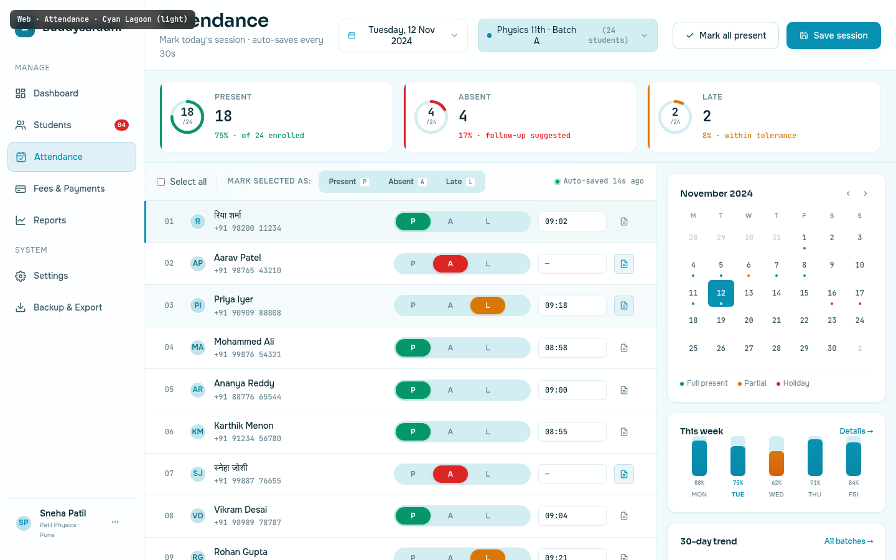

# Web · Attendance

> The most frequent, lowest-stakes action in Buddysaradhi: mark present, mark absent, move on. Cyan Lagoon's signature hue `#0891B2` is the colour of "go" and "flow" without urgency. The mist background `#F0FAFC` keeps the surface feeling light even when a tutor marks 200 students in a sitting. Designed for the 09:00 AM rush — the tutor's first action when a batch walks in.

---

## §1 Page Identity

| Property | Value |
|---|---|
| Page name | Attendance |
| Route | `/attendance` (defaults to today's session for the most-recent batch) |
| Palette | `cyan-lagoon` |
| Theme default | `light` |
| Viewport | 1440 × 900 |
| Primary CTA | `Save session` (top-right, `btn-primary`) |
| Secondary CTAs | `Mark all present` (`btn-secondary`), bulk-action `P`/`A`/`L` toggles in the action bar |
| Per-row controls | 3-button toggle `P` / `A` / `L` (Present / Absent / Late) + time-in input + notes icon |
| Right-rail cards | Calendar (current month) · This week (5 day bars) · 30-day trend (line chart) |
| Active sidebar item | **Attendance** |
| Page-level pattern | 3-zone workspace — KPI strip on top, attendance list (left 2/3), contextual rail (right 1/3) |
| Frame label | `Web · Attendance · Cyan Lagoon (light)` |

### Palette rationale
Cyan is the most "neutral-warm" accent in the system: not the urgency of red, not the success-declaration of green, not the celebration of amber. It says "flow" — mark, move, mark, move. The mist background `#F0FAFC` reduces eye strain during long marking sessions. The teal accent `#0E7490` (deeper, secondary) appears in hover states and secondary icons, never as a primary fill — colour restraint is essential on a high-density screen.

---

## §2 Layout Anatomy

```
┌──────────────────────────────────────────────────────────────────────────────────┐
│ mockup-frame-label (fixed, top-left)                                              │
├──────────┬────────────────────────────────────────────────────────────────────────┤
│ SIDEBAR  │ TOPBAR  (Attendance h1 · date-pill · batch-select · Mark all · Save)  │
│ 232px    ├────────────────────────────────────────────────────────────────────────┤
│          │ KPI STRIP  (3 mini cards: Present 18/24, Absent 4/24, Late 2/24)       │
│          ├──────────────────────────────────────────────┬─────────────────────────┤
│ Brand    │ ATT-LIST CARD                                  │ RIGHT RAIL (384px)      │
│ ─────    │ ┌─ BULK BAR ────────────────────────────────┐ │ ┌─ Calendar ──────────┐│
│ Manage   │ │ ☐ Select all  Mark selected as: P A L     │ │ │ Nov 2024 · mini grid││
│  Dashb.  │ ├───────────────────────────────────────────┤ │ │ • • • today=12 Nov  ││
│  Studen. │ │ #01  रिया शर्मा    [P][A][L]  09:02  📝   │ │ │ • • holiday legend  ││
│  ●Atten. │ │ #02  Aarav Patel   [P][●A][L]   —    📝✏  │ │ ├─ This week ─────────┤│
│  Fees    │ │ #03  Priya Iyer    [P][A][●L]  09:18  📝✏ │ │ │ Mon 88 Tue 75(hov)  ││
│  Reports │ │ #04  Mohammed Ali  [●P][A][L]  08:58  📝   │ │ │ Wed 62 Thu 91 Fri 84││
│ ─────    │ │ ... (24 rows total, 10 visible)           │ │ ├─ 30-day trend ──────┤│
│ System   │ │ 14 more · scroll to view all              │ │ │ line chart + dot    ││
│  Setting.│ └───────────────────────────────────────────┘ │ │ 87% avg · +3%       ││
│  Backup  │                                                │ └─────────────────────┘│
│ ─────    │                                                │                         │
│ usercard │                                                │                         │
│          ├────────────────────────────────────────────────┴─────────────────────────┤
│          │ FOOTER  (auto-saving · P/A/L hint · version)                              │
└──────────┴────────────────────────────────────────────────────────────────────────┘
```

### Grid declaration
```css
.app-shell { display: flex; flex-direction: row; min-height: 100vh; }
.sidebar { width: 232px; flex-shrink: 0; }
.main-col { flex: 1; display: flex; flex-direction: column; min-width: 0; }
.kpi-strip { display: grid; grid-template-columns: repeat(3, 1fr); gap: var(--space-4); }
.content-area { display: grid; grid-template-columns: 1fr 384px; flex: 1; min-height: 0; }
.att-card { display: flex; flex-direction: column; border-right: 1px solid var(--border-default); }
.right-col { display: flex; flex-direction: column; gap: var(--space-4); overflow-y: auto; }
```

### Vertical rhythm (top to bottom inside `.main-col`)
1. `.topbar` — 72px tall, sticky. Page title left, date pill + batch selector centre, action buttons right.
2. `.kpi-strip` — 96px tall. 3 mini cards in a row.
3. `.content-area` — fills the remaining height (≈ 680px at 1440×900). Two-pane grid.
4. `.app-footer` — 40px tall. Auto-save indicator + keyboard hint.

### Responsive collapse (below 1024px)
- Sidebar collapses to icon rail.
- Right rail moves below the attendance list (stacked).
- KPI strip stays 3 columns but compresses to ~280px wide each.
- Bulk-action bar wraps: the "Select all" + bulk toggles move to a sticky bottom bar.

---

## §3 Section-by-Section Content Spec

### §3.1 Topbar

| Slot | Content | Notes |
|---|---|---|
| Page title | `Attendance` (h1, `--text-2xl`, weight 600) | Sora heading face |
| Subtitle | "Mark today's session · auto-saves every 30s" | Tells the tutor the safety-net contract |
| Date pill | Calendar icon + "Tuesday, 12 Nov 2024" + chevron-down | Click → opens date picker popover |
| Batch selector | Coloured dot + "Physics 11th · Batch A" + "(24 students)" count + chevron | Click → dropdown of enrolled batches |
| Mark all present | `btn-secondary`, check icon | Bulk action — sets all 24 to Present |
| Save session | `btn-primary`, save icon | Commits the attendance sheet to DB + syncs |

### §3.2 KPI strip

Three mini cards, each 1fr wide, 96px tall, with a 3px coloured left-bar accent.

| Card | Bar colour | Donut | Big number | Sub-label | % caption |
|---|---|---|---|---|---|
| Present | `--accent-success` (#059669) | 75% arc emerald | 18 | "Present" | "75% · of 24 enrolled" |
| Absent | `--accent-danger` (#DC2626) | 17% arc red | 4 | "Absent" | "17% · follow-up suggested" |
| Late | `--accent-warning` (#D97706) | 8% arc amber | 2 | "Late" | "8% · within tolerance" |

Donut: 56px SVG, 3 stroke-width, `--bg-surface-inset` background ring, coloured arc starts at top (rotate -90), round linecap. Centre text shows the absolute number (`18`) + small denominator (`/24`) for the Present card; absent/late cards show only the absolute number (denominator would be redundant).

### §3.3 Bulk action bar

Sticky strip at the top of the attendance list card. Layout:

```
[☐ Select all] | [Mark selected as:] [P] [A] [L]            [● Auto-saved 14s ago]
```

- **Select all checkbox**: toggles all 24 rows. When partially checked (3+ rows selected), shows the indeterminate state.
- **Divider**: 1px × 20px vertical line, `--border-default`.
- **Bulk label**: "Mark selected as:" — `--text-xs` uppercase `--text-muted`.
- **Bulk toggle group**: 3 buttons in a pill container (`--bg-surface-inset` background, 4px radius). Active/hover states use the corresponding accent (green for P, red for A, amber for L). Each button shows a small `kbd` hint (`P`, `A`, `L`).
- **Spacer**: flex-grow.
- **Auto-saved indicator**: green pulse dot + "Auto-saved 14s ago" (mono font for the time).

### §3.4 Attendance list

24 rows total; 10 visible in the viewport; the rest implied via scroll. Each row is a 5-column grid:

| Column | Width | Content |
|---|---|---|
| 1 | 40px | Row number (01–24), mono `--text-muted` |
| 2 | 1fr | Avatar (28px) + name (primary, Devanagari-capable) + phone (secondary, mono) |
| 3 | 220px | P/A/L toggle group |
| 4 | 110px | Time-in input (HH:MM, mono); disabled when status ≠ Present/Late |
| 5 | 48px | Notes icon button; filled (accent-tinted) when a note exists |

#### P/A/L toggle group anatomy
Three pill buttons inside a rounded container (`--bg-surface-inset`, `--radius-full`, 3px padding). Active state:
- **P (Present)**: `--accent-success` fill, white text, soft green shadow `0 1px 4px color-mix(... 30% ...)`.
- **A (Absent)**: `--accent-danger` fill, white text.
- **L (Late)**: `--accent-warning` fill, white text.

Inactive state: transparent, `--text-muted` text, hover reveals the colour. Only one of P/A/L is active per row at a time.

#### Row states
| State | Visual | Trigger |
|---|---|---|
| Default | `--bg-surface` | unhovered, unselected |
| Hover | `color-mix(in srgb, var(--accent-primary) 4%, transparent)` overlay | mouse over row |
| Selected (focused row) | 6% cyan tint + 3px left-bar `--accent-primary` | click on row; the row is keyboard-focusable |

The mockup shows:
- Row 1 (Riya Sharma): Present, selected (3px left-bar)
- Row 2 (Aarav Patel): Absent (time-in disabled, placeholder "—")
- Row 3 (Priya Iyer): Late (hover demo — tinted background)
- Rows 4-10: various states (mostly Present, one more Absent, one more Late)

#### Notes icon
Outline icon (file-with-lines) by default. When the student has a note for this session, the icon becomes filled and tinted (`color-mix(in srgb, var(--accent-primary) 8%, transparent)` background, `--accent-primary` text/border). Click → opens a small inline popover for adding/editing a note (max 200 chars).

### §3.5 Right rail (3 cards)

#### Card A — Calendar
- Header: "November 2024" (Sora, 600 weight) + prev/next nav buttons.
- 7-column grid (Mon–Sun headers in `--text-muted` uppercase 10px).
- Each day cell: aspect-ratio 1, mono date number, dot indicator at the bottom.
  - Today (12 Nov): `--accent-primary` fill, white text, 600 weight.
  - Full present days (1, 4, 5, 7, 8, 11): green dot at bottom.
  - Partial days (6): amber dot.
  - Holidays (16, 17 — weekend + Diwali): red dot.
  - Future days: no dot.
  - Outside-month days (28, 29, 30, 31 from Oct; 1 from Dec): 40% opacity grey.
- Legend below: 3 items (Full present / Partial / Holiday).

#### Card B — This week
5 vertical bar columns (Mon–Fri), each showing the day's attendance %.
- Bar height: 64px max, fill proportional to %.
- Today (Tue): highlighted — `--accent-primary` fill + bold day label + `--accent-primary` % caption.
- Other days: `--accent-primary` gradient fill (lighter at the bottom).
- Wednesday (62%): `--accent-warning` gradient (signals a dip — encourages the tutor to follow up).
- Header: "This week" + "Details →" link.

#### Card C — 30-day trend
SVG line chart, 320×88 viewport.
- Gridlines: 3 dashed horizontal lines at 25/50/75% (`--border-default`, dashed).
- Area fill: `--accent-primary` at 30% opacity → 0% gradient.
- Line: 2px `--accent-primary`, round linecap + linejoin.
- Hover dot: rightmost point (today) — `--accent-primary` fill, 2px `--bg-surface` stroke, 4px radius.
- Below: "87% avg" (mono 600 weight) + "↑ +3% vs last 30d" (`--accent-success`).
- Header: "30-day trend" + "All batches →" link.

### §3.6 Footer

| Slot | Content |
|---|---|
| Left | `● Auto-saving · 14s ago` (green pulse dot) + `·` + `Press P / A / L on a row to mark attendance` (keyboard hint, with `kbd` chips) |
| Right | `Buddysaradhi v1.0.0 · contracts/v1.0.0` |

---

## §4 Interaction Model

References `04_Motion_and_Microinteractions.md` variants.

### §4.1 P/A/L toggle — `buttonPress` (scale 0.97, 100ms)
Each P/A/L button uses the `buttonPress` variant on click — a quick 100ms scale-down that signals "I registered your tap". The previously-active sibling returns to neutral with a 150ms fade (no exit animation needed; state changes are atomic).

### §4.2 Row hover — `cardHover` (no scale, 150ms bg fade)
Per shared CSS, hover applies a 4% `--accent-primary` background fade. No scale (would cause reflow on a 24-row list). The hover-demo row (Priya Iyer) in the mockup documents this state.

### §4.3 Calendar day click — `tooltipEnter` (100ms, opacity)
Clicking a day in the calendar swaps the attendance list to that day's session. The list body fades 0→1 over 100ms (`tooltipEnter` variant — opacity-only, no y-translate, because the rows are already positioned).

### §4.4 KPI donut redraw — `chartDraw` (600ms, ease-out, first mount only)
On first mount, the donut arcs animate from 0% to their final percentage using the `chartDraw` variant (`stroke-dashoffset` 0→final, 600ms `--ease-out`). On subsequent data updates (tutor marks another student), the arc updates instantly — no redraw, per `04_Motion_and_Microinteractions.md` §4.9 (chart re-draw anti-pattern).

### §4.5 30-day trend chart — `chartDraw` (600ms, ease-out, first mount only)
The trend line animates its `pathLength` from 0 to 1 over 600ms on first mount. The `hasMounted` ref trick (§4.9) ensures re-renders triggered by data changes do not re-animate.

### §4.6 Save session — `buttonPress` + toast (`toastEnter`, 250ms)
On Save, the button enters loading state (spinner replaces icon), then on success fires a bottom-right toast "Attendance saved · 24 students marked" (`toastEnter` variant, slide-up + fade, 250ms `--ease-out`, auto-dismiss 4s).

### §4.7 Auto-save tick — `tooltipEnter` (100ms opacity)
Every 30s, the auto-save indicator dot pulses once (no rotation, no scale — opacity 0.5→1→0.5 over 800ms). The "Auto-saved Xs ago" text updates instantly.

### §4.8 Reduced-motion override
All animations collapse to `--motion-instant: 0ms`. Donut arcs and trend line appear at their final state instantly. Hover fades become instant bg swaps.

---

## §5 Data Bindings

References `buddysaradhi_Planning/11_Data_Model.md` and `06_Attendance.md`.

### §5.1 Today's session
```
-- Find or create today's session for the selected batch
SELECT id, session_date, batch_id, status
FROM attendance_sessions
WHERE batch_id = ? AND session_date = '2024-11-12'
ORDER BY created_at DESC LIMIT 1;

-- If not found, INSERT a new session (status='open')
```

### §5.2 Attendance records (24 rows)
```
SELECT
  ar.id, ar.status, ar.time_in, ar.notes,
  s.id AS student_id, s.name, s.phone, s.code,
  ROW_NUMBER() OVER (ORDER BY s.name) AS row_num
FROM attendance_records ar
RIGHT JOIN students s ON s.id = ar.student_id
  AND ar.session_id = ?
JOIN enrollments e ON e.student_id = s.id
  AND e.batch_id = ? AND e.end_date IS NULL
WHERE s.archived_at IS NULL AND s.status = 'active'
ORDER BY s.name ASC;
```

A `RIGHT JOIN` ensures all enrolled students appear even if no record exists yet (default status: `null` → rendered as "unmarked"; the P/A/L toggles all show inactive).

### §5.3 KPI aggregates
```
SELECT
  COUNT(*) AS total,
  SUM(CASE WHEN ar.status = 'present' THEN 1 ELSE 0 END) AS present,
  SUM(CASE WHEN ar.status = 'absent'  THEN 1 ELSE 0 END) AS absent,
  SUM(CASE WHEN ar.status = 'late'    THEN 1 ELSE 0 END) AS late
FROM attendance_records ar
WHERE ar.session_id = ?;
```

### §5.4 Calendar data (current month)
```
SELECT
  ase.session_date,
  COUNT(ar.id) AS marked,
  SUM(CASE WHEN ar.status = 'present' THEN 1 ELSE 0 END) AS present,
  COUNT(*) AS total
FROM attendance_sessions ase
LEFT JOIN attendance_records ar ON ar.session_id = ase.id
WHERE ase.batch_id = ?
  AND strftime('%Y-%m', ase.session_date) = '2024-11'
GROUP BY ase.session_date;
```
- A day with `present/total >= 0.85` → green dot (full).
- A day with `0 < present/total < 0.85` → amber dot (partial).
- A day with `total = 0` AND in the `holidays` table (or a Sunday) → red dot (holiday).
- Future days → no dot.

### §5.5 This week summary
```
SELECT
  strftime('%w', ase.session_date) AS dow,
  ROUND(100.0 * SUM(CASE WHEN ar.status='present' THEN 1 ELSE 0 END) / COUNT(*), 0) AS pct
FROM attendance_sessions ase
JOIN attendance_records ar ON ar.session_id = ase.id
WHERE ase.batch_id = ?
  AND ase.session_date >= date('2024-11-12', 'weekday 0', '-7 days')
  AND ase.session_date <= date('2024-11-12', 'weekday 0', '-3 days')  -- Mon-Fri of this week
GROUP BY ase.session_date;
```

### §5.6 30-day trend
```
SELECT
  ase.session_date,
  ROUND(100.0 * SUM(CASE WHEN ar.status='present' THEN 1 ELSE 0 END) / COUNT(*), 0) AS pct
FROM attendance_sessions ase
JOIN attendance_records ar ON ar.session_id = ase.id
WHERE ase.batch_id = ?
  AND ase.session_date >= date('2024-11-12', '-30 days')
GROUP BY ase.session_date
ORDER BY ase.session_date ASC;
```

### §5.7 Mutations
| Action | Endpoint | Body |
|---|---|---|
| Mark one student | `PATCH /api/attendance/records/:id` | `{ status: 'present'|'absent'|'late', time_in: 'HH:MM' }` — also writes `audit_log` |
| Bulk mark | `POST /api/attendance/sessions/:id/bulk` | `{ student_ids: [...], status: 'present' }` — single SQL `UPDATE ... WHERE student_id IN (...)` |
| Save session | `POST /api/attendance/sessions/:id/save` | Sets `attendance_sessions.status='saved'`, locks the session from further edits unless unlocked by the tutor. |
| Add note | `PATCH /api/attendance/records/:id` | `{ notes: '...' }` |

All mutations enqueue a `sync_outbox` row for offline sync (per `mobile/04_Offline_Sync_and_Conflict_Resolution.md` conflict rules — last-write-wins for attendance within a 5-minute window).

---

## §6 Accessibility Notes

### §6.1 Heading hierarchy
- One `<h1>` per page: "Attendance" in the topbar.
- Right-rail card titles (`Calendar`, `This week`, `30-day trend`) are `<h3>` elements (the implicit `<h2>` is the page section label "Today's session" which is visually omitted in this layout but present in the a11y tree as a `role="heading" aria-level="2"` on the list card).

### §6.2 Keyboard navigation (per `05_Accessibility_Contract.md` §3 — table/form hybrid)
| Key | Action |
|---|---|
| `Tab` | Move through topbar → KPI cards (read-only) → bulk-bar controls → first att-row |
| `↑` / `↓` | Move focus between att-rows (roving `tabindex`) |
| `P` | Mark focused student Present |
| `A` | Mark focused student Absent |
| `L` | Mark focused student Late |
| `Tab` (within row) | Cycle through P/A/L group → time-in input → notes button |
| `Enter` (on notes button) | Open notes popover |
| `Cmd+S` | Save session |
| `Cmd+Shift+P` | Mark all present |

The `P`/`A`/`L` single-key shortcuts are scoped — they only fire when focus is inside the attendance list, not when focus is in the search bar or any input.

### §6.3 Screen-reader patterns
- Each att-row has `role="row"` with `aria-rowindex`. The P/A/L group has `role="radiogroup" aria-label="Mark Riya Sharma's attendance"`; each toggle button has `role="radio" aria-checked="true|false"`.
- KPI cards have `aria-label="Present: 18 of 24, 75 percent"`.
- The 30-day trend SVG has `role="img" aria-label="30-day attendance trend, average 87 percent, up 3 points versus previous 30 days"`.
- The calendar has `role="grid"` and each day cell has `role="gridcell" aria-label="12 November 2024, Tuesday, today, 75 percent present"`.

### §6.4 Colour is never the only signal
- P/A/L toggles pair colour (green/red/amber) with text labels (`P`/`A`/`L`) and position (left/centre/right in the group).
- Calendar dots pair colour with shape (the dot's presence/absence is itself a signal — future days have no dot at all).
- KPI cards pair colour with the bar accent (3px left-bar) AND the donut arc AND the text label.

### §6.5 Touch targets
- All P/A/L toggles are ≥44×28px hit area (the visible pill is 28px tall but the hit area extends via padding).
- Calendar day cells are ~28×28px (smaller than 44px); on touch devices, the calendar grows to 44px cells (responsive).

### §6.6 Contrast (Cyan Lagoon light)
| Pair | Ratio | Grade |
|---|---|---|
| `--text-primary` `#082A35` on `--bg-canvas` `#F0FAFC` | 16.8:1 | AAA |
| `--text-secondary` `#3A5A66` on `--bg-surface` `#FFFFFF` | 9.2:1 | AAA |
| `--accent-primary` `#0891B2` on `--bg-surface` `#FFFFFF` | 4.9:1 | AA |
| `--text-on-accent` `#FFFFFF` on `--accent-primary` `#0891B2` | 5.4:1 | AA |
| `--accent-success` `#059669` on `--bg-surface` (Present button) | 4.6:1 | AA |

---

## §7 Edge Cases

### §7.1 No session today (holiday / weekend)
- The topbar's `Save session` button is disabled.
- The KPI strip shows zeros across the board with caption "No session scheduled for 12 Nov".
- The attendance list is replaced by a single full-width empty state: "12 November is a holiday (Diwali). Resume marking on 18 Nov." + `[Create unscheduled session]` secondary button.

### §7.2 Student count mismatch
- If a student was added to the batch AFTER the session was created (e.g. late enrolment at 09:15 AM), they appear at the bottom of the list with status "unmarked" (no P/A/L active) and a small `NEW` badge in the name cell. The KPI denominator updates to include them.

### §7.3 Loading state
- KPI cards: skeleton circles for donuts + skeleton lines for figures.
- Attendance list: 24 skeleton rows (avatar circle + 3 skeleton lines matching the row layout).
- Right rail: 3 skeleton cards with shimmer.
- Topbar: interactive (date pill + batch selector are cached from last session).

### §7.4 Save failed (offline)
- Save button enters persistent loading state.
- Toast: "Couldn't reach the server. Your marks are saved locally and will sync when you reconnect." (`--accent-warning` border, persistent until sync succeeds).
- The auto-save indicator dot turns amber.
- All edits remain in local state; once reconnected, the sync engine flushes them in order (per `mobile/04_Offline_Sync_and_Conflict_Resolution.md`).

### §7.5 Conflict — two devices marking same session
- If device A marks Riya as Present at 09:01 and device B marks Riya as Late at 09:03, last-write-wins within the 5-minute window — Riya is Late.
- If the gap is >5 minutes, the conflict is flagged: a small amber warning chip appears next to Riya's name with a tooltip "Edited on 2 devices. Last update at 09:03 from your phone."

### §7.6 100+ students in one batch
- The list becomes scrollable (virtualized via `react-window` in production). 10 rows visible at a time, smooth scroll.
- Bulk actions become essential — the tutor will use `Select all` + `Mark all present` + then individually flip the absentees.
- KPIs update live as the tutor marks.

### §7.7 Past date editing
- The tutor can navigate to a past date via the calendar. The list loads in read-only mode (P/A/L toggles disabled, time-in inputs disabled) with a banner "Viewing session from 5 Nov 2024. [Unlock to edit]".
- Unlocking requires a confirmation dialog: "Editing a saved session creates an audit trail entry. Continue?" — yes → enables editing; the session's `status` flips from `saved` to `reopened`, and every subsequent edit records the original value in `audit_log`.

### §7.8 Mobile / narrow viewport (below 1024px)
- Sidebar collapses to icon rail.
- Right rail moves below the list (stacked, calendar first then week then trend).
- KPI strip stays 3 columns but very compact.
- P/A/L toggles grow to 56px wide each (touch-friendly).
- Time-in input moves to a secondary sheet (swipe up from the row to reveal).

---

## §8 Image Reference



The screenshot is captured at 1440×900 viewport, no scroll, with row 1 (Riya Sharma) marked Present + selected, row 2 (Aarav Patel) Absent, row 3 (Priya Iyer) Late + hover state, and rows 4-10 in various marked states. The right rail shows the November 2024 calendar (with today=12 Nov highlighted), the This-week bars, and the 30-day trend chart.
