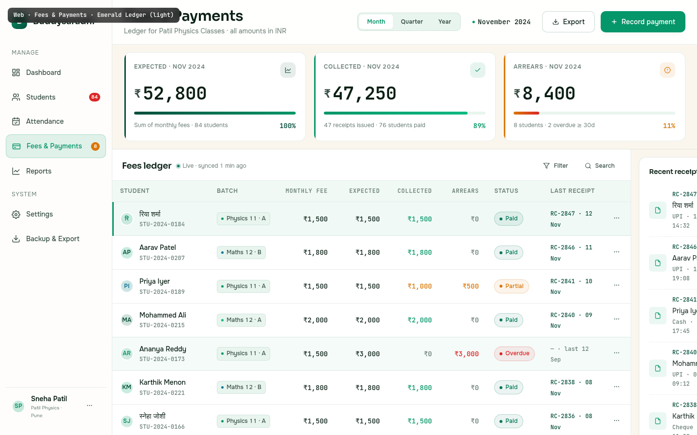

# Web · Fees &amp; Payments

> The financial ledger — the most trust-sensitive surface in Buddysaradhi. A tutor collecting ₹1,500 a month from 84 students is performing a small monthly ritual; the surface must feel like a paper bank statement, not a Stripe checkout. Emerald Ledger's signature hue `#059669` is the colour of the Indian bank-note green and the rubber-stamp green on a paper receipt. It says "settled" without saying "crypto bro". Money is integer paise; the ledger is append-only and hash-chained.

---

## §1 Page Identity

| Property | Value |
|---|---|
| Page name | Fees &amp; Payments |
| Route | `/fees` (defaults to current month) |
| Palette | `emerald-ledger` |
| Theme default | `light` |
| Viewport | 1440 × 900 |
| Primary CTA | `Record payment` (top-right, `btn-primary`) |
| Secondary CTAs | `Export` (CSV/Excel/PDF menu), per-row `⋯` (View receipt / Send reminder / Edit / Void) |
| Period toggle | `[Month]` `[Quarter]` `[Year]` — Month active, showing November 2024 |
| Right-rail cards | Recent receipts (5) · Payment methods donut · Upcoming dues (3-4) |
| Active sidebar item | **Fees &amp; Payments** (with `8` amber arrears badge) |
| Page-level pattern | KPI strip on top (full width), then 2-col — ledger table (2/3) + right rail (1/3) |
| Frame label | `Web · Fees &amp; Payments · Emerald Ledger (light)` |

### Palette rationale
Green is the universal colour of money done right — but the Stripe/Robinhood greens are cold. Emerald Ledger uses a deep forest green (`#059669` primary, `#064E3B` secondary) that echoes the Indian bank-note green and the rubber-stamp green on a paper receipt. The sand background `#FAF6EE` carries warmth without distracting from the numbers. Amber (`#D97706`) appears only on the Arrears KPI and Partial/Overdue chips — a deliberate contrast that signals "needs attention" against the dominant "settled" green.

---

## §2 Layout Anatomy

```
┌──────────────────────────────────────────────────────────────────────────────────┐
│ mockup-frame-label (fixed, top-left)                                              │
├──────────┬────────────────────────────────────────────────────────────────────────┤
│ SIDEBAR  │ TOPBAR  (Fees h1 · period toggle · Nov 2024 · Export · Record payment)│
│ 232px    ├────────────────────────────────────────────────────────────────────────┤
│          │ KPI STRIP  (Expected ₹52,800 · Collected ₹47,250 · Arrears ₹8,400)     │
│          ├──────────────────────────────────────────────┬─────────────────────────┤
│ Brand    │ LEDGER TABLE CARD                              │ RIGHT RAIL (384px)      │
│ ─────    │  head: "Fees ledger" + Live + Filter + Search │ ┌─ Recent receipts ───┐│
│ Manage   │  ┌─┬─Student─┬Batch─┬Fee─┬Expt─┬Coll─┬Arr─┬St│ │ │ RC-2847 Riya ₹1,500 ││
│  Dashb.  │  │A│ avatar  │ pill │ ₹  │ ₹   │ ₹   │ ₹ │chip│ │ │ RC-2846 Aarav ₹1,800││
│  Studen. │  │ │ name+id │      │    │     │     │   │   │ │ │ RC-2841 Priya ₹1,000││
│  Attend. │  │ └─┴────────┴──────┴────┴─────┴─────┴───┴───┘ │ │ RC-2840 Ali ₹2,000  ││
│  ● Fees  │  ... 12 rows ...  (row 1 = sel, row 5 = hov)   │ │ RC-2838 Karthik ₹1.8k││
│  Reports │  TOTALS · 84 · ₹52,800 expt · ₹47,250 coll ... │ ├─ Payment methods ───┤│
│ ─────    │                                                  │ │ donut: UPI 62% /     ││
│ System   │                                                  │ │ Cash 28% / Cheque 10%││
│  Setting.│                                                  │ ├─ Upcoming dues ─────┤│
│  Backup  │                                                  │ │ AR ₹3,000 (urgent)   ││
│ ─────    │  1–12 of 84 · ← 1/7 →                            │ │ NF ₹1,500 (urgent)   ││
│ usercard │                                                  │ │ PI ₹500 · VD ₹500    ││
│          ├──────────────────────────────────────────────────┴─────────────────────────┤
│          │ FOOTER  (ledger hash-chained · R/E hints · version)                         │
└──────────┴────────────────────────────────────────────────────────────────────────┘
```

### Grid declaration
```css
.app-shell { display: flex; flex-direction: row; min-height: 100vh; }
.sidebar { width: 232px; flex-shrink: 0; }
.main-col { flex: 1; display: flex; flex-direction: column; min-width: 0; }
.kpi-strip { display: grid; grid-template-columns: repeat(3, 1fr); gap: var(--space-4); }
.content-area { display: grid; grid-template-columns: 1fr 384px; flex: 1; min-height: 0; }
.ledger-card { display: flex; flex-direction: column; border-right: 1px solid var(--border-default); }
.right-col { display: flex; flex-direction: column; gap: var(--space-4); overflow-y: auto; }
```

### Vertical rhythm
1. `.topbar` — 72px, sticky. Title left, period toggle + period label centre-right, action buttons right.
2. `.kpi-strip` — 144px, 3 cards. Each card has a 3px left-bar accent, icon chip, big figure, progress bar, meta caption.
3. `.content-area` — fills the remaining height (≈ 660px at 1440×900). Two-pane grid; ledger table + right rail.
4. `.app-footer` — 40px. Ledger integrity status + keyboard hints.

### Responsive collapse (below 1024px)
- Sidebar collapses to icon rail.
- KPI strip becomes 1 column (3 stacked cards).
- Right rail moves below the ledger table.
- Ledger table drops the `Batch` and `Last receipt` columns.

---

## §3 Section-by-Section Content Spec

### §3.1 Topbar

| Slot | Content | Notes |
|---|---|---|
| Page title | `Fees &amp; Payments` (h1, `--text-2xl`, weight 600) | Sora |
| Subtitle | "Ledger for Patil Physics Classes · all amounts in INR" | Per `11_Data_Model.md` §6 — integer paise, INR display via `Intl.NumberFormat('en-IN')` |
| Period toggle | 3-button pill `[Month]` `[Quarter]` `[Year]` — Month active | Changes the KPI strip's expected/collected/arrears figures |
| Period label | "● November 2024" (mono + emerald dot) | Updates with the toggle; Quarter → "Q4 2024 (Oct–Dec)"; Year → "2024" |
| Export | `btn-secondary` with download icon | Opens a menu: CSV / Excel / PDF (statement) / WhatsApp summary |
| Record payment | `btn-primary` with `+` icon | Opens `RecordPaymentSheet` (per `07_Fees_and_Payments.md` §4) |

### §3.2 KPI strip

Three cards, each 1fr wide, ~144px tall. Each card has:
- A 3px coloured left-bar accent (full height).
- Top row: KPI label (uppercase 600 weight) + icon chip (32×32, 10% accent-tinted background).
- Big figure: `₹XX,XXX` (mono, `--text-3xl`, 600 weight, `₹` symbol smaller + offset).
- Progress bar: 6px tall, gradient fill.
- Bottom row: meta caption (left) + percentage (right, mono, accent-coloured).

| Card | Bar | Icon | Figure | Progress | Caption | % |
|---|---|---|---|---|---|---|
| Expected | `--accent-secondary` (forest) | trend-line | ₹52,800 | 100% | "Sum of monthly fees · 84 students" | 100% |
| Collected | `--accent-primary` (emerald) | check | ₹47,250 | 89% | "47 receipts issued · 76 students paid" | 89% |
| Arrears | `--accent-warning` (amber) | alert | ₹8,400 | 16% | "8 students · 2 overdue ≥ 30d" | 11% |

**Progress bar contract**: Collected's progress bar fills to 89% of its track width (the ratio collected/expected). Arrears's bar fills to 16% (arrears/expected). Expected's bar is full by definition. This gives the tutor an at-a-glance visual ratio: "most of the bar is green, a small amber slice at the end".

### §3.3 Fees ledger table

| # | Column | Align | Sortable | Data source |
|---|---|---|---|---|
| 1 | Student (avatar + name + STU code) | left | yes (name) | `students.name`, `students.code` |
| 2 | Batch | left | yes | `batches.name` via `enrollments` |
| 3 | Monthly Fee | right | yes | `students.monthly_fee_paise` |
| 4 | Expected | right | yes | `expectedForPeriod(s.id, period)` per BR-CALC-09 |
| 5 | Collected | right | yes | `collectedForPeriod(s.id, period)` per BR-CALC-10 |
| 6 | Arrears | right | yes | `arrearsForPeriod(s.id, period)` per BR-CALC-11 (negative = advance, shown in green) |
| 7 | Status | left | yes | Derived: Paid / Partial / Overdue / Paused |
| 8 | Last receipt | left | yes | Most recent `receipts.code + occurred_on` |
| 9 | Actions `⋯` | centre | no | Overflow: View receipt / Send reminder / Edit / Void |

#### Money cell contract
- All money cells: `font-family: var(--font-mono); font-variant-numeric: tabular-nums; text-align: right;`
- `₹0` arrears: `--text-muted` (dim, signals "settled, nothing to see").
- `> ₹0` arrears: `--accent-danger` (red, signals "owes money").
- Collected = Expected: `--accent-primary` (green, "fully collected").
- Collected < Expected (partial): `--accent-warning` (amber).
- Collected = 0 (overdue): `--text-muted` (dim red — the Arrears column carries the alarm).

#### Status chips
| Status | Chip class | Dot | Condition |
|---|---|---|---|
| Paid | `chip-success` | green | Arrears = 0 AND paid_till ≥ current_period |
| Partial | `chip-warning` | amber | Arrears > 0 AND collected > 0 |
| Overdue | `chip-danger` | red | Arrears > 0 AND collected = 0 OR paid_till < previous_period |
| Paused | `chip-neutral` | grey | `students.status = 'paused'` |

#### Totals row
A distinct row at the bottom of the table body, separated by a 2px `--accent-primary` top border. Background: 8% emerald-tinted gradient. Bold weight, `--text-md` size on money cells. Contents:
- "Totals · 84 students" (left, uppercase 600 weight)
- ₹1,650 avg (Monthly Fee column — average, not sum)
- ₹52,800 (Expected total)
- ₹47,250 (Collected total — emerald)
- ₹8,400 (Arrears total — red)
- "89% collected · 11% arrears" (right-aligned caption)

#### Row states
| State | Visual | Trigger |
|---|---|---|
| Default | `--bg-surface` | unhovered, unselected |
| Hover | `color-mix(in srgb, var(--accent-primary) 4%, transparent)` overlay | mouse over row |
| Selected | 6% emerald tint + 3px left-bar `--accent-primary` | click on row; opens receipt drawer |

The mockup shows row 1 (Riya Sharma, Paid) as selected and row 5 (Ananya Reddy, Overdue) as hover-demo.

### §3.4 Right rail (3 cards)

#### Card A — Recent receipts
Header: "Recent receipts" + "View all →" link. 5 receipt items, each row:
- Icon chip: 36×36 emerald-tinted square with a receipt icon.
- Stack: receipt code (`RC-2847`, mono emerald) + student name + meta line (method + date/time, mono `--text-muted`).
- Amount: emerald, mono, 600 weight, tabular-nums.
- Download button: ghost icon, hover reveals emerald.

Items shown: RC-2847 Riya ₹1,500 (UPI · 12 Nov), RC-2846 Aarav ₹1,800 (UPI · 11 Nov), RC-2841 Priya ₹1,000 (Cash · 10 Nov), RC-2840 Mohammed ₹2,000 (UPI · 09 Nov), RC-2838 Karthik ₹1,800 (Cheque · 08 Nov).

#### Card B — Payment methods
Header: "Payment methods" + "This month" sub-label. Donut chart:
- 120×120 SVG donut, 4 stroke-width.
- Three arcs: UPI 62% (emerald), Cash 28% (amber), Cheque 10% (forest secondary).
- Centre: "47" (mono 600) + "receipts" (10px uppercase).
- Legend: 3 rows, each with swatch + label + percentage.

#### Card C — Upcoming dues
Header: "Upcoming dues" + "Send reminders →" link. 3-4 due items, each row:
- Avatar (28px) — danger-tinted for urgent, warning-tinted for normal.
- Stack: student name + due date caption ("Due 15 Nov · 3 days overdue" — red for urgent, amber for normal).
- Amount: danger colour for urgent, warning for normal.

Items shown: Ananya Reddy ₹3,000 (urgent, 3 days overdue), Neha Fernandes ₹1,500 (urgent, 3 days overdue), Priya Iyer ₹500 (due 30 Nov, in 18 days), Vikram Desai ₹500 (due 30 Nov, in 18 days).

### §3.5 Footer

| Slot | Content |
|---|---|
| Left | `● Ledger hash-chained · last verified 1 min ago` (green pulse dot) + `·` + `Press R to record payment · E to export` (keyboard hint) |
| Right | `Buddysaradhi v1.0.0 · contracts/v1.0.0 · integer paise` |

---

## §4 Interaction Model

References `04_Motion_and_Microinteractions.md`.

### §4.1 Period toggle — `buttonPress` + `chartDraw`
Switching period (Month → Quarter) triggers:
1. `buttonPress` micro-interaction on the new active period button (100ms scale 0.97).
2. KPI figures count up/down via `chartDraw` variant (600ms ease-out, value animates from old → new).
3. Ledger table body fades 0→1 over 250ms (`listItemEnter` stagger applied to visible rows, capped at 8).

### §4.2 Row hover — `cardHover` (no scale, 150ms bg fade)
Per shared CSS. The hover-demo row (Ananya Reddy) in the mockup documents this state.

### §4.3 Record payment sheet — `modalEnter` (250ms, scale + y-translate)
The `RecordPaymentSheet` enters with `modalEnter` variant: opacity 0→1, scale 0.95→1, y +8px → 0, 250ms `--ease-out`. On close, `ease-in` (250ms) — accelerates away.

### §4.4 Receipt download — `toastEnter` (250ms)
After clicking the download icon, a toast slides in from bottom-right: "Receipt RC-2847 downloaded" with a `View` link. Auto-dismisses after 4s.

### §4.5 KPI progress bar — `chartDraw` (600ms, first mount only)
On first mount, the progress bars animate from 0% width to their final ratio over 600ms `--ease-out`. On data updates (e.g. after recording a payment), the bar updates instantly — no re-animation (per `04_Motion_and_Microinteractions.md` §4.9).

### §4.6 Void receipt — confirmation dialog → toast
Voiding (per `11_Data_Model.md` P-DM3) requires a confirmation dialog ("Voiding receipt RC-2847 creates a `VOID` ledger entry. The original receipt remains visible but marked void. Continue?"). On confirm, a `VOID` row is appended to `ledger_entries`, and a toast confirms: "Receipt RC-2847 voided. Arrears recalculated."

### §4.7 Reduced-motion override
All animations collapse to `--motion-instant: 0ms`. KPI figures appear at final value instantly. Progress bars at final width. No count-up.

---

## §5 Data Bindings

References `buddysaradhi_Planning/11_Data_Model.md`, `12_Business_Rules.md`, `02_Core_Logic.md` §6.9.

### §5.1 Ledger rows (per student, for the selected period)
```
-- For each active student, compute expected/collected/arrears for the period
SELECT
  s.id, s.code, s.name, s.monthly_fee_paise, s.fee_frequency, s.status,
  b.name AS batch_name, b.accent_color,
  -- Expected (BR-CALC-09): monthly_fee × period_multiplier
  CASE
    WHEN :period = 'month' THEN s.monthly_fee_paise
    WHEN :period = 'quarter' THEN s.monthly_fee_paise * 3
    WHEN :period = 'year' THEN s.monthly_fee_paise * 12
  END AS expected_paise,
  -- Collected (BR-CALC-10): sum of PAYMENT_RECEIVED ledger entries in period
  COALESCE((
    SELECT SUM(le.amount_paise) FROM ledger_entries le
    WHERE le.student_id = s.id
      AND le.type = 'PAYMENT_RECEIVED'
      AND le.occurred_on BETWEEN :period_start AND :period_end
      AND le.void_of_id IS NULL  -- not voided
  ), 0) AS collected_paise,
  -- Arrears (BR-CALC-11): expected - collected (negative = advance)
  CASE
    WHEN :period = 'month' THEN s.monthly_fee_paise
    WHEN :period = 'quarter' THEN s.monthly_fee_paise * 3
    WHEN :period = 'year' THEN s.monthly_fee_paise * 12
  END - COALESCE((
    SELECT SUM(le.amount_paise) FROM ledger_entries le
    WHERE le.student_id = s.id
      AND le.type = 'PAYMENT_RECEIVED'
      AND le.occurred_on BETWEEN :period_start AND :period_end
      AND le.void_of_id IS NULL
  ), 0) AS arrears_paise,
  -- Last receipt
  (SELECT r.code FROM receipts r
   JOIN ledger_entries le ON le.id = r.ledger_entry_id
   WHERE le.student_id = s.id AND le.void_of_id IS NULL
   ORDER BY r.occurred_on DESC LIMIT 1) AS last_receipt_code,
  (SELECT r.occurred_on FROM receipts r
   JOIN ledger_entries le ON le.id = r.ledger_entry_id
   WHERE le.student_id = s.id AND le.void_of_id IS NULL
   ORDER BY r.occurred_on DESC LIMIT 1) AS last_receipt_date
FROM students s
LEFT JOIN enrollments e ON e.student_id = s.id AND e.end_date IS NULL
LEFT JOIN batches b ON b.id = e.batch_id
WHERE s.tenant_id = ? AND s.archived_at IS NULL AND s.status = 'active'
ORDER BY s.name ASC
LIMIT 12 OFFSET ?;
```

**Effective-dated fee history** (per `02_Core_Logic.md` §6.9): for past periods, `expected_paise` uses the rate effective THEN (from `student_fee_rates`), not today's `monthly_fee_paise`. The denormalised cache `students.monthly_fee_paise` is only valid for the current period; past periods must consult `student_fee_rates`.

### §5.2 KPI aggregates
```
SELECT
  SUM(s.monthly_fee_paise) AS total_expected,        -- sum of current monthly fees
  COALESCE((
    SELECT SUM(le.amount_paise) FROM ledger_entries le
    JOIN students s2 ON s2.id = le.student_id
    WHERE le.type = 'PAYMENT_RECEIVED'
      AND le.void_of_id IS NULL
      AND le.occurred_on BETWEEN :period_start AND :period_end
      AND s2.archived_at IS NULL AND s2.status = 'active'
  ), 0) AS total_collected,
  COUNT(DISTINCT r.id) AS receipt_count,
  COUNT(DISTINCT CASE WHEN collected_paise > 0 THEN s.id END) AS students_paid_count,
  COUNT(DISTINCT CASE WHEN collected_paise = 0 AND expected_paise > 0 THEN s.id END) AS students_arrears_count
FROM students s
LEFT JOIN receipts r ON r.ledger_entry_id IN (SELECT id FROM ledger_entries WHERE student_id = s.id AND void_of_id IS NULL)
WHERE s.archived_at IS NULL AND s.status = 'active';
```

### §5.3 Recent receipts (right rail)
```
SELECT r.code, r.amount_paise, r.method, r.occurred_on,
       s.name AS student_name
FROM receipts r
JOIN ledger_entries le ON le.id = r.ledger_entry_id
JOIN students s ON s.id = le.student_id
WHERE le.void_of_id IS NULL
  AND s.tenant_id = ?
ORDER BY r.occurred_on DESC LIMIT 5;
```

### §5.4 Payment methods breakdown
```
SELECT r.method,
       COUNT(*) AS count,
       SUM(r.amount_paise) AS total_paise
FROM receipts r
JOIN ledger_entries le ON le.id = r.ledger_entry_id
JOIN students s ON s.id = le.student_id
WHERE le.void_of_id IS NULL
  AND r.occurred_on BETWEEN :period_start AND :period_end
  AND s.tenant_id = ?
GROUP BY r.method;  -- 'upi' | 'cash' | 'cheque' | 'bank_transfer'
```

### §5.5 Upcoming dues
```
SELECT s.id, s.name, s.monthly_fee_paise,
       COALESCE((
         SELECT SUM(le.amount_paise) FROM ledger_entries le
         WHERE le.student_id = s.id
           AND le.type = 'PAYMENT_RECEIVED'
           AND le.void_of_id IS NULL
           AND le.occurred_on < :period_start
       ), 0) - s.monthly_fee_paise * :months_elapsed AS arrears_paise,
       :due_date AS due_date,
       julianday(:due_date) - julianday('now') AS days_until_due
FROM students s
WHERE s.archived_at IS NULL AND s.status = 'active'
  AND s.monthly_fee_paise > 0
  AND ( ... arrears_paise > 0 ... )
ORDER BY days_until_due ASC LIMIT 4;
```

### §5.6 Mutations
| Action | Endpoint | Body | Side effects |
|---|---|---|---|
| Record payment | `POST /api/receipts` | `{ student_id, amount_paise, method, occurred_on, notes }` | Appends `PAYMENT_RECEIVED` row to `ledger_entries` (with `this_hash`); creates `receipts` row with auto-incremented code (`RC-YYYY-NNNN`); inserts `audit_log` entry; enqueues `sync_outbox` row |
| Void receipt | `POST /api/receipts/:id/void` | `{ reason }` | Appends `VOID` row to `ledger_entries` referencing original via `void_of_id`; original receipt marked void (still visible) |
| Send reminder | `POST /api/students/:id/reminders` | `{ channel: 'whatsapp'|'sms'|'email', template: 'arrears' }` | Inserts `reminders` row; enqueues `sync_outbox` for delivery |
| Export | `GET /api/fees/export?period=month&format=csv` | — | Streams CSV; for PDF, generates a statement per `09_Backup_and_Import_Export.md` §4 |

All financial mutations run inside a Prisma `$transaction` with the trigger-guarded `ledger_entries` (per `11_Data_Model.md` §10 — INSERT-only trigger).

---

## §6 Accessibility Notes

### §6.1 Heading hierarchy
- One `<h1>` per page: "Fees &amp; Payments" in the topbar.
- KPI card labels are `<div>` (not headings) — they're labels, not structural.
- Right-rail card titles are `<h3>`.
- The implicit `<h2>` is "Fees ledger" — the table card's heading.

### §6.2 Keyboard navigation (per `05_Accessibility_Contract.md` §3 — table map)
| Key | Action |
|---|---|
| `Tab` | Move through topbar → period toggle → KPI cards (read-only) → table card head → first table row |
| `↑` / `↓` | Move focus between ledger rows (roving `tabindex`) |
| `Enter` | Open receipt drawer for focused row |
| `R` | Open Record Payment sheet (scoped — only when focus is in the ledger card, not in any input) |
| `E` | Open Export menu |
| `Cmd+S` | (no-op; the ledger auto-saves) |
| `Escape` | Close any open sheet/drawer |

### §6.3 Screen-reader patterns
- Each money cell has `aria-label`: e.g. `aria-label="Collected: 1,500 rupees"`. The visible `₹1,500` is read as "rupee sign one thousand five hundred" by some screen readers; the explicit label overrides that.
- Status chips carry `aria-label`: e.g. `aria-label="Fee status: Paid, no arrears"`.
- The payment methods donut: `role="img" aria-label="Payment methods this month: UPI 62 percent, Cash 28 percent, Cheque 10 percent, 47 receipts total"`.
- KPI progress bars have `role="progressbar" aria-valuenow="89" aria-valuemin="0" aria-valuemax="100" aria-label="Collected: 89 percent of expected"`.

### §6.4 Colour is never the only signal
- Status chips pair colour with text (Paid / Partial / Overdue / Paused) AND dot (solid / half / cross / hollow).
- Money cells pair colour with sign and context: red arrears only appear in the Arrears column AND the chip is red; the position + chip + colour together carry the signal.
- KPI cards pair the bar accent colour with the icon AND the percentage colour.

### §6.5 Tabular numerics
Every money cell, receipt code, percentage, and count uses `font-variant-numeric: tabular-nums; font-feature-settings: "tnum";`. The ₹ symbol is included in the same mono font run so column alignment holds even with varying digit counts.

### §6.6 Contrast (Emerald Ledger light)
| Pair | Ratio | Grade |
|---|---|---|
| `--text-primary` `#0A1F14` on `--bg-canvas` `#FAF6EE` | 17.2:1 | AAA |
| `--text-secondary` `#3B5247` on `--bg-surface` `#FFFFFF` | 9.5:1 | AAA |
| `--accent-primary` `#059669` on `--bg-surface` `#FFFFFF` | 4.8:1 | AA |
| `--text-on-accent` `#FFFFFF` on `--accent-primary` `#059669` | 4.6:1 | AA |
| `--accent-warning` `#D97706` on `--bg-surface` (Partial chip) | 4.6:1 | AA |
| `--accent-danger` `#DC2626` on `--bg-surface` (Overdue chip) | 5.2:1 | AA |

---

## §7 Edge Cases

### §7.1 No students / no fees set
- KPI strip shows zeros across all three cards.
- Ledger table displays an empty state: "No students enrolled yet. Add your first student to begin tracking fees." + `[+ Add student]` primary CTA.
- Right rail cards display empty states with secondary CTAs ("Record your first payment" etc.).

### §7.2 Student with no fee set (BR-FEE-24 / EC-F-19)
- Monthly Fee column shows `—` (em-dash, `--text-muted`).
- Expected / Collected / Arrears columns show `—`.
- Status chip: `chip-neutral` with text "No fee set".
- Tooltip on the row: "Set a monthly fee for this student to track expected revenue."

### §7.3 Negative arrears (advance payment)
- Arrears column shows the amount in emerald with a `+` prefix (e.g. `+₹1,500`).
- Status chip: `chip-success` with text "Advance".
- KPI Arrears card's total subtracts advances (net arrears only).

### §7.4 Voided receipt
- The original receipt row remains in the ledger but is dimmed (50% opacity) with a strikethrough on the receipt code.
- A small `VOID` chip appears next to the code.
- The corresponding `VOID` ledger entry is visible in the Receipts drawer (linked via `void_of_id`).
- Collected total is automatically reduced; arrears recalculated.

### §7.5 Period switch with no data
- If the tutor switches to "Quarter" and Q4 hasn't started yet, the KPIs show zeros with a caption "Q4 2024 has not started — no data".
- The ledger table shows enrolled students with all money columns as `—`.
- The "Live" indicator in the table head turns amber (no live data to sync).

### §7.6 Loading state
- KPI cards: skeleton blocks for figures + skeleton bars for progress.
- Ledger table: 12 skeleton rows (avatar circle + 4 skeleton text lines matching the row layout).
- Right rail: 3 skeleton cards with shimmer.

### §7.7 Error state (ledger hash verification failed)
- This is a P0 security event per `10_Security.md`.
- The footer's "Ledger hash-chained" indicator turns red.
- A modal blocks further actions: "Ledger integrity check failed. Last verified block #2,847. Please contact support before recording any new payments."
- The Record Payment button is disabled.

### §7.8 Large tutor (200+ students)
- Ledger table paginates 12 rows per page (configurable in Settings: 12/25/50/100).
- The totals row appears on every page (it's the tenant-wide total, not page-total).
- Search debounces at 250ms with FTS5 on `students.name` + `students.code`.

### §7.9 Mobile / narrow viewport (below 1024px)
- Sidebar collapses to icon rail.
- KPI strip becomes 1 column (3 stacked cards).
- Ledger table drops `Batch` and `Last receipt` columns.
- Right rail moves below the table.
- Totals row collapses to a single line: "84 students · ₹47,250 collected · ₹8,400 arrears".

---

## §8 Image Reference



The screenshot is captured at 1440×900 viewport, no scroll, with row 1 (Riya Sharma, Paid) selected and row 5 (Ananya Reddy, Overdue) in hover state. The KPI strip shows Expected ₹52,800 / Collected ₹47,250 (89%) / Arrears ₹8,400 (11%). The right rail shows the 5 most recent receipts, the payment-methods donut (UPI 62% / Cash 28% / Cheque 10%), and 4 upcoming dues (2 urgent, 2 normal).
