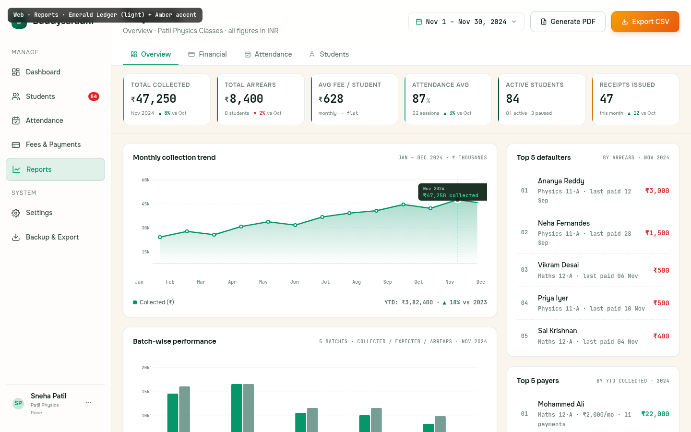

# Web · Reports

> The analytical surface — where a tutor steps back from day-to-day operations and looks at the month, the quarter, the year. Reports shares the Emerald Ledger palette with Fees &amp; Payments (financial reports are the dominant use-case), but adds an Amber Sunrise accent on the `Export CSV` CTA to differentiate it from the `Generate PDF` secondary action. The result is a clean emerald-ledger reading experience with a single warm amber call-to-action that signals "export your data".

---

## §1 Page Identity

| Property | Value |
|---|---|
| Page name | Reports |
| Route | `/reports` (defaults to Overview tab, current month) |
| Palette | `emerald-ledger` (base) + `amber-sunrise` accent on Export CTA |
| Theme default | `light` |
| Viewport | 1440 × 900 |
| Primary CTA | `Export CSV` (`btn-amber` — Amber Sunrise gradient `#F59E0B → #EA580C`) |
| Secondary CTAs | `Generate PDF` (`btn-secondary`), report-type tabs (Overview/Financial/Attendance/Students) |
| Date range picker | "Nov 1 – Nov 30, 2024" (range-pill, opens calendar popover) |
| Active sidebar item | **Reports** |
| Page-level pattern | Topbar → report-type tabs → 6-card KPI strip → main grid (left 2/3 charts + right 1/3 lists) → P&L statement table → footer |
| Frame label | `Web · Reports · Emerald Ledger (light) + Amber accent` |

### Palette rationale (and the amber accent)
Financial reports share the Emerald Ledger palette with Fees &amp; Payments because the dominant content is the same — money in, money out, arrears. But Reports has a second job: **export**. The Export CSV button needs to be visually distinct from the secondary Generate PDF button without becoming the page's primary emerald CTA (which would compete with the period toggle and tabs). The Amber Sunrise accent (`#F59E0B → #EA580C` gradient) gives it the warmth of "begin here" without breaking the emerald-ledger reading rhythm. Amber appears ONLY on this one button — it's a single intentional accent, not a recurring colour in the page.

---

## §2 Layout Anatomy

```
┌──────────────────────────────────────────────────────────────────────────────────┐
│ mockup-frame-label (fixed, top-left)                                              │
├──────────┬────────────────────────────────────────────────────────────────────────┤
│ SIDEBAR  │ TOPBAR  (Reports h1 · date-range-pill · Generate PDF · [Export CSV])  │
│ 232px    ├────────────────────────────────────────────────────────────────────────┤
│          │ TAB STRIP  (Overview · Financial · Attendance · Students)              │
│          ├────────────────────────────────────────────────────────────────────────┤
│ Brand    │ KPI STRIP (6 cards: collected · arrears · avg fee · att · students ·  │
│ ─────    │            receipts)                                                   │
│ Manage   ├───────────────────────────────────────────┬────────────────────────────┤
│  Dashb.  │ LEFT COL (1fr)                            │ RIGHT COL (360px)          │
│  Studen. │ ┌─ Monthly collection trend ───────────┐ │ ┌─ Top 5 defaulters ───┐  │
│  Attend. │ │  line chart, 12 months Jan-Dec       │ │ │ 1. Ananya ₹3,000     │  │
│  Fees    │ │  emerald line + gradient fill + hover│ │ │ 2. Neha ₹1,500       │  │
│  ●Repor. │ │  dot at Nov + tooltip                │ │ │ 3-5. ...             │  │
│ ─────    │ ├─ Batch-wise performance ─────────────┤ │ ├─ Top 5 payers ───────┤  │
│ System   │ │  grouped bar chart, 5 batches × 3    │ │ │ 1. Mohammed ₹22,000  │  │
│  Setting.│ │  metrics (coll/expt/arrears)         │ │ │ 2-5. ...             │  │
│  Backup  │ └──────────────────────────────────────┘ │ ├─ Payment methods ────┤  │
│ ─────    │                                            │ │ donut: UPI/Cash/Cheq │  │
│ usercard │                                            │ └──────────────────────┘  │
│          ├────────────────────────────────────────────┴────────────────────────────┤
│          │ P&L STATEMENT (full width, in a card)                                    │
│          │  Revenue: Tuition 46,800 + Late 200 + Admission 250 = 47,250             │
│          │  Less: Refunds -1,500 + Scholarships -600 = -2,100                       │
│          │  Net collected · November 2024: ₹45,150 (95.5%)                          │
│          ├──────────────────────────────────────────────────────────────────────────┤
│          │ FOOTER  (generated timestamp · G/E hints · version)                       │
└──────────┴────────────────────────────────────────────────────────────────────────┘
```

### Grid declaration
```css
.app-shell { display: flex; flex-direction: row; min-height: 100vh; }
.sidebar { width: 232px; flex-shrink: 0; height: 100vh; }
.main-col { flex: 1; display: flex; flex-direction: column; min-width: 0; overflow-y: auto; }
.kpi-strip { display: grid; grid-template-columns: repeat(6, 1fr); gap: var(--space-3); }
.report-main { display: grid; grid-template-columns: 1fr 360px; gap: var(--space-5); padding: var(--space-5) var(--space-6); }
.left-col { display: flex; flex-direction: column; gap: var(--space-5); min-width: 0; }
.right-col { display: flex; flex-direction: column; gap: var(--space-5); }
```

### Vertical rhythm (top to bottom inside `.main-col`)
1. `.topbar` — 72px, sticky. Title + date range + actions.
2. `.tab-strip` — 44px. Report-type tabs.
3. `.kpi-strip` — 96px. 6 mini cards in a row.
4. `.report-main` — flexible height. Two-column grid with the trend chart + batch chart on the left, 3 list cards on the right.
5. `.pnl-card` — auto height. Full-width P&L statement table.
6. `.app-footer` — 40px.

### Responsive collapse (below 1280px)
- KPI strip becomes 3×2 (or 2×3 below 1024px).
- Right rail moves below the left column (stacked).
- P&L table drops the "% of revenue" column.
- The amber Export CTA remains prominent — it's the most important action regardless of viewport.

---

## §3 Section-by-Section Content Spec

### §3.1 Topbar

| Slot | Content | Notes |
|---|---|---|
| Page title | `Reports` (h1, `--text-2xl`, weight 600) | Sora |
| Subtitle | "Overview · Patil Physics Classes · all figures in INR" | Updates with active tab |
| Date range pill | Calendar icon + "Nov 1 – Nov 30, 2024" (mono) + chevron-down | Click → opens date-range popover with quick presets (This month / Last month / This quarter / YTD / Custom) |
| Generate PDF | `btn-secondary` with document icon | Opens `PDFExportSheet`: select template (Overview / Detailed / Arrears report), orientation, paper size |
| Export CSV | `btn-amber` (Amber Sunrise gradient) with download icon | The single amber accent on the page; exports the current tab's dataset to CSV |

### §3.2 Report-type tabs

| Tab | Icon | Content scope |
|---|---|---|
| Overview (active) | dashboard-grid | All KPIs + collection trend + batch performance + top lists + P&L |
| Financial | bank-card | Deeper financial drill-down: per-batch P&L, payment method trends over time, receipt register |
| Attendance | calendar-check | Attendance trends, per-batch attendance, defaulters-by-attendance, monthly heatmap |
| Students | users | Enrolment funnel, new vs churned, demographic breakdown, top attenders |

Active tab: emerald text + 2px emerald underline. Inactive: `--text-muted`, hover reveals `--text-primary`.

### §3.3 KPI strip (6 mini cards)

Each card: 2px coloured left-bar accent (one of 6 colours, cycling through palette accents), KPI label (uppercase 600), big figure (mono, `--text-xl`), meta line with delta.

| # | Label | Figure | Bar colour | Meta |
|---|---|---|---|---|
| 1 | Total collected | ₹47,250 | emerald | Nov 2024 · ▲ 8% vs Oct |
| 2 | Total arrears | ₹8,400 | danger red | 8 students · ▼ 2% vs Oct |
| 3 | Avg fee / student | ₹628 | info cyan | monthly · — flat |
| 4 | Attendance avg | 87% | tertiary emerald-light | 22 sessions · ▲ 3% vs Oct |
| 5 | Active students | 84 | secondary forest | 81 active · 3 paused |
| 6 | Receipts issued | 47 | warning amber | this month · ▲ 12 vs Oct |

### §3.4 Monthly collection trend (left chart)

SVG line chart, 720×220 viewBox.

- **Gridlines**: 5 horizontal lines at 0/15k/30k/45k/60k (top to bottom). Solid at 0, dashed at intermediate.
- **Y-axis labels**: "60k / 45k / 30k / 15k" (mono 9px, `--text-muted`).
- **Area fill**: emerald gradient (`#059669` at 0.35 opacity → 0 at bottom).
- **Line**: 2.5px emerald, round linecap + linejoin.
- **Data points**: 12 monthly points (Jan–Dec) as 3px circles, white fill + 2px emerald stroke.
- **Hover dot at Nov**: 6px emerald fill + 2.5px white stroke. A vertical dashed line connects hover dot to the X-axis.
- **Tooltip** (above hover dot): dark forest background, "Nov 2024" caption + "₹47,250 collected" (emerald mono).
- **X-axis labels**: Jan / Feb / Mar / Apr / May / Jun / Jul / Aug / Sep / Oct / Nov / Dec.
- **Legend below**: "Collected (₹)" + "YTD: ₹3,82,400 · ▲ 18% vs 2023".

The line shows the seasonal pattern: low Jan-Mar (start of academic year, partial enrolment), rising Apr-Jul (full enrolment), peak Aug-Nov (festival + exam-prep season), slight dip Dec (year-end holidays).

### §3.5 Batch-wise performance (left chart, second)

SVG grouped bar chart, 720×220 viewBox.

- 5 batch groups, each with 3 bars side-by-side:
  - Collected (emerald `#059669`, solid)
  - Expected (forest `#064E3B`, 55% opacity — appears as a "shadow" of expected)
  - Arrears (red `#DC2626`, 85% opacity — visible only when present)
- Y-axis: 0/5k/10k/15k/20k.
- X-axis: batch names below each group.

**Data**:
| Batch | Collected | Expected | Arrears | % |
|---|---|---|---|---|
| Physics 11·A | ₹12,000 | ₹13,500 | ₹1,500 | 89% |
| Maths 12·A | ₹14,000 | ₹14,000 | ₹0 | 100% |
| Physics 11·B | ₹8,000 | ₹9,000 | ₹1,000 | 89% |
| Maths 12·B | ₹7,500 | ₹9,000 | ₹1,500 | 83% |
| Physics 12 | ₹5,700 | ₹7,300 | ₹1,600 | 78% |

Legend below: "Collected / Expected / Arrears" + "Best: Maths 12·A · 100% · Worst: Physics 12 · 78%".

### §3.6 Top 5 defaulters (right card)

5 list items, each: rank number (mono `--text-muted` 600) + student name + meta line (batch + last paid date) + arrears amount (red, mono 600).

Defaulters sorted by arrears descending. Ananya Reddy ₹3,000 (last paid 12 Sep — 2 months behind), Neha Fernandes ₹1,500 (last paid 28 Sep — 2 months behind), Vikram Desai ₹500 (partial), Priya Iyer ₹500 (partial), Sai Krishnan ₹400 (partial).

### §3.7 Top 5 payers (right card)

5 list items, same structure as defaulters but amounts in emerald (success).

Sorted by YTD collected descending. Mohammed Ali ₹22,000 (Maths 12·A · ₹2,000/mo · 11 payments), Vikram ₹20,000, Sai Krishnan ₹20,000, Aarav ₹19,800, Karthik ₹18,000.

### §3.8 Payment methods donut (right card)

120×120 SVG donut, 4 stroke-width, three arcs:
- UPI 62% (emerald `#059669`)
- Cash 28% (amber `#D97706`)
- Cheque 10% (forest `#064E3B`)

Centre: "47" (mono 600) + "RECEIPTS" (4px uppercase). Legend below: 3 rows with swatch + label + percentage. Footer: "UPI value: ₹29,295 · 62%".

### §3.9 Detailed P&L statement (full-width card)

| Column | Align | Type |
|---|---|---|
| Line item | left | text |
| Note | left | text (mono `--text-muted`) |
| Amount (₹) | right | mono, tabular-nums |
| % of revenue | right | mono, tabular-nums |

**Structure**:
1. Section header: "Revenue" (background tint, uppercase 600).
2. Three line items: Tuition fees ₹46,800 / Late fees ₹200 / Admission fees ₹250.
3. Subtotal row: "Gross revenue · ₹47,250 · 100%" (emerald-tinted bg, bold).
4. Section header: "Less: deductions".
5. Two line items: Refunds -₹1,500 (red) / Scholarships -₹600 (red).
6. Subtotal row: "Total deductions · -₹2,100 · -4.5%".
7. Grand total row: "Net collected · November 2024 · ₹45,150 · 95.5%" — emerald gradient background, 2px emerald top + bottom borders, emerald-coloured money, 700 weight.

### §3.10 Footer

| Slot | Content |
|---|---|
| Left | `● Report generated 12 Nov 2024 · 14:48 IST` (green pulse dot) + `·` + `Press G to generate PDF · E to export CSV` |
| Right | `Buddysaradhi v1.0.0 · contracts/v1.0.0` |

---

## §4 Interaction Model

References `04_Motion_and_Microinteractions.md`.

### §4.1 Tab switch — `listItemEnter` stagger
Switching tabs (Overview → Financial) re-mounts the KPI strip + main grid with a 30ms stagger (capped at 8 children). The previously-active tab returns to neutral instantly.

### §4.2 Date range picker — `modalEnter`
The range popover enters with `modalEnter` variant (250ms `--ease-out`, opacity + y-translate +8px → 0). Quick-preset buttons use `buttonPress` on click.

### §4.3 Line chart hover — `tooltipEnter` (100ms opacity)
Hovering over a data point reveals the tooltip with `tooltipEnter` (opacity 0→1, 100ms — no translate, the tooltip is already positioned). The hover dot scales 3px → 6px over 150ms `--ease-spring`.

### §4.4 KPI figures — `chartDraw` count-up (600ms, first mount only)
On first mount, the 6 KPI figures animate from 0 to their final value over 600ms `--ease-out`. The `hasMounted` ref trick ensures tab switches re-trigger the count-up (because the data changed), but pure re-renders don't.

### §4.5 Export CSV — `buttonPress` + `toastEnter`
Click triggers `buttonPress` (100ms scale 0.97), then the CSV generates (synchronous for <5000 rows), then a `toastEnter` toast slides up from bottom-right: "CSV exported · 84 rows" with `Open folder` link. Auto-dismiss 4s.

### §4.6 Generate PDF — async loading state
PDF generation is async (server-side render). Button enters loading state (spinner replaces icon), then a toast confirms with a `Download` link to the PDF blob URL.

### §4.7 Bar chart bars — `chartDraw` (600ms, first mount only)
Each bar animates its height from 0 to final over 600ms `--ease-out` on first mount, staggered by 50ms per batch group. On data updates (tab switch, date range change), the bars update instantly — no re-animation.

### §4.8 Reduced-motion override
All animations collapse to `--motion-instant: 0ms`. KPI figures appear at final value. Charts appear at final state. No count-up, no draw-in.

---

## §5 Data Bindings

References `buddysaradhi_Planning/11_Data_Model.md` and `02_Core_Logic.md` §6.9.

### §5.1 KPI strip — 6 aggregates for the selected period
```
-- 1. Total collected
SELECT COALESCE(SUM(le.amount_paise), 0)
FROM ledger_entries le
WHERE le.tenant_id = ?
  AND le.type = 'PAYMENT_RECEIVED'
  AND le.void_of_id IS NULL
  AND le.occurred_on BETWEEN :period_start AND :period_end;

-- 2. Total arrears (BR-CALC-11)
SELECT COALESCE(SUM(
  expectedForPeriod(s.id, :period) - collectedForPeriod(s.id, :period)
), 0)
FROM students s WHERE s.status = 'active' AND s.archived_at IS NULL;

-- 3. Avg fee/student
SELECT AVG(monthly_fee_paise) FROM students
WHERE archived_at IS NULL AND status = 'active' AND monthly_fee_paise > 0;

-- 4. Attendance avg (period)
SELECT ROUND(100.0 * SUM(CASE WHEN ar.status='present' THEN 1 ELSE 0 END) / COUNT(*), 0)
FROM attendance_records ar
JOIN attendance_sessions ase ON ase.id = ar.session_id
WHERE ase.session_date BETWEEN :period_start AND :period_end;

-- 5. Active students
SELECT COUNT(*) FROM students WHERE archived_at IS NULL AND status = 'active';

-- 6. Receipts issued (period)
SELECT COUNT(*) FROM receipts r
JOIN ledger_entries le ON le.id = r.ledger_entry_id
WHERE le.void_of_id IS NULL AND r.occurred_on BETWEEN :period_start AND :period_end;
```

### §5.2 Monthly collection trend (12 months YTD)
```
SELECT
  strftime('%Y-%m', le.occurred_on) AS month,
  SUM(le.amount_paise) AS collected_paise
FROM ledger_entries le
WHERE le.tenant_id = ?
  AND le.type = 'PAYMENT_RECEIVED'
  AND le.void_of_id IS NULL
  AND le.occurred_on >= date('now', 'start of year')
  AND le.occurred_on <= date('now', 'end of year')
GROUP BY month
ORDER BY month ASC;
```

### §5.3 Batch-wise performance (5 batches × 3 metrics)
```
SELECT
  b.name AS batch_name,
  SUM(s.monthly_fee_paise) AS expected_paise,    -- for the current month
  COALESCE((
    SELECT SUM(le.amount_paise) FROM ledger_entries le
    JOIN students s2 ON s2.id = le.student_id
    JOIN enrollments e2 ON e2.student_id = s2.id AND e2.end_date IS NULL
    WHERE e2.batch_id = b.id
      AND le.type = 'PAYMENT_RECEIVED'
      AND le.void_of_id IS NULL
      AND le.occurred_on BETWEEN :period_start AND :period_end
  ), 0) AS collected_paise,
  (SUM(s.monthly_fee_paise) - COALESCE((...), 0)) AS arrears_paise
FROM batches b
LEFT JOIN enrollments e ON e.batch_id = b.id AND e.end_date IS NULL
LEFT JOIN students s ON s.id = e.student_id AND s.status = 'active'
WHERE b.tenant_id = ? AND b.archived_at IS NULL
GROUP BY b.id;
```

### §5.4 Top 5 defaulters
```
SELECT s.id, s.name, b.name AS batch_name,
  (expectedForPeriod(s.id, :period) - collectedForPeriod(s.id, :period)) AS arrears_paise,
  (SELECT MAX(r.occurred_on) FROM receipts r
   JOIN ledger_entries le ON le.id = r.ledger_entry_id
   WHERE le.student_id = s.id AND le.void_of_id IS NULL) AS last_paid_date
FROM students s
LEFT JOIN enrollments e ON e.student_id = s.id AND e.end_date IS NULL
LEFT JOIN batches b ON b.id = e.batch_id
WHERE s.archived_at IS NULL AND s.status = 'active'
  AND arrears_paise > 0
ORDER BY arrears_paise DESC LIMIT 5;
```

### §5.5 Top 5 payers (YTD)
```
SELECT s.id, s.name, b.name AS batch_name, s.monthly_fee_paise,
  COUNT(r.id) AS payment_count,
  SUM(le.amount_paise) AS ytd_collected_paise
FROM students s
LEFT JOIN enrollments e ON e.student_id = s.id AND e.end_date IS NULL
LEFT JOIN batches b ON b.id = e.batch_id
JOIN ledger_entries le ON le.student_id = s.id
  AND le.type = 'PAYMENT_RECEIVED'
  AND le.void_of_id IS NULL
  AND le.occurred_on >= date('now', 'start of year')
LEFT JOIN receipts r ON r.ledger_entry_id = le.id
WHERE s.archived_at IS NULL
GROUP BY s.id
ORDER BY ytd_collected_paise DESC LIMIT 5;
```

### §5.6 Payment methods breakdown (period)
```
SELECT r.method, COUNT(*) AS count, SUM(r.amount_paise) AS total_paise
FROM receipts r
JOIN ledger_entries le ON le.id = r.ledger_entry_id
WHERE le.void_of_id IS NULL
  AND r.occurred_on BETWEEN :period_start AND :period_end
GROUP BY r.method;
```

### §5.7 P&L statement (period)
```
-- Revenue
SELECT
  'Tuition fees' AS line_item,
  COALESCE(SUM(CASE WHEN le.fee_category = 'tuition' THEN le.amount_paise ELSE 0 END), 0) AS amount
FROM ledger_entries le
WHERE le.type = 'PAYMENT_RECEIVED' AND le.void_of_id IS NULL
  AND le.occurred_on BETWEEN :period_start AND :period_end
UNION ALL
SELECT 'Late fees',
  COALESCE(SUM(CASE WHEN le.fee_category = 'late_fee' THEN le.amount_paise ELSE 0 END), 0)
FROM ledger_entries le WHERE ...
UNION ALL
SELECT 'Admission fees',
  COALESCE(SUM(CASE WHEN le.fee_category = 'admission' THEN le.amount_paise ELSE 0 END), 0)
FROM ledger_entries le WHERE ...;

-- Deductions
SELECT 'Refunds', -COALESCE(SUM(le.amount_paise), 0)
FROM ledger_entries le WHERE le.type = 'REFUND_ISSUED' AND ...
UNION ALL
SELECT 'Scholarships', -COALESCE(SUM(le.amount_paise), 0)
FROM ledger_entries le WHERE le.type = 'DISCOUNT_GRANTED' AND ...;
```

### §5.8 Export mutations
| Action | Endpoint | Body |
|---|---|---|
| Generate PDF | `POST /api/reports/pdf` | `{ template: 'overview'|'detailed'|'arrears', period: {start, end}, orientation: 'portrait'|'landscape' }` — returns a blob URL |
| Export CSV | `POST /api/reports/csv` | `{ tab: 'overview'|'financial'|'attendance'|'students', period: {start, end} }` — returns CSV stream |

Both enqueue a `sync_outbox` row for the audit log (per `11_Data_Model.md` audit_log table).

---

## §6 Accessibility Notes

### §6.1 Heading hierarchy
- One `<h1>` per page: "Reports" in the topbar.
- Card titles (`Monthly collection trend`, `Batch-wise performance`, etc.) are `<h3>`.
- The implicit `<h2>` is the active tab name (Overview/Financial/etc.).

### §6.2 Keyboard navigation
| Key | Action |
|---|---|
| `Tab` | Move through topbar → tabs → KPI cards → main grid → P&L |
| `←` / `→` | Move between report-type tabs |
| `Enter` (on tab) | Activate tab |
| `G` | Generate PDF (scoped — only when focus is in the main content) |
| `E` | Export CSV (same scope) |
| `Escape` | Close any open popover/sheet |

### §6.3 Screen-reader patterns
- Each KPI card has `aria-label="Total collected: 47,250 rupees, up 8 percent versus October"`.
- The line chart SVG has `role="img" aria-label="Monthly collection trend, January to December 2024. Collected rises from 30,000 in January to 47,250 in November. Tooltip: November 2024, 47,250 collected."`.
- The bar chart SVG has `role="img" aria-label="Batch-wise performance, 5 batches. Best: Maths 12-A at 100 percent. Worst: Physics 12 at 78 percent."`.
- The donut SVG has `role="img" aria-label="Payment methods this month: UPI 62 percent, Cash 28 percent, Cheque 10 percent. 47 receipts total."`.
- The P&L table is a real `<table>` with `<th scope="col">` headers; screen readers traverse it natively.

### §6.4 Colour is never the only signal
- KPI deltas pair colour (green/red/grey) with arrow (▲/▼/—) AND text ("up 8%", "down 2%", "flat").
- P&L line items pair negative amounts (red) with the minus sign (`-1,500`).
- Chart series pair colour with position in legend AND text label.
- The amber Export button's colour is reinforced by its gradient (visually distinct from solid emerald) AND its position (right-most in the topbar) AND its icon (download).

### §6.5 Tabular numerics
All money, percentage, count, and date cells use `font-variant-numeric: tabular-nums; font-feature-settings: "tnum";`. The P&L table's amount column is right-aligned with mono font for column alignment.

### §6.6 Contrast
Same as Fees (`emerald-ledger` palette). The amber Export button has `#FFFFFF` text on `#EA580C → #F59E0B` gradient — ratio 4.7:1 (AA pass).

---

## §7 Edge Cases

### §7.1 No data for the selected period
- All 6 KPI cards show zeros with caption "No data for this period".
- Charts display empty-state: a single dashed line at y=0 with caption "No collections recorded in this period".
- Top-5 lists display "No data" placeholders.
- P&L table shows all zeros with the grand total as ₹0.

### §7.2 Loading state
- KPI cards: 6 skeleton blocks (figure + meta).
- Charts: skeleton rectangles matching chart dimensions with shimmer.
- Right rail: 3 skeleton cards.
- P&L: 5 skeleton rows.

### §7.3 PDF generation in progress
- The Generate PDF button enters loading state (spinner).
- A bottom-right toast: "Generating PDF… this may take 10-15 seconds."
- The user can navigate away; the toast updates to "PDF ready · Download" when complete.

### §7.4 Very large date range (e.g. full year)
- The line chart smooths to weekly aggregates instead of daily to keep the SVG manageable.
- The bar chart can show up to 12 batch groups before paginating (right-arrow to scroll horizontally).
- The P&L table grows to ~30 line items (monthly breakdown), scrollable.

### §7.5 Multi-batch tutor (20+ batches)
- The batch-wise performance bar chart paginates 5 batches per page (left/right arrows).
- "Top 5 defaulters" and "Top 5 payers" become "Top 10" on a toggle.
- The KPI strip's "Active students" card shows the total; hovering reveals the per-batch breakdown.

### §7.6 Currency / locale
- Reports always render in INR (per `11_Data_Model.md` §6). If the tutor's locale is set to en-IN, large numbers use the lakh/crore grouping (₹1,00,000 instead of ₹100,000) via `Intl.NumberFormat('en-IN')`.
- Date ranges display in the tutor's locale ("Nov 1 – Nov 30, 2024" for en-US; "1 नवंबर – 30 नवंबर 2024" for hi-IN).

### §7.7 Export failed (network error)
- The amber Export button enters persistent loading state for 5s, then returns to normal.
- Toast: "Export failed — couldn't reach the server. Try again." (`--accent-danger` border, persistent with Retry button).

### §7.8 Mobile / narrow viewport (below 1024px)
- Sidebar collapses to icon rail.
- KPI strip becomes 2×3 or 1×6.
- Main grid stacks (left column on top, right rail below).
- P&L table drops the Note and % of revenue columns.
- The amber Export CTA remains in the topbar — it's the most important action regardless of viewport.

---

## §8 Image Reference



The screenshot is captured at 1440×900 viewport. The page shows: the topbar with the date range pill + Generate PDF (secondary) + Export CSV (amber accent) buttons; the report-type tab strip (Overview active); the 6-card KPI strip; the main grid with the monthly collection trend line chart (hover dot at Nov with tooltip) and batch-wise performance grouped bar chart on the left, and the Top 5 defaulters / Top 5 payers / Payment methods donut on the right; the full-width P&L statement table with revenue, deductions, and net-collected grand total; the footer with the generated timestamp and keyboard hints.
