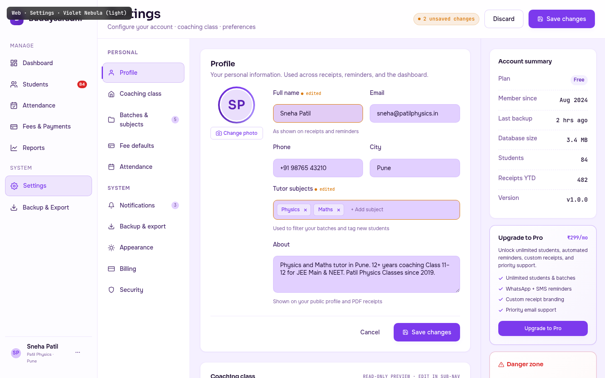

# Web · Settings

> The "back of house" — where a tutor configures their world. Settings is the ONLY palette permitted to use violet as a primary (`#7C3AED`), per `01_Color_Palettes.md` Palette 7. The plum-warm violet signals "you are in a special, protected space" without the coldness of blue. It is explicitly NOT Stripe-indigo (`#6366F1`) — the `no-indigo-accent` lint rule greps for `#6366F1/#3B82F6/#2563EB/#4F46E5`, NOT for `#7C3AED`. Settings has the most complex layout in the app: a 3-column workspace with a vertical sub-nav, the active section's form, and a contextual right rail.

---

## §1 Page Identity

| Property | Value |
|---|---|
| Page name | Settings |
| Route | `/settings` (defaults to Profile sub-section) |
| Palette | `violet-nebula` |
| Theme default | `light` |
| Viewport | 1440 × 900 |
| Primary CTA | `Save changes` (top-right, `btn-primary`) — disabled-looking until changes; shows "2 unsaved changes" pill when dirty |
| Secondary CTAs | `Discard` (top-right, `btn-secondary`); per-section sub-CTAs (Change photo, Add subject, Export, Delete) |
| Sub-nav sections | Profile (active), Coaching class, Batches &amp; subjects, Fee defaults, Attendance, Notifications, Backup &amp; export, Appearance, Billing, Security |
| Right-rail cards | Account summary · Upgrade-to-Pro · Danger zone |
| Active sidebar item | **Settings** |
| Page-level pattern | 3-column workspace — sub-nav (220px) + content (1fr) + right rail (296px) |
| Frame label | `Web · Settings · Violet Nebula (light)` |

### Palette rationale
Violet Nebula's signature `#7C3AED` is the warmest, most "creative premium" accent in the system. Settings is the back of house — protected, configurable, low-frequency but high-stakes. The violet signals "you are configuring something important" without being alarmist. The lavender-mist background `#F5F0FF` is the lightest canvas in the system, giving the form fields room to breathe. The plum secondary `#5B21B6` appears on the avatar ring and the active sub-nav indicator.

---

## §2 Layout Anatomy

```
┌──────────────────────────────────────────────────────────────────────────────────┐
│ mockup-frame-label (fixed, top-left)                                              │
├──────────┬────────────────────────────────────────────────────────────────────────┤
│ SIDEBAR  │ TOPBAR  (Settings h1 · [2 unsaved changes] · Discard · Save changes)  │
│ 232px    ├──────────┬───────────────────────────────────┬─────────────────────────┤
│          │ SUB-NAV  │ CONTENT COL                       │ RIGHT RAIL (296px)      │
│ Brand    │ 220px    │                                   │                         │
│ ─────    │ Personal │ ┌─ Profile card ────────────────┐│ ┌─ Account summary ───┐│
│ Manage   │  ●Profile│ │ avatar XL + form grid         ││ │ Plan: Free           ││
│  Dashb.  │  Coachin.│ │ (Full name, Email, Phone,     ││ │ Member since Aug 24  ││
│  Studen. │  Batches │ │  City, Subjects multiselect,  ││ │ Last backup: 2hrs    ││
│  Attend. │  Fee def.│ │  About textarea)              ││ │ 84 students          ││
│  Fees    │  Attend. │ │ [Cancel] [Save changes]       ││ ├─ Upgrade to Pro ────┤│
│  Reports │ System   │ └────────────────────────────────┘│ │ ₹299/mo · 4 features││
│ ─────    │  Notific.│ ┌─ Coaching class preview ──────┐│ │ [Upgrade to Pro]    ││
│ System   │  Backup  │ │ name · est. 2019 · 84 students││ ├─ Danger zone ───────┤│
│  ●Settin.│  Appear. │ │ address · GSTIN · receipt pre.││ │ ⚠ Export all data   ││
│  Backup  │  Billing │ └────────────────────────────────┘│ │ ⚠ Delete account    ││
│ ─────    │  Securit.│ ┌─ Appearance ──────────────────┐│ └──────────────────────┘│
│ usercard │          │ │ Theme: [Light] [Dark] [System]││                         │
│          │          │ │ Palette: 8 swatches, Violet ● ││                         │
│          │          │ └────────────────────────────────┘│                         │
│          ├──────────┴───────────────────────────────────┴─────────────────────────┤
│          │ FOOTER  (2 unsaved changes · ⌘S/Esc hints · version)                     │
└──────────┴────────────────────────────────────────────────────────────────────────┘
```

### Grid declaration
```css
.app-shell { display: flex; flex-direction: row; min-height: 100vh; }
.sidebar { width: 232px; flex-shrink: 0; height: 100vh; }
.main-col { flex: 1; display: flex; flex-direction: column; min-width: 0; overflow-y: auto; }
.settings-grid { display: grid; grid-template-columns: 220px 1fr 296px; flex: 1; min-height: 0; }
.subnav { border-right: 1px solid var(--border-default); overflow-y: auto; }
.content-col { padding: var(--space-6); overflow-y: auto; display: flex; flex-direction: column; gap: var(--space-6); }
.right-col { border-left: 1px solid var(--border-default); overflow-y: auto; }
```

### Vertical rhythm (top to bottom inside `.main-col`)
1. `.topbar` — 72px, sticky. Title left, dirty-pill + actions right.
2. `.settings-grid` — fills the remaining height (≈ 780px at 1440×900). 3-column workspace.
3. `.app-footer` — 40px. Dirty-status indicator + keyboard hints.

### Responsive collapse (below 1280px)
- Right rail moves below the content (stacked).
- Sub-nav stays — it's the primary navigation aid on this page.
- Below 1024px, the sub-nav collapses to a horizontal tab strip at the top of the content area.

---

## §3 Section-by-Section Content Spec

### §3.1 Topbar

| Slot | Content | Notes |
|---|---|---|
| Page title | `Settings` (h1, `--text-2xl`, weight 600) | Sora |
| Subtitle | "Configure your account · coaching class · preferences" | |
| Dirty pill | "● 2 unsaved changes" (amber-tinted, mono) | Visible only when form is dirty; hidden when clean |
| Discard | `btn-secondary` | Reverts all changes since last save; asks for confirmation if dirty |
| Save changes | `btn-primary` with save icon | Disabled (50% opacity) when form is clean; full-opacity violet when dirty |

### §3.2 Sub-nav (vertical tabs)

Two grouped sections with 10 total items:

**Personal**
1. **Profile** (active) — user icon
2. Coaching class — home icon
3. Batches &amp; subjects — folder icon (with count badge `5`)
4. Fee defaults — bank-card icon
5. Attendance — calendar icon

**System**
6. Notifications — bell icon (with count badge `3`)
7. Backup &amp; export — download icon
8. Appearance — sun icon
9. Billing — credit-card icon
10. Security — shield icon

Active item: 12% violet tint, 1px 25%-accent border, 3px left-bar accent (`--accent-primary`), violet text. Inactive: `--text-secondary`, hover reveals `--text-primary` + faint surface tint.

### §3.3 Profile section (content card 1)

#### Card header
- Title: "Profile" (h2, `--text-md`, 600 weight).
- Subtitle: "Your personal information. Used across receipts, reminders, and the dashboard." (`--text-sm`, `--text-muted`).

#### Profile top — avatar zone + form grid

**Avatar zone** (left, fixed width):
- Avatar XL (80px) with conic-gradient ring (`--accent-primary → --accent-tertiary → --accent-secondary → --accent-primary`), 4px outset.
- Avatar initials: `SP` (Sora, `--text-2xl`, 600 weight, `--accent-secondary` colour, on 16% violet-tinted background).
- "Change photo" button below — `btn-sm`, violet outline icon + text. Click → opens file picker; on upload, crops to 1:1 and uploads to Vercel Blob.

**Form grid** (right, 2-column):
| Field | Type | Default value | Notes |
|---|---|---|---|
| Full name | text input | Sneha Patil | Dirty-state styling (amber border + tinted bg) — shown as edited |
| Email | text input | sneha@patilphysics.in | Validated on blur; inline error if invalid |
| Phone | text input | +91 98765 43210 | Formatted with `libphonenumber-js` |
| City | text input | Pune | Used in PDF receipt footer |
| Tutor subjects | multi-select chips | Physics, Maths | Dirty-state styling — shown as edited |
| About | textarea (3 rows) | "Physics and Maths tutor in Pune. 12+ years coaching Class 11–12 for JEE Main &amp; NEET..." | Max 280 chars; shown on receipts |

**Dirty-state contract**: any field the user has edited gets:
- 1px `--accent-warning` border (instead of `--border-default`).
- 4% amber-tinted background (instead of `--bg-surface-inset`).
- A small "● edited" label next to the field's main label (mono 10px, `--accent-warning`).
- The topbar's dirty-pill increments.

**Multi-select anatomy**:
- Container: `--bg-surface-inset` fill, `--border-default` border, 6px padding, 4px gap between chips.
- Each subject chip: 12% violet-tinted bg, 25% violet border, violet text, with a 16px circular `×` button (hover reveals stronger violet bg).
- "+ Add subject" pill at the end — `--text-muted`, hover reveals `--accent-primary`. Click → opens a small popover with subject suggestions (Physics, Maths, Chemistry, Biology, English, Hindi, Sanskrit, History, Geography, Economics, Accountancy, Business Studies, Computer Science).

#### Form actions (bottom of card)
- Right-aligned: `Cancel` (ghost) + `Save changes` (primary violet).
- Top border: 1px `--border-default` separator above the actions row.

### §3.4 Coaching class preview (content card 2)

Read-only preview of the coaching class record (editable in the "Coaching class" sub-nav item).

| Field | Value |
|---|---|
| Name | Patil Physics Classes |
| Established | 2019 (mono) |
| Address | 2nd floor, Karve Rd, Kothrud, Pune 411038 |
| Students enrolled | 84 (mono) |
| GSTIN (optional) | 27ABCDE1234F1Z5 (mono) |
| Receipt prefix | PPC-2024 (mono) |

2-column grid, dashed-bottom-border separators between rows.

### §3.5 Appearance card (content card 3)

#### Theme toggle
3-button pill: `[Light]` `[Dark]` `[System]`.
- Light active: sun icon + "Light", `--bg-surface` fill, `--accent-primary` text, soft shadow.
- Each button has a small icon (sun for Light, moon for Dark, monitor for System).
- "System" follows the OS preference via `prefers-color-scheme` media query.

#### Palette swatches
4×2 grid of 8 swatches. Each swatch:
- 36px circular gradient (palette's signature hue over its background).
- Palette name below (10px, `--text-secondary`).
- Active swatch (Violet): 2px `--accent-primary` border, 6% violet-tinted bg, ✓ check badge top-right.
- Inactive: transparent border, hover reveals `--surface-glass` tint.

**All 8 palettes**:
1. Aurora (cosmic dark gradient)
2. Saffron (`#FFFBF5` → `#FF9933`)
3. Emerald (`#FAF6EE` → `#059669`)
4. Cyan (`#F0FAFC` → `#0891B2`)
5. Violet (active — `#F5F0FF` → `#7C3AED`)
6. Amber (`#FFFAF0` → `#EA580C`)
7. Rose (`#FFF7F8` → `#E11D48`)
8. Slate (`#F8FAFC` → `#0F172A`)

**Note** (below the grid): "Active: **Violet Nebula** · the only palette permitted to use violet as primary (auth/settings context)".

Per `01_Color_Palettes.md`, the palette assignment is **per-page automatic** (e.g. /students → rose-petal, /fees → emerald-ledger). The user can override here only for the app shell / dashboard — not for the per-page palette, which is locked. The override writes to `localStorage.buddysaradhi.shellPalette`.

### §3.6 Right rail

#### Card A — Account summary
| Label | Value |
|---|---|
| Plan | Free (badge — tertiary-tinted pill) |
| Member since | Aug 2024 |
| Last backup | 2 hrs ago |
| Database size | 3.4 MB |
| Students | 84 |
| Receipts YTD | 482 |
| Version | v1.0.0 |

#### Card B — Upgrade to Pro
- Header: "Upgrade to Pro" + "₹299/mo" (mono violet).
- Body: pitch text + 4 feature bullets (each with violet ✓ icon).
- CTA: full-width violet `Upgrade to Pro` button.
- Card background: subtle violet-tinted gradient (8% accent on `--bg-surface`).

#### Card C — Danger zone
- Header: warning triangle icon + "Danger zone" (`--accent-danger` text).
- Card background: subtle red-tinted gradient.
- Two rows:
  1. **Export all data** — secondary `Export` button. Triggers a full DB backup zip download.
  2. **Delete account** — `btn-danger` button. Opens a multi-step confirmation dialog: type your password → type "DELETE" → confirm. Starts a 30-day grace period; after that, irreversible.

### §3.7 Footer

| Slot | Content |
|---|---|
| Left | `● 2 unsaved changes · auto-saved drafts every 60s` (amber pulse dot — NOT green, because dirty) + `·` + `Press ⌘S to save · Esc to discard` |
| Right | `Buddysaradhi v1.0.0 · contracts/v1.0.0` |

---

## §4 Interaction Model

References `04_Motion_and_Microinteractions.md`.

### §4.1 Sub-nav item switch — `listItemEnter` stagger
Clicking a different sub-nav item re-mounts the content card with `listItemEnter` stagger (30ms per child, capped at 8). The previously-active sub-nav item returns to neutral instantly (no exit animation). The right rail stays mounted (only the Account summary card is universally relevant; the other two cards may swap depending on the active sub-nav).

### §4.2 Dirty state — `tooltipEnter` (100ms opacity)
When a field is edited, the dirty styling (amber border + tinted bg + "● edited" label) fades in over 100ms (`tooltipEnter` — opacity-only, no translate). The topbar's dirty-pill slides in from the right with `toastEnter` (250ms slide-up + fade).

### §4.3 Save changes — `buttonPress` + `toastEnter`
Click triggers `buttonPress` (100ms scale 0.97), then the save commits to the DB (synchronous local Turso write + queued `sync_outbox`), then a `toastEnter` toast: "Settings saved · 2 fields updated" with an `Undo` link (5s window). Auto-dismiss 4s.

### §4.4 Discard — confirmation dialog
If dirty, opens a confirmation dialog: "Discard 2 unsaved changes? This cannot be undone." → `Discard` (danger) / `Keep editing` (secondary). On confirm, all dirty fields revert to their last-saved values with a 200ms fade (`--ease-out`).

### §4.5 Avatar upload — `modalEnter` + crop UI
The Change Photo flow:
1. File picker opens.
2. Selected image appears in a `modalEnter` crop dialog (250ms `--ease-out`).
3. Crop UI: 1:1 aspect-ratio crop box, drag to reposition, zoom slider.
4. On confirm: upload to Vercel Blob (progress bar in the dialog footer), update the avatar's `src`, toast confirms.

### §4.6 Palette swatch hover — `cardHover`
Each swatch has a hover lift (`translateY(-1px)` + `--surface-glass` bg tint). On click, the swatch becomes active (instantly — no fade between active states; the previous active swatch's check badge disappears instantly, the new one appears instantly with a `--ease-spring` scale-in over 150ms).

### §4.7 Theme toggle — instant
Theme switching is instant (no fade between light and dark). Per `04_Motion_and_Microinteractions.md` §8 (anti-patterns), animating layout properties (which a theme switch would trigger via CSS variable changes) is forbidden. The user sees the new theme immediately.

### §4.8 Reduced-motion override
All animations collapse to `--motion-instant: 0ms`. Dirty-state styling, toast arrivals, and avatar upload dialog all become instant state changes.

---

## §5 Data Bindings

References `buddysaradhi_Planning/11_Data_Model.md` (settings table is a singleton per tenant) and `08_Settings.md`.

### §5.1 Profile data
```
-- settings is a singleton row per tenant
SELECT
  tutor_name, tutor_email, tutor_phone, tutor_city,
  tutor_subjects_json, tutor_about, tutor_avatar_url,
  coaching_class_name, established_year, address, gstin, receipt_prefix,
  theme_preference, shell_palette_override,
  plan_tier, member_since, last_backup_at, db_size_bytes,
  created_at, updated_at
FROM settings
WHERE tenant_id = ?;
```

### §5.2 Form mutations
| Field | Endpoint | Side effects |
|---|---|---|
| Full name | `PATCH /api/settings/profile` | Updates `tutor_name`; cascades to receipt footer + reminder sender name |
| Email | `PATCH /api/settings/profile` | Validates format; sends verification email if changed |
| Phone | `PATCH /api/settings/profile` | Validates via `libphonenumber-js`; sends OTP if changed |
| City | `PATCH /api/settings/profile` | Updates receipt footer |
| Tutor subjects | `PATCH /api/settings/profile` | Updates `tutor_subjects_json`; cascades to student import defaults |
| About | `PATCH /api/settings/profile` | Updates PDF receipt header |
| Theme | `PATCH /api/settings/appearance` | Writes `localStorage.buddysaradhi.theme`; sets `data-theme` attribute |
| Shell palette | `PATCH /api/settings/appearance` | Writes `localStorage.buddysaradhi.shellPalette`; sets `data-palette` on app shell only |

All mutations enqueue a `sync_outbox` row for the audit log.

### §5.3 Coaching class mutations
| Field | Endpoint |
|---|---|
| Name | `PATCH /api/settings/coaching-class` |
| Established | `PATCH /api/settings/coaching-class` |
| Address | `PATCH /api/settings/coaching-class` |
| GSTIN | `PATCH /api/settings/coaching-class` — validates GSTIN checksum |
| Receipt prefix | `PATCH /api/settings/coaching-class` — affects next-receipt-code sequence |

### §5.4 Avatar upload
```
POST /api/settings/avatar
Content-Type: multipart/form-data
Body: { file: <cropped-1:1-image>, filename }
Response: { url: 'https://blob.vercel.com/...avatar-123.jpg' }
```
Then `PATCH /api/settings/profile` with `{ tutor_avatar_url: '...' }`.

### §5.5 Account summary aggregates
```
SELECT
  (SELECT COUNT(*) FROM students WHERE archived_at IS NULL) AS student_count,
  (SELECT COUNT(*) FROM receipts r JOIN ledger_entries le ON le.id = r.ledger_entry_id
   WHERE le.void_of_id IS NULL AND strftime('%Y', r.occurred_on) = strftime('%Y', 'now')) AS receipts_ytd,
  (SELECT datetime(last_backup_at) FROM settings) AS last_backup,
  (SELECT page_count * page_size FROM pragma_page_count(), pragma_page_size()) AS db_size_bytes;
```

### §5.6 Danger zone actions
| Action | Endpoint | Behaviour |
|---|---|---|
| Export all data | `POST /api/backup/full` | Triggers `09_Backup_and_Import_Export.md` §3 full-backup flow; returns a signed Blob URL for the zip |
| Delete account | `POST /api/account/delete` | Starts 30-day grace period; sets `settings.deletion_scheduled_at = now + 30 days`; sends confirmation email; queues a `sync_outbox` row with the deletion request for the central account service |

---

## §6 Accessibility Notes

### §6.1 Heading hierarchy
- One `<h1>` per page: "Settings" in the topbar.
- Card titles (`Profile`, `Coaching class`, `Appearance`, `Account summary`, `Upgrade to Pro`, `Danger zone`) are `<h2>` or `<h3>` depending on context.
- The sub-nav items are `<a>` elements (not headings) with `aria-current="page"` on the active item.

### §6.2 Keyboard navigation (per `05_Accessibility_Contract.md` §3 — form map)
| Key | Action |
|---|---|
| `Tab` | Move through topbar → sub-nav items → first form field → ... → form action buttons |
| `↑` / `↓` | Move between sub-nav items (roving `tabindex`) |
| `Enter` (on sub-nav item) | Switch to that section |
| `⌘S` | Save changes (scoped — only when focus is in the content column) |
| `Escape` | If a dialog is open, close it; if the form is dirty, focus the Discard button |
| `Ctrl+Z` | Undo last field edit (within the same session) |

### §6.3 Screen-reader patterns
- The dirty-pill has `role="status" aria-live="polite" aria-label="2 unsaved changes"`.
- Each form field has `aria-describedby` linking input → helper text + dirty marker.
- The avatar `img` has `alt="Sneha Patil's profile photo"`.
- Palette swatches have `aria-label` per swatch (e.g. `aria-label="Violet Nebula palette, currently active"`) and `aria-pressed="true|false"`.
- The theme toggle has `role="radiogroup"`; each theme button has `role="radio" aria-checked="true|false"`.

### §6.4 Colour is never the only signal
- Dirty fields pair amber border with text "● edited" label AND background tint.
- The active palette swatch pairs violet border with the ✓ check badge AND the name highlighted in violet.
- Danger-zone rows pair red tinting with the warning triangle icon AND the "Danger zone" header text.
- The Upgrade-to-Pro card pairs violet tinting with the ₹299/mo price AND the violet CTA button.

### §6.5 Form accessibility
- Every input has a visible `<label>` (no placeholder-only fields).
- The "About" textarea has `maxlength="280"` and a live character counter (aria-live).
- The phone input has `autocomplete="tel"`; the email input has `autocomplete="email"`.
- Required fields are marked with `aria-required="true"` and a visible asterisk.
- The multi-select has `role="listbox"` with each chip as `role="option" aria-selected="true"` (and the add-subject control as `role="button" aria-haspopup="listbox"`).

### §6.6 Contrast (Violet Nebula light)
| Pair | Ratio | Grade |
|---|---|---|
| `--text-primary` `#1A0B2E` on `--bg-canvas` `#F5F0FF` | 16.5:1 | AAA |
| `--text-secondary` `#4A2D6E` on `--bg-surface` `#FFFFFF` | 9.3:1 | AAA |
| `--accent-primary` `#7C3AED` on `--bg-surface` `#FFFFFF` | 5.4:1 | AA |
| `--text-on-accent` `#FFFFFF` on `--accent-primary` `#7C3AED` | 4.6:1 | AA |
| `--accent-danger` `#DC2626` on `--bg-surface` (Danger zone) | 5.2:1 | AA |

---

## §7 Edge Cases

### §7.1 No changes (clean state)
- The topbar's dirty-pill is hidden.
- The Save changes button is disabled (50% opacity, `aria-disabled="true"`).
- The Discard button is also disabled.
- The footer's status indicator shows "All changes saved · last saved 2 hours ago" (green pulse dot).

### §7.2 Loading state
- The Profile card displays skeleton blocks for each form field.
- The right rail shows 3 skeleton cards.
- The sub-nav items are interactive (cached).

### §7.3 Save failed (network error)
- The Save button enters persistent loading state.
- Toast: "Couldn't reach the server. Your changes are saved locally and will sync when you reconnect." (`--accent-warning` border, persistent).
- The dirty-pill remains visible — local state is preserved.
- On reconnect, the sync engine flushes pending changes (per `mobile/04_Offline_Sync_and_Conflict_Resolution.md`).

### §7.4 Avatar upload failed
- The crop dialog's "Confirm" button shows an inline error: "Upload failed. Check your connection and try again."
- The user's existing avatar remains unchanged.
- The dialog stays open so the user can retry without re-selecting the file.

### §7.5 Multi-device edit conflict
- If the tutor edits the same field on two devices, the last-write-wins rule applies within a 5-minute window. Beyond that, the conflict is flagged: an amber banner appears at the top of the Profile card: "This field was edited on another device 8 minutes ago. [Keep mine] [Use theirs]".

### §7.6 Delete account — 30-day grace
- After the user confirms deletion, the right rail's Danger zone card changes: "Account deletion scheduled for 12 Dec 2024 (29 days remaining). [Cancel deletion]".
- The user can still log in and use the app normally during the grace period.
- A weekly email reminder is sent: "Your Buddysaradhi account will be deleted in X days. Cancel if this was a mistake."

### §7.7 Free plan limits reached
- If the tutor has 50 students (Free plan limit) and tries to add a 51st, the Add Student sheet shows an upsell: "You've reached the Free plan limit of 50 students. Upgrade to Pro for unlimited students." + `[Upgrade to Pro]` primary CTA + `[Manage students]` secondary (which takes them back to the Students list).
- The right rail's Upgrade card highlights with a subtle pulse (single pulse on first appearance per session, not continuous — per `04_Motion_and_Microinteractions.md` §1).

### §7.8 GSTIN validation
- If the tutor enters an invalid GSTIN (fails checksum), the field shows an inline error: "Invalid GSTIN format. Should be 15 characters, e.g. 27ABCDE1234F1Z5."
- The Save button is disabled until the GSTIN is valid OR empty (it's optional).

### §7.9 Mobile / narrow viewport (below 1024px)
- Sidebar collapses to icon rail.
- The 3-column workspace becomes 1-column: sub-nav → content → right rail (stacked).
- Sub-nav becomes a horizontal tab strip at the top of the content area.
- Form grid becomes 1-column.
- Palette swatches become a 4×2 grid still (smaller swatches).

---

## §8 Image Reference



The screenshot is captured at 1440×900 viewport. The page shows: the topbar with "2 unsaved changes" amber pill + Discard + Save changes buttons; the 3-column workspace with the violet sub-nav (Profile active) on the left, the Profile card with avatar XL (violet conic-gradient ring) + form fields (Full name + Tutor subjects marked dirty in amber) in the middle, and the right rail with Account summary + Upgrade-to-Pro + Danger zone cards. Below the Profile card: Coaching class preview + Appearance card (with Light/Dark/System toggle and 8-palette swatch grid, Violet active and ringed). The footer shows the dirty-state amber indicator.
