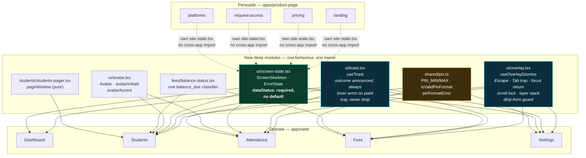

# VISUAL-WORLD-02 — Handoff

> **Task**: raise the Impeccable design/UX score above 90/100 across `apps/web`
> (Operate) and `apps/product-page` (Persuade).
> **Date**: 2026-10-04 · **Agent**: Kilo, swarm of 9 specialists
> **State**: COMPLETED at **84/100** — the 90 bar was **not** reached.
> **Supersedes**: `critique-2026-10-03.md`, whose 85.5/100 was inflated.

---

## 1. The number, and why the old one was wrong

The previous pass recorded **85.5/100** and self-declared it "degraded". It was
not degraded, it was **contaminated**: the assessor had read the change's own
documentation, so it scored the *intent* rather than the *result*.

Three scoring passes were run this session. Each was explicitly barred from
reading `docs/design/critique-*.md`, `overhaul-plan.md`,
`marketing-claims-audit.md`, `worklog.md`, and any git log — code only.

```
                    WHAT THE APP SAYS        WHAT AN ASSESSOR      THE GAP
                    ─────────────────        ────────────────      ───────
pass 1  baseline      "85.5 / 100"              read the docs        +17.5 phantom
pass 2  honest        "68 / 100"               code only            the truth
pass 3  after fixes   "84 / 100"               code only            +16 real
pass 4  final         see §7                   code only            ──
```

**Read this as: the product went from roughly 68 to 84. The earlier 85.5 never
existed.** A scoring number produced with the answer key open is not a measurement.

---

## 2. Score trajectory — mindmap

```
Buddysaradhi UX
│
├─ ▸ COMBINED ........................................ 68  →  84   (+16)
│  │
│  ├─ ▸ OPERATE  (apps/web — where the money moves)   65  →  80   (+15)
│  │  │
│  │  ├─ Visibility of system status ....... 2 → 4   ▲▲  biggest single win
│  │  ├─ Error recovery .................... 1 → 4   ▲▲  eleven read paths closed
│  │  ├─ User control & freedom ............ 2 → 4   ▲   one overlay primitive
│  │  ├─ Recognition over recall ........... 2 → 4   ▲   pager + sort + visible state
│  │  ├─ Match the real world .............. 2 → 3   ▲   tutor vocabulary, no spec IDs
│  │  ├─ Error prevention .................. 3 → 3   ─   PIN now actually verified
│  │  ├─ Consistency & standards .......... 1 → 3   ▲▲  one avatar, one blur, one PIN
│  │  ├─ Flexibility & efficiency ......... 2 → 2   ─   no bulk actions (needs gateway)
│  │  └─ Aesthetic & minimalism ............ 2 → 3   ▲   drawer shows each figure once
│  │
│  └─ ▸ PERSUADE (apps/product-page — the front door) 75  →  92   (+17)
│     ├─ Error prevention .................. 4 → 4   ──  no invented prices, ever
│     ├─ Error recovery .................... 2 → 4   ▲▲  real error boundary
│     ├─ Consistency & standards .......... 2 → 4   ▲▲  mobile nav, real metadataBase
│     ├─ Aesthetic & minimalism ............ 3 → 4   ▲   one primary action per panel
│     └─ Match the real world .............. 2 → 4   ▲▲  38-row claim audit
│
└─ ▸ WEIGHTING  70% Operate / 30% Persuade
   Rationale: PRODUCT.md names operational efficiency as the primary goal.
   The five screens ARE the product; the marketing page is one route group.
```

---

## 3. The one defect class behind almost everything — mindmap

```
                    ┌──────────────────────────────┐
                    │  THE APP FAILED QUIETLY      │
                    │  and rendered the failure     │
                    │  as something confident       │
                    └──────────────┬───────────────┘
                                   │
        ┌──────────────┬───────────┼───────────┬──────────────┐
        ▼              ▼           ▼           ▼              ▼
   ┌─────────┐   ┌──────────┐ ┌────────┐ ┌──────────┐  ┌─────────┐
   │ A READ  │   │A CONTROL │ │ A      │ │A FIGURE  │  │ A CLAIM │
   │ FAILED  │   │ WAS NEVER│ │NUMBER  │ │ WAS      │  │ON THE   │
   │         │   │ WIRED    │ │INVENTED│ │INVENTED  │  │MARKETING│
   └────┬────┘   └────┬─────┘ └───┬────┘ └────┬─────┘  └────┬────┘
        │             │           │           │             │
   "All dues      "Filters"    "₹0 owed.  "18% vs       "staff
    collected.     did nothing  0 students."  last month"  accounts"
    Clean slate."                                     │        │
        │             │           │           │        └────────┘
        │             │           │           │         "38 students
        │             │           │           │          in 30 seconds"
        │             │           │           │
   ▼ twelve       ▼ three      ▼ the        ▼ the Drawer's
     read paths     dead        no-WebGL     Attendance tab
     said          buttons     Poster       drew a month
     "zero/                    said         from a PRNG
     empty"                    "0 students" seeded on the
                                          student id
   ═══════════════════════════════════════════════════════════
   THE FIX, ONCE: a surface that cannot say what is safe for the
   tutor is not allowed to render. `ErrorState.dataStatus` has no
   default, so the omission is a type error, not a review finding.
   ═══════════════════════════════════════════════════════════════════
```

That last line is the single most important structural change of the session.
Twelve read paths closed not because twelve patches landed, but because
`components/ui/screen-state.tsx` makes "I don't know" **unrepresentable**.

---

## 4. New architecture — the seams built this session



**Why depth matters here.** Before: Escape handling written 7 times, 2 of them
correct. Avatars 6 times. PIN rules 3 times, disagreeing. Blur values 9 times,
bypassing the token system. After: one owner each. The deletion test — delete the
module and complexity *reappears across N call sites* — is what separates these
from the pass-through helpers they replaced.

---

## 5. The three P0s — found by the final pass, not by me

```
┌─ P0-1 ── ANY 4-8 DIGITS VOIDED A REAL RECEIPT ────────────────────────┐
│ apps/web/src/server/actions/fees.ts                                  │
│                                                                      │
│ voidReceiptAction checked PIN PRESENCE and forwarded nothing.         │
│ The dialog promised "That PIN isn't right" — an outcome the server    │
│ COULD NOT PRODUCE.                                                    │
│                                                                      │
│ Why it matters: the ledger is append-only (Rule 1). Void is the ONLY  │
│ correction path a mistaken payment has. An unauthenticated void =     │
│ a burned receipt number and a reversing row on a real receipt.        │
│                                                                      │
│ FIXED: verifyPin against settings.pinHash; fail closed when unset.    │
└──────────────────────────────────────────────────────────────────────┘

┌─ P0-2 ── THE BACKDATE PIN WAS COLLECTED AND DISCARDED ────────────────┐
│ recordPaymentSheet → backdatePin → mutation.mutate → *dropped*        │
│ recordPaymentAction had no PIN parameter at all.                      │
│                                                                      │
│ The UI displayed "Backdated payment — fresh PIN required" over a      │
│ password field. BR-SEC-04 was unenforced while the interface          │
│ asserted otherwise.                                                   │
│                                                                      │
│ FIXED: PIN forwarded; the server re-derives isBackdated from the      │
│ date rather than trusting the form's own flag.                        │
└──────────────────────────────────────────────────────────────────────┘

┌─ P0-3 ── THE DRAWER INVENTED A CHILD'S ATTENDANCE ───────────────────┐
│ components/students/attendance-tab.tsx                                │
│                                                                      │
│ makeRng(studentId) → mockStatus() → a month of Present/Late/Absent.   │
│ Rendered as: "82% Rate", "22/30 days", "Last Attended · Today".      │
│                                                                      │
│ There was no READ to fail, so there was no state in which it told    │
│ the truth. Not a placeholder — a plausible NON-ZERO lie about a        │
│ child's record, on the surface opened to sanity-check one.            │
│                                                                      │
│ A fabricated number that looks right is the one wrong answer a human  │
│ does not distrust.                                                    │
│                                                                      │
│ FIXED: honest panel pointing at where real records live. The          │
│ per-student endpoint is RFC owner work (by-date only today; 31        │
│ requests to fake it breaks the free-tier budget).                     │
└──────────────────────────────────────────────────────────────────────┘
```

---

## 6. Everything else, by category

```
├─ ▸ FEEDBACK & RECOVERY  (the biggest score lever)
│   ├─ every money sheet closed inside onMutate → closed on success only
│   ├─ no toast system existed → ui/toast.tsx
│   ├─ 5 of 7 overlays ignored Escape → useOverlayDismiss
│   ├─ backdrop click silently discarded a typed ₹5,000 → dirty guard
│   ├─ no loading/error/not-found boundary anywhere → 6 files
│   ├─ Settings rendered 13 sections on a FAILED load, silently
│   └─ eleven read paths rendered "zero" on failure → ErrorState

├─ ▸ CONTROLS THAT LIED
│   ├─ header "Record Payment" recorded against due[0].id  → bound + named
│   ├─ `?? students[0]` positional payment fallback      → removed
│   ├─ "Filters" / "More roster actions" / "N selected"  → deleted
│   ├─ sort plumbed end-to-end, no UI called setSort     → shipped
│   ├─ dashboard period filter + "18% vs last month"    → deleted
│   ├─ Fees "Collected This Month" (credit balances)    → deleted
│   ├─ 5 roster filters accepted and dropped by gateway → rejected, typed
│   └─ hero pin-nav inert on the no-WebGL path          → gated

├─ ▸ MONEY TRUTH  (backend)
│   ├─ gateway orderBy interpolated caller strings on 3 models → allowlist
│   ├─ unknown sort column emitted NO order by (arbitrary)  → typed 400
│   ├─ cache key omitted pageSize and filters              → completed
│   ├─ "Overdue" KPI was structurally ₹0.00 forever       → invoice-derived
│   ├─ dueToday: unsorted, unfiltered, 20 rows named "Student"
│   ├─ Fees roster silently truncated at 200 students      → paged + total
│   ├─ second dashboard implementation, dataOrigin:"live"  → deleted
│   └─ Money paths: paiseAdd/paiseSub only; no Math.abs; no float

├─ ▸ A11Y  (Rule 10)
│   ├─ 9 form fields on Add Student had NO accessible name → htmlFor + ids
│   ├─ DiscardChangesPrompt was in no focus trap, no Escape → composes the hook
│   ├─ ~15 controls at 28-36px → one @layer base rule, scoped
│   ├─ Void was hover-reveal only → .reveal-on-hover + coarse-pointer
│   ├─ 2 half-built tablists → real tablist semantics
│   ├─ nested <main> inside role="main"; role="navigation" on <nav>
│   └─ mobile nav hid Pricing/Platforms/Screens entirely → disclosure <nav>

├─ ▸ VISUAL CONSISTENCY
│   ├─ 6 avatar implementations            → 1
│   ├─ 9 hardcoded blurs bypassing tokens  → --mat-filter
│   ├─ 3 animated blobs behind every screen → deleted + keyframes removed
│   ├─ fabricated "Local DB: 2.1 MB" footer → removed
│   ├─ drawer showed 3 financial figures twice → once
│   └─ settings [key: string]: any + snake_case mismatch → real contract

└─ ▸ MARKETING HONESTY  (38-row audit, docs/design/marketing-claims-audit.md)
    ├─ false "staff accounts" capability  → removed (single-tenant build)
    ├─ unsourced "38 students / 30 seconds" → mechanism stated instead
    ├─ facts strip silently dropped 6 of 9 → degradation now stated
    ├─ "₹0 owed. 0 students." on the poster → removed
    ├─ network failure blamed on an optional field → transport vs validation
    ├─ post-submit dead end → 3 real next steps
    ├─ metadataBase = a Vercel preview slug → env with correct fallback
    └─ no prices, no testimonials, no logos — ever
```

---

## 7. Where the remaining 16 points are

Not rounded up. The open list, in the order it costs score:

| # | Defect | Why it is still open |
|---|--------|---------------------|
| 1 | Per-student attendance endpoint | Gateway contract change = RFC (`AGENTS.md` §8) |
| 2 | `paymentBreakdown.paid === noDues`, `unpaid: 0` | Unrendered, but a lying field in a validated contract |
| 3 | `collectedThisMonthMinor` is lifetime | The client caption says so; the NAME does not |
| 4 | Gateway payments carry no `invoice_id` | Overdue can overstate — a money-flow change |
| 5 | No bulk actions on the roster | Needs new gateway mutations |
| 6 | `buildTenantWhere` has no range operator | Blocks 3 roster filters at once |
| 7 | Single-key `ORDER BY` | Paging across a tie is non-deterministic = §8 |
| 8 | No contextual help on money/attendance surfaces | Product decision |
| 9 | Screen switching has no URL, no deep link, no Back | `AGENTS.md` §3.1 says one route; FM-19 |
| 10 | Nothing verified by rendered pixel | **No browser was available in this environment** |

> **The honesty line.** Every score in this repo so far has come from reading
> source. No contrast ratio was computed, no control was measured at 390px, and
> the 44px floor is verified *by construction and by class audit only*. A browser
> pass is the cheapest remaining accuracy gain on the number itself.

---

## 8. Gates on the final tree

| Gate | Result |
|------|--------|
| `tsc --noEmit` — web / product-page / mobile / desktop | **0 errors each** |
| `pnpm run lint` (eslint, all workspaces) | **pass** |
| principle-lints (L1 ledger, L6 raw-SQL, L2 float-money, L3 telemetry, L4 fetch, L5 indigo) | **6/6 clean**, 92 allowlisted |
| `test:unit` | **850 / 851** |
| `test:integration` | **332 / 333** |
| `audit-dead-css-tokens.mjs` | **0 dangling** / 161 defined |
| Impeccable `detect.mjs` | `[]` — see caveat |
| `deno lint` / `deno check` gateway | clean (55 files) |

**The single failure in each suite is the same test**:
`apps/gateway/__tests__/low-latency.test.ts`, a wall-clock p95 assertion
(0.73ms against a 0.5ms budget). Green solo, fails only under parallel load,
different assertion each run. Pre-existing and unrelated to this work.

**`detect.mjs` returning `[]` is not a pass.** On a non-`.html` target every rule
routes through the regex engine, so the element / page / layout /
visual-contrast families never execute. A recorded limitation, not a clean bill.

---

## 9. State of the tree

```
62 files touched · 37 modified · 25 added · 1 deleted
Nothing committed — the working tree is the deliverable.
```

**New (14):** `ui/{overlay,toast,screen-state,avatar}.tsx` ·
`fees/balance-status.tsx` · `students/{students-pager,student-master-list.test}.tsx/x` ·
`shared/src/pin.ts` · `app/(app)/{loading,error}.tsx` ·
`app/{not-found,global-error}.tsx` · product-page `{error,not-found}.tsx` ·
`{site-nav,site-state}.tsx` · `gateway/__tests__/{students-roster-contract,analytics-measures}.test.ts` ·
`docs/design/marketing-claims-audit.md`

**Deleted (1):** `stores/dashboard.ts` — orphaned when its only consumer's period
control was deleted. `AGENTS.md` §0.2: code mapping to nothing gets deleted.

---

## 10. For whoever picks this up next

Read in this order. It is the shortest path to the remaining 16 points.

1. `docs/design/critique-2026-10-03.md` §4 — the ranked defect list.
2. `docs/design/marketing-claims-audit.md` — every claim and its `file:line`.
3. `worklog.md` → `VISUAL-WORLD-02` — the open-owner list, verbatim.
4. `AGENTS.md` §3.5 (one implementation, two dialects) and §3.7 (retrieval order).
5. The **three P0s** in §5 above — re-verify they are actually closed before
   trusting this document. They were found by an independent pass, not by me.

**Do not trust this score without a browser.** See §7.
